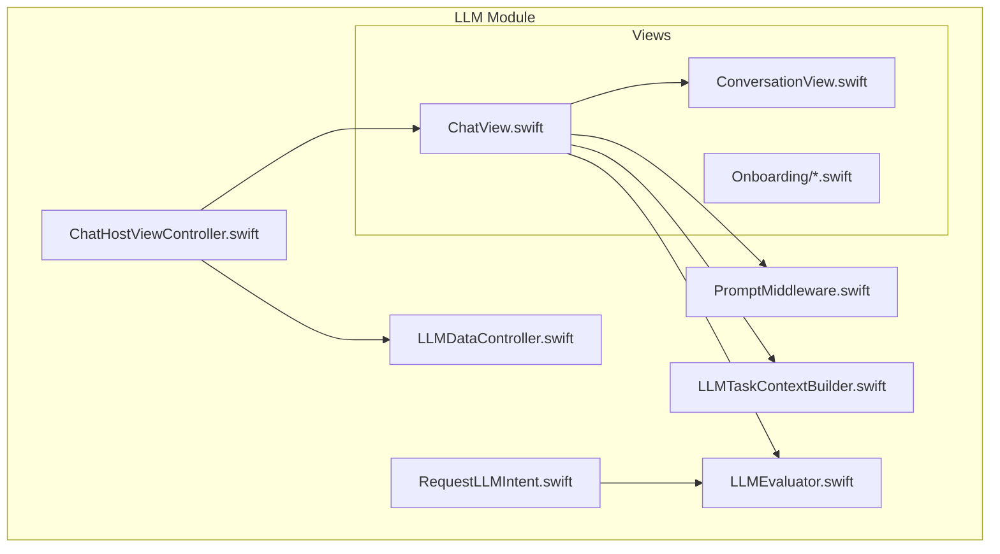
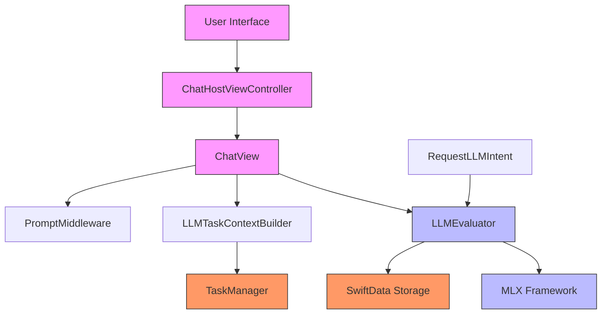
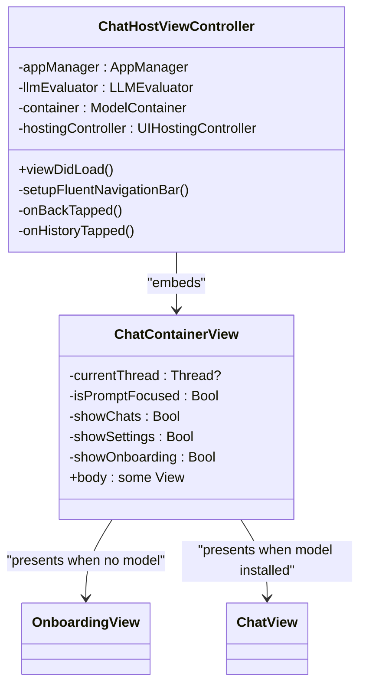
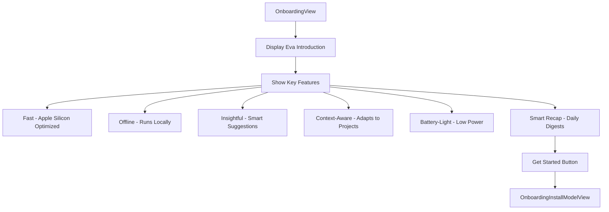
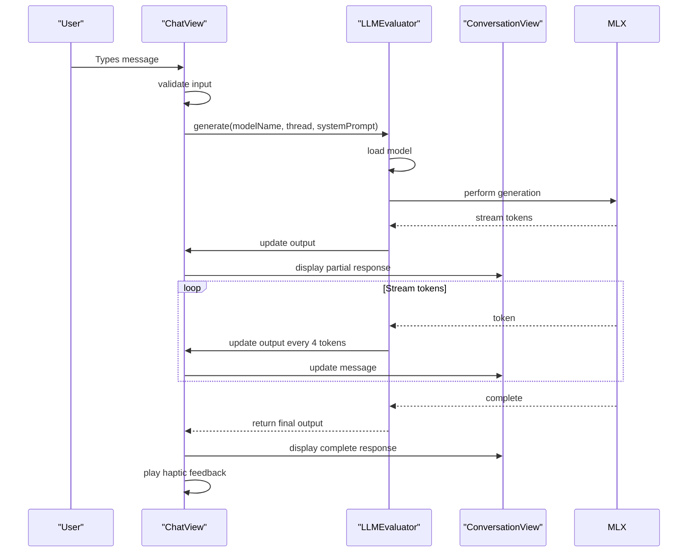
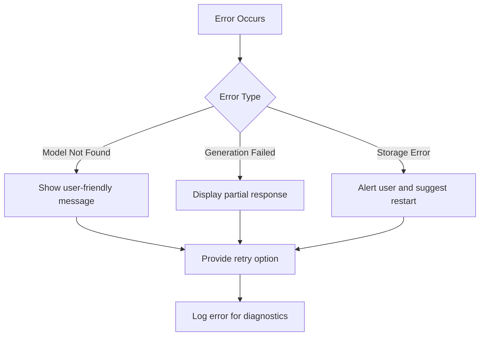

# AI Integration

<cite>
**Referenced Files in This Document**   
- [ChatHostViewController.swift](file://To%20Do%20List/LLM/ChatHostViewController.swift)
- [LLMDataController.swift](file://To%20Do%20List/LLM/Models/LLMDataController.swift)
- [ChatView.swift](file://To%20Do%20List/LLM/Views/Chat/ChatView.swift)
- [OnboardingView.swift](file://To%20Do%20List/LLM/Views/Onboarding/OnboardingView.swift)
- [LLMEvaluator.swift](file://To%20Do%20List/LLM/Models/LLMEvaluator.swift)
- [privacy.html](file://privacy.html)
</cite>

## Table of Contents
1. [Introduction](#introduction)
2. [Project Structure](#project-structure)
3. [Core Components](#core-components)
4. [Architecture Overview](#architecture-overview)
5. [Detailed Component Analysis](#detailed-component-analysis)
6. [Integration with Main Application](#integration-with-main-application)
7. [Usage Guidelines](#usage-guidelines)
8. [Troubleshooting Guide](#troubleshooting-guide)
9. [Conclusion](#conclusion)

## Introduction
The AI Integration module in Tasker provides a local large language model (LLM) system that enables natural language interaction for task management. Designed with privacy in mind, all processing occurs on-device, ensuring user data remains secure and never leaves the device. The system features Eva, a personal AI assistant that helps users manage tasks, projects, and daily planning through conversational interfaces. This documentation details the implementation of the ChatHostViewController, integration patterns, usage guidelines, and troubleshooting strategies.

## Project Structure
The AI integration is organized within a dedicated LLM module inside the main To Do List application. This module contains all components related to the local LLM functionality, including view controllers, models, and UI components.



**Diagram sources**
- [ChatHostViewController.swift](file://To%20Do%20List/LLM/ChatHostViewController.swift)
- [ChatView.swift](file://To%20Do%20List/LLM/Views/Chat/ChatView.swift)
- [ConversationView.swift](file://To%20Do%20List/LLM/Views/Chat/ConversationView.swift)
- [LLMTaskContextBuilder.swift](file://To%20Do%20List/LLM/Models/LLMTaskContextBuilder.swift)
- [PromptMiddleware.swift](file://To%20Do%20List/LLM/Models/PromptMiddleware.swift)
- [LLMEvaluator.swift](file://To%20Do%20List/LLM/Models/LLMEvaluator.swift)
- [RequestLLMIntent.swift](file://To%20Do%20List/LLM/Models/RequestLLMIntent.swift)
- [LLMDataController.swift](file://To%20Do%20List/LLM/Models/LLMDataController.swift)

**Section sources**
- [ChatHostViewController.swift](file://To%20Do%20List/LLM/ChatHostViewController.swift)

## Core Components
The AI integration in Tasker consists of several key components that work together to provide LLM-powered assistance. The architecture follows a clean separation of concerns, with distinct responsibilities for UI presentation, data management, and AI processing.

**Section sources**
- [ChatHostViewController.swift](file://To%20Do%20List/LLM/ChatHostViewController.swift)
- [LLMEvaluator.swift](file://To%20Do%20List/LLM/Models/LLMEvaluator.swift)
- [LLMDataController.swift](file://To%20Do%20List/LLM/Models/LLMDataController.swift)

## Architecture Overview
The AI integration architecture follows a layered approach with clear boundaries between presentation, business logic, and data layers. The system is designed to work entirely on-device, ensuring user privacy and data security.



**Diagram sources**
- [ChatHostViewController.swift](file://To%20Do%20List/LLM/ChatHostViewController.swift)
- [ChatView.swift](file://To%20Do%20List/LLM/Views/Chat/ChatView.swift)
- [ConversationView.swift](file://To%20Do%20List/LLM/Views/Chat/ConversationView.swift)
- [LLMTaskContextBuilder.swift](file://To%20Do%20List/LLM/Models/LLMTaskContextBuilder.swift)
- [PromptMiddleware.swift](file://To%20Do%20List/LLM/Models/PromptMiddleware.swift)
- [LLMEvaluator.swift](file://To%20Do%20List/LLM/Models/LLMEvaluator.swift)
- [RequestLLMIntent.swift](file://To%20Do%20List/LLM/Models/RequestLLMIntent.swift)
- [LLMDataController.swift](file://To%20Do%20List/LLM/Models/LLMDataController.swift)

## Detailed Component Analysis

### ChatHostViewController Analysis
The ChatHostViewController serves as the UIKit wrapper that embeds the SwiftUI-based LLM interface. It manages the lifecycle of the chat interface and handles navigation between different states.



**Diagram sources**
- [ChatHostViewController.swift](file://To%20Do%20List/LLM/ChatHostViewController.swift)

**Section sources**
- [ChatHostViewController.swift](file://To%20Do%20List/LLM/ChatHostViewController.swift)

### OnboardingView Analysis
The OnboardingView provides a welcoming interface for users who haven't yet installed an LLM model. It highlights key features and guides users through the setup process.



**Diagram sources**
- [OnboardingView.swift](file://To%20Do%20List/LLM/Views/Onboarding/OnboardingView.swift)

**Section sources**
- [OnboardingView.swift](file://To%20Do%20List/LLM/Views/Onboarding/OnboardingView.swift)

### ChatView Analysis
The ChatView implements the main chat interface, handling message input, response streaming, and context display. It processes user input and manages the conversation flow.

```mermaid
flowchart TD
A[User types message] --> B{Empty?}
B --> |No| C[Parse slash commands]
C --> D{Thread exists?}
D --> |No| E[Create new thread]
E --> F[Save to SwiftData]
D --> |Yes| F
F --> G[Build system prompt]
G --> H[Include task context]
H --> I[Call LLMEvaluator.generate()]
I --> J[Stream response tokens]
J --> K[Update UI incrementally]
K --> L[Save assistant response]
```

**Diagram sources**
- [ChatView.swift](file://To%20Do%20List/LLM/Views/Chat/ChatView.swift)

**Section sources**
- [ChatView.swift](file://To%20Do%20List/LLM/Views/Chat/ChatView.swift)

### Chat Interaction Flow
The sequence of interactions when a user engages with the AI assistant follows a well-defined pattern with proper state management.



**Diagram sources**
- [ChatView.swift](file://To%20Do%20List/LLM/Views/Chat/ChatView.swift)
- [ConversationView.swift](file://To%20Do%20List/LLM/Views/Chat/ConversationView.swift)
- [LLMEvaluator.swift](file://To%20Do%20List/LLM/Models/LLMEvaluator.swift)

## Integration with Main Application
The AI Integration module integrates seamlessly with the main Tasker application through several key patterns:

1. **Environment Objects**: The AppManager is passed through the SwiftUI environment, allowing shared state across components.
2. **SwiftData Integration**: The LLMDataController provides a shared ModelContainer for persistent storage of chat threads and messages.
3. **Notification System**: Uses NotificationCenter to coordinate UI state changes, such as toggling the chat history.
4. **FluentUI Integration**: Adopts the application's design language through the FluentUI framework for consistent navigation appearance.

The integration maintains separation of concerns while enabling rich interaction between the AI features and core task management functionality.

**Section sources**
- [ChatHostViewController.swift](file://To%20Do%20List/LLM/ChatHostViewController.swift)
- [LLMDataController.swift](file://To%20Do%20List/LLM/Models/LLMDataController.swift)

## Usage Guidelines

### Getting Started
1. Navigate to the Chat section from the main menu
2. If no model is installed, follow the onboarding process to download a model
3. Once installed, the chat interface will appear automatically

### Chat Commands
The AI assistant supports several slash commands for quick actions:
- `/today` - Get summary of today's tasks
- `/tomorrow` - Get summary of tomorrow's tasks
- `/week` - Get weekly task overview
- `/month` - Get monthly task overview
- `/project [name]` - Get tasks for a specific project
- `/clear` - Clear current conversation

### Best Practices
- Use specific language when asking about tasks
- Refer to projects by name for context-aware responses
- Allow time for model loading on first use
- Keep conversations focused on task management topics

**Section sources**
- [ChatView.swift](file://To%20Do%20List/LLM/Views/Chat/ChatView.swift)
- [OnboardingView.swift](file://To%20Do%20List/LLM/Views/Onboarding/OnboardingView.swift)

## Troubleshooting Guide

### Common Issues and Solutions

| Issue | Possible Cause | Solution |
|------|---------------|----------|
| Model not loading | Insufficient storage space | Free up device storage and retry download |
| Slow responses | Large model on limited hardware | Try a smaller model variant |
| No response after sending message | Model loading in progress | Wait for model to load (indicated by thinking indicator) |
| App crashes during chat | Memory pressure | Close other apps and restart Tasker |

### Error Handling Strategies
The AI integration implements comprehensive error handling:



**Section sources**
- [LLMEvaluator.swift](file://To%20Do%20List/LLM/Models/LLMEvaluator.swift)
- [privacy.html](file://privacy.html)

## Conclusion
The AI integration in Tasker provides a sophisticated local LLM system that enhances task management through natural language interaction. The architecture effectively separates concerns between presentation, business logic, and data layers while maintaining privacy through local processing. Key strengths include context-aware prompting, efficient caching, and responsive streaming of responses. The system is extensible, allowing for the addition of new models and capabilities through the modular component design. Future improvements could include enhanced error handling, more sophisticated context management, and additional prompt engineering techniques to improve response quality.