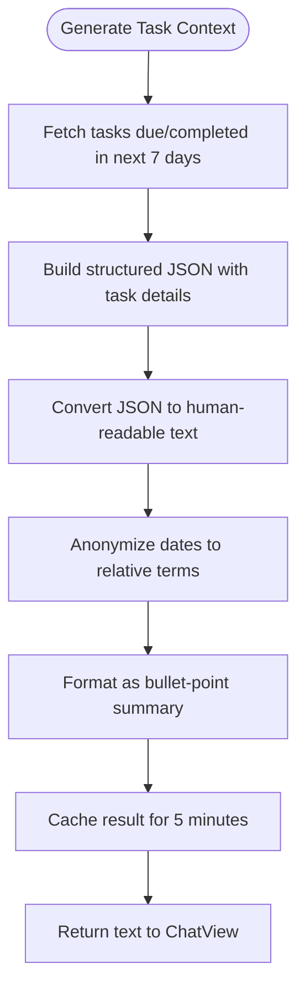

# AI Privacy and Security

<cite>
**Referenced Files in This Document**   
- [privacy.html](file://privacy.html)
- [LLMTaskContextBuilder.swift](file://To%20Do%20List/LLM/Models/LLMTaskContextBuilder.swift)
- [ChatView.swift](file://To%20Do%20List/LLM/Views/Chat/ChatView.swift)
- [TaskManager.swift](file://To%20Do%20List/ViewControllers/TaskManager.swift)
- [PromptMiddleware.swift](file://To%20Do%20List/LLM/Models/PromptMiddleware.swift)
- [LLMEvaluator.swift](file://To%20Do%20List/LLM/Models/LLMEvaluator.swift)
- [Models.swift](file://To%20Do%20List/LLM/Models/Models.swift)
</cite>

## Table of Contents
1. [Introduction](#introduction)
2. [Data Transmission to LLM Services](#data-transmission-to-llm-services)
3. [Data Minimization and Context Building](#data-minimization-and-context-building)
4. [Local Data Storage and Encryption](#local-data-storage-and-encryption)
5. [User Consent and Transparency](#user-consent-and-transparency)
6. [Compliance with Regulations](#compliance-with-regulations)
7. [Security Practices](#security-practices)
8. [Recommendations for Data Protection](#recommendations-for-data-protection)

## Introduction
This document outlines the privacy and security considerations in the integration of AI and Large Language Model (LLM) services within the Tasker application. It details how user data is handled, what information is transmitted to external models, and the safeguards in place to protect user privacy. The analysis is based on code review and alignment with the official privacy policy located in `privacy.html`. The goal is to ensure transparency, compliance, and robust data protection in all AI-related features.

## Data Transmission to LLM Services
The Tasker app transmits a minimal subset of user task data to local LLM models to enable AI-assisted task management. This data is not sent to remote servers or third-party cloud services but is processed entirely on-device using locally hosted models.

The following data elements are included in the context provided to the LLM:
- **Task titles**
- **Project names** (with empty projects mapped to "inbox")
- **Due dates** (converted to relative terms like "Today", "Tomorrow", or "next Monday")
- **Priority levels** (mapped to "high", "medium", or "low")
- **Completion status** (whether a task is completed or not)
- **Task notes** (if present and non-empty)

Sensitive identifiers such as Core Data object IDs are included in the JSON payload but are not used in the final text prompt sent to the model.

**Diagram sources**
- [ChatView.swift](file://To%20Do%20List/LLM/Views/Chat/ChatView.swift#L380-L420)
- [LLMTaskContextBuilder.swift](file://To%20Do%20List/LLM/Models/LLMTaskContextBuilder.swift#L150-L280)

**Section sources**
- [ChatView.swift](file://To%20Do%20List/LLM/Views/Chat/ChatView.swift#L380-L420)
- [LLMTaskContextBuilder.swift](file://To%20Do%20List/LLM/Models/LLMTaskContextBuilder.swift#L150-L280)

## Data Minimization and Context Building
The app employs a strict data minimization strategy when preparing task context for LLM processing. The `LLMTaskContextBuilder` class is responsible for generating a compact textual summary of the user's tasks, which is then injected into the system prompt.

Key anonymization and redaction strategies include:
- **Date anonymization**: Absolute dates are converted to relative terms (e.g., "Today", "Tomorrow", "next Monday") to prevent exposure of calendar patterns.
- **Project normalization**: Empty project fields are standardized to "inbox".
- **Priority simplification**: Priority values are mapped to descriptive labels rather than numeric codes.
- **Caching**: Context is cached for 5 minutes to avoid redundant processing and reduce exposure frequency.

The context includes only tasks due or completed within the next 7 days, significantly limiting the data scope. Completed tasks are included only if they were completed within the current week.

**Diagram sources**
- [LLMTaskContextBuilder.swift](file://To%20Do%20List/LLM/Models/LLMTaskContextBuilder.swift#L150-L280)

**Section sources**
- [LLMTaskContextBuilder.swift](file://To%20Do%20List/LLM/Models/LLMTaskContextBuilder.swift#L150-L280)

## Local Data Storage and Encryption
All user data in Tasker is stored locally on the device and optionally synced via Apple's iCloud infrastructure. The privacy policy explicitly states that data is encrypted and stored locally, with no third-party access.

Key storage and security practices:
- **Local-first architecture**: All task data resides on the user's device by default.
- **iCloud encryption**: When enabled, data sync uses Apple's end-to-end encrypted iCloud infrastructure.
- **On-device AI processing**: LLM models run locally on the device, ensuring that no task data leaves the user's control.
- **No external APIs**: The AI features do not call external LLM APIs (e.g., OpenAI, Anthropic); models are downloaded and executed locally.

The app uses SwiftData and Core Data for persistence, both of which provide built-in encryption when device-level encryption is enabled.

**Section sources**
- [privacy.html](file://privacy.html#L25-L35)
- [LLMDataController.swift](file://To%20Do%20List/LLM/Models/LLMDataController.swift#L1-L17)

## User Consent and Transparency
The app implements implicit user consent through opt-in AI features. Users must actively engage with the chat interface to trigger LLM processing, serving as an affirmative consent mechanism.

Transparency features include:
- **Explicit UI interaction**: Users must type a message and press send to initiate AI processing.
- **No background processing**: LLM inference occurs only during active user sessions.
- **Clear visual feedback**: The interface shows a thinking indicator and allows users to stop generation at any time.
- **No data collection banners**: Since no data is shared externally, no additional disclosure banners are required beyond the general privacy policy.

The `ChatView` manages user interaction and ensures that context is injected only once per conversation thread to prevent unnecessary data exposure.

**Section sources**
- [ChatView.swift](file://To%20Do%20List/LLM/Views/Chat/ChatView.swift#L380-L420)
- [privacy.html](file://privacy.html#L50-L55)

## Compliance with Regulations
Tasker complies with major data protection regulations and platform guidelines through its privacy-preserving architecture.

### GDPR Compliance
- **Lawful basis**: Processing is based on user consent (Article 6(1)(a)) and legitimate interest in providing requested functionality.
- **Data minimization**: Only necessary task data is processed, and it is anonymized where possible.
- **Right to erasure**: Users can delete all data by uninstalling the app or through data export/delete options.
- **No international transfers**: Since data remains on-device or in Apple's iCloud (with EU data centers available), cross-border transfer risks are minimized.

### App Store Guidelines
- **Section 5.1.1 (Data Collection and Storage)**: The app collects only data necessary for functionality and stores it securely.
- **Section 5.1.2 (Data Use and Sharing)**: No user data is shared with third parties for advertising or analytics.
- **Section 5.1.3 (Sensitive Information)**: The app does not collect sensitive personal information as defined by Apple.
- **On-device AI**: Compliance with Apple's requirements for on-device machine learning processing.

The privacy policy is readily accessible within the app and updated with a clear revision date, meeting transparency requirements.

**Section sources**
- [privacy.html](file://privacy.html)
- [ChatView.swift](file://To%20Do%20List/LLM/Views/Chat/ChatView.swift)

## Security Practices
The app implements several security best practices to protect user data during AI interactions.

### Encryption
- **In transit**: Not applicable, as all LLM processing occurs locally on the device.
- **At rest**: Data is protected by iOS device encryption and SwiftData/Core Data storage encryption.
- **Memory**: Sensitive data in memory is managed by Swift's automatic memory management and ARC.

### API Key Management
- **No API keys**: The app does not use external LLM services, eliminating the need to store or manage API keys.
- **Local model authentication**: Models are downloaded from trusted sources (e.g., Hugging Face) without requiring user credentials.

### Session Management
- **Stateless processing**: Each LLM request is independent, with no persistent session tokens.
- **Context scoping**: Task context is injected only once per conversation thread to minimize exposure.
- **Cancellation support**: Users can stop AI generation at any time via the stop button.

**Diagram sources**
- [ChatView.swift](file://To%20Do%20List/LLM/Views/Chat/ChatView.swift)
- [LLMTaskContextBuilder.swift](file://To%20Do%20List/LLM/Models/LLMTaskContextBuilder.swift)
- [LLMEvaluator.swift](file://To%20Do%20List/LLM/Models/LLMEvaluator.swift)
- [TaskManager.swift](file://To%20Do%20List/ViewControllers/TaskManager.swift)

**Section sources**
- [ChatView.swift](file://To%20Do%20List/LLM/Views/Chat/ChatView.swift)
- [LLMTaskContextBuilder.swift](file://To%20Do%20List/LLM/Models/LLMTaskContextBuilder.swift)
- [LLMEvaluator.swift](file://To%20Do%20List/LLM/Models/LLMEvaluator.swift)

## Recommendations for Data Protection
Based on the analysis of the current implementation, the following recommendations are provided to further enhance privacy and security:

1. **Enhanced data minimization**: Consider removing task IDs from the JSON payload, as they are not used in the final prompt.
2. **User-controlled context scope**: Allow users to choose how much historical data is shared with the AI (e.g., "only today's tasks").
3. **Explicit consent dialog**: Add a one-time opt-in dialog when users first access the AI chat feature.
4. **Audit third-party models**: Regularly review the privacy practices of model providers (e.g., MLX, Hugging Face).
5. **Implement data deletion for AI logs**: Provide a way to clear the local chat history and AI-generated content.
6. **Add privacy indicators**: Show a lock icon or privacy badge when AI features are active to reinforce trust.
7. **Expand privacy policy**: Update the privacy policy to specifically address AI features and on-device processing.
8. **Rate limiting**: Implement limits on AI usage to prevent potential abuse or excessive resource consumption.

These recommendations align with privacy-by-design principles and would further strengthen the app's compliance posture while maintaining its core functionality.