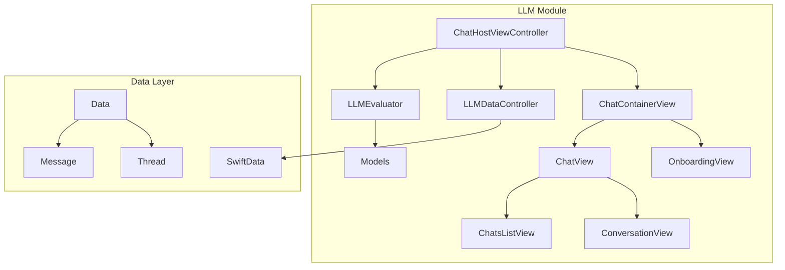
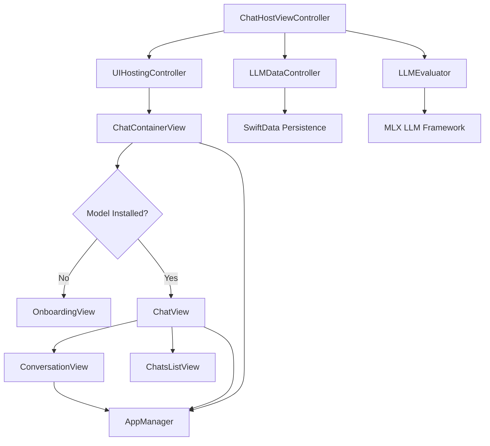
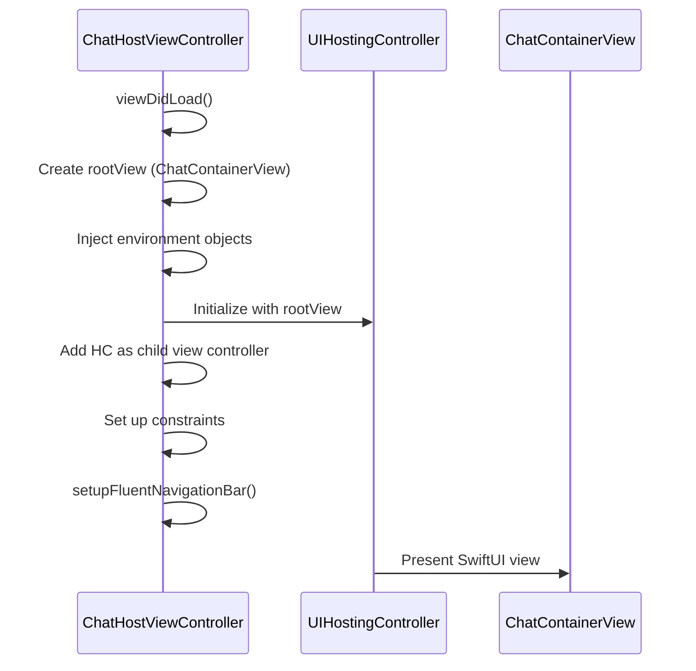
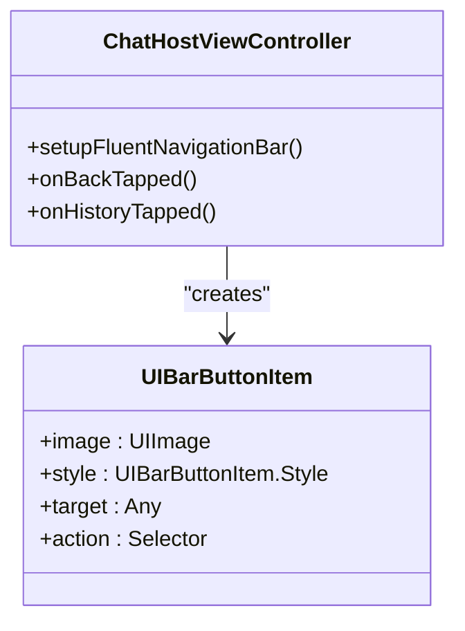
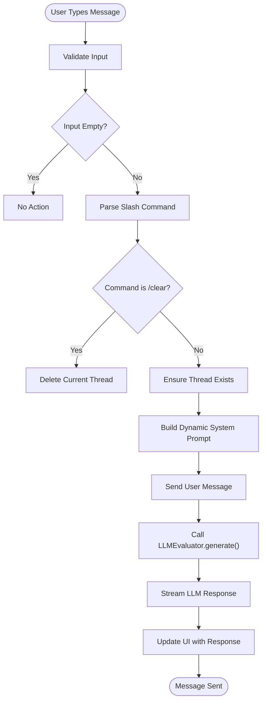
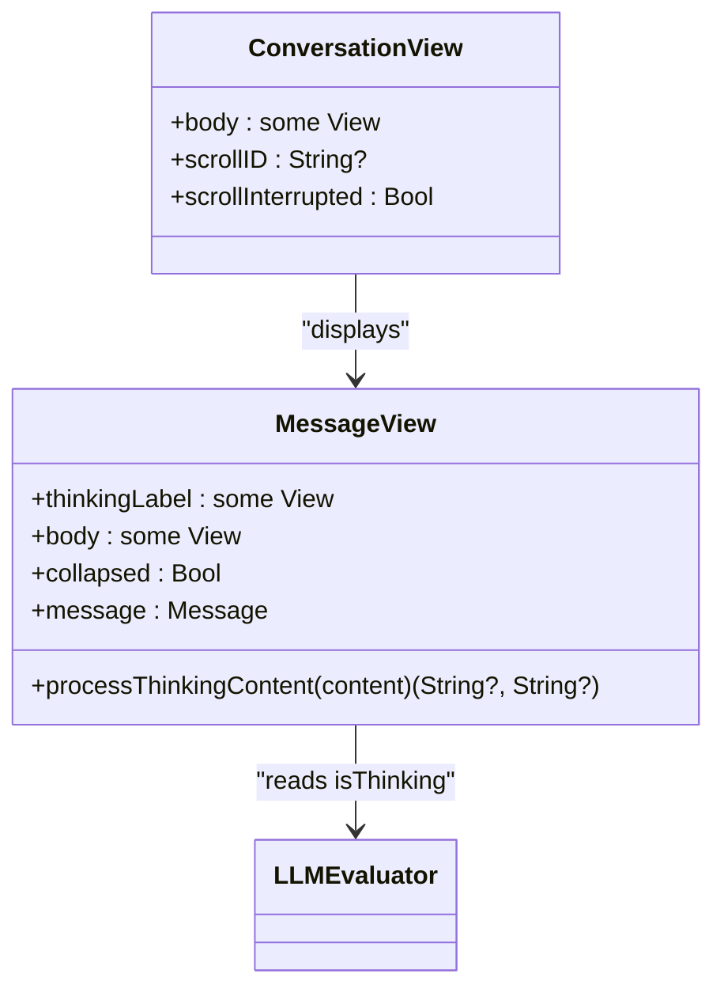
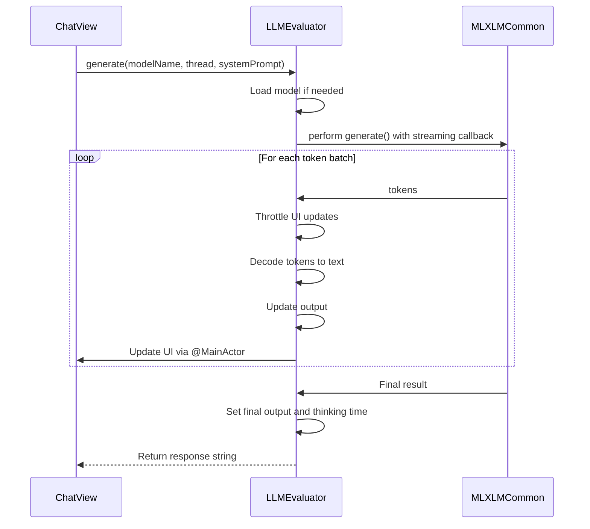
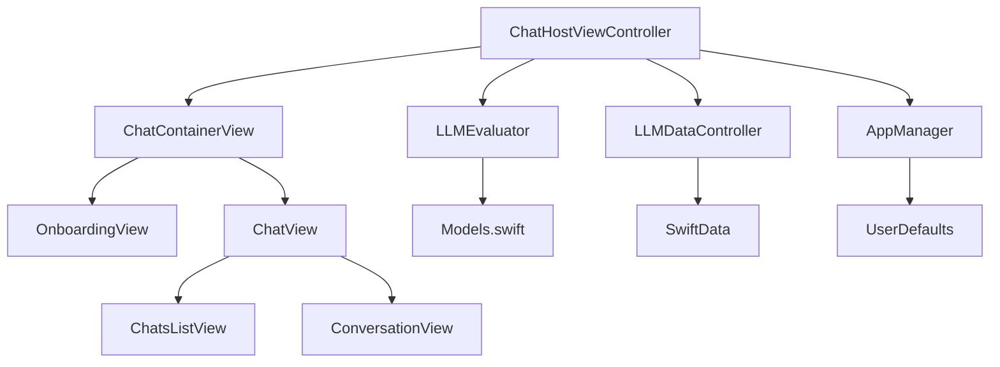

# ChatHostViewController

<cite>
**Referenced Files in This Document**   
- [ChatHostViewController.swift](file://To%20Do%20List/LLM/ChatHostViewController.swift)
- [LLMDataController.swift](file://To%20Do%20List/LLM/Models/LLMDataController.swift)
- [ChatView.swift](file://To%20Do%20List/LLM/Views/Chat/ChatView.swift)
- [ConversationView.swift](file://To%20Do%20List/LLM/Views/Chat/ConversationView.swift)
- [LLMEvaluator.swift](file://To%20Do%20List/LLM/Models/LLMEvaluator.swift)
- [Data.swift](file://To%20Do%20List/LLM/Models/Data.swift)
- [Models.swift](file://To%20Do%20List/LLM/Models/Models.swift)
- [ChatsListView.swift](file://To%20Do%20List/LLM/Views/Chat/ChatsListView.swift)
</cite>

## Table of Contents
1. [Introduction](#introduction)
2. [Project Structure](#project-structure)
3. [Core Components](#core-components)
4. [Architecture Overview](#architecture-overview)
5. [Detailed Component Analysis](#detailed-component-analysis)
6. [Dependency Analysis](#dependency-analysis)
7. [Performance Considerations](#performance-considerations)
8. [Troubleshooting Guide](#troubleshooting-guide)
9. [Conclusion](#conclusion)

## Introduction
The **ChatHostViewController** serves as the primary interface for the AI-powered chat assistant in the Tasker application. It acts as a UIKit wrapper that embeds a SwiftUI-based chat interface, enabling users to interact with a locally running large language model (LLM). The controller dynamically presents either an onboarding flow for model installation or the main chat UI based on whether a model is already installed. It manages user input, message threading, real-time streaming of LLM responses, and navigation state. This document provides a comprehensive analysis of its responsibilities, lifecycle, UI integration, and interaction with backend services such as **LLMDataController** and **LLMEvaluator**.

## Project Structure
The project follows a modular structure with clear separation between UIKit and SwiftUI components. The LLM module resides under `To Do List/LLM/`, organizing code into **Models**, **Views**, and **Extensions**. The **ChatHostViewController** sits at the boundary between UIKit and SwiftUI, hosting the SwiftUI chat interface via **UIHostingController**. Data persistence is handled through SwiftData, with models defined in **Data.swift** and shared via a singleton container in **LLMDataController.swift**.

**Diagram sources**
- [ChatHostViewController.swift](file://To%20Do%20List/LLM/ChatHostViewController.swift#L1-L141)
- [Data.swift](file://To%20Do%20List/LLM/Models/Data.swift#L1-L289)
- [LLMDataController.swift](file://To%20Do%20List/LLM/Models/LLMDataController.swift#L1-L17)

**Section sources**
- [ChatHostViewController.swift](file://To%20Do%20List/LLM/ChatHostViewController.swift#L1-L141)
- [LLMDataController.swift](file://To%20Do%20List/LLM/Models/LLMDataController.swift#L1-L17)

## Core Components
The **ChatHostViewController** integrates several key components:
- **UIHostingController**: Embeds the SwiftUI chat interface.
- **AppManager**: Manages app state, preferences, and haptics.
- **LLMEvaluator**: Handles LLM model loading, generation, and streaming.
- **LLMDataController**: Provides a shared SwiftData container for persistent message storage.
- **ChatContainerView**: Determines whether to show onboarding or chat UI.
- **ChatView**: Implements the main chat interface with input and message display.
- **ConversationView**: Renders individual messages with support for streaming and thinking indicators.

These components work together to provide a seamless chat experience with real-time response streaming and persistent chat history.

**Section sources**
- [ChatHostViewController.swift](file://To%20Do%20List/LLM/ChatHostViewController.swift#L1-L141)
- [ChatView.swift](file://To%20Do%20List/LLM/Views/Chat/ChatView.swift#L1-L442)
- [ConversationView.swift](file://To%20Do%20List/LLM/Views/Chat/ConversationView.swift#L1-L240)

## Architecture Overview
The architecture follows a hybrid UIKit-SwiftUI pattern, where **ChatHostViewController** acts as the entry point from UIKit and hosts a SwiftUI view hierarchy. The data layer uses SwiftData for local persistence, with a shared **ModelContainer** ensuring consistency across views. The **LLMEvaluator** class manages LLM interactions, including model loading, prompt generation, and streaming output. The UI dynamically switches between onboarding and chat modes based on model availability.

**Diagram sources**
- [ChatHostViewController.swift](file://To%20Do%20List/LLM/ChatHostViewController.swift#L1-L141)
- [ChatView.swift](file://To%20Do%20List/LLM/Views/Chat/ChatView.swift#L1-L442)
- [LLMEvaluator.swift](file://To%20Do%20List/LLM/Models/LLMEvaluator.swift#L1-L167)

## Detailed Component Analysis

### ChatHostViewController Analysis
The **ChatHostViewController** is responsible for initializing the chat interface, setting up the navigation bar, and embedding the SwiftUI chat view. It uses a **UIHostingController** to present the **ChatContainerView**, which decides between showing onboarding or the main chat UI.

#### View Lifecycle and Initialization
The controller overrides `viewDidLoad()` to configure the hosting controller and set up the FluentUI navigation bar. It injects the shared **ModelContainer** and environment objects into the SwiftUI hierarchy.

**Diagram sources**
- [ChatHostViewController.swift](file://To%20Do%20List/LLM/ChatHostViewController.swift#L25-L75)

#### Navigation Bar Setup
The **setupFluentNavigationBar()** method configures a custom navigation bar with a back button and a history button. The history button posts a notification to toggle the chat history sheet.

**Diagram sources**
- [ChatHostViewController.swift](file://To%20Do%20List/LLM/ChatHostViewController.swift#L77-L115)

**Section sources**
- [ChatHostViewController.swift](file://To%20Do%20List/LLM/ChatHostViewController.swift#L77-L115)

### ChatView Analysis
The **ChatView** struct implements the main chat interface, including message input, model selection, and conversation display.

#### Message Input Handling
The **chatInput** computed property returns a **TextField** bound to the **prompt** state. On submission, it calls **generate()**, which handles sending the message and initiating LLM processing.

**Diagram sources**
- [ChatView.swift](file://To%20Do%20List/LLM/Views/Chat/ChatView.swift#L100-L300)

#### Slash Command Processing
The **parseSlashCommand()** method parses special commands like `/today`, `/week`, and `/clear` to trigger specific actions such as summarizing tasks or clearing the chat.

**Section sources**
- [ChatView.swift](file://To%20Do%20List/LLM/Views/Chat/ChatView.swift#L300-L380)

### ConversationView Analysis
The **ConversationView** displays the message thread, with special handling for streaming responses and thinking indicators.

#### Message Streaming Display
The **MessageView** component processes messages containing `<think>` tags to display intermediate reasoning steps. It supports collapsing and expanding the thinking content.

**Diagram sources**
- [ConversationView.swift](file://To%20Do%20List/LLM/Views/Chat/ConversationView.swift#L1-L240)

**Section sources**
- [ConversationView.swift](file://To%20Do%20List/LLM/Views/Chat/ConversationView.swift#L1-L240)

### LLMEvaluator Analysis
The **LLMEvaluator** class manages communication with the LLM, including model loading, generation, and response streaming.

#### Streaming Response Handling
The **generate()** method uses MLXLMCommon's streaming API to receive tokens incrementally, updating the **output** property every N tokens for performance.

**Diagram sources**
- [LLMEvaluator.swift](file://To%20Do%20List/LLM/Models/LLMEvaluator.swift#L1-L167)

**Section sources**
- [LLMEvaluator.swift](file://To%20Do%20List/LLM/Models/LLMEvaluator.swift#L1-L167)

## Dependency Analysis
The **ChatHostViewController** has dependencies on several key components:

**Diagram sources**
- [ChatHostViewController.swift](file://To%20Do%20List/LLM/ChatHostViewController.swift#L1-L141)
- [Data.swift](file://To%20Do%20List/LLM/Models/Data.swift#L1-L289)

**Section sources**
- [ChatHostViewController.swift](file://To%20Do%20List/LLM/ChatHostViewController.swift#L1-L141)

## Performance Considerations
The application implements several performance optimizations:
- **Throttled UI Updates**: The **LLMEvaluator** updates the UI every N tokens (default 4) to reduce overhead.
- **Lazy Loading**: Models are loaded only when needed and cached for subsequent use.
- **Efficient Data Fetching**: SwiftData queries are optimized with **FetchDescriptor** and **@Query**.
- **Memory Management**: The GPU cache limit is set to 20MB to prevent excessive memory usage.
- **Background Processing**: LLM generation runs on a background task to avoid blocking the main thread.

## Troubleshooting Guide
Common issues and their solutions:

**Section sources**
- [ChatHostViewController.swift](file://To%20Do%20List/LLM/ChatHostViewController.swift#L1-L141)
- [LLMEvaluator.swift](file://To%20Do%20List/LLM/Models/LLMEvaluator.swift#L1-L167)
- [ConversationView.swift](file://To%20Do%20List/LLM/Views/Chat/ConversationView.swift#L1-L240)

### Issue: Chat History Not Updating
**Symptom**: Changes to chat threads do not reflect in the UI.
**Cause**: The **@Query** in **ChatsListView** may not be observing changes properly.
**Solution**: Ensure the **modelContext** is correctly injected and that **try? modelContext.save()** is called after modifications.

### Issue: LLM Response Streaming Stalls
**Symptom**: The response stops updating mid-generation.
**Cause**: The streaming callback may be blocked on the main thread.
**Solution**: Verify that the **generate()** method uses **DispatchQueue.main.async** for UI updates and that **shouldCancel** is properly checked.

### Issue: Onboarding View Always Shows
**Symptom**: The app shows onboarding even after model installation.
**Cause**: The **AppManager.installedModels** array is not updated.
**Solution**: Ensure **addInstalledModel()** is called after successful model download and that **UserDefaults** storage works correctly.

## Conclusion
The **ChatHostViewController** effectively bridges UIKit and SwiftUI to deliver a robust chat interface for local LLM interaction. It manages complex state, integrates with SwiftData for persistence, and handles real-time streaming responses through the **LLMEvaluator**. The architecture supports dynamic UI switching between onboarding and chat modes, with extensible components for message display, input handling, and history management. By following SwiftUI best practices and leveraging modern iOS frameworks, the implementation provides a responsive and maintainable foundation for AI-powered chat functionality.