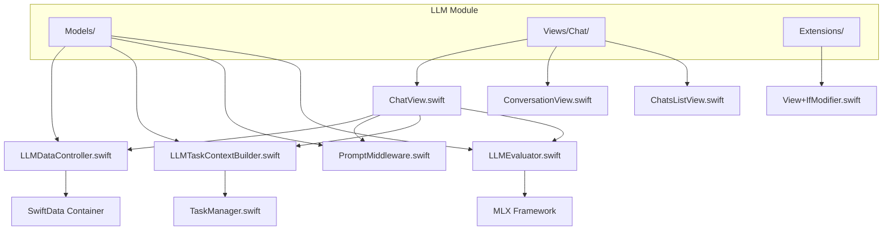
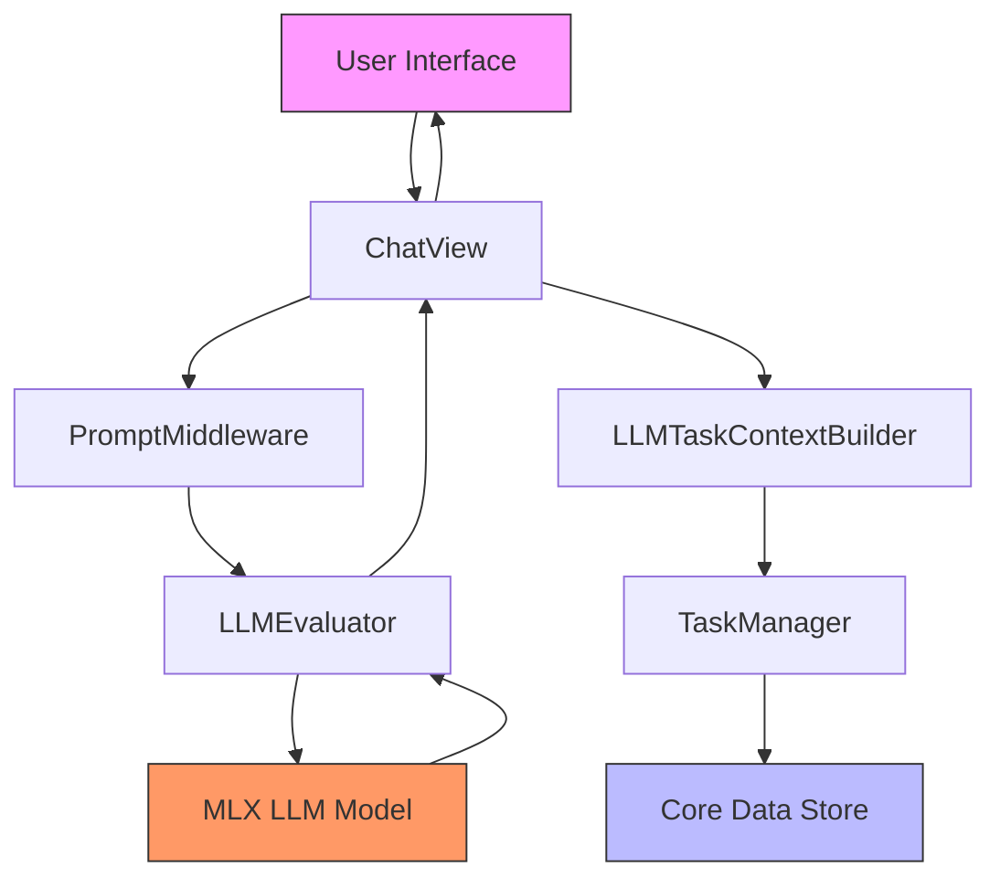
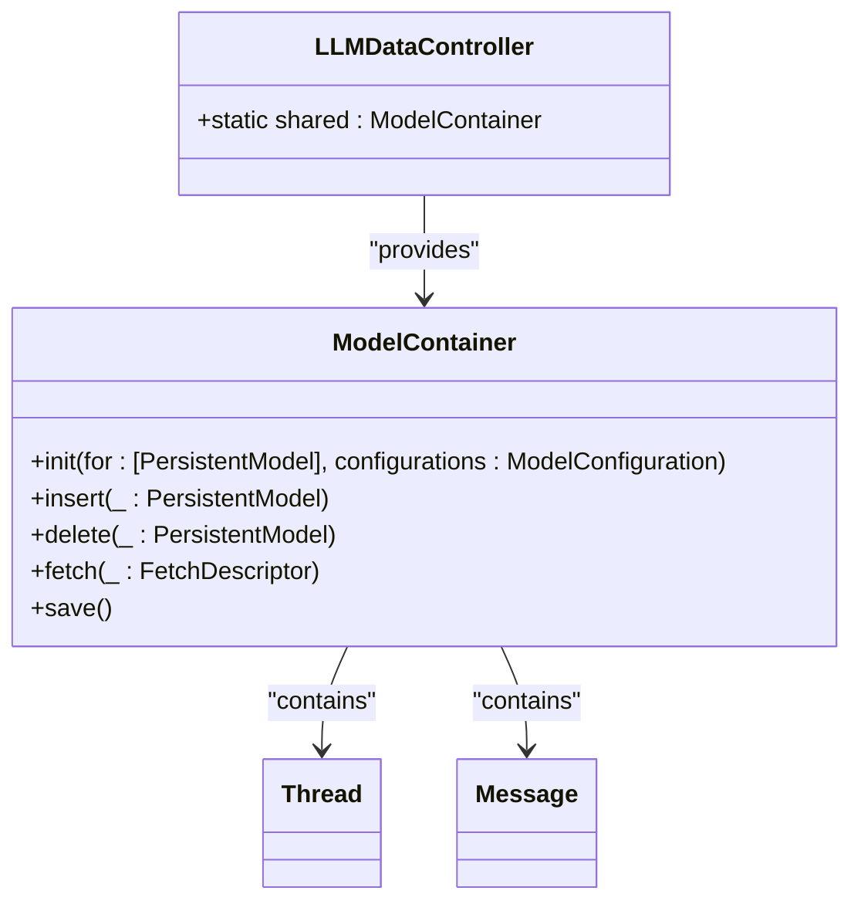
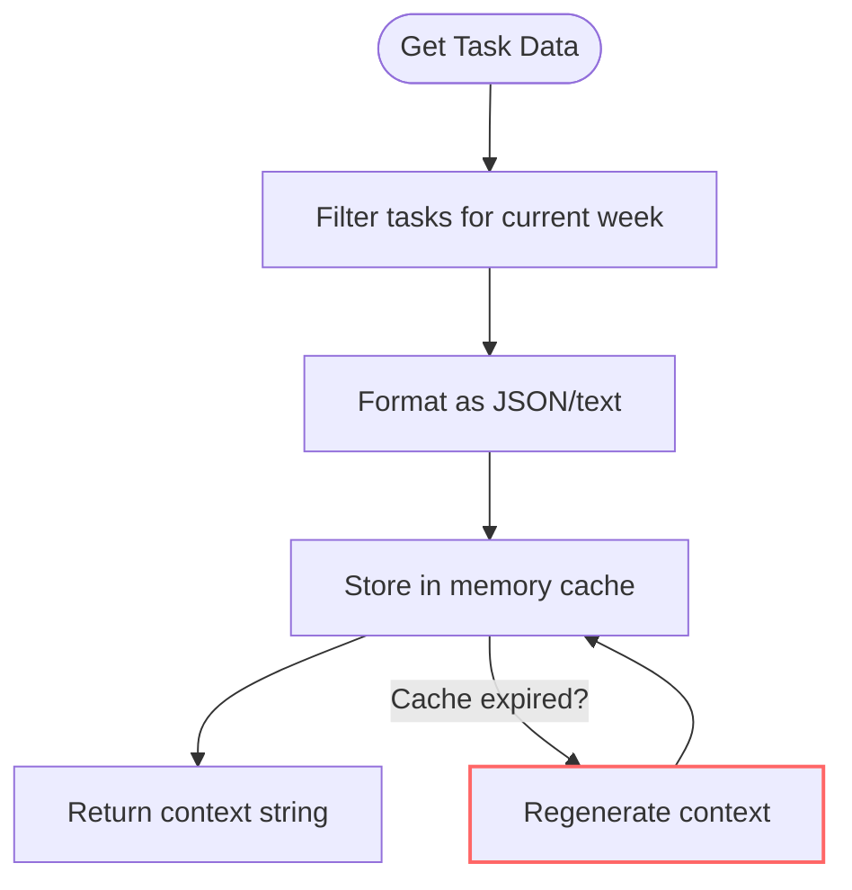
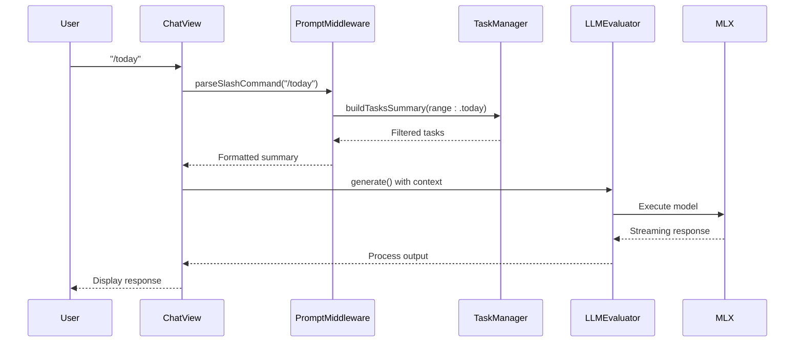
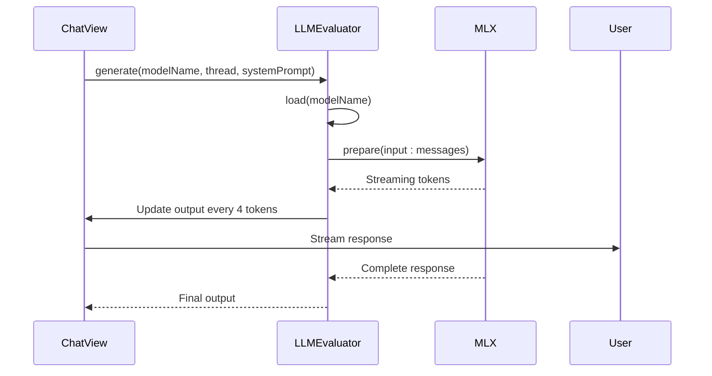
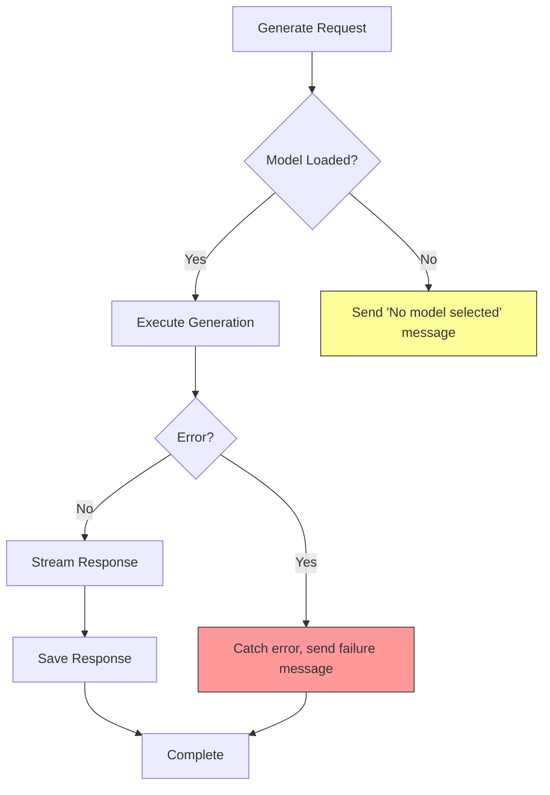
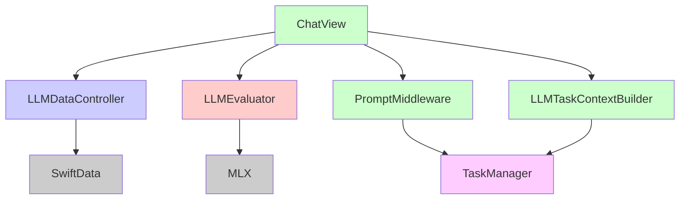

# LLMDataController

<cite>
**Referenced Files in This Document**   
- [LLMDataController.swift](file://To%20Do%20List/LLM/Models/LLMDataController.swift)
- [LLMTaskContextBuilder.swift](file://To%20Do%20List/LLM/Models/LLMTaskContextBuilder.swift)
- [PromptMiddleware.swift](file://To%20Do%20List/LLM/Models/PromptMiddleware.swift)
- [ChatView.swift](file://To%20Do%20List/LLM/Views/Chat/ChatView.swift)
- [LLMEvaluator.swift](file://To%20Do%20List/LLM/Models/LLMEvaluator.swift)
- [TaskManager.swift](file://To%20Do%20List/ViewControllers/TaskManager.swift)
- [NTask+CoreDataProperties.swift](file://To%20Do%20List/NTask+CoreDataProperties.swift)
</cite>

## Table of Contents
1. [Introduction](#introduction)
2. [Project Structure](#project-structure)
3. [Core Components](#core-components)
4. [Architecture Overview](#architecture-overview)
5. [Detailed Component Analysis](#detailed-component-analysis)
6. [Dependency Analysis](#dependency-analysis)
7. [Performance Considerations](#performance-considerations)
8. [Troubleshooting Guide](#troubleshooting-guide)
9. [Conclusion](#conclusion)

## Introduction

The **LLMDataController** is a central component in the Tasker application responsible for managing the data flow and state of the AI chat assistant feature. It serves as the backbone for integrating local large language models (LLMs) with the user's task management system, enabling context-aware assistance based on the user's current tasks, priorities, and project status.

This document provides a comprehensive analysis of the LLMDataController and its ecosystem, detailing how it maintains chat session state using SwiftData, constructs dynamic prompts enriched with task context, and communicates with local LLM APIs through the LLMEvaluator. The system is designed with privacy in mind, processing sensitive task data locally and minimizing exposure in external requests.

The controller orchestrates interactions between the UI layer (ChatView), task data (TaskManager), prompt engineering logic (LLMTaskContextBuilder), and model execution (LLMEvaluator), forming a cohesive pipeline that transforms raw task data into intelligent, actionable suggestions.

## Project Structure

The LLM module is organized within a dedicated directory structure under the main application, following a clean separation of concerns between models, views, and utilities. The architecture leverages SwiftData for persistent storage of chat sessions and integrates with Core Data for accessing task information.

**Diagram sources**
- [LLMDataController.swift](file://To%20Do%20List/LLM/Models/LLMDataController.swift)
- [ChatView.swift](file://To%20Do%20List/LLM/Views/Chat/ChatView.swift)
- [LLMEvaluator.swift](file://To%20Do%20List/LLM/Models/LLMEvaluator.swift)

**Section sources**
- [LLMDataController.swift](file://To%20Do%20List/LLM/Models/LLMDataController.swift)
- [ChatView.swift](file://To%20Do%20List/LLM/Views/Chat/ChatView.swift)

## Core Components

The LLMDataController ecosystem consists of several key components that work together to deliver AI-powered task assistance:

- **LLMDataController**: Singleton that provides a shared SwiftData container for persistent chat session storage
- **LLMTaskContextBuilder**: Utility that extracts and formats task data into structured context blocks
- **PromptMiddleware**: Applies prompt engineering strategies and handles slash commands
- **LLMEvaluator**: Manages communication with local LLM models using Apple's MLX framework
- **ChatView**: SwiftUI interface that orchestrates user interaction and prompt generation
- **TaskManager**: Core Data-based service that provides access to the user's task database

These components form a pipeline where user input is enriched with relevant task context, formatted into an effective prompt, and submitted to a local LLM model for processing, with responses streamed back to the user interface.

**Section sources**
- [LLMDataController.swift](file://To%20Do%20List/LLM/Models/LLMDataController.swift)
- [LLMTaskContextBuilder.swift](file://To%20Do%20List/LLM/Models/LLMTaskContextBuilder.swift)
- [LLMEvaluator.swift](file://To%20Do%20List/LLM/Models/LLMEvaluator.swift)

## Architecture Overview

The LLM architecture follows a layered pattern with clear separation between data access, business logic, and presentation layers. The system is designed to operate primarily offline, with all sensitive task data processed locally on the device.

**Diagram sources**
- [ChatView.swift](file://To%20Do%20List/LLM/Views/Chat/ChatView.swift)
- [LLMEvaluator.swift](file://To%20Do%20List/LLM/Models/LLMEvaluator.swift)
- [TaskManager.swift](file://To%20Do%20List/ViewControllers/TaskManager.swift)

## Detailed Component Analysis

### LLMDataController Analysis

The LLMDataController is implemented as a singleton enum that provides a shared SwiftData container for the LLM module. This ensures that all views and components access the same persistent store, maintaining consistency across the application.

**Diagram sources**
- [LLMDataController.swift](file://To%20Do%20List/LLM/Models/LLMDataController.swift#L1-L16)

#### Chat Session State Management

The LLMDataController manages chat session state through SwiftData's ModelContainer, which persists Thread and Message entities. Each chat session is represented as a Thread, with associated Message objects storing the conversation history.

When a user begins a new conversation, the ChatView creates a new Thread instance and saves it to the model context. Subsequent messages are added to this thread, with both user inputs and AI responses persisted locally. This approach ensures that chat history is maintained across app launches while respecting user privacy.

The shared container pattern prevents data inconsistencies that could arise from multiple instances accessing different data stores. By centralizing the ModelContainer, the application guarantees that all components interact with the same dataset.

**Section sources**
- [LLMDataController.swift](file://To%20Do%20List/LLM/Models/LLMDataController.swift#L1-L16)
- [ChatView.swift](file://To%20Do%20List/LLM/Views/Chat/ChatView.swift#L370-L380)

### LLMTaskContextBuilder Analysis

The LLMTaskContextBuilder is responsible for extracting relevant task data and formatting it into structured context blocks that can be injected into LLM prompts. This component plays a critical role in enabling context-aware AI assistance.

**Diagram sources**
- [LLMTaskContextBuilder.swift](file://To%20Do%20List/LLM/Models/LLMTaskContextBuilder.swift#L1-L281)

#### Context-Aware Prompt Construction

The LLMTaskContextBuilder constructs context blocks by retrieving tasks from the TaskManager that are due or completed within the next seven days. It organizes this data into a structured JSON format that includes:

- Tasks due today or overdue
- Other tasks scheduled for the current week
- Open projects with active tasks and their counts

The builder applies several transformations to make the data more useful for the LLM:
- Relative date labels (e.g., "Today", "Tomorrow", "next Monday")
- Priority labels converted from numeric values to descriptive terms
- Project grouping with task counts

This contextual information is cached for five minutes to avoid unnecessary recomputation, improving performance while ensuring the AI assistant has access to reasonably current task data.

**Section sources**
- [LLMTaskContextBuilder.swift](file://To%20Do%20List/LLM/Models/LLMTaskContextBuilder.swift#L1-L281)
- [NTask+CoreDataProperties.swift](file://To%20Do%20List/NTask+CoreDataProperties.swift#L1-L53)

### Prompt Engineering and Dynamic Variables

The system employs sophisticated prompt engineering techniques to guide the LLM's behavior and ensure relevant, actionable responses. The PromptMiddleware component handles slash commands that allow users to request specific types of assistance.

**Diagram sources**
- [PromptMiddleware.swift](file://To%20Do%20List/LLM/Models/PromptMiddleware.swift#L1-L56)
- [ChatView.swift](file://To%20Do%20List/LLM/Views/Chat/ChatView.swift#L250-L360)

The prompt construction process incorporates dynamic variables such as task urgency, due dates, and priorities to influence the AI's suggestions. For example, tasks with high priority are explicitly labeled as such in the context, prompting the AI to give them appropriate attention. The system also handles relative time references, converting absolute dates into human-readable terms like "Today" or "Tomorrow" to make the context more natural.

Slash commands like `/today`, `/week`, and `/project` allow users to focus the AI's attention on specific timeframes or projects, with the PromptMiddleware filtering the task data accordingly before injection into the prompt.

**Section sources**
- [PromptMiddleware.swift](file://To%20Do%20List/LLM/Models/PromptMiddleware.swift#L1-L56)
- [ChatView.swift](file://To%20Do%20List/LLM/Views/Chat/ChatView.swift#L250-L360)

### API Request Construction and Streaming

The LLMEvaluator component manages communication with the local LLM model using Apple's MLX framework. It constructs API requests with appropriate headers, payload structure, and handles streaming responses efficiently.

**Diagram sources**
- [LLMEvaluator.swift](file://To%20Do%20List/LLM/Models/LLMEvaluator.swift#L1-L166)
- [ChatView.swift](file://To%20Do%20List/LLM/Views/Chat/ChatView.swift#L300-L360)

The request construction includes:
- System prompts that establish the AI's role and capabilities
- Message history from the current thread
- Dynamically generated context from LLMTaskContextBuilder
- Configuration parameters (temperature: 0.5, max tokens: 4096)

The implementation uses streaming to provide immediate feedback to users, updating the interface every four tokens to balance responsiveness with performance. This creates the perception of real-time generation while minimizing UI update overhead.

**Section sources**
- [LLMEvaluator.swift](file://To%20Do%20List/LLM/Models/LLMEvaluator.swift#L1-L166)
- [ChatView.swift](file://To%20Do%20List/LLM/Views/Chat/ChatView.swift#L300-L360)

### Error Handling and Resilience

The system implements comprehensive error handling to manage various failure scenarios gracefully:

**Diagram sources**
- [LLMEvaluator.swift](file://To%20Do%20List/LLM/Models/LLMEvaluator.swift#L120-L160)
- [ChatView.swift](file://To%20Do%20List/LLM/Views/Chat/ChatView.swift#L340-L360)

Key error handling strategies include:
- Graceful degradation when no model is selected
- Comprehensive error catching with user-friendly messages
- Task cancellation support through the stop() method
- Robust Core Data error handling with detailed logging
- Model loading with progress tracking and error recovery

The LLMEvaluator class uses Swift's async/await pattern to handle asynchronous operations safely, with proper error propagation and cancellation support. This ensures that the UI remains responsive even during extended model loading or generation processes.

**Section sources**
- [LLMEvaluator.swift](file://To%20Do%20List/LLM/Models/LLMEvaluator.swift#L1-L166)
- [ChatView.swift](file://To%20Do%20List/LLM/Views/Chat/ChatView.swift#L300-L360)

### Data Privacy and Security

The architecture prioritizes data privacy through several key design decisions:

- All task data processing occurs locally on the device
- No sensitive information is sent to external servers
- SwiftData container explicitly disables CloudKit synchronization
- Context injection is limited to necessary information only
- Memory caching with automatic expiration

The LLMDataController uses a ModelConfiguration with cloudKitDatabase set to .none, ensuring that chat history and task context remain on the user's device. This approach aligns with privacy best practices by minimizing data exposure and giving users full control over their information.

**Section sources**
- [LLMDataController.swift](file://To%20Do%20List/LLM/Models/LLMDataController.swift#L1-L16)
- [LLMTaskContextBuilder.swift](file://To%20Do%20List/LLM/Models/LLMTaskContextBuilder.swift#L1-L281)

## Dependency Analysis

The LLMDataController and its associated components have a well-defined dependency graph that enables modularity and testability:

**Diagram sources**
- [LLMDataController.swift](file://To%20Do%20List/LLM/Models/LLMDataController.swift)
- [ChatView.swift](file://To%20Do%20List/LLM/Views/Chat/ChatView.swift)
- [LLMEvaluator.swift](file://To%20Do%20List/LLM/Models/LLMEvaluator.swift)

The dependency structure follows the dependency inversion principle, with higher-level modules depending on abstractions rather than concrete implementations. This design allows for easier testing and potential replacement of components, such as integrating alternative LLM providers.

**Section sources**
- [LLMDataController.swift](file://To%20Do%20List/LLM/Models/LLMDataController.swift)
- [ChatView.swift](file://To%20Do%20List/LLM/Views/Chat/ChatView.swift)
- [LLMEvaluator.swift](file://To%20Do%20List/LLM/Models/LLMEvaluator.swift)

## Performance Considerations

The system incorporates several performance optimizations:

- In-memory caching of task context with 5-minute TTL
- Throttled UI updates during streaming (every 4 tokens)
- Efficient Core Data fetching with predicates
- Background processing for model loading
- Minimal context injection to reduce prompt size

The LLMTaskContextBuilder caches generated JSON to avoid expensive recomputation, while the streaming implementation in LLMEvaluator balances responsiveness with performance by updating the UI only every four tokens. These optimizations ensure a smooth user experience even on resource-constrained devices.

## Troubleshooting Guide

Common issues and their solutions:

**Issue**: Chat history not persisting across app launches
**Solution**: Verify that the SwiftData container is properly configured and that modelContext.save() is called after modifications

**Issue**: LLM responses appear outdated or irrelevant
**Solution**: Check that LLMTaskContextBuilder cache is properly invalidated and that fresh task data is being retrieved

**Issue**: Model fails to load or generate responses
**Solution**: Verify model installation status through AppManager and check MLX framework compatibility

**Issue**: Memory usage spikes during conversation
**Solution**: Monitor SwiftData container size and implement periodic cleanup of old threads

**Issue**: Slow response times
**Solution**: Check device thermal state, model size, and background processes that may be competing for GPU resources

**Section sources**
- [LLMDataController.swift](file://To%20Do%20List/LLM/Models/LLMDataController.swift)
- [LLMEvaluator.swift](file://To%20Do%20List/LLM/Models/LLMEvaluator.swift)
- [ChatView.swift](file://To%20Do%20List/LLM/Views/Chat/ChatView.swift)

## Conclusion

The LLMDataController and its ecosystem represent a sophisticated integration of local AI capabilities with personal task management. By leveraging SwiftData for persistent storage, MLX for local model execution, and thoughtful prompt engineering, the system delivers a privacy-preserving AI assistant that understands the user's workflow and priorities.

The architecture demonstrates best practices in mobile AI development, with clear separation of concerns, efficient resource management, and robust error handling. The design enables context-aware assistance while keeping sensitive task data on the device, addressing growing privacy concerns in AI applications.

Future enhancements could include support for multiple LLM providers, improved context summarization for longer conversations, and adaptive prompting based on user feedback patterns. The modular design makes such extensions feasible without major architectural changes.