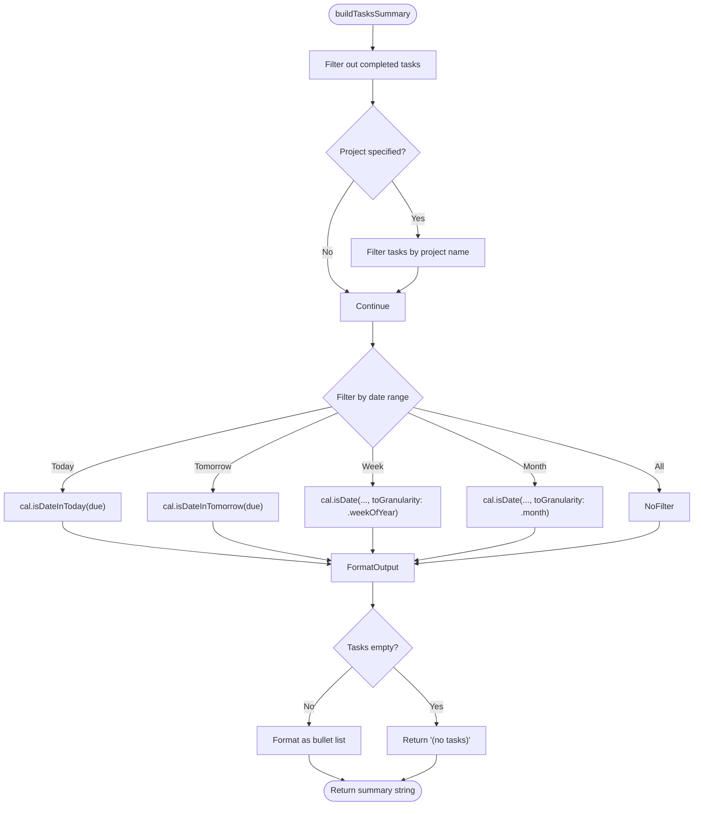

# Prompt Engineering Strategy

<cite>
**Referenced Files in This Document**   
- [LLMDataController.swift](file://To%20Do%20List/LLM/Models/LLMDataController.swift)
- [PromptMiddleware.swift](file://To%20Do%20List/LLM/Models/PromptMiddleware.swift)
- [LLMTaskContextBuilder.swift](file://To%20Do%20List/LLM/Models/LLMTaskContextBuilder.swift)
- [ChatView.swift](file://To%20Do%20List/LLM/Views/Chat/ChatView.swift)
- [ChatHostViewController.swift](file://To%20Do%20List/LLM/ChatHostViewController.swift)
- [LLMEvaluator.swift](file://To%20Do%20List/LLM/Models/LLMEvaluator.swift)
</cite>

## Table of Contents
1. [Introduction](#introduction)
2. [Project Structure](#project-structure)
3. [Core Components](#core-components)
4. [Architecture Overview](#architecture-overview)
5. [Detailed Component Analysis](#detailed-component-analysis)
6. [Prompt Construction and Context Injection](#prompt-construction-and-context-injection)
7. [Dynamic Prompt Assembly](#dynamic-prompt-assembly)
8. [User Interaction and Slash Commands](#user-interaction-and-slash-commands)
9. [Caching and Performance Optimization](#caching-and-performance-optimization)
10. [Security and Injection Risks](#security-and-injection-risks)
11. [Best Practices and Recommendations](#best-practices-and-recommendations)

## Introduction
This document provides a comprehensive analysis of the prompt engineering strategy implemented in the Tasker iOS application to integrate a local Large Language Model (LLM) for task management assistance. The system leverages SwiftData for persistence, dynamic context injection, and structured prompt assembly to deliver personalized, context-aware responses. The architecture emphasizes efficiency, security, and usability, ensuring that user data is securely embedded within prompts while minimizing token usage and maintaining conversational coherence.

## Project Structure
The project is structured around a modular SwiftUI/UIKit hybrid architecture with a dedicated LLM module. The core components are organized under the `To Do List/LLM` directory, separating concerns between data models, UI views, and business logic.


**Diagram sources**
- [LLMDataController.swift](file://To%20Do%20List/LLM/Models/LLMDataController.swift#L1-L17)
- [PromptMiddleware.swift](file://To%20Do%20List/LLM/Models/PromptMiddleware.swift#L1-L57)
- [LLMTaskContextBuilder.swift](file://To%20Do%20List/LLM/Models/LLMTaskContextBuilder.swift#L1-L282)

**Section sources**
- [LLMDataController.swift](file://To%20Do%20List/LLM/Models/LLMDataController.swift#L1-L17)
- [PromptMiddleware.swift](file://To%20Do%20List/LLM/Models/PromptMiddleware.swift#L1-L57)

## Core Components
The core components of the LLM integration include:
- **LLMDataController**: Manages the SwiftData container for persistent storage of chat threads and messages.
- **LLMEvaluator**: Handles LLM inference, model selection, and response generation.
- **LLMTaskContextBuilder**: Constructs contextual summaries of user tasks and projects for injection into prompts.
- **PromptMiddleware**: Provides utility functions for filtering and summarizing tasks based on time ranges and projects.
- **ChatView**: The primary SwiftUI interface for user interaction with the LLM.
- **ChatHostViewController**: UIKit wrapper that embeds the SwiftUI chat interface.

These components work together to create a seamless, context-aware assistant experience.

**Section sources**
- [LLMDataController.swift](file://To%20Do%20List/LLM/Models/LLMDataController.swift#L1-L17)
- [LLMEvaluator.swift](file://To%20Do%20List/LLM/Models/LLMEvaluator.swift)
- [ChatView.swift](file://To%20Do%20List/LLM/Views/Chat/ChatView.swift#L1-L442)

## Architecture Overview
The LLM integration follows a clean separation of concerns between data, logic, and presentation layers. The system uses a singleton pattern for shared state (e.g., `LLMDataController.shared`) and dependency injection via SwiftUI's environment system.


**Diagram sources**
- [ChatView.swift](file://To%20Do%20List/LLM/Views/Chat/ChatView.swift#L1-L442)
- [LLMEvaluator.swift](file://To%20Do%20List/LLM/Models/LLMEvaluator.swift)
- [LLMTaskContextBuilder.swift](file://To%20Do%20List/LLM/Models/LLMTaskContextBuilder.swift#L1-L282)

## Detailed Component Analysis

### LLMDataController Analysis
The `LLMDataController` is a singleton that provides a shared `ModelContainer` instance for SwiftData, ensuring all views access the same persistent store. It disables CloudKit synchronization to avoid validation requirements.


**Diagram sources**
- [LLMDataController.swift](file://To%20Do%20List/LLM/Models/LLMDataController.swift#L1-L17)

**Section sources**
- [LLMDataController.swift](file://To%20Do%20List/LLM/Models/LLMDataController.swift#L1-L17)

### PromptMiddleware Analysis
The `PromptMiddleware` struct provides a static method to generate task summaries filtered by time range and optional project. It uses `TaskManager` to access all tasks and applies filtering logic based on due dates and project membership.



**Diagram sources**
- [PromptMiddleware.swift](file://To%20Do%20List/LLM/Models/PromptMiddleware.swift#L1-L57)

**Section sources**
- [PromptMiddleware.swift](file://To%20Do%20List/LLM/Models/PromptMiddleware.swift#L1-L57)

## Prompt Construction and Context Injection
The system constructs prompts using a multi-part strategy that combines a fixed role definition, dynamic user context, and real-time task data. This approach ensures the LLM operates as a personalized assistant with up-to-date information.

### System Prompt Structure
The base system prompt establishes the assistant's identity and behavior:
```
You are Eva, the user's personal task assistant. Use the provided tasks and project details to answer questions and help manage their work.
```

Additional context from `appManager.systemPrompt` is appended, allowing for configurable behavior.

### Context Injection Strategy
The system injects task context in two ways:
1. **Slash Command Context**: When the user uses commands like `/today` or `/week`, the `PromptMiddleware.buildTasksSummary()` method generates a filtered list of tasks.
2. **Automatic Weekly Context**: For each new conversation thread, the full weekly task context is injected once using `LLMTaskContextBuilder.weeklyTasksTextCached()`.

This dual strategy balances relevance with token efficiency, avoiding redundant context in multi-turn conversations.


**Diagram sources**
- [ChatView.swift](file://To%20Do%20List/LLM/Views/Chat/ChatView.swift#L1-L442)
- [LLMTaskContextBuilder.swift](file://To%20Do%20List/LLM/Models/LLMTaskContextBuilder.swift#L1-L282)
- [PromptMiddleware.swift](file://To%20Do%20List/LLM/Models/PromptMiddleware.swift#L1-L57)

**Section sources**
- [ChatView.swift](file://To%20Do%20List/LLM/Views/Chat/ChatView.swift#L1-L442)

## Dynamic Prompt Assembly
The `generate()` function in `ChatView` dynamically assembles the system prompt based on user input and conversation state. This process involves several key steps:

1. **Slash Command Parsing**: The input is analyzed for commands like `/today`, `/week`, or `/project`.
2. **Context Retrieval**: Relevant task summaries are fetched using `PromptMiddleware` or `LLMTaskContextBuilder`.
3. **Prompt Composition**: The system prompt is constructed by combining the base role, dynamic context, and user-specific data.
4. **Thread Management**: A new thread is created if none exists, and context injection is tracked to prevent duplication.

The system ensures that task context is injected only once per conversation thread, optimizing token usage and reducing redundancy.

```swift
var dynamicSystemPrompt = "You are Eva, the user's personal task assistant..." + "\n\n" + appManager.systemPrompt

switch action {
case let .summary(range, project):
    let summary = PromptMiddleware.buildTasksSummary(range: range, project: project)
    dynamicSystemPrompt += "\n\nTasks (\(range.description)):\n" + summary
default:
    break
}

if !ChatView.contextInjectedThreads.contains(tID) {
    let tasksText = LLMTaskContextBuilder.weeklyTasksTextCached()
    dynamicSystemPrompt += "\n\n" + tasksText
    ChatView.contextInjectedThreads.insert(tID)
}
```

**Section sources**
- [ChatView.swift](file://To%20Do%20List/LLM/Views/Chat/ChatView.swift#L1-L442)

## User Interaction and Slash Commands
The system supports a slash command interface for quick access to task summaries and actions:

| Command | Functionality |
|--------|---------------|
| `/today` | Shows tasks due today |
| `/tomorrow` | Shows tasks due tomorrow |
| `/week` | Shows tasks for this week |
| `/month` | Shows tasks for this month |
| `/project [name]` | Shows tasks for a specific project |
| `/clear` | Clears the current conversation |

These commands are parsed in the `parseSlashCommand()` function, which returns a `SlashAction` enum indicating the appropriate action. The system then generates a context-specific prompt to answer the query.

**Section sources**
- [ChatView.swift](file://To%20Do%20List/LLM/Views/Chat/ChatView.swift#L1-L442)

## Caching and Performance Optimization
The `LLMTaskContextBuilder` implements an in-memory caching mechanism to avoid expensive recomputation of task summaries:

- **Cache TTL**: 5 minutes (`cacheTTL: TimeInterval = 60 * 5`)
- **Cached Data**: Weekly tasks JSON and text, project details JSON
- **Cache Key**: Generation timestamp
- **Logging**: Regeneration time and JSON length are logged using `os_log`

This caching strategy significantly improves performance by reducing redundant data processing and JSON serialization operations.

```swift
private static var cachedWeekly: (generated: Date, json: String)?
private static let cacheTTL: TimeInterval = 60 * 5 // 5 minutes

static func weeklyTasksJSONCached() -> String {
    if let cached = cachedWeekly, Date().timeIntervalSince(cached.generated) < cacheTTL {
        return cached.json
    }
    // Regenerate and cache
    let json = weeklyTasksJSON()
    cachedWeekly = (Date(), json)
    return json
}
```

**Section sources**
- [LLMTaskContextBuilder.swift](file://To%20Do%20List/LLM/Models/LLMTaskContextBuilder.swift#L1-L282)

## Security and Injection Risks
The system addresses prompt injection risks through several strategies:

1. **Structured Context Injection**: Task data is formatted in a predictable, structured format that separates it from user input.
2. **Role Definition**: The system prompt clearly defines the assistant's role and boundaries.
3. **Input Sanitization**: Task data is filtered and formatted before injection, reducing the risk of malicious content.
4. **Context Isolation**: User commands and system context are processed separately before assembly.

However, the system could be enhanced with:
- Input validation for slash commands
- Rate limiting for LLM queries
- Enhanced sandboxing of model execution
- User confirmation for sensitive actions

**Section sources**
- [ChatView.swift](file://To%20Do%20List/LLM/Views/Chat/ChatView.swift#L1-L442)
- [PromptMiddleware.swift](file://To%20Do%20List/LLM/Models/PromptMiddleware.swift#L1-L57)

## Best Practices and Recommendations
Based on the analysis, the following best practices are recommended for prompt engineering in similar applications:

1. **Use Caching**: Cache expensive context generation operations to improve responsiveness.
2. **Limit Context Injection**: Inject context only when necessary and avoid duplication across turns.
3. **Implement Clear Roles**: Define the assistant's role and behavior in the system prompt.
4. **Support Natural Commands**: Use slash commands or natural language triggers for common actions.
5. **Monitor Token Usage**: Track prompt length to avoid exceeding model limits.
6. **Log for Analysis**: Log system prompts and responses for debugging and refinement.
7. **Test with Real Data**: Validate prompts with actual user task data to ensure relevance.

The current implementation demonstrates a robust approach to prompt engineering, effectively balancing personalization, performance, and security in a mobile task management context.

**Section sources**
- [ChatView.swift](file://To%20Do%20List/LLM/Views/Chat/ChatView.swift#L1-L442)
- [LLMTaskContextBuilder.swift](file://To%20Do%20List/LLM/Models/LLMTaskContextBuilder.swift#L1-L282)
- [PromptMiddleware.swift](file://To%20Do%20List/LLM/Models/PromptMiddleware.swift#L1-L57)