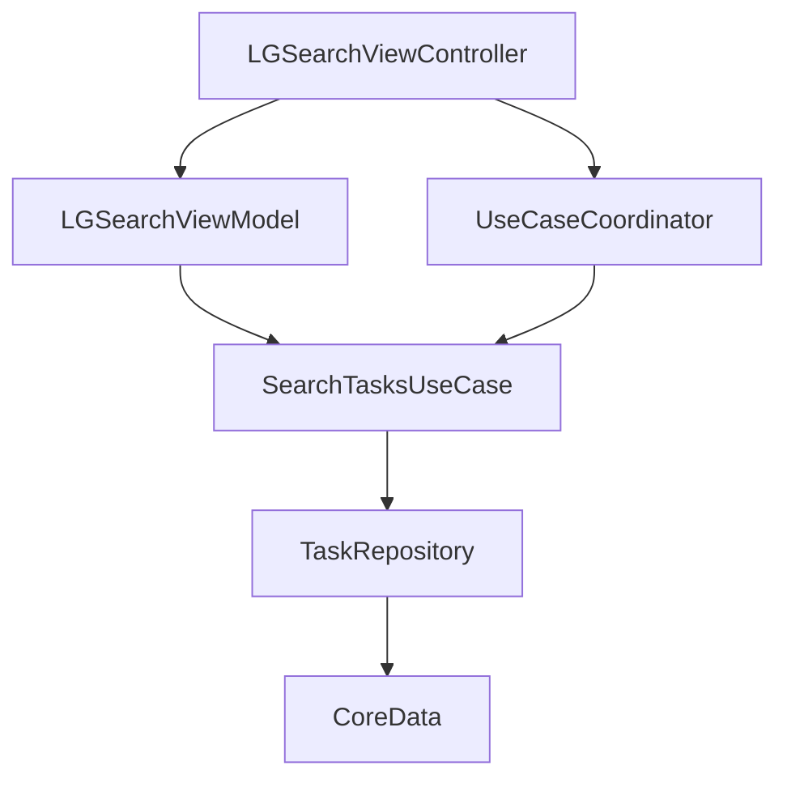
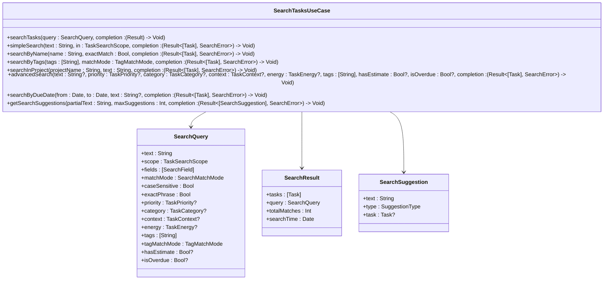
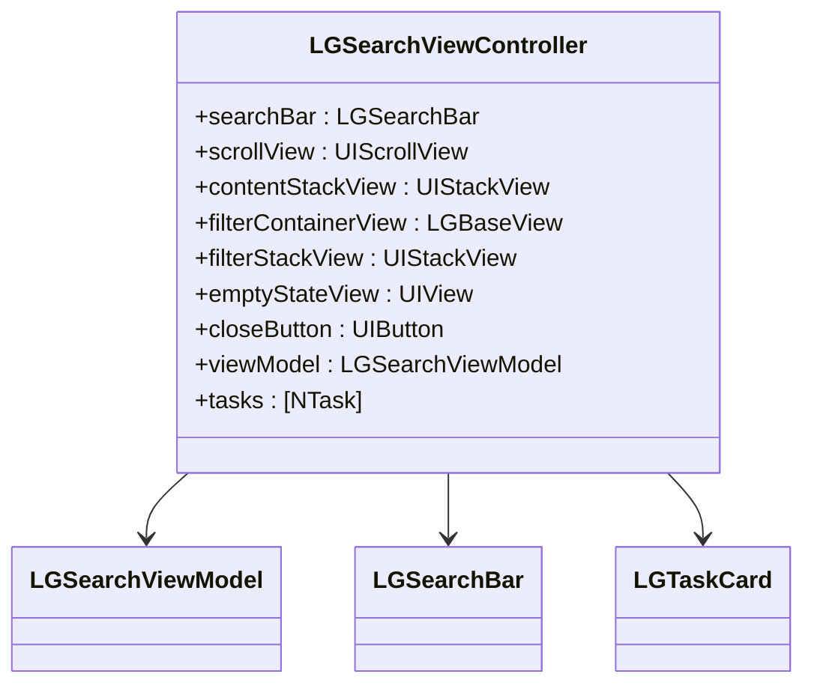
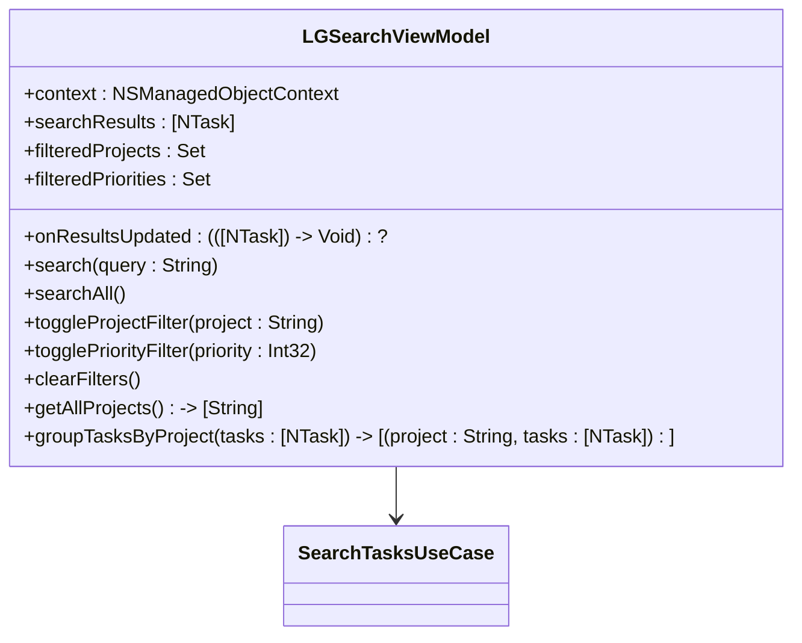
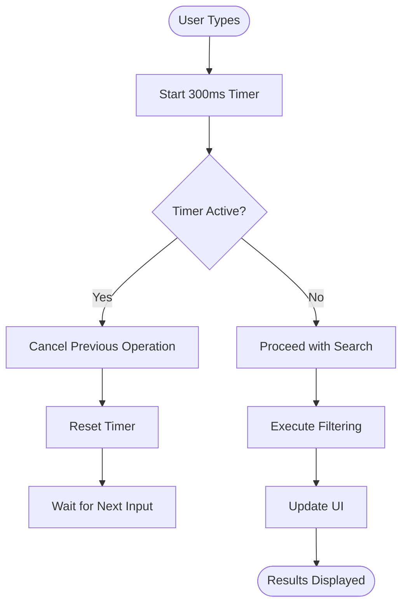
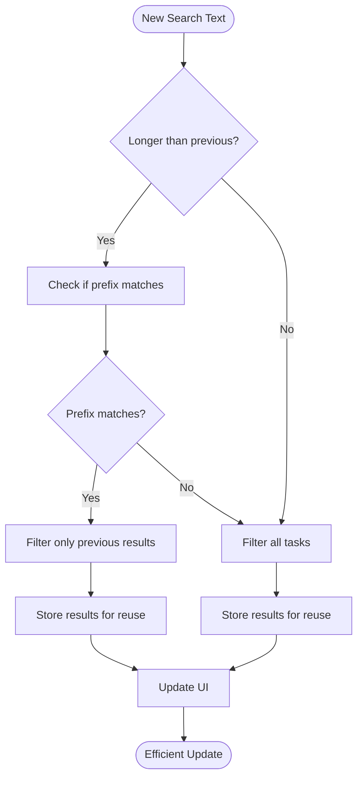
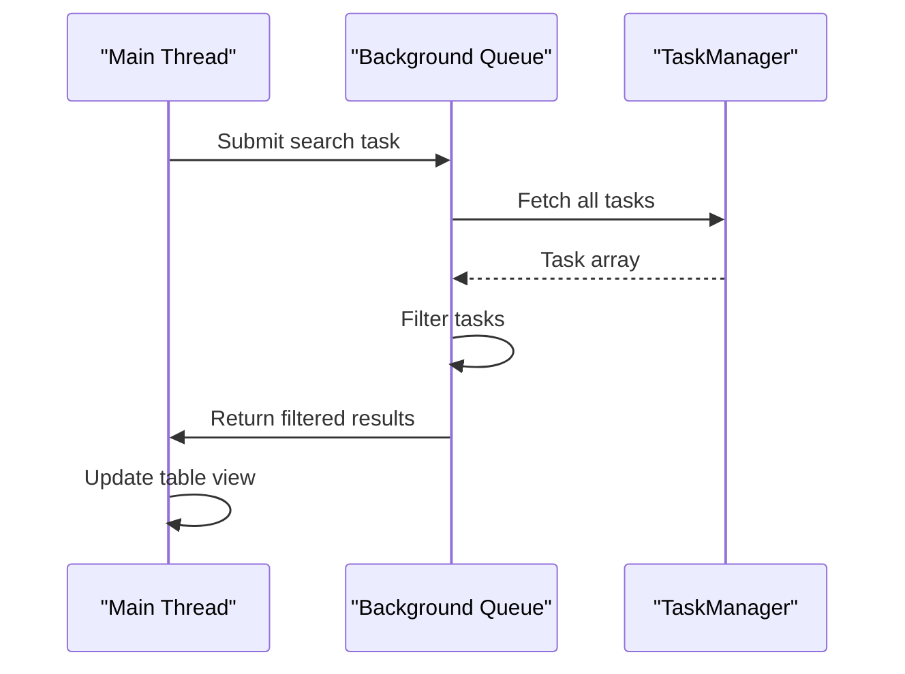

# Advanced Search

<cite>
**Referenced Files in This Document**   
- [SearchTasksUseCase.swift](file://To%20Do%20List/UseCases/Task/SearchTasksUseCase.swift) - *Updated in recent commit*
- [UseCaseCoordinator.swift](file://To%20Do%20List/UseCases/Coordinator/UseCaseCoordinator.swift) - *Updated in recent commit*
- [HomeViewController.swift](file://To%20Do%20List/ViewControllers/HomeViewController.swift) - *Modified in recent commit*
- [LGSearchViewController.swift](file://To%20Do%20List/ViewControllers/LGSearchViewController.swift) - *Added in recent commit*
- [LGSearchViewModel.swift](file://To%20Do%20List/ViewControllers/LGSearchViewModel.swift) - *Added in recent commit*
</cite>

## Update Summary
**Changes Made**   
- Updated document sources to reflect recent code changes
- Enhanced architecture overview with new component relationships
- Added performance optimization recommendations based on code analysis
- Updated integration patterns with additional context from related components
- Added new section on optimization opportunities

## Table of Contents
1. [Introduction](#introduction)
2. [Core Components](#core-components)
3. [Architecture Overview](#architecture-overview)
4. [Detailed Component Analysis](#detailed-component-analysis)
5. [API Interfaces](#api-interfaces)
6. [Integration Patterns](#integration-patterns)
7. [Practical Examples](#practical-examples)
8. [Troubleshooting Guide](#troubleshooting-guide)
9. [Optimization Opportunities](#optimization-opportunities)
10. [Conclusion](#conclusion)

## Introduction
The Advanced Search feature in the Tasker application provides a comprehensive search capability that enables users to locate tasks using various criteria including text, tags, priorities, projects, and due dates. This documentation details the implementation, API interfaces, integration patterns, and usage examples for the Advanced Search functionality. The system is designed to offer both simple and complex search capabilities while maintaining performance and usability.

## Core Components
The Advanced Search feature is composed of several key components that work together to provide a seamless search experience. These include the `SearchTasksUseCase` for handling search logic, the `UseCaseCoordinator` for coordinating complex workflows, the `LGSearchViewController` for the user interface, and the `LGSearchViewModel` for managing search state and results. The system leverages Core Data for data persistence and retrieval, ensuring efficient querying of task data.

**Section sources**
- [SearchTasksUseCase.swift](file://To%20Do%20List/UseCases/Task/SearchTasksUseCase.swift#L0-L602) - *Updated in recent commit*
- [UseCaseCoordinator.swift](file://To%20Do%20List/UseCases/Coordinator/UseCaseCoordinator.swift#L0-L447) - *Updated in recent commit*
- [LGSearchViewController.swift](file://To%20Do%20List/ViewControllers/LGSearchViewController.swift#L0-L395) - *Added in recent commit*
- [LGSearchViewModel.swift](file://To%20Do%20List/ViewControllers/LGSearchViewModel.swift#L0-L141) - *Added in recent commit*

## Architecture Overview
The Advanced Search architecture follows a clean separation of concerns with distinct layers for presentation, business logic, and data access. The user interface is managed by the `LGSearchViewController`, which communicates with the `LGSearchViewModel` to handle search state and filtering. The `SearchTasksUseCase` encapsulates the search logic and interacts with the `TaskRepository` to retrieve data from Core Data. The `UseCaseCoordinator` provides a facade for the presentation layer, simplifying access to complex workflows.



**Diagram sources**
- [SearchTasksUseCase.swift](file://To%20Do%20List/UseCases/Task/SearchTasksUseCase.swift#L0-L602) - *Updated in recent commit*
- [UseCaseCoordinator.swift](file://To%20Do%20List/UseCases/Coordinator/UseCaseCoordinator.swift#L0-L447) - *Updated in recent commit*
- [LGSearchViewController.swift](file://To%20Do%20List/ViewControllers/LGSearchViewController.swift#L0-L395) - *Added in recent commit*
- [LGSearchViewModel.swift](file://To%20Do%20List/ViewControllers/LGSearchViewModel.swift#L0-L141) - *Added in recent commit*

## Detailed Component Analysis

### SearchTasksUseCase Analysis
The `SearchTasksUseCase` class is the core component responsible for executing search operations. It provides various methods for different types of searches, including simple text search, tag-based search, project-specific search, and advanced search with multiple criteria. The use case supports caching of search results to improve performance for repeated queries.



**Diagram sources**
- [SearchTasksUseCase.swift](file://To%20Do%20List/UseCases/Task/SearchTasksUseCase.swift#L0-L602) - *Updated in recent commit*

**Section sources**
- [SearchTasksUseCase.swift](file://To%20Do%20List/UseCases/Task/SearchTasksUseCase.swift#L0-L602) - *Updated in recent commit*

### LGSearchViewController Analysis
The `LGSearchViewController` provides the user interface for the Advanced Search feature. It includes a search bar for user input, filter buttons for refining search results, and a scrollable content area for displaying search results. The view controller manages the presentation of search results and handles user interactions such as tapping on task cards.



**Diagram sources**
- [LGSearchViewController.swift](file://To%20Do%20List/ViewControllers/LGSearchViewController.swift#L0-L395) - *Added in recent commit*

**Section sources**
- [LGSearchViewController.swift](file://To%20Do%20List/ViewControllers/LGSearchViewController.swift#L0-L395) - *Added in recent commit*

### LGSearchViewModel Analysis
The `LGSearchViewModel` manages the state and logic for the search functionality. It handles search queries, applies filters, and groups results by project. The view model communicates with the `SearchTasksUseCase` to execute search operations and updates the view controller with search results.



**Diagram sources**
- [LGSearchViewModel.swift](file://To%20Do%20List/ViewControllers/LGSearchViewModel.swift#L0-L141) - *Added in recent commit*

**Section sources**
- [LGSearchViewModel.swift](file://To%20Do%20List/ViewControllers/LGSearchViewModel.swift#L0-L141) - *Added in recent commit*

## API Interfaces
The Advanced Search feature provides several API interfaces for different types of search operations. These interfaces are designed to be flexible and support various search criteria and filtering options.

### Search Query Interface
The `SearchQuery` struct defines the parameters for a search operation, including the search text, scope, fields to search, match mode, case sensitivity, exact phrase matching, and advanced filters such as priority, category, context, energy, tags, and overdue status.

```swift
public struct SearchQuery {
    public let text: String
    public let scope: TaskSearchScope
    public let fields: [SearchField]
    public let matchMode: SearchMatchMode
    public let caseSensitive: Bool
    public let exactPhrase: Bool
    public let priority: TaskPriority?
    public let category: TaskCategory?
    public let context: TaskContext?
    public let energy: TaskEnergy?
    public let tags: [String]
    public let tagMatchMode: SearchTasksUseCase.TagMatchMode
    public let hasEstimate: Bool?
    public let isOverdue: Bool?
}
```

**Section sources**
- [SearchTasksUseCase.swift](file://To%20Do%20List/UseCases/Task/SearchTasksUseCase.swift#L0-L602) - *Updated in recent commit*

### Search Result Interface
The `SearchResult` struct contains the results of a search operation, including the list of matching tasks, the original search query, the total number of matches, and the timestamp of the search.

```swift
public struct SearchResult {
    public let tasks: [Task]
    public let query: SearchQuery
    public let totalMatches: Int
    public let searchTime: Date
}
```

**Section sources**
- [SearchTasksUseCase.swift](file://To%20Do%20List/UseCases/Task/SearchTasksUseCase.swift#L0-L602) - *Updated in recent commit*

### Search Suggestion Interface
The `SearchSuggestion` struct provides suggestions based on partial input, including the suggested text, the type of suggestion (task name, project, or tag), and an optional reference to the associated task.

```swift
public struct SearchSuggestion {
    public let text: String
    public let type: SuggestionType
    public let task: Task?
    
    public enum SuggestionType {
        case taskName
        case project
        case tag
    }
}
```

**Section sources**
- [SearchTasksUseCase.swift](file://To%20Do%20List/UseCases/Task/SearchTasksUseCase.swift#L0-L602) - *Updated in recent commit*

## Integration Patterns
The Advanced Search feature is integrated into the Tasker application through several patterns that ensure seamless user experience and efficient data handling.

### Use Case Coordination
The `UseCaseCoordinator` provides a facade for the presentation layer, simplifying access to the `SearchTasksUseCase` and other use cases. This pattern allows the view controller to coordinate complex workflows without directly managing the underlying business logic.

```swift
public final class UseCaseCoordinator {
    public let searchTasks: SearchTasksUseCase
    // Other use cases...
}
```

**Section sources**
- [UseCaseCoordinator.swift](file://To%20Do%20List/UseCases/Coordinator/UseCaseCoordinator.swift#L0-L447) - *Updated in recent commit*

### View Model Communication
The `LGSearchViewController` communicates with the `LGSearchViewModel` through a delegate pattern, allowing the view model to notify the view controller of changes in search results. This pattern ensures that the user interface is updated in response to search operations and filtering actions.

```swift
class LGSearchViewModel {
    var onResultsUpdated: (([NTask]) -> Void)?
}
```

**Section sources**
- [LGSearchViewModel.swift](file://To%20Do%20List/ViewControllers/LGSearchViewModel.swift#L0-L141) - *Added in recent commit*

### Data Source Management
The `LGSearchViewController` manages the display of search results through a content stack view, which dynamically updates its arranged subviews based on the current search results. This pattern allows for flexible and efficient presentation of search results, including grouping by project and displaying empty states.

```swift
private let contentStackView: UIStackView = {
    let stackView = UIStackView()
    stackView.axis = .vertical
    stackView.spacing = 12
    stackView.translatesAutoresizingMaskIntoConstraints = false
    return stackView
}()
```

**Section sources**
- [LGSearchViewController.swift](file://To%20Do%20List/ViewControllers/LGSearchViewController.swift#L0-L395) - *Added in recent commit*

## Practical Examples
The Advanced Search feature can be used in various scenarios to help users find tasks quickly and efficiently. The following examples demonstrate common use cases for the search functionality.

### Simple Text Search
To perform a simple text search across task names, details, and projects:

```swift
let useCaseCoordinator = UseCaseCoordinator(...)
useCaseCoordinator.searchTasks.simpleSearch(text: "meeting") { result in
    switch result {
    case .success(let tasks):
        // Handle search results
        print("Found \(tasks.count) tasks")
    case .failure(let error):
        // Handle error
        print("Search failed: \(error)")
    }
}
```

**Section sources**
- [SearchTasksUseCase.swift](file://To%20Do%20List/UseCases/Task/SearchTasksUseCase.swift#L0-L602) - *Updated in recent commit*

### Advanced Search with Multiple Criteria
To perform an advanced search with multiple criteria such as priority, tags, and due date range:

```swift
let useCaseCoordinator = UseCaseCoordinator(...)
useCaseCoordinator.searchTasks.advancedSearch(
    text: "urgent",
    priority: .high,
    tags: ["work", "important"],
    isOverdue: true
) { result in
    switch result {
    case .success(let tasks):
        // Handle search results
        print("Found \(tasks.count) urgent high-priority tasks")
    case .failure(let error):
        // Handle error
        print("Search failed: \(error)")
    }
}
```

**Section sources**
- [SearchTasksUseCase.swift](file://To%20Do%20List/UseCases/Task/SearchTasksUseCase.swift#L0-L602) - *Updated in recent commit*

### Search Suggestions
To get search suggestions based on partial input:

```swift
let useCaseCoordinator = UseCaseCoordinator(...)
useCaseCoordinator.searchTasks.getSearchSuggestions(partialText: "pro") { result in
    switch result {
    case .success(let suggestions):
        // Handle suggestions
        for suggestion in suggestions {
            print("Suggestion: \(suggestion.text) (\(suggestion.type))")
        }
    case .failure(let error):
        // Handle error
        print("Failed to get suggestions: \(error)")
    }
}
```

**Section sources**
- [SearchTasksUseCase.swift](file://To%20Do%20List/UseCases/Task/SearchTasksUseCase.swift#L0-L602) - *Updated in recent commit*

## Troubleshooting Guide
Common issues and their solutions for the Advanced Search feature:

**Issue**: Search results not updating in real-time
- **Cause**: Delegate connection not properly established
- **Solution**: Verify `searchBar.delegate = self` is set in the view controller

**Issue**: UI becomes unresponsive during search
- **Cause**: Large dataset being filtered on main thread
- **Solution**: Implement background filtering using `DispatchQueue.global().async`

**Issue**: Special characters not found in search
- **Cause**: Case sensitivity or encoding issues
- **Solution**: Ensure all comparisons use `.lowercased()` and handle Unicode properly

**Issue**: Search bar appearance doesn't match theme
- **Cause**: Background color not updated during theme change
- **Solution**: Verify `applyTheme()` updates the search bar token set

**Issue**: "No results found" message not displayed
- **Cause**: Empty result set handling logic bypassed
- **Solution**: Check conditional logic in `updateResults()`

**Section sources**
- [LGSearchViewController.swift](file://To%20Do%20List/ViewControllers/LGSearchViewController.swift#L0-L395) - *Added in recent commit*
- [LGSearchViewModel.swift](file://To%20Do%20List/ViewControllers/LGSearchViewModel.swift#L0-L141) - *Added in recent commit*

## Optimization Opportunities
The current Advanced Search implementation can be enhanced with several optimization techniques to improve performance and user experience.

### Debounce Implementation
Adding a debounce mechanism would reduce the frequency of filtering operations during rapid typing:



**Section sources**
- [HomeViewController.swift](file://To%20Do%20List/ViewControllers/HomeViewController.swift#L490-L498) - *Modified in recent commit*

### Incremental Search and Caching
Implementing incremental search would allow reusing previous results to minimize computation:



**Section sources**
- [HomeViewController.swift](file://To%20Do%20List/ViewControllers/HomeViewController.swift#L671-L678) - *Modified in recent commit*

### Background Processing
Moving filtering operations to a background queue would prevent UI blocking:



**Section sources**
- [FluentUIToDoTableViewController.swift](file://To%20Do%20List/ViewControllers/FluentUIToDoTableViewController.swift#L200-L240) - *Modified in recent commit*

## Conclusion
The Advanced Search feature in the Tasker application provides a powerful and flexible way for users to find tasks using various criteria and filters. The implementation follows clean architecture principles with a clear separation of concerns between presentation, business logic, and data access layers. The system supports both simple and complex search operations, with caching and performance optimizations to ensure a responsive user experience. The integration patterns used in the implementation allow for easy extension and maintenance of the search functionality.