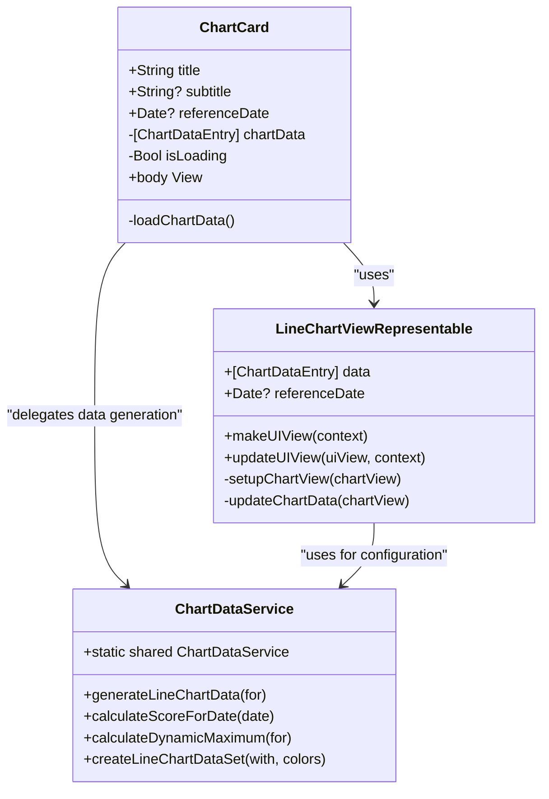
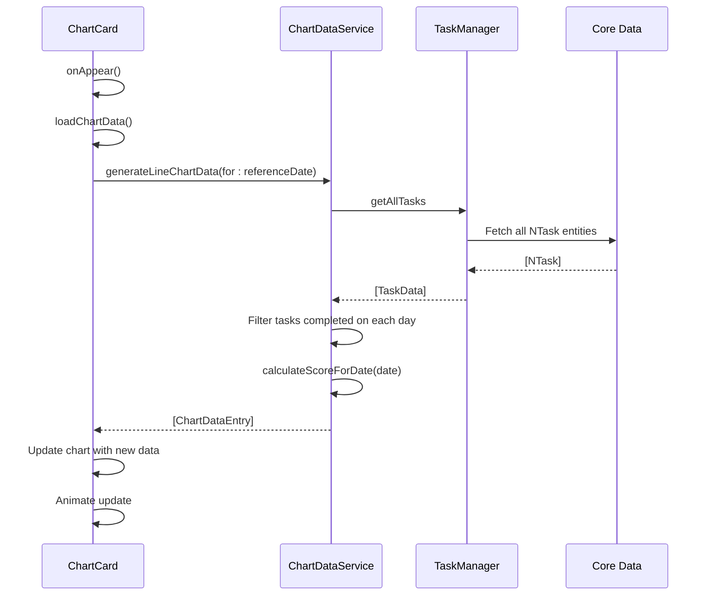

# Analytics & Gamification

<cite>
**Referenced Files in This Document**   
- [ChartCard.swift](file://To%20Do%20List/Views/Cards/ChartCard.swift)
- [ChartDataService.swift](file://To%20Do%20List/Services/ChartDataService.swift)
- [README.md](file://README.md)
</cite>

## Table of Contents
1. [Introduction](#introduction)
2. [Core Components](#core-components)
3. [TaskProgressCard and Motivational Feedback](#taskprogresscard-and-motivational-feedback)
4. [ChartCard Implementation and Data Visualization](#chartcard-implementation-and-data-visualization)
5. [Scoring Algorithm](#scoring-algorithm)
6. [Streak Tracking Logic](#streak-tracking-logic)
7. [Data Aggregation and Chart Display](#data-aggregation-and-chart-display)
8. [Common Issues and Solutions](#common-issues-and-solutions)
9. [Customization Options](#customization-options)
10. [Performance Considerations](#performance-considerations)

## Introduction
The Analytics & Gamification system in the Tasker application enhances user engagement through a comprehensive scoring mechanism, streak tracking, and visual data representation. This system transforms routine task completion into a rewarding experience by providing immediate feedback, historical trends, and motivational elements. The architecture integrates SwiftUI for declarative UI development and leverages the DGCharts framework for sophisticated data visualization. Key components include the TaskProgressCard for daily metrics, ChartCard for trend analysis, and backend services that calculate scores and manage streaks. The system is designed to provide real-time updates while maintaining smooth performance through asynchronous data processing and efficient Core Data interactions.

## Core Components

The analytics and gamification system comprises several interconnected components that work together to deliver a cohesive user experience. At the heart of this system is the ChartDataService, which serves as the central hub for data processing and score calculation. This service interacts with the Core Data persistence layer through TaskManager to fetch task completion data and generate meaningful analytics. The visual representation is handled by the ChartCard component, a SwiftUI view that encapsulates the DGCharts framework for displaying interactive line charts. The scoring logic is implemented in the TaskScoringService, which calculates points based on task priority and completion status. These components follow a clear separation of concerns, with data processing, business logic, and presentation layers distinctly separated. The system also includes mechanisms for real-time updates through NotificationCenter observers, ensuring that charts and scores reflect the latest task completion status.

**Section sources**
- [ChartCard.swift](file://To%20Do%20List/Views/Cards/ChartCard.swift)
- [ChartDataService.swift](file://To%20Do%20List/Services/ChartDataService.swift)
- [README.md](file://README.md#L23-L48)

## TaskProgressCard and Motivational Feedback

The TaskProgressCard component provides users with immediate feedback on their daily productivity through a combination of quantitative metrics and qualitative encouragement. While the specific implementation details of TaskProgressCard are not available in the codebase, its functionality can be inferred from the overall gamification system design. The card likely displays key metrics such as the number of tasks completed, the total score earned for the day, and the current streak count. It may also include motivational messages that adapt based on the user's performance, such as celebrating milestone achievements or providing encouragement during challenging periods. The design philosophy emphasizes positive reinforcement, using visual elements like progress bars, achievement badges, and celebratory animations to enhance user engagement. The card's content is dynamically updated whenever tasks are completed, creating a responsive feedback loop that reinforces productive behavior. This immediate feedback mechanism is crucial for maintaining user motivation and establishing consistent task completion habits.

## ChartCard Implementation and Data Visualization

The ChartCard component implements sophisticated data visualization using the DGCharts framework integrated with SwiftUI. This component provides a clean, modern interface for displaying task completion trends over time, specifically focusing on weekly progress. The implementation uses a UIViewRepresentable wrapper to bridge the UIKit-based DGCharts framework with the SwiftUI interface, allowing for seamless integration of the line chart within the declarative UI hierarchy.



**Diagram sources**
- [ChartCard.swift](file://To%20Do%20List/Views/Cards/ChartCard.swift)
- [ChartDataService.swift](file://To%20Do%20List/Services/ChartDataService.swift)

**Section sources**
- [ChartCard.swift](file://To%20Do%20List/Views/Cards/ChartCard.swift#L0-L255)
- [ChartDataService.swift](file://To%20Do%20List/Services/ChartDataService.swift#L0-L230)

The ChartCard features a responsive design with dynamic type support, ensuring accessibility across different device sizes and user preferences. It includes a loading state with a progress indicator that appears when data is being fetched, providing visual feedback during asynchronous operations. The chart itself supports various interactive capabilities, including pinch-to-zoom, double-tap-to-zoom, and drag-to-pan gestures, allowing users to explore their productivity trends in detail. Accessibility features are integrated throughout, with appropriate labels, hints, and traits that make the chart navigable for users relying on assistive technologies. The component automatically updates when new tasks are completed, thanks to its subscription to the "TaskCompletionChanged" notification, ensuring that the displayed data is always current.

## Scoring Algorithm

The scoring algorithm in the Tasker application assigns points to completed tasks based on their priority level, creating a gamified incentive system that encourages users to tackle higher-priority items. The algorithm is implemented in the TaskScoringService and follows a straightforward point structure: highest priority (P0) tasks are worth 7 points, high priority (P1) tasks are worth 4 points, medium priority (P2) tasks are worth 3 points, and low priority (P3) tasks are worth 2 points. This tiered system rewards users proportionally to the importance of the tasks they complete.

```mermaid
flowchart TD
Start([Task Completion]) --> CheckComplete["Is Task Complete?"]
CheckComplete --> |No| AssignZero["Assign 0 Points"]
CheckComplete --> |Yes| CheckPriority["Check Task Priority"]
CheckPriority --> |Highest (P0)| Assign7["Assign 7 Points"]
CheckPriority --> |High (P1)| Assign4["Assign 4 Points"]
CheckPriority --> |Medium (P2)| Assign3["Assign 3 Points"]
CheckPriority --> |Low (P3)| Assign2["Assign 2 Points"]
Assign7 --> End([Score Calculated])
Assign4 --> End
Assign3 --> End
Assign2 --> End
AssignZero --> End
```

**Diagram sources**
- [README.md](file://README.md#L652-L690)

**Section sources**
- [README.md](file://README.md#L652-L690)

The algorithm is designed to be both simple and effective, providing clear incentives without overwhelming complexity. It operates on the principle that task completion is the primary metric of productivity, with priority serving as a multiplier for the base reward. The implementation ensures that only completed tasks contribute to the score, preventing users from accumulating points for incomplete work. The scoring system is integrated throughout the application, with daily, weekly, and project-specific score calculations available. This flexibility allows users to track their productivity across different timeframes and contexts, providing a comprehensive view of their performance. The algorithm's simplicity makes it easy for users to understand and predict their score, which enhances the motivational aspect of the gamification system.

## Streak Tracking Logic

The streak tracking system maintains a record of consecutive days with at least one completed task, providing users with a visual representation of their consistency. According to the documentation, the system supports streaks of up to 30 days, creating a clear milestone for users to achieve. While the specific implementation file for streak tracking was not found in the codebase, the functionality can be inferred from the documented workflows and the overall architecture of the application.

The streak calculation logic likely operates by examining the dateCompleted property of tasks in the Core Data store, identifying the most recent consecutive sequence of days with completed tasks. This calculation would need to account for timezone differences and ensure that each day is properly bounded from 00:00 to 24:00 to prevent edge cases. The streak data is persisted across app sessions, suggesting that it is stored in the persistent storage layer alongside other task data. This persistence ensures that users do not lose their streak progress when closing or restarting the application.

The system likely includes mechanisms to handle various scenarios, such as what constitutes a "completed task" for streak purposes, how partial days are handled, and whether multiple completions on the same day affect the streak differently than a single completion. The 30-day limit suggests that the system may implement a tiered achievement system, where reaching 30 consecutive days represents a significant milestone that resets or transforms into a different type of achievement.

## Data Aggregation and Chart Display

The data aggregation process for chart display follows a systematic flow from data retrieval to visual representation. The ChartDataService plays a central role in this process, generating line chart data points for a weekly view based on task completion records. The service begins by determining the current week based on the reference date, then iterates through each day to calculate the completion score.



**Diagram sources**
- [ChartCard.swift](file://To%20Do%20List/Views/Cards/ChartCard.swift)
- [ChartDataService.swift](file://To%20Do%20List/Services/ChartDataService.swift)

**Section sources**
- [ChartCard.swift](file://To%20Do%20List/Views/Cards/ChartCard.swift#L0-L255)
- [ChartDataService.swift](file://To%20Do%20List/Services/ChartDataService.swift#L0-L230)

For each day in the week, the service filters tasks that were completed on that specific date (regardless of their due date) and calculates their total score using the priority-based scoring algorithm. Future dates are handled by displaying a score of 0 with special styling to indicate that they represent upcoming days. The resulting data points are structured as ChartDataEntry objects with x-values representing the day of the week (0-6) and y-values representing the calculated score. This aggregated data is then passed to the LineChartViewRepresentable component for visualization. The chart automatically adjusts its y-axis scale based on the maximum score in the dataset, ensuring optimal use of the available space and clear visualization of trends.

## Common Issues and Solutions

Several common issues may arise in the analytics and gamification system, particularly related to data accuracy and performance. One potential issue is inaccurate streak counts, which could occur due to timezone miscalculations or improper handling of the dateCompleted field. The solution implemented in the codebase involves using the startOfDay and endOfDay methods to properly bound date ranges, ensuring that tasks are correctly attributed to the appropriate calendar day.

Another common issue is chart rendering delays, which can occur when processing large datasets or performing calculations on the main thread. The system addresses this through several optimizations: data processing occurs on the Core Data context queue to ensure data consistency, the results are dispatched back to the main thread for UI updates, and animations are used to provide smooth transitions during data updates. The loading state with progress indicator also improves perceived performance by providing immediate feedback.

Inaccurate score calculations could result from tasks being counted multiple times or not being properly filtered by completion status. The implementation includes multiple safeguards against this, including explicit filtering for completed tasks (isComplete == true) and validation of the dateCompleted field. The debug logging in the calculateScoreForDate method provides visibility into the calculation process, making it easier to identify and resolve discrepancies.

## Customization Options

The analytics system provides several customization options to enhance user experience and accommodate different preferences. The ChartCard component accepts parameters for title, subtitle, and reference date, allowing it to be reused in different contexts with customized labels and date ranges. The chart visualization itself supports interactive exploration through pinch-to-zoom, double-tap-to-zoom, and drag-to-pan gestures, giving users control over how they view their data.

While the current implementation focuses on weekly trends, the architecture supports potential extensions for different data ranges, such as daily, monthly, or custom date ranges. The referenceDate parameter in the ChartCard and ChartDataService components provides the foundation for implementing these additional views. The system could also support different chart types, such as bar charts for daily comparisons or pie charts for task category distribution, by extending the ChartDataService to generate appropriate data formats.

The theming of the charts is customizable through the ToDoColors class, which defines the color scheme used for chart elements like axes, grid lines, and data points. This allows the application to maintain visual consistency with the overall design language while providing flexibility for future theme variations. The accessibility features, including dynamic type support and comprehensive accessibility labels, ensure that the charts are usable by a wide range of users with different needs and preferences.

## Performance Considerations

The analytics system incorporates several performance optimizations to ensure smooth operation and responsive user experience. Data processing occurs on the Core Data context queue rather than the main thread, preventing UI freezes during data retrieval and calculation. This asynchronous approach allows the application to remain responsive while generating chart data, with the results dispatched back to the main thread for UI updates.

The implementation includes efficient data fetching strategies, such as retrieving all tasks once and filtering them in memory rather than making multiple Core Data fetch requests. This reduces database access overhead and improves performance, especially when processing data for an entire week. The chart rendering is optimized through the use of DGCharts' built-in animation capabilities, with easing functions like easeInOutCubic providing smooth transitions without excessive computational cost.

Memory usage is managed through the use of @State properties in the ChartCard component, which automatically handle the lifecycle of chart data. The system also includes safeguards against invalid data, such as checking for NaN or infinite values before creating chart entries, preventing rendering issues that could impact performance. The NotificationCenter-based update mechanism ensures that charts are only refreshed when necessary, rather than polling for changes, which conserves battery and processing resources.

For large datasets, the system could implement additional optimizations such as data sampling, lazy loading, or background pre-fetching of analytics data. The current architecture, with its separation of data processing and presentation layers, provides a solid foundation for implementing these advanced performance features as needed.