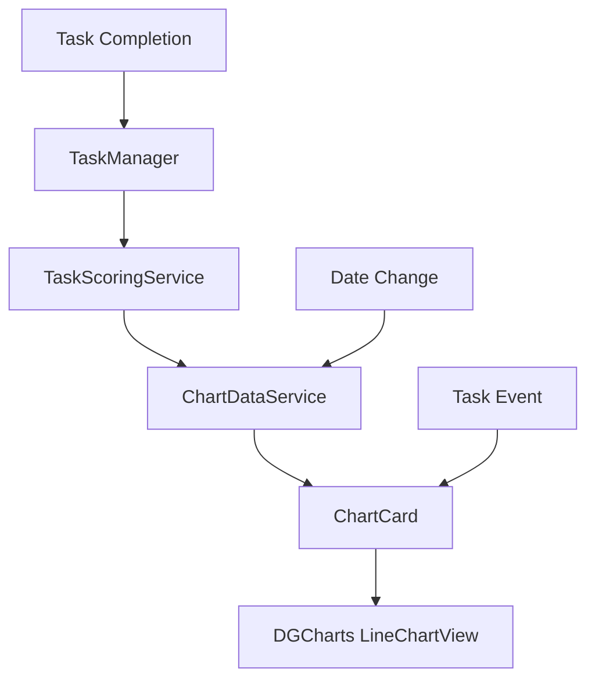
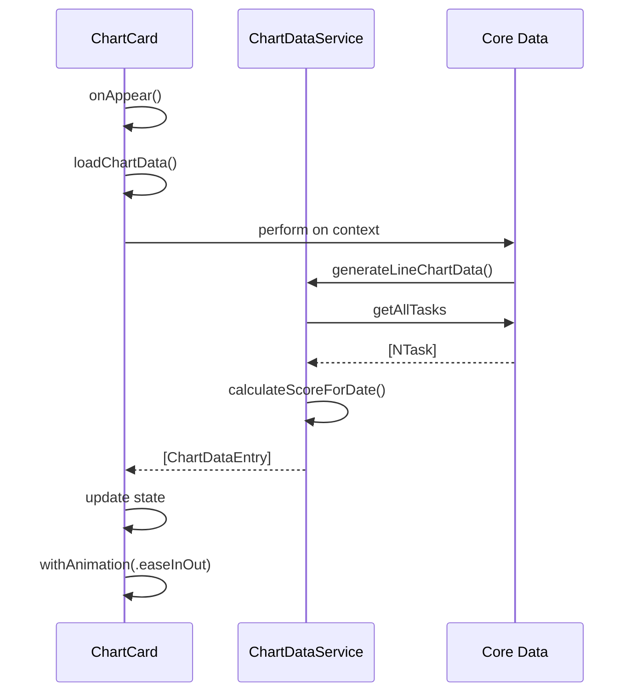
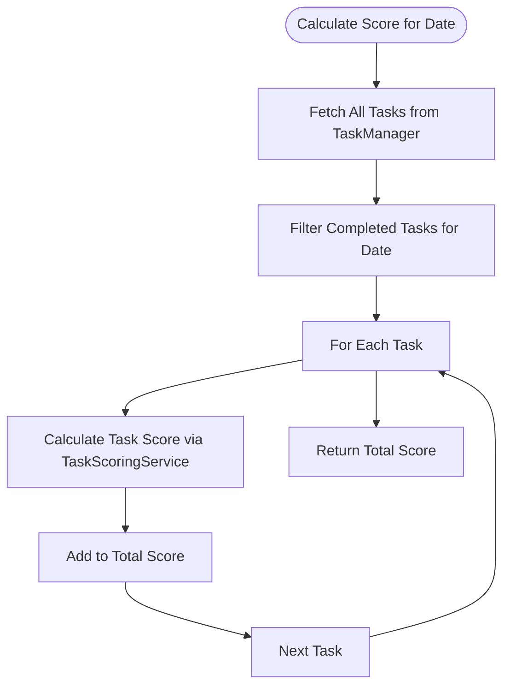

# Data Visualization

<cite>
**Referenced Files in This Document**   
- [ChartCard.swift](file://To%20Do%20List/Views/Cards/ChartCard.swift#L0-L255)
- [ChartDataService.swift](file://To%20Do%20List/Services/ChartDataService.swift#L0-L230)
- [TaskScoringService.swift](file://To%20Do%20List/Services/TaskScoringService.swift#L0-L154)
- [TaskData.swift](file://To%20Do%20List/Models/TaskData.swift#L0-L57)
- [TaskManager.swift](file://To%20Do%20List/ViewControllers/TaskManager.swift#L0-L1004)
</cite>

## Table of Contents
1. [Introduction](#introduction)
2. [Core Components Overview](#core-components-overview)
3. [ChartCard Implementation](#chartcard-implementation)
4. [Data Transformation Pipeline](#data-transformation-pipeline)
5. [Chart Data Service Architecture](#chart-data-service-architecture)
6. [Task Scoring System](#task-scoring-system)
7. [Dynamic Chart Updates and Event Handling](#dynamic-chart-updates-and-event-handling)
8. [Performance Optimization Techniques](#performance-optimization-techniques)
9. [Customization and Theming Options](#customization-and-theming-options)
10. [Troubleshooting Common Issues](#troubleshooting-common-issues)

## Introduction
The Tasker application implements a comprehensive data visualization system centered around task completion trends over time. This system leverages the DGCharts framework to render interactive line charts that display daily task completion scores across weekly periods. The visualization components are tightly integrated with the Core Data persistence layer, providing real-time updates as users complete tasks throughout the day. The primary visualization component, ChartCard, encapsulates both the UI presentation and data loading logic, while supporting dynamic updates based on date changes and task completion events. This documentation provides a detailed analysis of the architecture, implementation, and optimization strategies employed in the data visualization system.

## Core Components Overview
The data visualization system consists of several interconnected components that work together to transform raw task data into meaningful visual representations. At the highest level, the system follows a clear separation of concerns between data retrieval, score calculation, chart data generation, and UI presentation. The core components include ChartCard for UI rendering, ChartDataService for data transformation, TaskScoringService for score calculation, and TaskManager for data access. These components work in concert to provide a responsive and informative visualization experience that updates automatically as users interact with their tasks.



**Diagram sources**
- [ChartCard.swift](file://To%20Do%20List/Views/Cards/ChartCard.swift#L0-L255)
- [ChartDataService.swift](file://To%20Do%20List/Services/ChartDataService.swift#L0-L230)
- [TaskScoringService.swift](file://To%20Do%20List/Services/TaskScoringService.swift#L0-L154)

**Section sources**
- [ChartCard.swift](file://To%20Do%20List/Views/Cards/ChartCard.swift#L0-L255)
- [ChartDataService.swift](file://To%20Do%20List/Services/ChartDataService.swift#L0-L230)

## ChartCard Implementation
The ChartCard component serves as the primary UI container for data visualization in the Tasker application. Implemented as a SwiftUI View, it provides a clean, card-based interface for displaying task completion trends. The component accepts configuration parameters including title, subtitle, and reference date, allowing for flexible reuse across different contexts within the application. ChartCard manages its own loading state and automatically triggers data reloads when the reference date changes or when task completion events are detected through NotificationCenter.

### SwiftUI Structure and Layout
The ChartCard employs a VStack layout with clear visual hierarchy, featuring a header section with title and subtitle followed by the chart container. The header uses dynamic type sizing to ensure accessibility across different device configurations. The chart container occupies a fixed height of 200 points and is wrapped in a ZStack to accommodate loading states. During loading, a ProgressView is displayed over a gray background, providing visual feedback to users while data is being fetched from Core Data.

```swift
struct ChartCard: View {
    let title: String
    let subtitle: String?
    let referenceDate: Date?
    @State private var chartData: [ChartDataEntry] = []
    @State private var isLoading = true
}
```

The component's body implements a responsive design that adapts to different screen sizes through the use of relative spacing and dynamic type. The card itself has rounded corners and a subtle shadow effect, creating a layered appearance that integrates well with the overall application design language.

### Loading and Update Mechanisms
ChartCard implements three distinct mechanisms for triggering data reloads: initial appearance, date changes, and external events. The onAppear modifier calls loadChartData() when the view first appears, ensuring fresh data is displayed immediately. The onChange modifier monitors the referenceDate parameter and triggers a reload whenever it changes, enabling seamless navigation between different time periods. Additionally, the component subscribes to the "TaskCompletionChanged" notification through onReceive, allowing it to respond to task completion events from anywhere in the application.



**Diagram sources**
- [ChartCard.swift](file://To%20Do%20List/Views/Cards/ChartCard.swift#L0-L255)
- [ChartDataService.swift](file://To%20Do%20List/Services/ChartDataService.swift#L0-L230)

**Section sources**
- [ChartCard.swift](file://To%20Do%20List/Views/Cards/ChartCard.swift#L0-L255)

## Data Transformation Pipeline
The data transformation pipeline converts raw task entities from Core Data into chart-ready data points through a multi-stage process. This pipeline begins with the retrieval of all tasks from persistent storage, followed by date-based filtering, score calculation, and finally aggregation into the format required by the DGCharts framework. The pipeline is designed to be efficient and responsive, minimizing the performance impact of data processing while ensuring accurate representation of task completion trends.

### From Core Data to Chart Data
The transformation process starts with the ChartDataService generating line chart data for a specified reference date. By default, this is the current date, but it can be overridden to display historical or future periods. The service uses the calendar's daysWithSameWeekOfYear method to determine the seven days that comprise the week containing the reference date. For each day in this week, the service calculates a completion score based on tasks completed on that day.

```swift
func generateLineChartData(for referenceDate: Date? = nil) -> [ChartDataEntry] {
    var yValues: [ChartDataEntry] = []
    let currentReferenceDate = referenceDate ?? Date.today()
    let week = calendar.daysWithSameWeekOfYear(as: currentReferenceDate)
    
    for (index, day) in week.enumerated() {
        let score = day > today ? 0 : calculateScoreForDate(date: day)
        let dataEntry = ChartDataEntry(x: Double(index), y: Double(score))
        yValues.append(dataEntry)
    }
    return yValues
}
```

The resulting data entries use the day's index within the week (0-6) as the x-value and the calculated score as the y-value. This creates a time-series representation where each point corresponds to a specific day of the week.

### Future Date Handling
The system implements special handling for future dates to maintain visual consistency while accurately representing the lack of completion data. When processing days in the future, the service sets the score to zero but includes metadata in the data entry to indicate that it represents a future date. This allows the chart to display these points while potentially applying different styling or tooltips to communicate their special status to users.

## Chart Data Service Architecture
The ChartDataService class serves as the central hub for data transformation and aggregation in the visualization system. Implemented as a singleton, it provides a consistent interface for generating chart data across different parts of the application. The service encapsulates all logic related to score calculation, data aggregation, and chart configuration, providing a clean separation between business logic and UI presentation.

### Score Calculation Logic
The core functionality of ChartDataService is the calculateScoreForDate method, which determines the total completion score for a specific calendar day. This method operates exclusively on tasks that were completed on the specified date, regardless of their due date. It begins by fetching all tasks from the TaskManager singleton, then filters this collection to include only completed tasks with a dateCompleted value within the target day's range.



**Diagram sources**
- [ChartDataService.swift](file://To%20Do%20List/Services/ChartDataService.swift#L0-L230)
- [TaskScoringService.swift](file://To%20Do%20List/Services/TaskScoringService.swift#L0-L154)

**Section sources**
- [ChartDataService.swift](file://To%20Do%20List/Services/ChartDataService.swift#L0-L230)

The method includes comprehensive debugging output that logs the processing of each task, including its name, priority, due date, and completion date. This detailed logging helps diagnose issues with score calculation and ensures transparency in how completion metrics are derived.

### Dynamic Maximum Calculation
To ensure optimal chart scaling, ChartDataService implements a calculateDynamicMaximum method that determines the appropriate upper bound for the y-axis. This method takes the maximum score value from the data entries and applies a 20% buffer, ensuring that the highest data point does not touch the top of the chart area. It also enforces a minimum scale of 10 to prevent the chart from appearing overly compressed when completion scores are low.

```swift
func calculateDynamicMaximum(for dataEntries: [ChartDataEntry]) -> Double {
    let maxScore = dataEntries.map { $0.y }.max() ?? 0
    return max(maxScore * 1.2, 10)
}
```

This dynamic scaling ensures that the chart maintains an aesthetically pleasing appearance across different data ranges, from weeks with minimal task completion to periods of high productivity.

## Task Scoring System
The task scoring system provides the foundation for quantifying task completion and generating meaningful productivity metrics. Implemented in the TaskScoringService class, this system assigns point values to tasks based on their priority level, creating a gamified approach to task management that rewards users for completing higher-priority items.

### Priority-Based Scoring
The scoring system uses a simple but effective mapping from task priority to point values, with higher-priority tasks yielding more points upon completion. The current implementation assigns 7 points for high-priority tasks, 4 points for medium-priority tasks, 2 points for low-priority tasks, and 1 point for very low-priority tasks. This creates a clear incentive for users to focus on their most important tasks while still providing recognition for completing smaller items.

```swift
func calculateScore(for taskPriority: TaskPriority) -> Int {
    switch taskPriority {
    case .high:   return 7
    case .medium: return 4
    case .low:    return 2
    case .veryLow: return 1
    @unknown default:
        return 1
    }
}
```

The service provides multiple overloads of the calculateScore method to accommodate different input types, including TaskPriority enums, TaskData structs, and NTask managed objects. This flexibility allows the scoring logic to be used throughout the application without requiring data type conversions.

### Streak and Efficiency Calculations
In addition to individual task scoring, the TaskScoringService implements more complex metrics such as streak calculation and efficiency scoring. The calculateStreak method determines the number of consecutive days with at least one completed task, providing users with a visual representation of their consistency. The calculateEfficiency method computes the percentage of planned tasks that were completed on a given day, offering insight into daily productivity patterns.

These advanced metrics are calculated asynchronously using completion handlers, preventing UI blocking during potentially expensive operations. The streak calculation uses a synchronous dispatch group to ensure all date checks complete before returning the final count, while efficiency calculations are performed on background threads to maintain application responsiveness.

## Dynamic Chart Updates and Event Handling
The visualization system implements a robust event-driven architecture that ensures charts remain up-to-date with the latest task completion data. This architecture combines SwiftUI's reactive programming model with traditional notification patterns to provide immediate visual feedback when users complete tasks or navigate between different time periods.

### SwiftUI State Management
ChartCard leverages SwiftUI's @State properties to manage its internal state, including the chartData array and isLoading flag. When new data is received from ChartDataService, the component updates these properties within a DispatchQueue.main.async block to ensure thread safety. The withAnimation modifier is used to apply smooth transitions when the loading state changes, enhancing the user experience by providing visual continuity.

```swift
DispatchQueue.main.async {
    self.chartData = newData
    withAnimation(.easeInOut(duration: 0.3)) {
        self.isLoading = false
    }
}
```

This approach ensures that UI updates occur on the main thread while maintaining smooth animations that don't interfere with the perceived performance of data loading.

### Notification-Based Updates
The component subscribes to the "TaskCompletionChanged" notification using SwiftUI's onReceive modifier, allowing it to respond to task completion events from anywhere in the application. When this notification is received, the component logs the event and triggers a complete reload of the chart data, ensuring that the visualization reflects the most current state of task completion.

```swift
.onReceive(NotificationCenter.default.publisher(for: Notification.Name("TaskCompletionChanged"))) { _ in
    print("📡 ChartCard: Received TaskCompletionChanged - reloading chart data")
    loadChartData()
}
```

This decoupled communication pattern enables multiple components to contribute to the overall productivity metrics without requiring direct dependencies between them.

## Performance Optimization Techniques
The data visualization system incorporates several performance optimization techniques to ensure responsive behavior even with large datasets. These optimizations address potential bottlenecks in data retrieval, processing, and rendering, providing a smooth user experience across different device capabilities.

### Core Data Context Management
The system optimizes data access by performing chart data generation on the Core Data context queue, ensuring that the operation has access to the most up-to-date state of the persistent store. This approach prevents race conditions that could occur if data were fetched on a background thread while modifications were being made on the main thread.

```swift
TaskManager.sharedInstance.context.perform {
    let newData = ChartDataService.shared.generateLineChartData(for: referenceDate)
    DispatchQueue.main.async {
        // Update UI on main thread
    }
}
```

By using the context's perform method, the operation is executed synchronously on the context's private queue, guaranteeing data consistency while avoiding the complexity of asynchronous fetch requests.

### Efficient Data Processing
The ChartDataService optimizes performance by fetching all tasks once and then filtering them in memory, rather than executing multiple Core Data fetch requests for different date ranges. This reduces the overhead of database operations and leverages the efficiency of in-memory filtering for the relatively small datasets typical in task management applications.

Additionally, the service includes safeguards against invalid data values, ensuring that NaN or infinite values do not disrupt chart rendering:

```swift
let safeYValue = yValue.isNaN || yValue.isInfinite ? 0.0 : yValue
```

These checks prevent rendering issues that could occur if score calculations produced unexpected results.

## Customization and Theming Options
The visualization system supports various customization options that allow users to tailor the appearance and behavior of charts to their preferences. These options include configurable time ranges, visual themes, and interaction capabilities that enhance the usability of the data presentation.

### Time Range Configuration
The ChartCard component accepts an optional referenceDate parameter that determines which week of data to display. When no date is provided, it defaults to the current week, but callers can specify any date to navigate to historical or future periods. This flexibility enables features like weekly review screens or productivity forecasting.

### Visual Theming
The system integrates with the application's color scheme through the ToDoColors class, which provides consistent color values for chart elements. The LineChartViewRepresentable configures various visual properties including axis colors, grid lines, and marker appearance to match the overall application theme.

```swift
let colors = ToDoColors()
xAxis.axisLineColor = colors.primaryTextColor.withAlphaComponent(0.3)
leftAxis.gridColor = colors.primaryTextColor.withAlphaComponent(0.1)
```

The chart also supports dynamic type sizing and accessibility features, ensuring that the visualization remains usable for users with different visual requirements.

### Interaction Capabilities
The DGCharts integration enables several interactive features that enhance user engagement with the data:
- Pinch-to-zoom for detailed examination of specific date ranges
- Double-tap to zoom for quick magnification
- Drag-to-pan for navigating across the chart
- Tap highlighting to view detailed information about specific data points

These interactions are configured in the setupChartView method of LineChartViewRepresentable, with accessibility hints provided to assist users in discovering these features.

## Troubleshooting Common Issues
While the data visualization system is designed for reliability, certain issues may arise during development or usage. Understanding these potential problems and their solutions can help maintain the integrity of the visualization experience.

### Rendering Lag with Large Datasets
Although the current implementation is optimized for typical task volumes, extremely large datasets could potentially cause rendering lag. The primary mitigation strategy is the efficient data processing approach that minimizes database access. If performance issues are observed, additional optimizations could include:
- Implementing data sampling for very large date ranges
- Adding caching mechanisms for frequently accessed date periods
- Using Core Data fetch request limits for preliminary data analysis

### Animation Glitches
The use of SwiftUI's withAnimation modifier with a duration of 0.3 seconds provides smooth transitions between loading and loaded states. However, rapid successive updates could potentially cause animation conflicts. The current implementation mitigates this by performing animations only when transitioning from loading to loaded state, not during subsequent data updates.

### Data Consistency Issues
The system relies on the "TaskCompletionChanged" notification to trigger updates when tasks are completed. If this notification is not properly dispatched from all task completion pathways, the chart may become out of sync with the actual task state. Ensuring comprehensive notification dispatch from all relevant components is critical for maintaining data consistency.

### Future Date Representation
The current implementation sets scores to zero for future dates, which could potentially mislead users about expected productivity. Consider enhancing this with visual indicators or tooltips that clearly communicate that these values represent projections rather than actual completions.