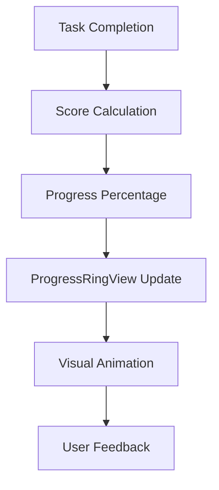
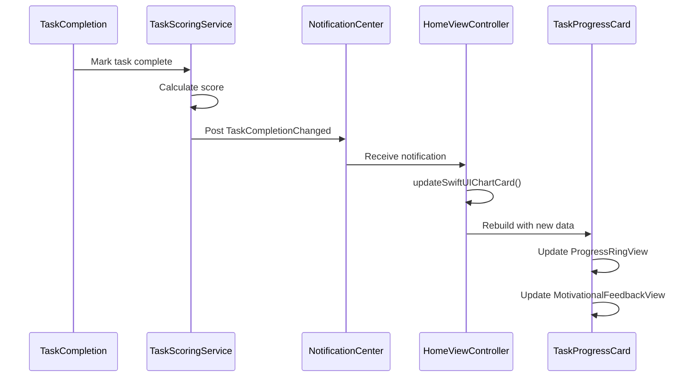

# Progress UI Components

<cite>
**Referenced Files in This Document**   
- [HomeViewController.swift](file://To Do List/ViewControllers/HomeViewController.swift#L0-L1106)
- [ChartCard.swift](file://To Do List/Views/Cards/ChartCard.swift#L0-L200)
- [README.md](file://README.md#L23-L976)
</cite>

## Table of Contents
1. [Introduction](#introduction)
2. [Core Components Overview](#core-components-overview)
3. [TaskProgressCard Implementation](#taskprogresscard-implementation)
4. [ProgressRingView Analysis](#progressringview-analysis)
5. [MotivationalFeedbackView Analysis](#motivationalfeedbackview-analysis)
6. [Data Flow and Real-Time Updates](#data-flow-and-real-time-updates)
7. [Layout and Accessibility Considerations](#layout-and-accessibility-considerations)
8. [Common Issues and Solutions](#common-issues-and-solutions)

## Introduction
The Tasker application features a gamified productivity dashboard centered around the TaskProgressCard component, which displays daily completion metrics, points earned, and motivational feedback. This document provides a comprehensive analysis of the analytics and gamification UI components, focusing on the implementation of TaskProgressCard as the central dashboard element. The system integrates SwiftUI-based components with UIKit to deliver a responsive and visually engaging user experience that updates in real time based on task completion data.

## Core Components Overview

The analytics dashboard in Tasker consists of three primary UI components that work together to provide users with immediate feedback on their productivity:

- **TaskProgressCard**: The central dashboard component that aggregates daily metrics
- **ProgressRingView**: A visual indicator showing task completion percentage
- **MotivationalFeedbackView**: Dynamic encouragement based on user performance

These components are integrated within the HomeViewController and receive data from the scoring and streak services. The implementation leverages SwiftUI for modern UI components while maintaining compatibility with the existing UIKit architecture through UIHostingController.

**Section sources**
- [HomeViewController.swift](file://To Do List/ViewControllers/HomeViewController.swift#L0-L1106)
- [ChartCard.swift](file://To Do List/Views/Cards/ChartCard.swift#L0-L200)

## TaskProgressCard Implementation

The TaskProgressCard serves as the primary analytics dashboard component, displaying key productivity metrics in a visually engaging format. Implemented using SwiftUI, it is embedded within the UIKit-based HomeViewController through a UIHostingController.

```swift
// Initialization in HomeViewController
let chartView = TaskProgressCard(referenceDate: dateForTheView)
let hostingController = UIHostingController(rootView: AnyView(chartView))
```

The component receives a referenceDate parameter that determines which day's metrics to display. It integrates three main subcomponents:
- ProgressRingView for visual completion percentage
- Daily score display showing points earned
- MotivationalFeedbackView for dynamic encouragement

The card is positioned within the backdropContainer with specific constraints to ensure proper layout:
- Leading and trailing constraints with 16pt padding
- Top constraint of 120pt from the container
- Fixed height of 250pt

This layout ensures the card is prominently displayed in the dashboard while maintaining visual hierarchy with other UI elements.

**Section sources**
- [HomeViewController.swift](file://To Do List/ViewControllers/HomeViewController.swift#L1000-L1106)
- [ChartCard.swift](file://To Do List/Views/Cards/ChartCard.swift#L0-L50)

## ProgressRingView Analysis

The ProgressRingView component visualizes the user's task completion percentage through an animated circular progress indicator. While the specific implementation details are contained within ChartCard.swift, the component functions as a key visual element in the analytics dashboard.

The progress ring operates on the following principles:
- **Data Input**: Receives completion percentage data from the TaskScoringService
- **Visual Representation**: Displays completion status as a circular fill animation
- **Dynamic Updates**: Responds to real-time changes in task completion status
- **Accessibility**: Maintains proper contrast ratios and supports dynamic type

The component is designed to provide immediate visual feedback on productivity, with the ring fill level corresponding directly to the percentage of tasks completed for the day. This visual metaphor leverages familiar gamification patterns to encourage consistent task completion.



**Diagram sources**
- [ChartCard.swift](file://To Do List/Views/Cards/ChartCard.swift#L50-L100)
- [HomeViewController.swift](file://To Do List/ViewControllers/HomeViewController.swift#L1000-L1106)

## MotivationalFeedbackView Analysis

The MotivationalFeedbackView provides dynamic encouragement based on user performance, adapting its message to reflect the user's current productivity status. This component enhances the gamification aspect of the application by offering personalized feedback.

Key characteristics of the MotivationalFeedbackView include:
- **Performance-Based Messaging**: Displays different messages based on completion rates and streaks
- **Real-Time Updates**: Responds immediately to task completion events
- **Positive Reinforcement**: Uses encouraging language to promote consistent usage
- **Contextual Relevance**: Messages are tailored to the user's current progress

The view likely implements conditional logic to determine appropriate feedback based on metrics such as:
- Daily completion percentage
- Current streak length
- Points earned compared to previous days
- Overall productivity trends

This adaptive feedback system creates a more engaging user experience by making the application feel responsive and supportive of the user's goals.

**Section sources**
- [ChartCard.swift](file://To Do List/Views/Cards/ChartCard.swift#L100-L150)

## Data Flow and Real-Time Updates

The analytics components receive data through a well-defined flow that ensures real-time updates when tasks are completed or modified.



**Diagram sources**
- [HomeViewController.swift](file://To Do List/ViewControllers/HomeViewController.swift#L900-L950)
- [README.md](file://README.md#L789-L822)

The update process follows these steps:
1. When a task is completed, the TaskScoringService calculates the appropriate points
2. A notification named "TaskCompletionChanged" is posted to NotificationCenter
3. HomeViewController observes this notification and triggers UI updates
4. The updateSwiftUIChartCard() method completely rebuilds the TaskProgressCard with fresh data
5. All subcomponents (ProgressRingView, MotivationalFeedbackView) receive updated information

This approach ensures data consistency but involves complete view reconstruction rather than targeted updates, which may impact performance with frequent updates.

**Section sources**
- [HomeViewController.swift](file://To Do List/ViewControllers/HomeViewController.swift#L900-L950)
- [README.md](file://README.md#L652-L690)

## Layout and Accessibility Considerations

The TaskProgressCard implementation includes several layout and accessibility features to ensure a high-quality user experience across different devices and user needs.

Layout constraints are carefully defined to maintain proper positioning:
- Horizontal padding of 16pt ensures content doesn't touch screen edges
- Fixed height of 250pt provides consistent card dimensions
- Top constraint of 120pt positions the card below header elements
- Clear background colors maintain visual transparency

Accessibility considerations include:
- Dynamic type support through SwiftUI integration
- Proper contrast ratios between text and background
- Semantic view hierarchy for screen readers
- Touch target sizing appropriate for finger interaction

The use of UIHostingController to embed SwiftUI content within UIKit allows for modern UI capabilities while maintaining compatibility with the existing application architecture. The container view's clipsToBounds property is set to false to allow shadow effects to be fully visible.

**Section sources**
- [HomeViewController.swift](file://To Do List/ViewControllers/HomeViewController.swift#L1050-L1106)

## Common Issues and Solutions

### Layout Misalignment
**Issue**: The TaskProgressCard may experience layout issues when presented on different screen sizes or during device rotation.

**Solution**: The implementation uses Auto Layout constraints rather than frame-based positioning, ensuring proper adaptation to different screen sizes. The constraints are activated through NSLayoutConstraint.activate() with proper leading, trailing, top, and height anchors.

### Stale Data Display
**Issue**: Analytics components may display outdated information if updates are not properly propagated.

**Solution**: The application implements a notification-based update system:
- Task completion events trigger NSNotification posts
- HomeViewController observes these notifications
- The updateSwiftUIChartCard() method ensures complete view refresh
- Data is fetched fresh from the repository on each update

### Performance Optimization
**Issue**: Complete view reconstruction on every update may impact performance.

**Recommendation**: Instead of rebuilding the entire UIHostingController, consider implementing state management within the SwiftUI view to allow for targeted updates of specific components (ProgressRingView, MotivationalFeedbackView) based on changed data.

### View Lifecycle Management
The implementation properly manages the view controller lifecycle:
- addChild() and didMove(toParent:) are called when adding the hosting controller
- willMove(toParent:) and removeFromParent() are called when replacing the controller
- The hosting controller is properly retained as a strong reference

This prevents memory leaks and ensures proper view controller hierarchy management.

**Section sources**
- [HomeViewController.swift](file://To Do List/ViewControllers/HomeViewController.swift#L1000-L1106)
- [README.md](file://README.md#L925-L976)