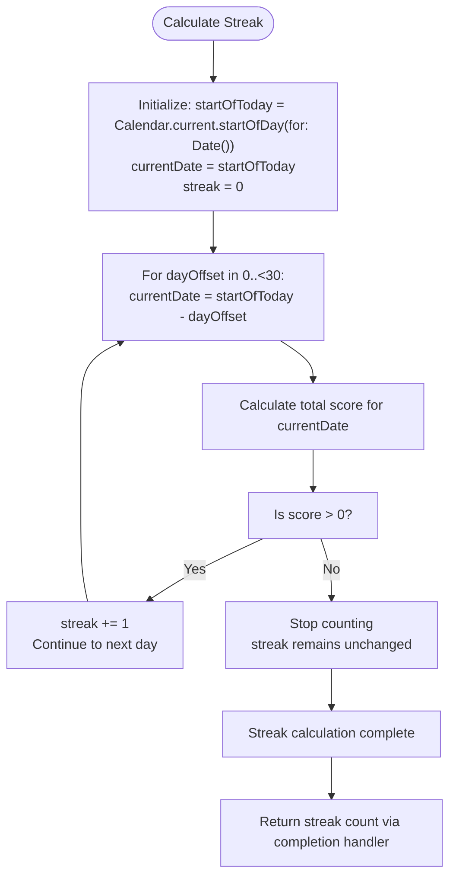
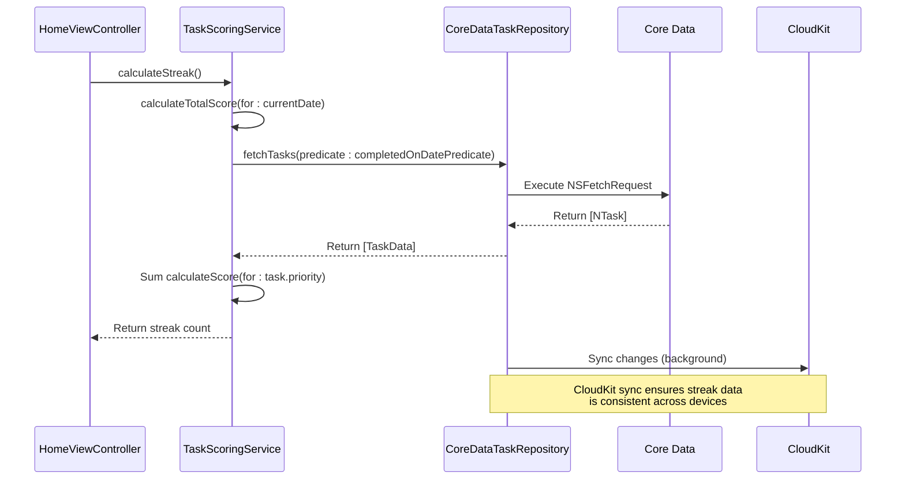
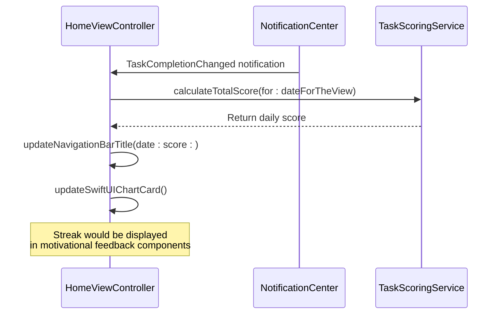

# Streak Tracking

<cite>
**Referenced Files in This Document**   
- [TaskScoringService.swift](file://To%20Do%20List/Services/TaskScoringService.swift)
- [CoreDataTaskRepository.swift](file://To%20Do%20List/Repositories/CoreDataTaskRepository.swift)
- [TaskRepository.swift](file://To%20Do%20List/Repositories/TaskRepository.swift)
- [TaskData.swift](file://To%20Do%20List/Models/TaskData.swift)
- [NTask+CoreDataProperties.swift](file://To%20Do%20List/NTask+CoreDataProperties.swift)
- [HomeViewController.swift](file://To%20Do%20List/ViewControllers/HomeViewController.swift)
</cite>

## Table of Contents
1. [Introduction](#introduction)
2. [Streak Calculation Logic](#streak-calculation-logic)
3. [Persistence and Data Flow](#persistence-and-data-flow)
4. [UI Integration and Display](#ui-integration-and-display)
5. [Edge Case Handling](#edge-case-handling)
6. [Performance and Optimization](#performance-and-optimization)
7. [Troubleshooting Common Issues](#troubleshooting-common-issues)

## Introduction
The streak tracking system in Tasker is a gamification feature designed to motivate users by tracking consecutive days of task completion. A streak is defined as the number of consecutive days where the user has completed at least one task. The system calculates this value dynamically based on daily task completion scores and persists the state across app restarts and device changes through Core Data and CloudKit synchronization. This document details the implementation, data flow, edge case handling, and integration with the user interface.

**Section sources**
- [TaskScoringService.swift](file://To%20Do%20List/Services/TaskScoringService.swift#L1-L154)

## Streak Calculation Logic

The streak calculation is implemented in the `TaskScoringService` class, which provides a centralized service for gamification logic. The core method `calculateStreak(from:using:completion:)` determines the current streak by counting backward from the current day until it encounters a day with no completed tasks.



**Diagram sources**
- [TaskScoringService.swift](file://To%20Do%20List/Services/TaskScoringService.swift#L100-L140)

**Section sources**
- [TaskScoringService.swift](file://To%20Do%20List/Services/TaskScoringService.swift#L100-L140)

### Key Implementation Details
- **Daily Score Threshold**: A day contributes to the streak if its total score is greater than zero, indicating at least one task was completed.
- **Maximum Lookback**: The algorithm checks up to 30 days backward to prevent excessive computation.
- **Synchronous Execution**: Uses `DispatchGroup` with `group.wait()` to ensure sequential day evaluation, maintaining correct streak continuity.
- **Calendar Awareness**: Uses `Calendar.current.startOfDay(for: Date())` to properly handle day boundaries regardless of time zone.

## Persistence and Data Flow

Streak data is not stored as a separate entity but is derived from persisted task completion records in Core Data. This approach ensures data consistency and leverages existing synchronization mechanisms.



**Diagram sources**
- [TaskScoringService.swift](file://To%20Do%20List/Services/TaskScoringService.swift#L60-L98)
- [CoreDataTaskRepository.swift](file://To%20Do%20List/Repositories/CoreDataTaskRepository.swift#L50-L100)

**Section sources**
- [TaskScoringService.swift](file://To%20Do%20List/Services/TaskScoringService.swift#L60-L98)
- [CoreDataTaskRepository.swift](file://To%20Do%20List/Repositories/CoreDataTaskRepository.swift#L50-L100)

### Data Model
The `NTask` entity in Core Data stores the fundamental data needed for streak calculation:

**NTask Attributes (Relevant to Streaks)**
- `dateCompleted`: NSDate? - When the task was marked complete
- `isComplete`: Bool - Completion status flag
- `taskPriority`: Int32 - Used to calculate task score

The streak is derived from these attributes rather than being stored directly, ensuring it always reflects the current state of completed tasks.

## UI Integration and Display

While the provided code does not explicitly show a dedicated streak display component, the streak calculation is integrated into the analytics workflow. The `HomeViewController` updates motivational feedback components when task completion changes.



**Diagram sources**
- [HomeViewController.swift](file://To%20Do%20List/ViewControllers/HomeViewController.swift#L950-L980)
- [TaskScoringService.swift](file://To%20Do%20List/Services/TaskScoringService.swift#L60-L98)

**Section sources**
- [HomeViewController.swift](file://To%20Do%20List/ViewControllers/HomeViewController.swift#L950-L980)

### Notification-Driven Updates
The UI stays current through a notification system:
- When a task's completion status changes, `CoreDataTaskRepository` posts a `TaskCompletionChanged` notification
- `HomeViewController` observes this notification and refreshes all analytics components
- This ensures streak-related displays are updated immediately after task completion

## Edge Case Handling

The streak tracking system includes several safeguards for edge cases:

### Time Zone Changes
The system uses `Calendar.current.startOfDay(for: Date())` to determine day boundaries, which automatically accounts for the user's current time zone. This ensures that streaks are not broken by time zone changes during travel.

### Missed Days
When a day has no completed tasks (score = 0), the streak calculation stops and returns the current count. This implements the standard "consecutive days" logic where any missed day resets the counter.

### App Restarts
Since streaks are calculated from persisted task data rather than in-memory state, app restarts do not affect streak continuity. The calculation always starts fresh from the current day.

### Device Changes
Through CloudKit synchronization, task completion data is shared across devices. Since the streak is derived from this synchronized data, users maintain consistent streak counts regardless of which device they use.

## Performance and Optimization

The streak calculation includes several performance considerations:

### Dispatch Queue Management
The algorithm uses synchronous waiting (`group.wait()`) within a limited loop (maximum 30 days), preventing excessive background thread usage while ensuring correct sequential evaluation.

### Predicate Optimization
The `calculateTotalScore` method uses an efficient Core Data predicate to fetch only tasks completed on a specific date:

```swift
NSPredicate(format: "dateCompleted >= %@ AND dateCompleted < %@ AND isComplete == YES", startOfDay, endOfDay)
```

This targets the `dateCompleted` attribute with a range query, leveraging Core Data's indexing capabilities.

### Caching Consideration
Currently, the implementation recalculates the streak on each request without caching. For improved performance in frequently accessed scenarios, implementing a caching layer with invalidation on task completion changes would be beneficial.

## Troubleshooting Common Issues

### Incorrect Streak Resets
**Symptom**: Streak resets unexpectedly
**Cause**: Tasks with `dateCompleted` set to nil or incorrect dates
**Solution**: Ensure `dateCompleted` is properly set when `isComplete` becomes true, as handled in `CoreDataTaskRepository.toggleComplete()`

### Streak Duplication
**Symptom**: Streak appears higher than expected
**Cause**: Multiple task completions on the same day being double-counted
**Solution**: The current implementation uses total score > 0 as the threshold, naturally preventing duplication since one completed task is sufficient

### Performance Issues
**Symptom**: UI lag when calculating streaks
**Solution**: Move the streak calculation to a background queue and cache the result, updating only when task completion status changes

### Data Integrity Safeguards
- **Weak Self References**: Uses `[weak self]` in completion handlers to prevent retain cycles
- **Error Handling**: Includes proper error handling in Core Data operations
- **Context Management**: Uses separate view and background contexts to prevent threading issues
- **Validation**: Checks for nil task objects and handles missing data gracefully

The streak tracking system demonstrates a robust, data-driven approach to gamification that prioritizes data consistency and user experience.