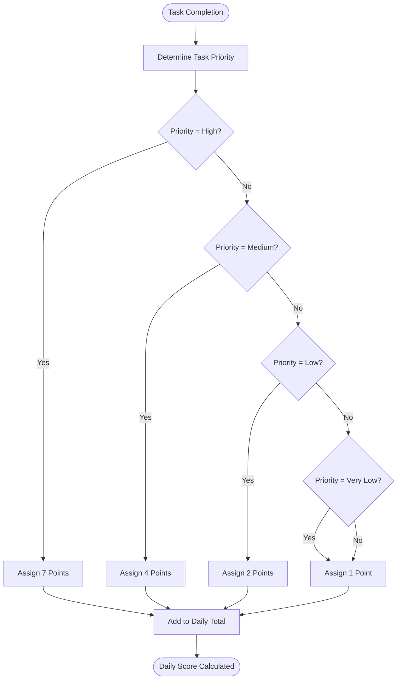
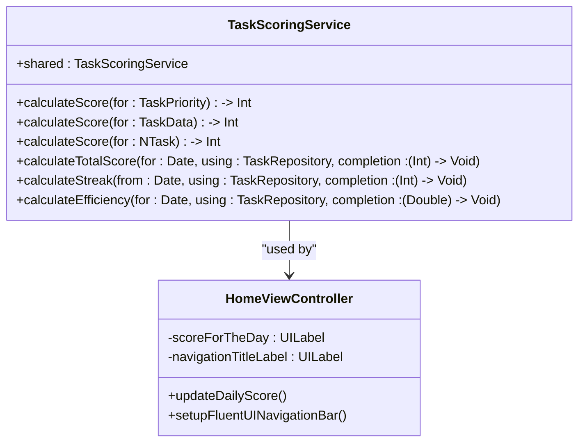
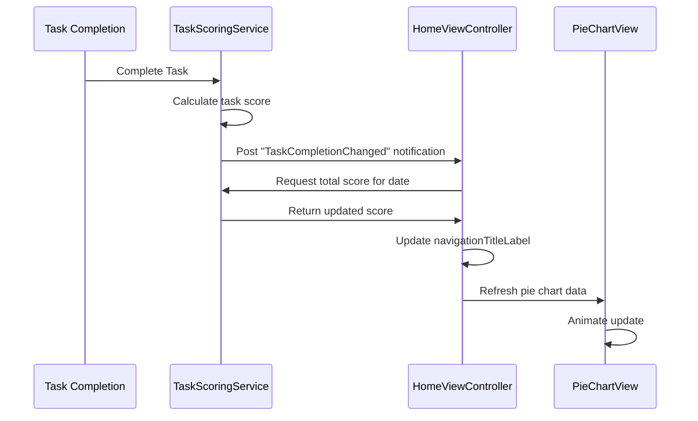
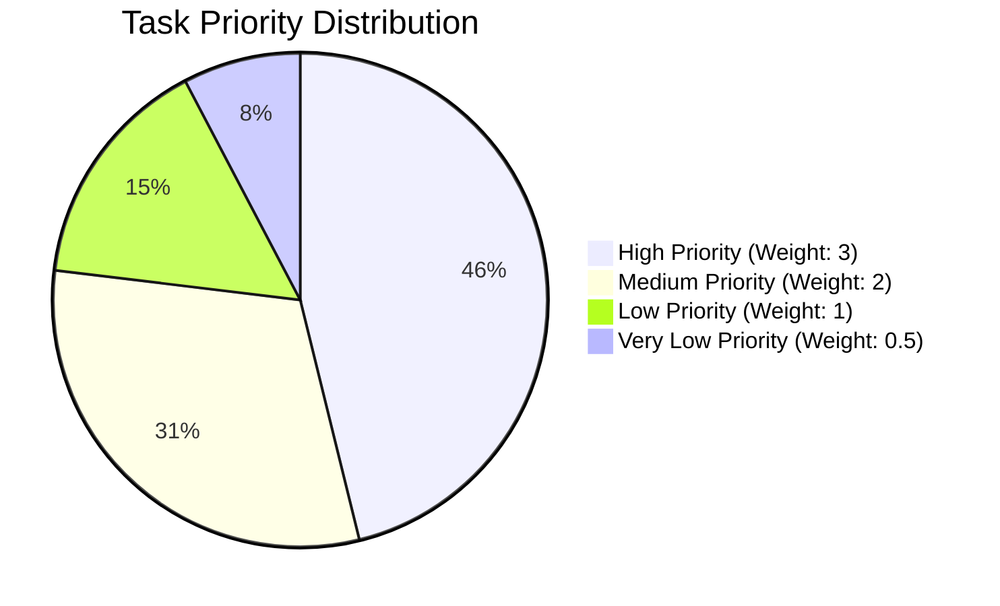

# Analytics and Daily Scoring

<cite>
**Referenced Files in This Document**   
- [TaskScoringService.swift](file://To Do List/Services/TaskScoringService.swift)
- [HomeViewController.swift](file://To Do List/ViewControllers/HomeViewController.swift)
- [PieChartView.swift](file://Pods/DGCharts/Source/Charts/Charts/PieChartView.swift)
</cite>

## Table of Contents
1. [Introduction](#introduction)
2. [Scoring Algorithm](#scoring-algorithm)
3. [Time-Based Scoring Logic](#time-based-scoring-logic)
4. [Score Calculation and UI Display](#score-calculation-and-ui-display)
5. [Score Recalculation Triggers](#score-recalculation-triggers)
6. [Example Scoring Scenarios](#example-scoring-scenarios)
7. [Historical Data and Visualization](#historical-data-and-visualization)
8. [Edge Cases and Accuracy Considerations](#edge-cases-and-accuracy-considerations)

## Introduction
The analytics and scoring system in the Tasker application provides users with a productivity metric based on task completion. The system calculates daily scores by evaluating completed tasks according to their priority levels and time categories. This document details the implementation of the scoring algorithm, UI integration, data persistence, and visualization components that comprise the analytics framework.

## Scoring Algorithm
The scoring algorithm implemented in TaskScoringService calculates points based on task priority levels. Each priority tier is assigned a specific point value that reflects its importance in the productivity metric.

**Diagram sources**
- [TaskScoringService.swift](file://To Do List/Services/TaskScoringService.swift#L25-L45)

**Section sources**
- [TaskScoringService.swift](file://To Do List/Services/TaskScoringService.swift#L20-L50)

## Time-Based Scoring Logic
The system differentiates between morning and evening tasks through the taskType property, which uses integer values to represent time categories (1 for morning, 2 for evening). While the current implementation assigns the same base points regardless of time category, the architecture supports time-based scoring adjustments through the taskType parameter. The scoring service evaluates completed tasks based on their completion date and priority, with the time category available for potential bonus or decay mechanisms in future implementations.

**Section sources**
- [TaskScoringService.swift](file://To Do List/Services/TaskScoringService.swift#L52-L85)
- [HomeViewController.swift](file://To Do List/ViewControllers/HomeViewController.swift#L1030-L1050)

## Score Calculation and UI Display
The daily score is calculated by aggregating points from all completed tasks on a given date. The HomeViewController retrieves this score and displays it in the navigation bar. The system uses Core Data predicates to filter tasks completed on the current date and applies the priority-based scoring algorithm to compute the total.

**Diagram sources**
- [TaskScoringService.swift](file://To Do List/Services/TaskScoringService.swift#L20-L150)
- [HomeViewController.swift](file://To Do List/ViewControllers/HomeViewController.swift#L300-L350)

**Section sources**
- [TaskScoringService.swift](file://To Do List/Services/TaskScoringService.swift#L52-L85)
- [HomeViewController.swift](file://To Do List/ViewControllers/HomeViewController.swift#L290-L350)

## Score Recalculation Triggers
Score recalculation is triggered by task completion events through a notification system. When a task's completion status changes, the system posts a "TaskCompletionChanged" notification that the HomeViewController observes. This triggers an update to both the numerical score display and the pie chart visualization in the navigation bar.

**Diagram sources**
- [TaskScoringService.swift](file://To Do List/Services/TaskScoringService.swift#L52-L85)
- [HomeViewController.swift](file://To Do List/ViewControllers/HomeViewController.swift#L200-L220)

**Section sources**
- [HomeViewController.swift](file://To Do List/ViewControllers/HomeViewController.swift#L190-L230)

## Example Scoring Scenarios
The following examples illustrate how the scoring algorithm works with real-world usage patterns:

**Scenario 1: High-Productivity Day**
- 2 High Priority tasks completed: 2 × 7 = 14 points
- 3 Medium Priority tasks completed: 3 × 4 = 12 points
- 4 Low Priority tasks completed: 4 × 2 = 8 points
- **Total Daily Score: 34 points**

**Scenario 2: Minimal Activity Day**
- 1 Very Low Priority task completed: 1 × 1 = 1 point
- 1 Low Priority task completed: 1 × 2 = 2 points
- **Total Daily Score: 3 points**

**Scenario 3: Balanced Productivity**
- 1 High Priority task completed: 1 × 7 = 7 points
- 2 Medium Priority tasks completed: 2 × 4 = 8 points
- 2 Low Priority tasks completed: 2 × 2 = 4 points
- 3 Very Low Priority tasks completed: 3 × 1 = 3 points
- **Total Daily Score: 22 points**

**Section sources**
- [TaskScoringService.swift](file://To Do List/Services/TaskScoringService.swift#L25-L45)

## Historical Data and Visualization
Historical scores are persisted through Core Data along with task completion records. The system visualizes daily productivity through a pie chart integrated into the navigation bar using DGCharts. The pie chart displays the distribution of completed tasks by priority level, with weighted values that emphasize higher-priority accomplishments.

**Diagram sources**
- [HomeViewController.swift](file://To Do List/ViewControllers/HomeViewController.swift#L450-L550)
- [PieChartView.swift](file://Pods/DGCharts/Source/Charts/Charts/PieChartView.swift#L20-L50)

**Section sources**
- [HomeViewController.swift](file://To Do List/ViewControllers/HomeViewController.swift#L400-L600)

## Edge Cases and Accuracy Considerations
The scoring system handles several edge cases that could affect accuracy:

1. **Rescheduled Tasks**: When tasks are rescheduled, the completion date determines scoring attribution. A task completed on a later date contributes to that day's score, not the original due date.

2. **Deleted Tasks**: Completed tasks that are subsequently deleted may create discrepancies between actual productivity and recorded scores, as the system relies on persistent task records for score calculation.

3. **Time Category Accuracy**: The current implementation does not apply different scoring rules for morning versus evening tasks, though the data structure supports this distinction.

4. **Data Consistency**: The system uses Core Data's context saving and refreshing mechanisms to ensure score calculations reflect the latest task states, with safeguards against race conditions during concurrent modifications.

**Section sources**
- [TaskScoringService.swift](file://To Do List/Services/TaskScoringService.swift#L52-L85)
- [HomeViewController.swift](file://To Do List/ViewControllers/HomeViewController.swift#L800-L850)