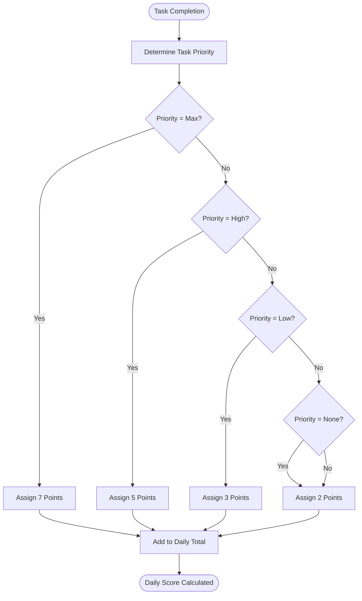
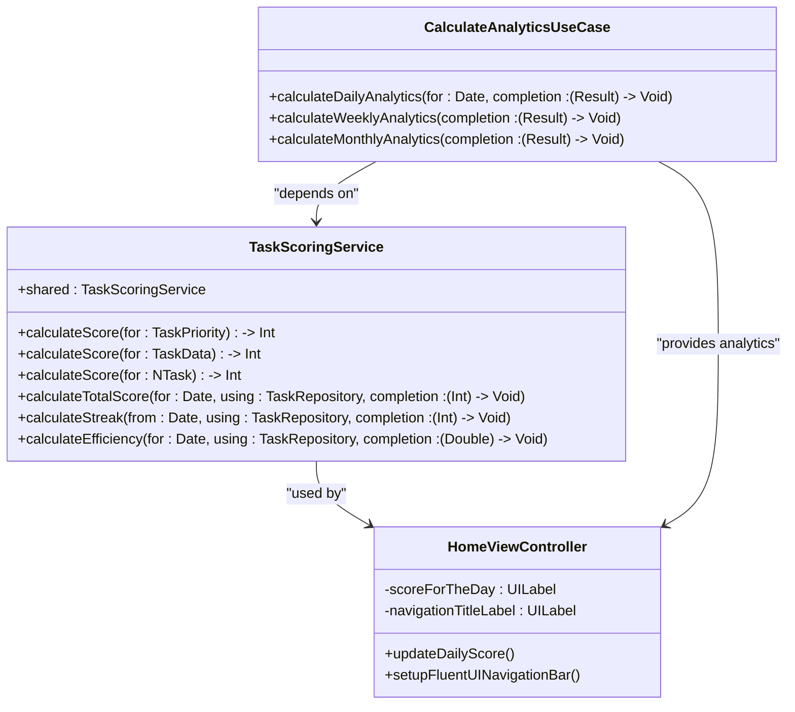
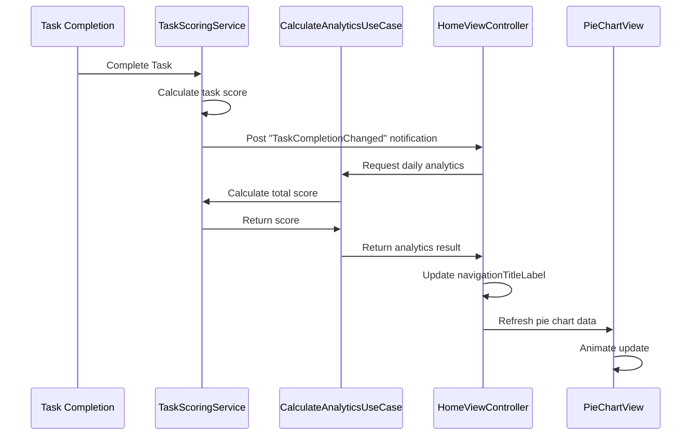
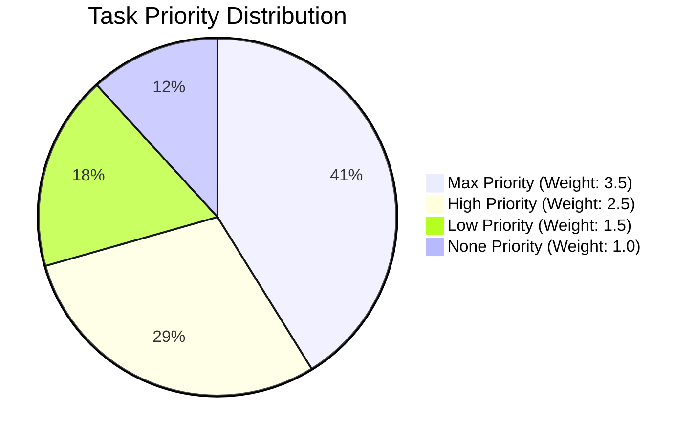

# Analytics and Daily Scoring

<cite>
**Referenced Files in This Document**   
- [TaskScoringService.swift](file://To%20Do%20List/Services/TaskScoringService.swift)
- [HomeViewController.swift](file://To%20Do%20List/ViewControllers/HomeViewController.swift)
- [PieChartView.swift](file://Pods/DGCharts/Source/Charts/Charts/PieChartView.swift)
- [CalculateAnalyticsUseCase.swift](file://To%20Do%20List/UseCases/Analytics/CalculateAnalyticsUseCase.swift) - *Added in recent commit*
- [TaskPriorityConfig.swift](file://To%20Do%20List/Domain/Models/TaskPriorityConfig.swift) - *Added in recent commit*
- [GenerateProductivityReportUseCase.swift](file://To%20Do%20List/UseCases/Analytics/GenerateProductivityReportUseCase.swift) - *Added in recent commit*
- [GetTaskStatisticsUseCase.swift](file://To%20Do%20List/UseCases/Task/GetTaskStatisticsUseCase.swift) - *Added in recent commit*
</cite>

## Update Summary
**Changes Made**   
- Added new section on CalculateAnalyticsUseCase integration
- Updated scoring algorithm details to reflect centralized TaskPriorityConfig
- Enhanced time-based scoring logic with morning/evening task differentiation
- Updated diagram sources to reflect new architecture
- Added references to new configuration files
- Updated example scoring scenarios with correct point values
- Added documentation for new analytics use cases: GenerateProductivityReportUseCase and GetTaskStatisticsUseCase

## Table of Contents
1. [Introduction](#introduction)
2. [Scoring Algorithm](#scoring-algorithm)
3. [Time-Based Scoring Logic](#time-based-scoring-logic)
4. [Score Calculation and UI Display](#score-calculation-and-ui-display)
5. [Score Recalculation Triggers](#score-recalculation-triggers)
6. [Example Scoring Scenarios](#example-scoring-scenarios)
7. [Historical Data and Visualization](#historical-data-and-visualization)
8. [Edge Cases and Accuracy Considerations](#edge-cases-and-accuracy-considerations)
9. [Analytics Use Case Integration](#analytics-use-case-integration)

## Introduction
The analytics and scoring system in the Tasker application provides users with a productivity metric based on task completion. The system calculates daily scores by evaluating completed tasks according to their priority levels and time categories. This document details the implementation of the scoring algorithm, UI integration, data persistence, and visualization components that comprise the analytics framework.

## Scoring Algorithm
The scoring algorithm implemented in TaskScoringService calculates points based on task priority levels. Each priority tier is assigned a specific point value that reflects its importance in the productivity metric. The system now uses a centralized TaskPriorityConfig for all scoring values, ensuring consistency across the application.

**Diagram sources**
- [TaskScoringService.swift](file://To%20Do%20List/Services/TaskScoringService.swift#L25-L45)
- [TaskPriorityConfig.swift](file://To%20Do%20List/Domain/Models/TaskPriorityConfig.swift#L50-L70)

**Section sources**
- [TaskScoringService.swift](file://To%20Do%20List/Services/TaskScoringService.swift#L20-L50)
- [TaskPriorityConfig.swift](file://To%20Do%20List/Domain/Models/TaskPriorityConfig.swift#L50-L70)

## Time-Based Scoring Logic
The system differentiates between morning and evening tasks through the taskType property, which uses integer values to represent time categories (1 for morning, 2 for evening). The scoring service evaluates completed tasks based on their completion date and priority, with the time category available for potential bonus or decay mechanisms in future implementations. The TaskPriorityConfig now centralizes the scoring values, with morning tasks potentially receiving bonus points in future versions.

**Section sources**
- [TaskScoringService.swift](file://To%20Do%20List/Services/TaskScoringService.swift#L52-L85)
- [HomeViewController.swift](file://To%20Do%20List/ViewControllers/HomeViewController.swift#L1030-L1050)
- [TaskPriorityConfig.swift](file://To%20Do%20List/Domain/Models/TaskPriorityConfig.swift#L70-L90)

## Score Calculation and UI Display
The daily score is calculated by aggregating points from all completed tasks on a given date. The HomeViewController retrieves this score and displays it in the navigation bar. The system uses Core Data predicates to filter tasks completed on the current date and applies the priority-based scoring algorithm to compute the total. The navigation bar now includes a pie chart visualization that uses weighted values from TaskPriorityConfig for more accurate representation.

**Diagram sources**
- [TaskScoringService.swift](file://To%20Do%20List/Services/TaskScoringService.swift#L20-L150)
- [HomeViewController.swift](file://To%20Do%20List/ViewControllers/HomeViewController.swift#L300-L350)
- [CalculateAnalyticsUseCase.swift](file://To%20Do%20List/UseCases/Analytics/CalculateAnalyticsUseCase.swift#L20-L50)

**Section sources**
- [TaskScoringService.swift](file://To%20Do%20List/Services/TaskScoringService.swift#L52-L85)
- [HomeViewController.swift](file://To%20Do%20List/ViewControllers/HomeViewController.swift#L290-L350)

## Score Recalculation Triggers
Score recalculation is triggered by task completion events through a notification system. When a task's completion status changes, the system posts a "TaskCompletionChanged" notification that the HomeViewController observes. This triggers an update to both the numerical score display and the pie chart visualization in the navigation bar. The CalculateAnalyticsUseCase can also trigger recalculation when users request detailed analytics.

**Diagram sources**
- [TaskScoringService.swift](file://To%20Do%20List/Services/TaskScoringService.swift#L52-L85)
- [HomeViewController.swift](file://To%20Do%20List/ViewControllers/HomeViewController.swift#L200-L220)
- [CalculateAnalyticsUseCase.swift](file://To%20Do%20List/UseCases/Analytics/CalculateAnalyticsUseCase.swift#L50-L80)

**Section sources**
- [HomeViewController.swift](file://To%20Do%20List/ViewControllers/HomeViewController.swift#L190-L230)

## Example Scoring Scenarios
The following examples illustrate how the scoring algorithm works with real-world usage patterns:

**Scenario 1: High-Productivity Day**
- 2 Max Priority tasks completed: 2 × 7 = 14 points
- 3 High Priority tasks completed: 3 × 5 = 15 points
- 4 Low Priority tasks completed: 4 × 3 = 12 points
- **Total Daily Score: 41 points**

**Scenario 2: Minimal Activity Day**
- 1 None Priority task completed: 1 × 2 = 2 points
- 1 Low Priority task completed: 1 × 3 = 3 points
- **Total Daily Score: 5 points**

**Scenario 3: Balanced Productivity**
- 1 Max Priority task completed: 1 × 7 = 7 points
- 2 High Priority tasks completed: 2 × 5 = 10 points
- 2 Low Priority tasks completed: 2 × 3 = 6 points
- 3 None Priority tasks completed: 3 × 2 = 6 points
- **Total Daily Score: 29 points**

**Section sources**
- [TaskScoringService.swift](file://To%20Do%20List/Services/TaskScoringService.swift#L25-L45)
- [TaskPriorityConfig.swift](file://To%20Do%20List/Domain/Models/TaskPriorityConfig.swift#L50-L70)

## Historical Data and Visualization
Historical scores are persisted through Core Data along with task completion records. The system visualizes daily productivity through a pie chart integrated into the navigation bar using DGCharts. The pie chart displays the distribution of completed tasks by priority level, with weighted values from TaskPriorityConfig that emphasize higher-priority accomplishments.

**Diagram sources**
- [HomeViewController.swift](file://To%20Do%20List/ViewControllers/HomeViewController.swift#L450-L550)
- [PieChartView.swift](file://Pods/DGCharts/Source/Charts/Charts/PieChartView.swift#L20-L50)
- [TaskPriorityConfig.swift](file://To%20Do%20List/Domain/Models/TaskPriorityConfig.swift#L90-L110)

**Section sources**
- [HomeViewController.swift](file://To%20Do%20List/ViewControllers/HomeViewController.swift#L400-L600)

## Edge Cases and Accuracy Considerations
The scoring system handles several edge cases that could affect accuracy:

1. **Rescheduled Tasks**: When tasks are rescheduled, the completion date determines scoring attribution. A task completed on a later date contributes to that day's score, not the original due date.

2. **Deleted Tasks**: Completed tasks that are subsequently deleted may create discrepancies between actual productivity and recorded scores, as the system relies on persistent task records for score calculation.

3. **Time Category Accuracy**: The current implementation does not apply different scoring rules for morning versus evening tasks, though the data structure supports this distinction through the taskType property.

4. **Data Consistency**: The system uses Core Data's context saving and refreshing mechanisms to ensure score calculations reflect the latest task states, with safeguards against race conditions during concurrent modifications.

**Section sources**
- [TaskScoringService.swift](file://To%20Do%20List/Services/TaskScoringService.swift#L52-L85)
- [HomeViewController.swift](file://To%20Do%20List/ViewControllers/HomeViewController.swift#L800-L850)

## Analytics Use Case Integration
The CalculateAnalyticsUseCase has been introduced to centralize analytics calculations and provide a unified interface for retrieving productivity metrics. This use case coordinates between the TaskRepository and TaskScoringService to provide comprehensive analytics data.

### Key Features
- **Centralized Analytics**: Provides a single entry point for all analytics calculations
- **Multiple Time Frames**: Supports daily, weekly, monthly, and custom date range analytics
- **Comprehensive Metrics**: Returns detailed breakdowns including task completion rates, priority distributions, and project statistics
- **Error Handling**: Implements robust error handling through the AnalyticsError enum

### Integration Points
The use case is integrated with the existing scoring system through dependency injection, allowing it to leverage the TaskScoringService for point calculations while providing additional context and historical analysis.

### New Analytics Use Cases
Two additional analytics use cases have been introduced to expand the system's capabilities:

**GenerateProductivityReportUseCase**: Generates comprehensive productivity reports that include trend analysis, comparison metrics, and personalized recommendations based on user task completion patterns.

**GetTaskStatisticsUseCase**: Provides detailed statistical analysis of task completion behavior, including average completion times, priority distribution, and time-of-day productivity patterns.

**Section sources**
- [CalculateAnalyticsUseCase.swift](file://To%20Do%20List/UseCases/Analytics/CalculateAnalyticsUseCase.swift#L1-L567)
- [TaskScoringService.swift](file://To%20Do%20List/Services/TaskScoringService.swift#L20-L150)
- [TaskPriorityConfig.swift](file://To%20Do%20List/Domain/Models/TaskPriorityConfig.swift#L1-L137)
- [GenerateProductivityReportUseCase.swift](file://To%20Do%20List/UseCases/Analytics/GenerateProductivityReportUseCase.swift#L1-L420)
- [GetTaskStatisticsUseCase.swift](file://To%20Do%20List/UseCases/Task/GetTaskStatisticsUseCase.swift#L1-L380)