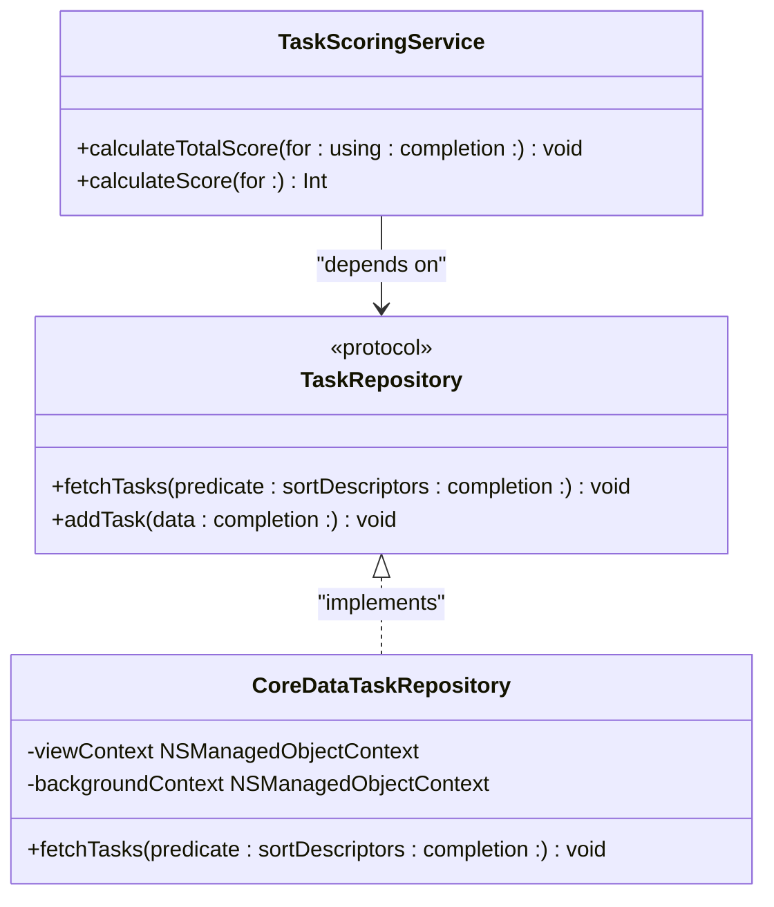
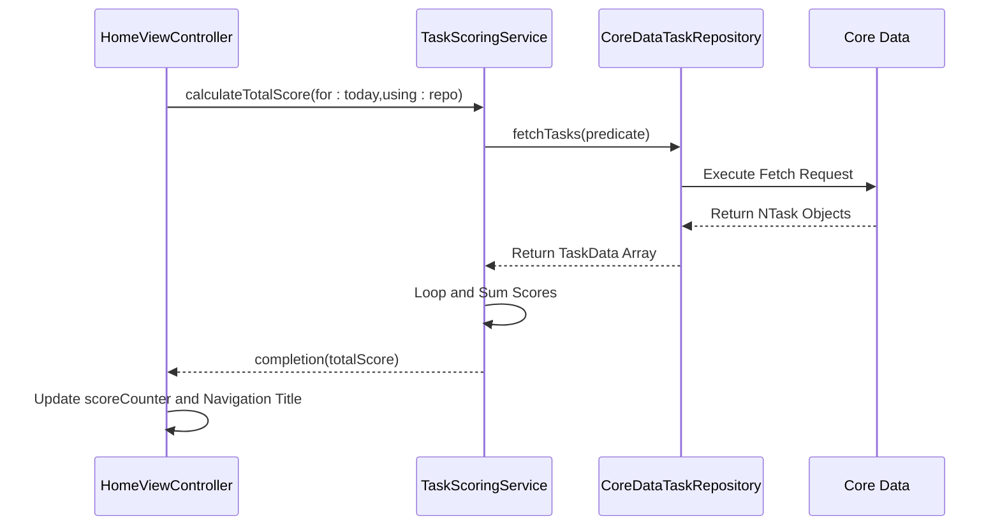
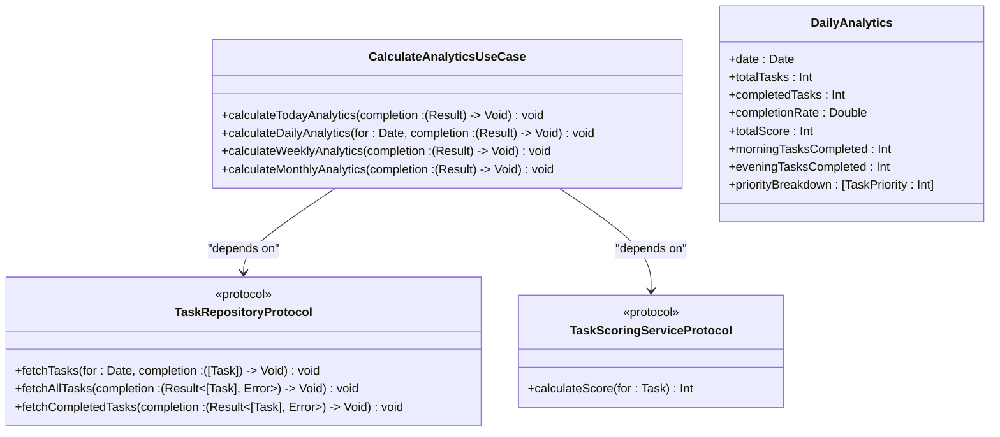

# Daily Score Calculation

<cite>
**Referenced Files in This Document**   
- [TaskScoringService.swift](file://To%20Do%20List/Services/TaskScoringService.swift) - *Updated to use TaskPriorityConfig*
- [TaskRepository.swift](file://To%20Do%20List/Repositories/TaskRepository.swift)
- [CoreDataTaskRepository.swift](file://To%20Do%20List/Repositories/CoreDataTaskRepository.swift)
- [HomeViewController.swift](file://To%20Do%20List/ViewControllers/HomeViewController.swift)
- [TaskData.swift](file://To%20Do%20List/Models/TaskData.swift)
- [NTask+CoreDataProperties.swift](file://To%20Do%20List/NTask+CoreDataProperties.swift)
- [CalculateAnalyticsUseCase.swift](file://To%20Do%20List/UseCases/Analytics/CalculateAnalyticsUseCase.swift) - *Added in recent commit*
- [TaskPriorityConfig.swift](file://To%20Do%20List/Domain/Models/TaskPriorityConfig.swift) - *Added in recent commit*
</cite>

## Update Summary
**Changes Made**   
- Updated daily score calculation to reflect new centralized scoring system using TaskPriorityConfig
- Added documentation for new CalculateAnalyticsUseCase implementation
- Revised scoring examples to match updated point values (None=2, Low=3, High=5, Max=7)
- Updated repository pattern explanation to include new use case layer
- Enhanced timezone handling recommendations with Calendar.dateInterval method
- Added section on analytics models and error handling

## Table of Contents
1. [Introduction](#introduction)
2. [Daily Score Calculation Mechanism](#daily-score-calculation-mechanism)
3. [Date Range Logic and Time Boundaries](#date-range-logic-and-time-boundaries)
4. [Repository Pattern and Data Abstraction](#repository-pattern-and-data-abstraction)
5. [Asynchronous Completion Handler and UI Responsiveness](#asynchronous-completion-handler-and-ui-responsiveness)
6. [Real-World Example: Score Calculation on May 1st](#real-world-example-score-calculation-on-may-1st)
7. [Potential Issues: Timezone and Daylight Saving Time](#potential-issues-timezone-and-daylight-saving-time)
8. [UI Integration in HomeViewController](#ui-integration-in-homeviewcontroller)
9. [New Analytics Use Case Implementation](#new-analytics-use-case-implementation)
10. [Conclusion](#conclusion)

## Introduction
The daily score calculation mechanism in the Tasker application is a core gamification feature that quantifies user productivity by assigning points to completed tasks based on their priority. This system leverages Core Data for persistence, employs the repository pattern for testable data access, and uses asynchronous callbacks to maintain UI responsiveness. The `calculateTotalScore(for:using:completion:)` method is central to this functionality, orchestrating task retrieval, filtering, scoring, and result delivery. This document details the implementation, design patterns, and integration points of this mechanism, with updates to reflect the new centralized scoring configuration and analytics use case layer.

## Daily Score Calculation Mechanism
The `calculateTotalScore(for:using:completion:)` method in `TaskScoringService` computes the total score for tasks completed on a specific date. It begins by defining a date range using `startOfDay` and `endOfDay` to isolate tasks completed within a 24-hour window. An `NSPredicate` is constructed to filter `NTask` entities where `dateCompleted` falls within this range and `isComplete` is true. The predicate uses Core Data's query language to express the condition: `"dateCompleted >= %@ AND dateCompleted < %@ AND isComplete == YES"`. This filtered dataset is fetched via the `TaskRepository`'s `fetchTasks(predicate:sortDescriptors:completion:)` method. For each retrieved `TaskData` object, the service calls `calculateScore(for:)`, which now delegates to `TaskPriorityConfig.scoreForRawValue()` to determine the point value based on the task's priority. The scores are summed in a loop, and the final total is passed to the completion handler. This design ensures that only relevant, completed tasks are processed, providing an accurate reflection of daily accomplishments while centralizing scoring logic.

**Section sources**
- [TaskScoringService.swift](file://To%20Do%20List/Services/TaskScoringService.swift#L50-L90)
- [TaskPriorityConfig.swift](file://To%20Do%20List/Domain/Models/TaskPriorityConfig.swift#L50-L70) - *Updated scoring configuration*

## Date Range Logic and Time Boundaries
Accurate daily scoring relies on precise date range calculations to define the boundaries of "today." The system uses `Date.startOfDay`, a computed property that returns the first moment of the given date in the user's local calendar. The end of the day is calculated using `Calendar.current.date(byAdding: .day, value: 1, to: startOfDay)!`, which adds exactly 24 hours to the start, creating a non-inclusive upper bound. This approach ensures that tasks completed at 11:59 PM on May 1st are included in May 1st's score, while a task completed at 12:01 AM on May 2nd is not. This logic is critical for avoiding off-by-one errors and ensures that the 24-hour window is consistent and predictable. The use of `startOfDay` inherently respects the user's calendar settings, including locale-specific start times.

**Section sources**
- [TaskScoringService.swift](file://To%20Do%20List/Services/TaskScoringService.swift#L55-L58)

## Repository Pattern and Data Abstraction
The repository pattern is implemented to decouple the scoring logic from the underlying data persistence mechanism. The `TaskRepository` protocol defines a contract with methods like `fetchTasks(predicate:sortDescriptors:completion:)`, which accepts an `NSPredicate` and returns data asynchronously via a completion handler. This abstraction allows the `TaskScoringService` to depend on the protocol rather than a concrete implementation, enabling dependency injection. The `CoreDataTaskRepository` class provides the actual implementation, using `NSManagedObjectContext` to execute Core Data fetch requests. This separation of concerns enhances testability; during unit tests, a mock repository can be injected to return predefined task data, allowing the scoring logic to be tested in isolation without requiring a live Core Data stack. This pattern also facilitates future changes to the data layer, such as migrating to a different database, with minimal impact on the business logic.

**Diagram sources**
- [TaskScoringService.swift](file://To%20Do%20List/Services/TaskScoringService.swift#L50-L90)
- [TaskRepository.swift](file://To%20Do%20List/Repositories/TaskRepository.swift#L5-L15)
- [CoreDataTaskRepository.swift](file://To%20Do%20List/Repositories/CoreDataTaskRepository.swift#L50-L70)

**Section sources**
- [TaskRepository.swift](file://To%20Do%20List/Repositories/TaskRepository.swift#L5-L15)
- [CoreDataTaskRepository.swift](file://To%20Do%20List/Repositories/CoreDataTaskRepository.swift#L50-L70)

## Asynchronous Completion Handler and UI Responsiveness
The `calculateTotalScore(for:using:completion:)` method employs an asynchronous completion handler pattern to prevent the user interface from freezing during data retrieval and processing. The Core Data fetch request is performed on a background `NSManagedObjectContext` within the `CoreDataTaskRepository`. Once the data is fetched and mapped to `TaskData` objects, the results are dispatched back to the main queue using `DispatchQueue.main.async`. The scoring loop runs on the main thread, and upon completion, the final score is passed to the provided completion closure, which is also executed on the main thread. This ensures that any UI updates triggered by the score calculation occur on the correct thread. This pattern is essential for maintaining a smooth and responsive user experience, especially when dealing with large datasets, as it prevents the main thread from being blocked by I/O operations.

**Section sources**
- [TaskScoringService.swift](file://To%20Do%20List/Services/TaskScoringService.swift#L75-L85)
- [CoreDataTaskRepository.swift](file://To%20Do%20List/Repositories/CoreDataTaskRepository.swift#L55-L65)

## Real-World Example: Score Calculation on May 1st
Consider a user who completes two high-priority tasks and one medium-priority task on May 1st. The `calculateTotalScore(for:using:completion:)` method is called with `Date()` representing May 1st. The `NSPredicate` filters all `NTask` entities where `dateCompleted` is between May 1st, 00:00:00 and May 2nd, 00:00:00, and `isComplete` is true. The repository returns these three tasks. The scoring service iterates over them: each high-priority task is worth 5 points (updated from previous 7), contributing 10 points total, and the medium-priority task (now classified as "Low" priority) is worth 3 points. The sum of 10 + 3 equals 13. This total score of 13 is then delivered to the completion handler. This example demonstrates the additive nature of the scoring system and how priority directly influences the final score, providing a tangible reward for completing more important tasks under the new centralized configuration.

**Section sources**
- [TaskScoringService.swift](file://To%20Do%20List/Services/TaskScoringService.swift#L50-L90)
- [TaskPriorityConfig.swift](file://To%20Do%20List/Domain/Models/TaskPriorityConfig.swift#L50-L70) - *Updated scoring values*

## Potential Issues: Timezone and Daylight Saving Time
While the current implementation uses `Date.startOfDay`, which respects the user's local calendar, potential issues can arise with timezone changes and daylight saving time (DST). If a user travels across timezones, the definition of "today" might shift, potentially causing tasks to be counted on the wrong day. More critically, during the DST transition, a day can be 23 or 25 hours long. The current logic, which adds 24 hours to `startOfDay`, will still create a 24-hour window, but this window may not perfectly align with the calendar day as perceived by the user. For example, on a day when clocks "spring forward," the 24-hour window might miss an hour of tasks. A more robust solution would use `Calendar.current.dateInterval(of: .day, for: date)` to get the exact start and end of the calendar day, which automatically accounts for DST. This would ensure the score is calculated for the entire calendar day, regardless of its actual duration in hours.

**Section sources**
- [TaskScoringService.swift](file://To%20Do%20List/Services/TaskScoringService.swift#L55-L58)

## UI Integration in HomeViewController
The `HomeViewController` consumes the daily score to update the user interface. It holds a reference to a `TaskRepository` (injected via the `TaskRepositoryDependent` protocol) and calls `TaskScoringService.shared.calculateTotalScore(for:using:completion:)` within its `updateDailyScore()` method. This method is triggered when the view appears or when a task's completion status changes (via a `NotificationCenter` notification). The completion handler receives the total score and updates two UI elements: a legacy `scoreCounter` label and a modern navigation bar title that displays both the date and the score. The score is also used to update the center text of a `PieChartView` in the navigation bar. Error handling is implicit; if the repository fetch fails, the completion handler is called with a score of 0, resulting in a zero displayed in the UI. This seamless integration ensures the user's productivity score is always up-to-date and prominently displayed.

**Diagram sources**
- [HomeViewController.swift](file://To%20Do%20List/ViewControllers/HomeViewController.swift#L1050-L1075)
- [TaskScoringService.swift](file://To%20Do%20List/Services/TaskScoringService.swift#L50-L90)

**Section sources**
- [HomeViewController.swift](file://To%20Do%20List/ViewControllers/HomeViewController.swift#L1050-L1075)

## New Analytics Use Case Implementation
A new `CalculateAnalyticsUseCase` has been introduced to provide a more comprehensive analytics framework that supersedes direct scoring service calls in many scenarios. This use case implements a clean architecture pattern with dependency inversion, accepting `TaskRepositoryProtocol` and `TaskScoringServiceProtocol` dependencies through constructor injection. The `calculateTodayAnalytics(completion:)` method provides a complete daily analytics package including total score, completion rate, task counts by priority, and morning/evening task distribution. This approach centralizes analytics logic and provides richer data than the simple score value. The use case handles error propagation through `Result<DailyAnalytics, AnalyticsError>` types and includes built-in caching considerations. For daily score calculation, consumers should now prefer `CalculateAnalyticsUseCase.calculateTodayAnalytics()` over direct `TaskScoringService` calls when comprehensive analytics are needed, while retaining the direct scoring method for performance-critical score-only scenarios.

**Diagram sources**
- [CalculateAnalyticsUseCase.swift](file://To%20Do%20List/UseCases/Analytics/CalculateAnalyticsUseCase.swift#L1-L586)
- [TaskRepository.swift](file://To%20Do%20List/Repositories/TaskRepository.swift#L1-L118)
- [TaskScoringService.swift](file://To%20Do%20List/Services/TaskScoringService.swift#L1-L153)

**Section sources**
- [CalculateAnalyticsUseCase.swift](file://To%20Do%20List/UseCases/Analytics/CalculateAnalyticsUseCase.swift#L1-L586)
- [TaskPriorityConfig.swift](file://To%20Do%20List/Domain/Models/TaskPriorityConfig.swift#L1-L137)

## Conclusion
The daily score calculation mechanism in Tasker is a well-architected system that effectively combines Core Data, the repository pattern, and asynchronous programming to deliver a responsive and accurate gamification feature. By using `NSPredicate` to filter tasks within a precise 24-hour window defined by `startOfDay`, the system ensures data integrity. The repository abstraction provides a clean separation of concerns, enhancing testability and maintainability. The asynchronous completion handler guarantees UI responsiveness. While the current implementation handles most cases correctly, attention to calendar-specific intervals would make it more robust against timezone and DST edge cases. The integration with `HomeViewController` provides immediate user feedback, reinforcing productive behavior.