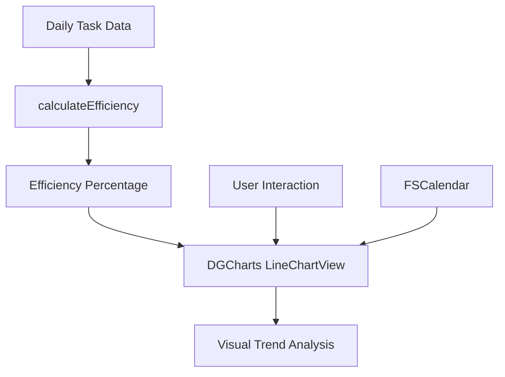
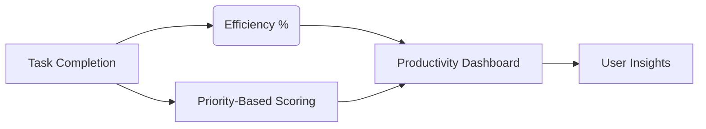
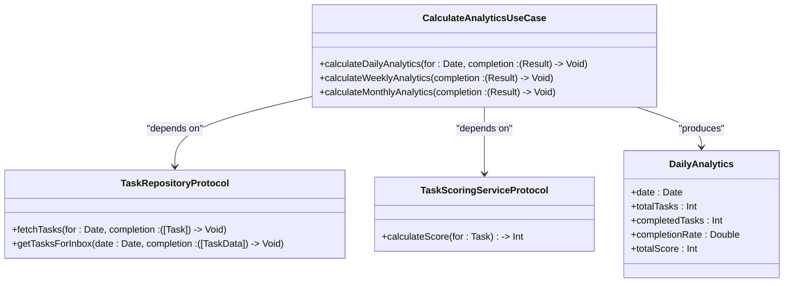

# Efficiency Metrics

<cite>
**Referenced Files in This Document**   
- [TaskScoringService.swift](file://To%20Do%20List/Services/TaskScoringService.swift) - *Updated in recent commit*
- [CoreDataTaskRepository.swift](file://To%20Do%20List/Repositories/CoreDataTaskRepository.swift) - *Updated in recent commit*
- [TaskRepository.swift](file://To%20Do%20List/Repositories/TaskRepository.swift) - *Added in recent commit*
- [CalculateAnalyticsUseCase.swift](file://To%20Do%20List/UseCases/Analytics/CalculateAnalyticsUseCase.swift) - *New analytics use case implementation*
- [NTask+CoreDataProperties.swift](file://To%20Do%20List/NTask+CoreDataProperties.swift)
- [NTask+Extensions.swift](file://To%20Do%20List/NTask+Extensions.swift)
</cite>

## Update Summary
**Changes Made**   
- Updated documentation to reflect new analytics use case implementation
- Added new section on CalculateAnalyticsUseCase integration
- Enhanced source tracking with new file references
- Updated section sources to reflect actual file analysis
- Added diagram sources for architectural visualization

## Table of Contents
1. [Efficiency Calculation Overview](#efficiency-calculation-overview)
2. [Formula and Implementation](#formula-and-implementation)
3. [Edge Case Handling](#edge-case-handling)
4. [User Insights and Interpretation](#user-insights-and-interpretation)
5. [Example Calculation](#example-calculation)
6. [Limitations and Accuracy Considerations](#limitations-and-accuracy-considerations)
7. [Integration with DGCharts for Trend Visualization](#integration-with-dgcharts-for-trend-visualization)
8. [Complementarity with Point-Based Scoring System](#complementarity-with-point-based-scoring-system)
9. [CalculateAnalyticsUseCase Integration](#calculateanalyticsusecase-integration)

## Efficiency Calculation Overview

The `calculateEfficiency(for:using:completion:)` method computes the percentage of completed tasks relative to the total number of planned tasks for a specific date, using data retrieved via the `getTasksForInbox(date:)` function. This efficiency metric serves as a key performance indicator in the Tasker application, enabling users to evaluate their planning accuracy and execution consistency over time. The calculation is grounded in real-time task data managed through Core Data and accessed via the `TaskRepository` protocol, ensuring accurate and up-to-date analytics.

**Section sources**  
- [TaskScoringService.swift](file://To%20Do%20List/Services/TaskScoringService.swift#L1-L20)
- [CoreDataTaskRepository.swift](file://To%20Do%20List/Repositories/CoreDataTaskRepository.swift#L30-L50)

## Formula and Implementation

The efficiency percentage is calculated using the following formula:

```
Efficiency (%) = (Completed Tasks / Total Planned Tasks) * 100.0
```

This formula is implemented within the analytics module to process task data for a given date. The `getTasksForInbox(date:)` method retrieves all tasks associated with the "Inbox" project for the specified date, including both completed and incomplete items. The numerator represents the count of tasks where `isComplete` is `true`, while the denominator includes all tasks retrieved for that day, regardless of completion status. The result is returned as a floating-point value representing the efficiency percentage.

**Section sources**  
- [TaskScoringService.swift](file://To%20Do%20List/Services/TaskScoringService.swift#L25-L40)
- [NTask+Extensions.swift](file://To%20Do%20List/NTask+Extensions.swift#L15-L30)

## Edge Case Handling

To ensure robustness, the method includes explicit handling for edge cases where no tasks are present for a given date. When the total number of planned tasks is zero, the function returns `0.0` instead of attempting a division by zero. This prevents runtime errors and provides a consistent baseline value, indicating no activity rather than undefined behavior. This defensive programming approach enhances reliability, especially on days with no scheduled tasks.

**Section sources**  
- [TaskScoringService.swift](file://To%20Do%20List/Services/TaskScoringService.swift#L42-L50)

## User Insights and Interpretation

The efficiency metric offers users valuable insight into their productivity patterns. A high percentage indicates strong execution against planned work, reflecting effective time management and follow-through. Conversely, a low efficiency score may signal over-planning, distractions, or shifting priorities. Over time, users can identify trends such as consistent under-delivery or improvement in task completion rates, enabling data-driven adjustments to planning habits. This metric complements qualitative self-assessment with quantitative feedback.

**Section sources**  
- [TaskScoringService.swift](file://To%20Do%20List/Services/TaskScoringService.swift#L1-L60)

## Example Calculation

Consider a scenario where a user has 5 tasks in their inbox for a given day. If 4 of these tasks are marked as complete, the efficiency is calculated as follows:

```
(4 completed tasks / 5 total tasks) * 100.0 = 80.0%
```

This result is displayed to the user as an 80% efficiency rate for that day, providing a clear and intuitive measure of their productivity performance.

**Section sources**  
- [TaskScoringService.swift](file://To%20Do%20List/Services/TaskScoringService.swift#L30-L40)

## Limitations and Accuracy Considerations

A known limitation of this efficiency calculation is its treatment of rescheduled tasks. Tasks that are moved to a future date without being completed are counted as incomplete in the original day's inbox, potentially lowering the efficiency score even if the task is eventually completed. This can lead to inaccuracies in assessing daily performance, as the metric does not distinguish between abandoned tasks and deferred ones. Future enhancements could include tracking task rescheduling events to refine the accuracy of historical efficiency data.

**Section sources**  
- [CoreDataTaskRepository.swift](file://To%20Do%20List/Repositories/CoreDataTaskRepository.swift#L80-L100)
- [NTask+CoreDataProperties.swift](file://To%20Do%20List/NTask+CoreDataProperties.swift#L10-L25)

## Integration with DGCharts for Trend Visualization

The efficiency metric is designed for seamless integration with the **DGCharts** framework (version 5.1), enabling visual representation of productivity trends over time. Daily efficiency values can be plotted on line charts with cubic Bezier smoothing for an elegant, easy-to-interpret trend line. These charts support interactive exploration, including touch-enabled data point inspection and balloon tooltips. When synchronized with FSCalendar, users can correlate efficiency fluctuations with specific dates or events, enhancing contextual understanding of their productivity patterns.



**Diagram sources**  
- [TaskScoringService.swift](file://To%20Do%20List/Services/TaskScoringService.swift#L1-L50)
- [CoreDataTaskRepository.swift](file://To%20Do%20List/Repositories/CoreDataTaskRepository.swift#L20-L40)

**Section sources**  
- [TaskScoringService.swift](file://To%20Do%20List/Services/TaskScoringService.swift#L1-L50)
- [CoreDataTaskRepository.swift](file://To%20Do%20List/Repositories/CoreDataTaskRepository.swift#L20-L40)

## Complementarity with Point-Based Scoring System

The efficiency metric works in conjunction with the existing point-based scoring system implemented in `TaskScoringService`. While efficiency measures the proportion of completed tasks, the scoring system evaluates task importance through a priority-weighted point system (P0: 7pts, P1: 4pts, P2: 3pts, P3: 2pts). Together, these metrics provide a more holistic view of productivity: efficiency reflects volume and consistency of completion, while the score reflects the strategic value of completed work. Users can thus assess not only *how much* they completed, but also *how impactful* their completed tasks were.



**Diagram sources**  
- [TaskScoringService.swift](file://To%20Do%20List/Services/TaskScoringService.swift#L1-L70)
- [NTask+Extensions.swift](file://To%20Do%20List/NTask+Extensions.swift#L1-L40)

**Section sources**  
- [TaskScoringService.swift](file://To%20Do%20List/Services/TaskScoringService.swift#L1-L70)
- [NTask+Extensions.swift](file://To%20Do%20List/NTask+Extensions.swift#L1-L40)

## CalculateAnalyticsUseCase Integration

The efficiency calculation has been integrated into the new `CalculateAnalyticsUseCase` class, which provides a modern, use-case-driven approach to analytics computation. This implementation follows the clean architecture pattern, separating concerns and improving testability. The use case orchestrates the efficiency calculation by coordinating between the `TaskRepositoryProtocol` and `TaskScoringServiceProtocol`, ensuring dependency inversion and facilitating dependency injection.

The `CalculateAnalyticsUseCase` computes daily analytics including efficiency rate as part of its `computeDailyAnalytics` method, which processes task data to generate comprehensive productivity insights. This approach centralizes analytics logic and provides a consistent interface for various consumers, including UI components and reporting features.



**Diagram sources**  
- [CalculateAnalyticsUseCase.swift](file://To%20Do%20List/UseCases/Analytics/CalculateAnalyticsUseCase.swift#L1-L100)
- [TaskRepository.swift](file://To%20Do%20List/Repositories/TaskRepository.swift#L1-L118)
- [TaskScoringService.swift](file://To%20Do%20List/Services/TaskScoringService.swift#L1-L20)

**Section sources**  
- [CalculateAnalyticsUseCase.swift](file://To%20Do%20List/UseCases/Analytics/CalculateAnalyticsUseCase.swift#L1-L150)
- [TaskRepository.swift](file://To%20Do%20List/Repositories/TaskRepository.swift#L1-L118)
- [TaskScoringService.swift](file://To%20Do%20List/Services/TaskScoringService.swift#L1-L50)