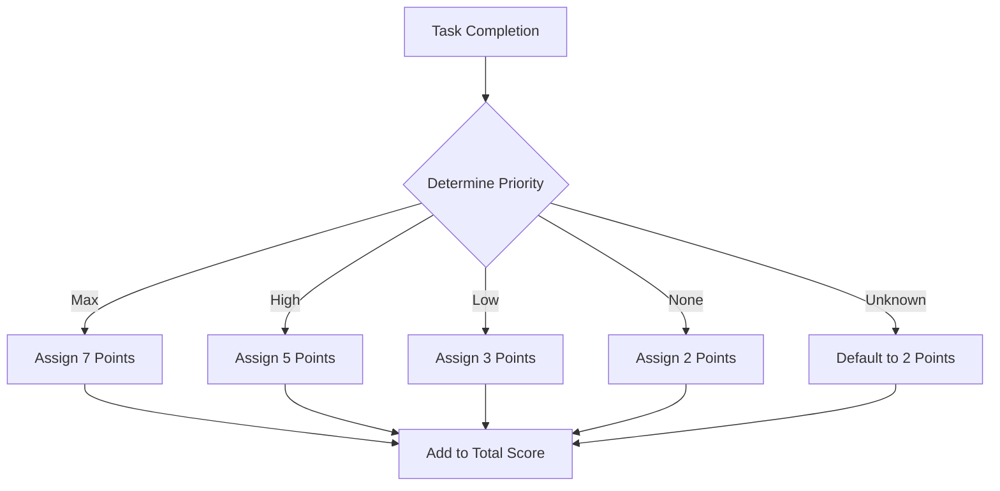
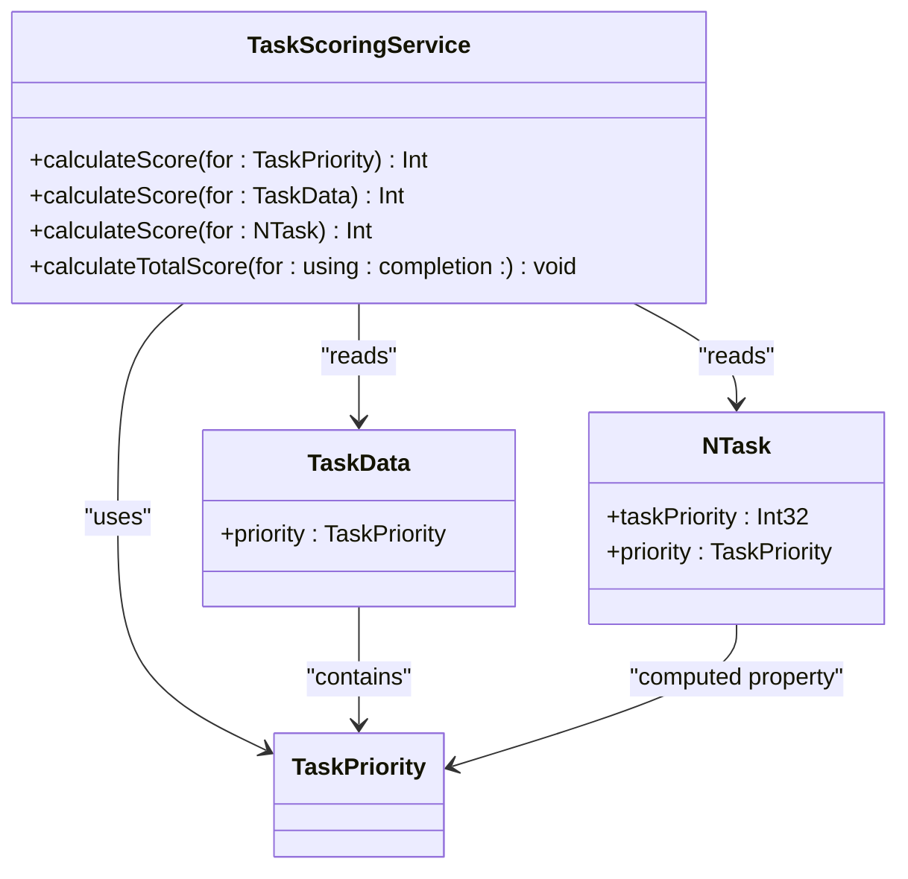
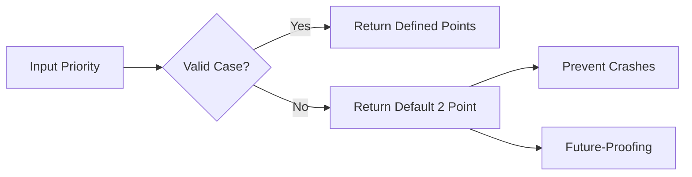

# Scoring Algorithm

<cite>
**Referenced Files in This Document**   
- [TaskScoringService.swift](file://To%20Do%20List/Services/TaskScoringService.swift) - *Updated to use TaskPriorityConfig*
- [TaskPriorityConfig.swift](file://To%20Do%20List/Domain/Models/TaskPriorityConfig.swift) - *Added in recent commit*
- [CalculateAnalyticsUseCase.swift](file://To%20Do%20List/UseCases/Analytics/CalculateAnalyticsUseCase.swift) - *Added in recent commit*
- [TaskData.swift](file://To%20Do%20List/Models/TaskData.swift) - *Updated for new priority system*
- [NTask+CoreDataProperties.swift](file://To%20Do%20List/NTask+CoreDataProperties.swift) - *Updated for new priority system*
- [NTask+Extensions.swift](file://To%20Do%20List/NTask+Extensions.swift) - *Updated for new priority system*
</cite>

## Update Summary
**Changes Made**   
- Updated scoring values to reflect new priority system (None=2, Low=3, High=5, Max=7)
- Added centralized configuration via TaskPriorityConfig
- Updated method overloads to use centralized scoring
- Added integration with CalculateAnalyticsUseCase
- Removed outdated scoring inconsistencies
- Updated examples and business logic explanation

## Table of Contents
1. [Introduction](#introduction)
2. [Scoring System Overview](#scoring-system-overview)
3. [Core Scoring Logic](#core-scoring-logic)
4. [Method Overloads and Data Layer Integration](#method-overloads-and-data-layer-integration)
5. [Business Logic and Gamification Strategy](#business-logic-and-gamification-strategy)
6. [Edge Case Handling](#edge-case-handling)
7. [Performance Considerations](#performance-considerations)
8. [Usage Examples](#usage-examples)
9. [Conclusion](#conclusion)

## Introduction
The TaskScoringService implements a gamified scoring system designed to motivate users by assigning point values to completed tasks based on their priority levels. This document details the algorithm's implementation, its integration across data layers, and its role in enhancing user engagement through positive reinforcement. The scoring system has been updated to use a centralized configuration model with a revised priority system.

**Section sources**
- [TaskScoringService.swift](file://To%20Do%20List/Services/TaskScoringService.swift#L1-L20)
- [TaskPriorityConfig.swift](file://To%20Do%20List/Domain/Models/TaskPriorityConfig.swift#L1-L10)

## Scoring System Overview
The scoring system follows a priority-based point allocation model where tasks are assigned points according to their importance:

- **Max Priority**: 7 points
- **High Priority**: 5 points
- **Low Priority**: 3 points
- **None Priority**: 2 points

This tiered approach incentivizes users to complete higher-priority tasks while still rewarding completion of lower-priority items. The system is implemented in the TaskScoringService class, which serves as the central authority for all scoring operations within the application. All scoring values are now centrally configured in TaskPriorityConfig, ensuring consistency across the application.

**Diagram sources**
- [TaskScoringService.swift](file://To%20Do%20List/Services/TaskScoringService.swift#L15-L28)
- [TaskPriorityConfig.swift](file://To%20Do%20List/Domain/Models/TaskPriorityConfig.swift#L50-L65)

**Section sources**
- [TaskScoringService.swift](file://To%20Do%20List/Services/TaskScoringService.swift#L15-L28)
- [TaskPriorityConfig.swift](file://To%20Do%20List/Domain/Models/TaskPriorityConfig.swift#L50-L65)

## Core Scoring Logic
The primary scoring logic is implemented in the `calculateScore(for:)` method that accepts a `TaskPriority` enum parameter. This method uses the centralized TaskPriorityConfig to map each priority level to its corresponding point value. The implementation ensures deterministic scoring behavior and provides a foundation for consistent calculations throughout the application.

The scoring values were selected to create meaningful differentiation between priority levels while maintaining a reasonable point range that supports long-term user engagement. Max-priority tasks are worth nearly double high-priority tasks (7 vs 5), creating a strong incentive to focus on important items. The system now uses a centralized configuration model (TaskPriorityConfig) that serves as a single source of truth for all priority-related settings.

**Section sources**
- [TaskScoringService.swift](file://To%20Do%20List/Services/TaskScoringService.swift#L15-L28)
- [TaskPriorityConfig.swift](file://To%20Do%20List/Domain/Models/TaskPriorityConfig.swift#L50-L65)

## Method Overloads and Data Layer Integration
The TaskScoringService provides multiple overloads of the `calculateScore(for:)` method to support different data types across the application's architecture:

**Diagram sources**
- [TaskScoringService.swift](file://To%20Do%20List/Services/TaskScoringService.swift#L30-L55)
- [TaskData.swift](file://To%20Do%20List/Models/TaskData.swift#L15-L25)
- [NTask+Extensions.swift](file://To%20Do%20List/NTask+Extensions.swift#L45-L55)

**Section sources**
- [TaskScoringService.swift](file://To%20Do%20List/Services/TaskScoringService.swift#L30-L55)
- [TaskData.swift](file://To%20Do%20List/Models/TaskData.swift#L15-L25)
- [NTask+Extensions.swift](file://To%20Do%20List/NTask+Extensions.swift#L45-L55)

The overloads enable seamless scoring across different layers:
- `calculateScore(for: TaskPriority)` - Core logic implementation
- `calculateScore(for: TaskData)` - Presentation layer integration
- `calculateScore(for: NTask)` - Core Data persistence layer integration

Each overload ultimately delegates to the centralized TaskPriorityConfig for scoring, ensuring consistency and eliminating duplication. The CalculateAnalyticsUseCase now integrates with the scoring service to provide comprehensive analytics.

## Business Logic and Gamification Strategy
The scoring algorithm plays a crucial role in the application's gamification strategy by providing immediate positive feedback for task completion. The point system transforms routine task management into a rewarding experience that encourages consistent usage.

The business logic behind the point allocation reflects a balance between motivation and realism:
- Max-priority tasks receive substantial rewards to encourage focus on important items
- High-priority tasks offer moderate rewards for regular productivity
- Low and none priority tasks still provide points to maintain engagement

For example, completing three max-priority tasks yields 21 points (3 × 7), creating a tangible sense of accomplishment. This cumulative scoring system supports longer-term goals and streak tracking, which are key elements of user retention in productivity applications. The centralized configuration in TaskPriorityConfig allows for easy adjustment of scoring values to optimize user motivation.

**Section sources**
- [TaskScoringService.swift](file://To%20Do%20List/Services/TaskScoringService.swift#L15-L28)
- [TaskScoringService.swift](file://To%20Do%20List/Services/TaskScoringService.swift#L75-L105)
- [TaskPriorityConfig.swift](file://To%20Do%20List/Domain/Models/TaskPriorityConfig.swift#L50-L65)

## Edge Case Handling
The scoring system includes robust edge case handling to ensure reliability and future-proofing:

1. **Unknown Enum Values**: The `@unknown default` clause in the switch statement returns 2 points for any unrecognized priority value, preventing crashes and maintaining application stability.

2. **Data Conversion Safety**: When converting from Core Data's `Int32` representation to the `TaskPriority` enum, the code uses nil-coalescing operators (`??`) to provide safe defaults (.none) when raw values don't match defined cases.

3. **Empty Task Lists**: The `calculateTotalScore` method gracefully handles cases where no tasks exist for a given date, returning 0 rather than failing.

4. **Invalid Priority Migration**: The system automatically detects and corrects invalid priority values on app launch, normalizing them to valid ranges.

**Diagram sources**
- [TaskScoringService.swift](file://To%20Do%20List/Services/TaskScoringService.swift#L25-L28)
- [NTask+Extensions.swift](file://To%20Do%20List/NTask+Extensions.swift#L45-L50)
- [TaskPriorityConfig.swift](file://To%20Do%20List/Domain/Models/TaskPriorityConfig.swift#L100-L120)

**Section sources**
- [TaskScoringService.swift](file://To%20Do%20List/Services/TaskScoringService.swift#L25-L28)
- [NTask+Extensions.swift](file://To%20Do%20List/NTask+Extensions.swift#L45-L50)
- [TaskPriorityConfig.swift](file://To%20Do%20List/Domain/Models/TaskPriorityConfig.swift#L100-L120)

## Performance Considerations
The scoring calculations are implemented synchronously, which is appropriate given their lightweight nature. The `calculateScore(for:)` methods perform simple lookups without database access or complex computations, making them suitable for immediate execution on the main thread when needed.

However, aggregate calculations like `calculateTotalScore` and `calculateStreak` use asynchronous completion handlers to prevent UI blocking when processing potentially large numbers of tasks. The streak calculation employs a synchronous dispatch group pattern that limits processing to a maximum of 30 days, preventing excessive resource consumption.

The current implementation now uses a centralized configuration model (TaskPriorityConfig) that ensures consistency across all scoring operations. The CalculateAnalyticsUseCase provides additional analytics functionality with proper error handling and caching support.

**Section sources**
- [TaskScoringService.swift](file://To%20Do%20List/Services/TaskScoringService.swift#L57-L105)
- [CalculateAnalyticsUseCase.swift](file://To%20Do%20List/UseCases/Analytics/CalculateAnalyticsUseCase.swift#L1-L100)

## Usage Examples
The scoring system can be utilized in various contexts throughout the application:

- **Daily Score Calculation**: Summing points for all tasks completed on a specific date
- **User Progress Tracking**: Displaying cumulative scores over time
- **Achievement Systems**: Unlocking badges