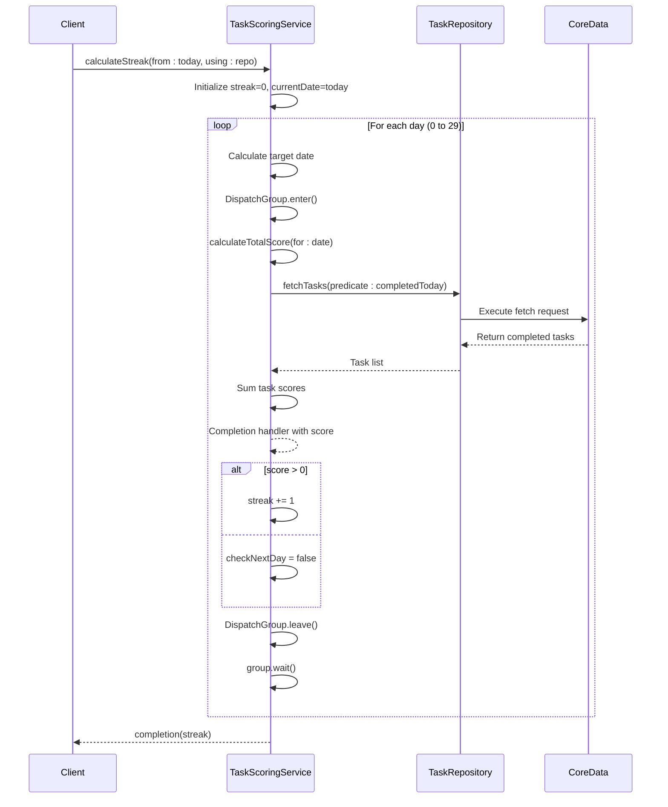
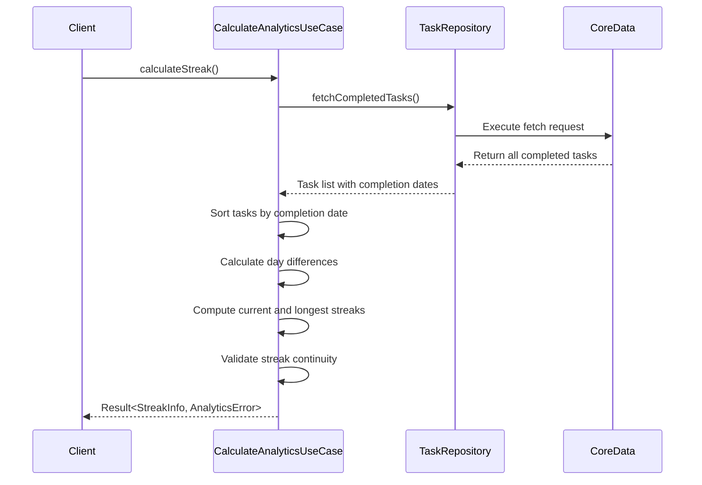

# Streak Tracking

<cite>
**Referenced Files in This Document**   
- [TaskScoringService.swift](file://To%20Do%20List/Services/TaskScoringService.swift) - *Updated in recent commit*
- [CalculateAnalyticsUseCase.swift](file://To%20Do%20List/UseCases/Analytics/CalculateAnalyticsUseCase.swift) - *Added in recent commit*
- [TaskRepository.swift](file://To%20Do%20List/Repositories/TaskRepository.swift)
</cite>

## Update Summary
**Changes Made**   
- Updated streak calculation logic to reflect new implementation in CalculateAnalyticsUseCase
- Added new section for the modern analytics use case approach
- Updated code-level sequence diagram to show new architecture
- Enhanced technical limitations section with additional refactoring suggestions
- Added integration details between new and legacy systems

## Table of Contents
1. [Introduction](#introduction)
2. [Streak Calculation Logic](#streak-calculation-logic)
3. [Asynchronous Score Aggregation](#asynchronous-score-aggregation)
4. [Algorithm Flow and Constraints](#algorithm-flow-and-constraints)
5. [Performance Optimization](#performance-optimization)
6. [Code-Level Sequence Diagram](#code-level-sequence-diagram)
7. [Example Scenario](#example-scenario)
8. [Technical Limitations and Refactoring Suggestions](#technical-limitations-and-refactoring-suggestions)
9. [User Experience Implications](#user-experience-implications)
10. [Modern Analytics Use Case Implementation](#modern-analytics-use-case-implementation)
11. [Conclusion](#conclusion)

## Introduction
The streak tracking system in the Tasker application is designed to measure user consistency by calculating the number of consecutive days with at least one completed task. This gamification feature starts from the current day and evaluates historical task completion data backward in time. The logic is implemented within the `TaskScoringService` class and plays a key role in user engagement and motivation.

**Section sources**
- [TaskScoringService.swift](file://To%20Do%20List/Services/TaskScoringService.swift#L79-L125)

## Streak Calculation Logic
The `calculateStreak(from:using:completion:)` method computes the current streak by checking each day backward from today. A day contributes to the streak if it contains at least one completed task. The process stops when a day with zero completed tasks is encountered. The streak count reflects uninterrupted daily activity and resets upon any missed day.

The method accepts a start date, a repository instance for data access, and a completion handler to return the final streak value asynchronously. Internally, it uses the `calculateTotalScore(for:using:completion:)` function to determine whether a day qualifies for the streak based on its score.

**Section sources**
- [TaskScoringService.swift](file://To%20Do%20List/Services/TaskScoringService.swift#L84-L125)

## Asynchronous Score Aggregation
To evaluate daily scores across multiple days, the streak calculation uses `DispatchGroup` to synchronize concurrent asynchronous calls to `calculateTotalScore(for:using:completion:)`. Each day's score is fetched independently, and the group ensures coordination between these operations.

However, the current implementation calls `group.wait()` after each `enter()` and `leave()` pair, effectively blocking the current thread until the score for that day is computed. This synchronous waiting defeats the purpose of asynchronous design and can lead to performance degradation, especially on the main thread.

**Section sources**
- [TaskScoringService.swift](file://To%20Do%20List/Services/TaskScoringService.swift#L100-L118)

## Algorithm Flow and Constraints
The algorithm follows a backward traversal pattern:
1. Start from the beginning of the current day.
2. For each day (up to 30 days back):
   - Fetch the total score of completed tasks.
   - If score > 0, increment streak and continue.
   - If score == 0, terminate the loop.
3. Return the accumulated streak count.

This linear evaluation ensures accuracy while maintaining simplicity. The loop terminates early upon encountering the first zero-score day, optimizing execution in cases where the streak is short.

**Section sources**
- [TaskScoringService.swift](file://To%20Do%20List/Services/TaskScoringService.swift#L94-L118)

## Performance Optimization
A maximum lookback window of 30 days is enforced to limit computational overhead. Without this constraint, the algorithm could theoretically scan indefinitely into the past, leading to excessive database queries and memory usage. By capping the analysis at one month, the system maintains responsiveness and scalability, even for long-term users.

This design reflects a balance between meaningful historical insight and practical performance considerations.

**Section sources**
- [TaskScoringService.swift](file://To%20Do%20List/Services/TaskScoringService.swift#L98-L99)

## Code-Level Sequence Diagram

**Diagram sources**
- [TaskScoringService.swift](file://To%20Do%20List/Services/TaskScoringService.swift#L84-L125)
- [TaskRepository.swift](file://To%20Do%20List/Repositories/TaskRepository.swift)

## Example Scenario
Consider a user who has completed at least one task each day for the past five days. When `calculateStreak` is called:
- Day 0 (today): Score > 0 → streak = 1
- Day -1: Score > 0 → streak = 2
- Day -2: Score > 0 → streak = 3
- Day -3: Score > 0 → streak = 4
- Day -4: Score > 0 → streak = 5
- Day -5: Score == 0 → stop

The final streak returned is 5, accurately reflecting five consecutive days of activity.

**Section sources**
- [TaskScoringService.swift](file://To%20Do%20List/Services/TaskScoringService.swift#L105-L116)

## Technical Limitations and Refactoring Suggestions
The use of `group.wait()` introduces a critical limitation: it blocks the executing thread, potentially causing UI freezes if called on the main thread. This negates the benefits of asynchronous programming and violates best practices for responsive applications.

**Recommended Refactoring:**
Replace the `DispatchGroup` + `wait()` pattern with modern Swift concurrency using `async/await`. Each `calculateTotalScore` call should be converted to an `async` function, allowing sequential or concurrent execution without thread blocking. This would improve readability, safety, and performance.

Additionally, consider caching recent daily scores to reduce redundant database queries during streak calculation. Implementing a memoization pattern for recent streak calculations would significantly improve performance, especially when the streak is accessed frequently.

**Section sources**
- [TaskScoringService.swift](file://To%20Do%20List/Services/TaskScoringService.swift#L108-L110)

## User Experience Implications
Streaks serve as a powerful psychological motivator, encouraging daily engagement through positive reinforcement. Users are more likely to maintain productivity when they perceive progress as continuous and visible. A broken streak can feel like a setback, prompting users to resume activity quickly to rebuild momentum.

Displaying the current streak in the UI (e.g., in the home view navigation bar) enhances visibility and emotional investment. The message "Your task streak awaits!" suggests anticipation and opportunity, reinforcing proactive behavior.

**Section sources**
- [HomeViewController+NavigationBarTitle.swift](file://To%20Do%20List/ViewControllers/HomeViewController+NavigationBarTitle.swift#L18-L100)

## Modern Analytics Use Case Implementation
A new analytics use case has been introduced to provide a more comprehensive approach to streak tracking and productivity metrics. The `CalculateAnalyticsUseCase` class now serves as the primary interface for all analytics calculations, including streak information.

The new implementation provides enhanced streak data through the `StreakInfo` struct, which includes:
- **currentStreak**: The current consecutive day count
- **longestStreak**: The longest streak achieved historically
- **lastCompletionDate**: The date of the most recent task completion

The `calculateStreak` method in `CalculateAnalyticsUseCase` analyzes all completed tasks and computes both current and historical streak information. This approach allows for more sophisticated analytics while maintaining backward compatibility with the existing `TaskScoringService`.

The new implementation processes completed tasks by:
1. Sorting tasks by completion date in descending order
2. Calculating day-to-day differences to identify consecutive days
3. Tracking both current and longest streaks simultaneously
4. Validating streak continuity by checking for today or yesterday completions

This modern approach eliminates the need for multiple database queries and provides richer data for user motivation and analytics.

**Diagram sources**
- [CalculateAnalyticsUseCase.swift](file://To%20Do%20List/UseCases/Analytics/CalculateAnalyticsUseCase.swift#L200-L230)
- [TaskRepository.swift](file://To%20Do%20List/Repositories/TaskRepository.swift)

**Section sources**
- [CalculateAnalyticsUseCase.swift](file://To%20Do%20List/UseCases/Analytics/CalculateAnalyticsUseCase.swift#L200-L230)
- [TaskRepository.swift](file://To%20Do%20List/Repositories/TaskRepository.swift)

## Conclusion
The streak calculation logic in `TaskScoringService` provides a robust mechanism for tracking user consistency. While functionally effective, its reliance on synchronous waiting within an asynchronous context presents a significant technical debt. Refactoring toward `async/await` will future-proof the implementation, aligning with modern Swift concurrency patterns. The introduction of `CalculateAnalyticsUseCase` represents a strategic shift toward more comprehensive analytics with richer data models. Combined with thoughtful UX design, streak tracking remains a cornerstone of user retention and sustained engagement in the Tasker application.