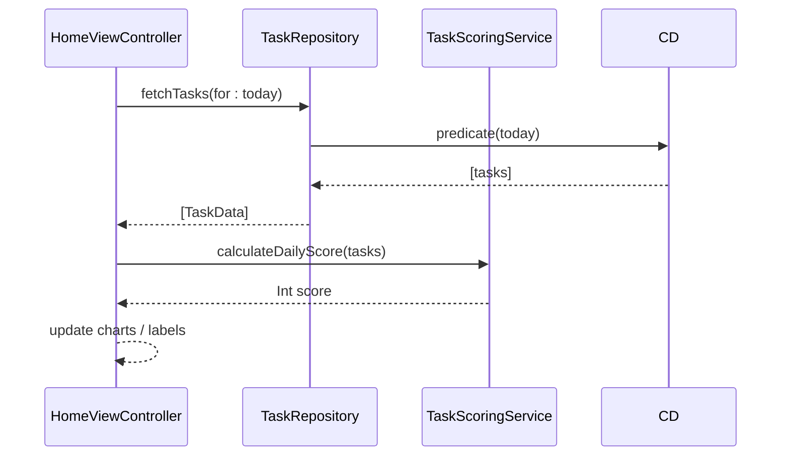
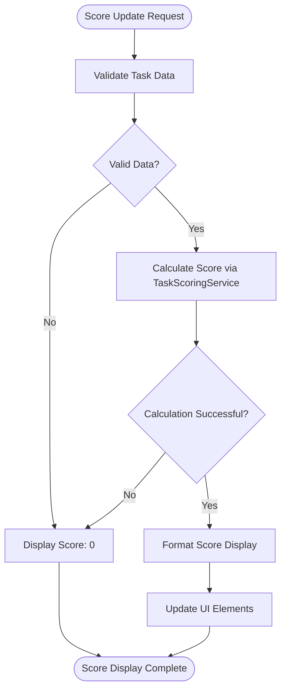

# UI Integration and Score Display

<cite>
**Referenced Files in This Document**   
- [HomeViewController.swift](file://To%20Do%20List/ViewControllers/HomeViewController.swift)
- [TaskScoringService.swift](file://README.md#L652-L690)
- [ChartCard.swift](file://To%20Do%20List/Views/Cards/ChartCard.swift)
- [HomeBackdropView.swift](file://To%20Do%20List/View/HomeBackdropView.swift)
- [AddTaskBackdropView.swift](file://To%20Do%20List/View/AddTaskBackdropView.swift)
</cite>

## Table of Contents
1. [Introduction](#introduction)
2. [Score Update Lifecycle](#score-update-lifecycle)
3. [Dependency Injection and Service Integration](#dependency-injection-and-service-integration)
4. [UI Elements and Score Display](#ui-elements-and-score-display)
5. [Thread-Safe UI Updates](#thread-safe-ui-updates)
6. [Loading States and Error Handling](#loading-states-and-error-handling)
7. [Accessibility and Dynamic Type](#accessibility-and-dynamic-type)
8. [Animation Patterns](#animation-patterns)
9. [Real-Time Score Updates](#real-time-score-updates)
10. [Conclusion](#conclusion)

## Introduction
This document details the integration of scoring data into the user interface of the Tasker application, with a primary focus on the HomeViewController. It explains how score updates are triggered during view lifecycle events, how the TaskScoringService is integrated, and how various UI elements display scoring information including daily score, streak, and efficiency metrics. The document also covers implementation details for thread-safe updates, error handling, accessibility, and animation patterns that enhance the user experience when scores change.

## Score Update Lifecycle

The HomeViewController implements a comprehensive score update system that is triggered at key points in the view lifecycle. The primary method responsible for score updates is `updateDailyScore()`, which is called from multiple lifecycle events to ensure the displayed score is always current.

The `viewDidAppear(_:)` method serves as a critical trigger point for score updates. When the view appears, the system refreshes the navigation pie chart and ensures any dummy table views are fixed, providing a clean slate for the updated score display. This lifecycle method guarantees that users see the most current score information whenever they navigate to the home screen.

Additional score update triggers include:
- `viewWillAppear(_:)` for pre-display preparation
- Calendar date changes via `updateDailyScore(for: date)`
- Task completion events through notification observers
- Manual refresh actions initiated by the user

These multiple entry points ensure that score calculations are performed whenever relevant data changes, maintaining data consistency across the application.

**Section sources**
- [HomeViewController.swift](file://To%20Do%20List/ViewControllers/HomeViewController.swift#L298)
- [HomeViewController.swift](file://To%20Do%20List/ViewControllers/HomeViewController.swift#L405)
- [HomeViewController.swift](file://To%20Do%20List/ViewControllers/HomeViewController.swift#L981)
- [HomeCalendarExtention.swift](file://To%20Do%20List/ViewControllers/Delegates/HomeCalendarExtention.swift#L200)

## Dependency Injection and Service Integration

The scoring system integrates with the user interface through the TaskScoringService, which is accessed statically to calculate scores based on task completion and priority. The service follows a clean separation of concerns, with the UI layer calling into the service layer for score calculations without managing the underlying business logic.

The dependency flow follows the sequence diagram pattern where HomeViewController acts as the UI participant, TaskRepository as the data service, and TaskScoringService as the scoring component. When the view needs to update scores, it first fetches the relevant tasks through the repository pattern, then passes these tasks to the scoring service for calculation.

The integration occurs in the `updateDailyScore()` method, which retrieves tasks for the current view date and passes them to the TaskScoringService for daily score calculation. This pattern ensures that the UI remains decoupled from data access details while still providing responsive score updates.



**Diagram sources**
- [HomeViewController.swift](file://To%20Do%20List/ViewControllers/HomeViewController.swift#L981)
- [README.md](file://README.md#L925-L976)

**Section sources**
- [HomeViewController.swift](file://To%20Do%20List/ViewControllers/HomeViewController.swift#L981)
- [README.md](file://README.md#L925-L976)

## UI Elements and Score Display

The application displays scoring information through multiple UI elements, each designed to provide specific insights into user performance. The primary score display elements include labels and badges that show daily score, streak information, and efficiency metrics.

The main score display is implemented through the `scoreAtHomeLabel` UILabel, which shows the formatted score text. This label is configured with specific styling including monospaced font design and regular weight to create a distinctive visual appearance. The label is positioned in the top bar area of the interface, ensuring high visibility.

Additional UI elements include:
- Navigation bar pie chart showing task completion breakdown
- Score counter label with bold, rounded font for emphasis
- SwiftUI-based TaskProgressCard for weekly progress visualization
- Badge indicators for streak tracking

The score formatting follows a simple pattern where the raw integer score is displayed directly (e.g., "42") without additional text prefixes in the main display area. This minimalist approach emphasizes the gamification aspect of the scoring system.

**Section sources**
- [HomeViewController.swift](file://To%20Do%20List/ViewControllers/HomeViewController.swift#L298)
- [HomeBackdropView.swift](file://To%20Do%20List/View/HomeBackdropView.swift#L97)
- [AddTaskBackdropView.swift](file://To%20Do%20List/View/AddTaskBackdropView.swift#L37)

## Thread-Safe UI Updates

All score updates are performed on the main queue to ensure thread safety and prevent UI rendering issues. The application uses `DispatchQueue.main.async` to marshal score update operations to the main thread, which is essential for UIKit compatibility.

When score calculations complete, the results are applied to UI elements within a main queue dispatch block. This pattern is consistently applied across all score update pathways, including:
- Initial view loading
- Calendar date changes
- Task completion events
- Manual refresh operations

The thread-safe update pattern follows this structure:
```swift
DispatchQueue.main.async { [weak self] in
    self?.scoreAtHomeLabel.text = "\(score)"
    self?.refreshNavigationPieChart()
}
```

This approach prevents race conditions and ensures that UI updates are serialized properly, maintaining application stability even when multiple score update requests occur simultaneously.

**Section sources**
- [HomeViewController.swift](file://To%20Do%20List/ViewControllers/HomeViewController.swift#L972)
- [HomeViewController.swift](file://To%20Do%20List/ViewControllers/HomeViewController.swift#L298)

## Loading States and Error Handling

The scoring system implements robust error handling to ensure a seamless user experience even when score calculations fail. In cases where score calculation encounters an error or returns nil, the system defaults to displaying a score of 0 rather than showing no value or crashing.

The loading state management is particularly evident in the SwiftUI-based TaskProgressCard, which implements an explicit loading state with a ProgressView indicator. This provides visual feedback during data fetching operations, preventing the perception of application lag.

Error handling follows these principles:
- Fail gracefully by displaying default values (0) instead of error messages
- Maintain UI responsiveness during data operations
- Provide visual feedback for loading states
- Log errors for debugging without disrupting the user experience

The system also handles edge cases such as empty task lists or missing completion dates by returning appropriate default values, ensuring that the score display remains consistent under all conditions.



**Diagram sources**
- [TaskScoringService.swift](file://README.md#L652-L690)
- [ChartCard.swift](file://To%20Do%20List/Views/Cards/ChartCard.swift#L52)

**Section sources**
- [README.md](file://README.md#L652-L690)
- [ChartCard.swift](file://To%20Do%20List/Views/Cards/ChartCard.swift#L52)

## Accessibility and Dynamic Type

The score display system incorporates accessibility features to support users with different needs. The SwiftUI components, particularly the TaskProgressCard, implement dynamic type support to accommodate various text size preferences.

Key accessibility features include:
- Dynamic type sizing from large to accessibility level 5 for primary text
- Dynamic type sizing from large to accessibility level 3 for secondary text
- Proper accessibility traits including header identification
- Combined accessibility elements for grouped content
- Clear accessibility labels and hints for interactive components

The UIKit components also support accessibility through proper labeling and traits, ensuring that screen readers can effectively communicate score information to visually impaired users. The system maintains readability across different text sizes by using appropriate font scaling and layout constraints.

**Section sources**
- [ChartCard.swift](file://To%20Do%20List/Views/Cards/ChartCard.swift#L28)

## Animation Patterns

The application employs subtle animation patterns to provide visual feedback when scores change, enhancing the user experience and drawing attention to score updates. These animations follow a principle of providing feedback without being distracting.

Key animation patterns include:
- Smooth transitions when updating the navigation pie chart
- Bounce effects after main chart animations to add visual interest
- Fade-in effects for newly loaded chart data
- Synchronized animations across related UI elements

The pie chart animations are particularly notable, using easing functions like `.easeOutBack` to create a natural, responsive feel. These animations are triggered whenever the score data changes, providing immediate visual confirmation of task completion or other score-affecting actions.

The animation system also includes performance considerations, with animation durations optimized to provide feedback without introducing perceived lag. The system balances visual appeal with responsiveness, ensuring that the interface remains snappy even when multiple animations are occurring.

**Section sources**
- [HomeViewController.swift](file://To%20Do%20List/ViewControllers/HomeViewController.swift#L298)
- [ChartCard.swift](file://To%20Do%20List/Views/Cards/ChartCard.swift#L112)

## Real-Time Score Updates

The UI reflects real-time updates when tasks are completed through a notification-based system. The HomeViewController registers for `TaskCompletionChanged` notifications, which are posted whenever a task's completion status changes.

When a task completion event occurs:
1. The system posts a `TaskCompletionChanged` notification
2. HomeViewController receives the notification via its observer
3. The `updateDailyScore()` method is called to recalculate the score
4. UI elements are updated with the new score value

This real-time update system ensures that score changes are reflected immediately in the interface, providing instant feedback to users when they complete tasks. The system also updates the navigation pie chart to reflect the changed task completion status, maintaining data consistency across all visualizations.

The real-time update mechanism is efficient, only recalculating scores when necessary rather than polling for changes. This approach conserves battery life and processing resources while still providing immediate feedback.

**Section sources**
- [HomeViewController.swift](file://To%20Do%20List/ViewControllers/HomeViewController.swift#L298)
- [ChartCard.swift](file://To%20Do%20List/Views/Cards/ChartCard.swift#L108)

## Conclusion
The scoring system integration in the Tasker application provides a comprehensive, responsive, and visually appealing way to display user performance metrics. Through careful implementation of lifecycle events, dependency injection, thread-safe updates, and thoughtful UI design, the system delivers a seamless user experience that encourages task completion and engagement. The combination of immediate feedback, graceful error handling, and accessibility support makes the scoring system a core component of the application's gamification strategy.