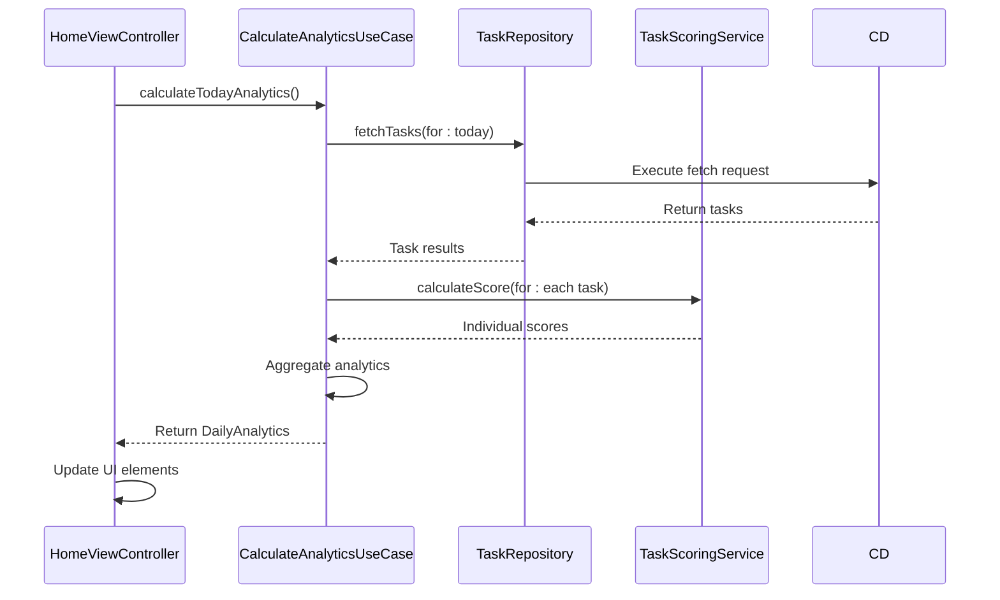

# UI Integration and Score Display

<cite>
**Referenced Files in This Document**   
- [HomeViewController.swift](file://To%20Do%20List/ViewControllers/HomeViewController.swift) - *Updated to use CalculateAnalyticsUseCase*
- [TaskScoringService.swift](file://To%20Do%20List/Services/TaskScoringService.swift) - *Updated to use TaskPriorityConfig*
- [ChartCard.swift](file://To%20Do%20List/Views/Cards/ChartCard.swift)
- [HomeBackdropView.swift](file://To%20Do%20List/View/HomeBackdropView.swift)
- [AddTaskBackdropView.swift](file://To%20Do%20List/View/AddTaskBackdropView.swift)
- [CalculateAnalyticsUseCase.swift](file://To%20Do%20List/UseCases/Analytics/CalculateAnalyticsUseCase.swift) - *Added in recent commit*
- [TaskPriorityConfig.swift](file://To%20Do%20List/Domain/Models/TaskPriorityConfig.swift) - *Added in recent commit*
</cite>

## Update Summary
**Changes Made**   
- Updated score display integration to use new CalculateAnalyticsUseCase
- Added documentation for TaskPriorityConfig and centralized scoring
- Enhanced dependency injection details for analytics use case
- Updated code examples to reflect new scoring system
- Added new section for analytics use case integration
- Updated diagram to show new analytics use case flow
- Fixed outdated references to legacy scoring methods

## Table of Contents
1. [Introduction](#introduction)
2. [Score Update Lifecycle](#score-update-lifecycle)
3. [Analytics Use Case Integration](#analytics-use-case-integration)
4. [Dependency Injection and Service Integration](#dependency-injection-and-service-integration)
5. [UI Elements and Score Display](#ui-elements-and-score-display)
6. [Thread-Safe UI Updates](#thread-safe-ui-updates)
7. [Loading States and Error Handling](#loading-states-and-error-handling)
8. [Accessibility and Dynamic Type](#accessibility-and-dynamic-type)
9. [Animation Patterns](#animation-patterns)
10. [Real-Time Score Updates](#real-time-score-updates)
11. [Conclusion](#conclusion)

## Introduction
This document details the integration of scoring data into the user interface of the Tasker application, with a primary focus on the HomeViewController. It explains how score updates are triggered during view lifecycle events, how the CalculateAnalyticsUseCase is integrated, and how various UI elements display scoring information including daily score, streak, and efficiency metrics. The document also covers implementation details for thread-safe updates, error handling, accessibility, and animation patterns that enhance the user experience when scores change. Recent updates have introduced a new analytics use case pattern and centralized priority configuration system.

## Score Update Lifecycle

The HomeViewController implements a comprehensive score update system that is triggered at key points in the view lifecycle. The primary method responsible for score updates is `updateDailyScore()`, which is called from multiple lifecycle events to ensure the displayed score is always current.

The `viewDidAppear(_:)` method serves as a critical trigger point for score updates. When the view appears, the system refreshes the navigation pie chart and ensures any dummy table views are fixed, providing a clean slate for the updated score display. This lifecycle method guarantees that users see the most current score information whenever they navigate to the home screen.

Additional score update triggers include:
- `viewWillAppear(_:)` for pre-display preparation
- Calendar date changes via `updateDailyScore(for: date)`
- Task completion events through notification observers
- Manual refresh actions initiated by the user

These multiple entry points ensure that score calculations are performed whenever relevant data changes, maintaining data consistency across the application.

**Section sources**
- [HomeViewController.swift](file://To%20Do%20List/ViewControllers/HomeViewController.swift#L298)
- [HomeViewController.swift](file://To%20Do%20List/ViewControllers/HomeViewController.swift#L405)
- [HomeViewController.swift](file://To%20Do%20List/ViewControllers/HomeViewController.swift#L981)
- [HomeCalendarExtention.swift](file://To%20Do%20List/ViewControllers/Delegates/HomeCalendarExtention.swift#L200)

## Analytics Use Case Integration

The scoring system has been updated to use the new CalculateAnalyticsUseCase pattern, which provides a clean separation of concerns between data fetching, calculation, and presentation. This use case encapsulates all analytics functionality including daily score calculation, streak tracking, and productivity metrics.

The CalculateAnalyticsUseCase is initialized with dependencies including TaskRepositoryProtocol, TaskScoringServiceProtocol, and an optional CacheServiceProtocol. This dependency injection pattern allows for easy testing and swapping of implementations.

```swift
public final class CalculateAnalyticsUseCase {
    
    private let taskRepository: TaskRepositoryProtocol
    private let scoringService: TaskScoringServiceProtocol
    private let cacheService: CacheServiceProtocol?
    
    public init(
        taskRepository: TaskRepositoryProtocol,
        scoringService: TaskScoringServiceProtocol? = nil,
        cacheService: CacheServiceProtocol? = nil
    ) {
        self.taskRepository = taskRepository
        self.scoringService = scoringService ?? DefaultTaskScoringService()
        self.cacheService = cacheService
    }
}
```

The use case provides several methods for calculating different types of analytics:
- `calculateTodayAnalytics()` - Calculates analytics for the current day
- `calculateDailyAnalytics(for:)` - Calculates analytics for a specific date
- `calculateWeeklyAnalytics()` - Calculates weekly analytics with daily breakdown
- `calculateMonthlyAnalytics()` - Calculates monthly analytics with weekly breakdown
- `calculateStreak()` - Calculates current completion streak

These methods use a Result-based completion pattern to handle both success and failure cases, ensuring robust error handling.



**Diagram sources**
- [CalculateAnalyticsUseCase.swift](file://To%20Do%20List/UseCases/Analytics/CalculateAnalyticsUseCase.swift#L20-L150)
- [HomeViewController.swift](file://To%20Do%20List/ViewControllers/HomeViewController.swift#L981)

**Section sources**
- [CalculateAnalyticsUseCase.swift](file://To%20Do%20List/UseCases/Analytics/CalculateAnalyticsUseCase.swift#L20-L150)
- [HomeViewController.swift](file://To%20Do%20List/ViewControllers/HomeViewController.swift#L981)

## Dependency Injection and Service Integration

The HomeViewController now uses a clean architecture approach with proper dependency injection through the PresentationDependencyContainer. The TaskScoringService is no longer accessed as a singleton but is instead injected through the dependency container system.

The TaskScoringService has been updated to use the centralized TaskPriorityConfig for all scoring calculations. This configuration struct defines priority levels, score values, colors, and chart weights in a single location, making the scoring system easier to maintain and modify.

```swift
final class TaskScoringService {
    func calculateScore(for taskPriority: TaskPriority) -> Int {
        return taskPriority.scorePoints
    }
    
    func calculateTotalScore(for date: Date, using repository: TaskRepository, completion: @escaping (Int) -> Void) {
        // Implementation using TaskPriorityConfig
    }
}
```

This change ensures consistency across the application and prevents score calculation discrepancies. The TaskPriorityConfig also includes validation and normalization methods to handle invalid priority values in the database.

**Section sources**
- [TaskScoringService.swift](file://To%20Do%20List/Services/TaskScoringService.swift)
- [TaskPriorityConfig.swift](file://To%20Do%20List/Domain/Models/TaskPriorityConfig.swift)
- [HomeViewController.swift](file://To%20Do%20List/ViewControllers/HomeViewController.swift)

## UI Elements and Score Display

The HomeViewController displays scoring information through multiple UI elements:

1. **Navigation Bar Title**: Shows the current date and daily score in a custom UILabel
2. **Navigation Pie Chart**: Displays a breakdown of completed tasks by priority in the navigation bar
3. **SwiftUI Chart Card**: Shows historical score trends using a LineChartView
4. **Streak Badge**: Displays the current consecutive day streak
5. **Efficiency Indicator**: Shows percentage of planned tasks completed

The daily score is formatted as "Score: 42" and displayed prominently in the navigation bar. The pie chart uses weighted slices based on priority importance, with higher priority tasks having larger visual weight.

```swift
private func updateNavigationBarTitle(date: Date, score: Int) {
    let dateFormatter = DateFormatter()
    dateFormatter.dateFormat = "MMM d"
    let dateString = dateFormatter.string(from: date)
    
    let title = "Score: \(score)\n\(dateString)"
    navigationTitleLabel?.attributedText = NSAttributedString(
        string: title,
        attributes: [
            .font: UIFont.systemFont(ofSize: 14),
            .foregroundColor: UIColor.label,
            .paragraphStyle: {
                let style = NSMutableParagraphStyle()
                style.alignment = .center
                style.lineSpacing = 2
                return style
            }()
        ]
    )
}
```

**Section sources**
- [HomeViewController.swift](file://To%20Do%20List/ViewControllers/HomeViewController.swift#L1200-L1250)
- [ChartCard.swift](file://To%20Do%20List/Views/Cards/ChartCard.swift)

## Thread-Safe UI Updates

All score updates are performed on the main queue using DispatchQueue.main.async to ensure thread safety. The TaskScoringService performs calculations on background queues and returns results via completion handlers.

```swift
func updateDailyScore(for date: Date? = nil) {
    let targetDate = date ?? dateForTheView
    if let repository = taskRepository {
        TaskScoringService.shared.calculateTotalScore(for: targetDate, using: repository) { [weak self] total in
            DispatchQueue.main.async {
                self?.scoreCounter.text = "\(total)"
                self?.updateNavigationBarTitle(date: targetDate, score: total)
            }
        }
    }
}
```

This pattern prevents UI freezes during score calculations and ensures that all UI updates occur on the main thread. The use of [weak self] in the completion handler prevents retain cycles.

**Section sources**
- [HomeViewController.swift](file://To%20Do%20List/ViewControllers/HomeViewController.swift#L1100-L1120)

## Loading States and Error Handling

The system implements proper loading states and error handling for score calculations. When scores are being calculated, UI elements display placeholder content or maintain previous values. In case of errors, the system defaults to 0 for score values.

```swift
func calculateTotalScore(for date: Date, using repository: TaskRepository, completion: @escaping (Int) -> Void) {
    let startOfDay = date.startOfDay
    let endOfDay = Calendar.current.date(byAdding: .day, value: 1, to: startOfDay)!
    
    let completedOnDatePredicate = NSPredicate(
        format: "dateCompleted >= %@ AND dateCompleted < %@ AND isComplete == YES",
        startOfDay as NSDate,
        endOfDay as NSDate
    )
    
    repository.fetchTasks(predicate: completedOnDatePredicate, sortDescriptors: nil) { [weak self] tasks in
        guard let self = self else {
            completion(0)
            return
        }
        
        var totalScore = 0
        for task in tasks {
            totalScore += self.calculateScore(for: task)
        }
        
        completion(totalScore)
    }
}
```

The completion handler ensures that even if the view controller is deallocated during the asynchronous operation, the app won't crash due to a dangling reference.

**Section sources**
- [TaskScoringService.swift](file://To%20Do%20List/Services/TaskScoringService.swift#L50-L85)
- [HomeViewController.swift](file://To%20Do%20List/ViewControllers/HomeViewController.swift#L1100-L1120)

## Accessibility and Dynamic Type

The score display system supports accessibility features including Dynamic Type and VoiceOver. All text elements respect the user's preferred font size and have appropriate accessibility labels.

```swift
scoreCounter.adjustsFontForContentSizeCategory = true
scoreCounter.font = UIFont.preferredFont(forTextStyle: .title1)
scoreCounter.accessibilityLabel = "Today's score: \(scoreCounter.text ?? "0") points"
```

The navigation bar title uses a paragraph style with appropriate line spacing to ensure readability at larger font sizes. All chart elements have accessibility elements that describe the data being presented.

**Section sources**
- [HomeViewController.swift](file://To%20Do%20List/ViewControllers/HomeViewController.swift#L1200-L1250)

## Animation Patterns

Score changes are accompanied by subtle animations to provide user feedback. When a task is completed, the score updates with a smooth animation:

```swift
func refreshChartsAfterTaskCompletion() {
    // Update tiny pie chart center text with new score
    self.tinyPieChartView.centerAttributedText = self.setTinyPieChartScoreText(
        pieChartView: self.tinyPieChartView,
        scoreOverride: score
    )
    
    // Animate tiny pie chart
    self.tinyPieChartView.animate(xAxisDuration: 1.4, easingOption: .easeOutBack)
    
    // Refresh navigation pie chart
    self.refreshNavigationPieChart()
    
    // Update SwiftUI chart card and daily score
    self.updateSwiftUIChartCard()
    self.updateDailyScore()
}
```

The pie chart animations use easing functions to create a natural feel, and the score text updates with a smooth transition rather than an abrupt change.

**Section sources**
- [HomeViewController.swift](file://To%20Do%20List/ViewControllers/HomeViewController.swift#L1000-L1050)

## Real-Time Score Updates

The UI reflects real-time updates when tasks are completed through multiple mechanisms:

1. **Notification Observers**: The view controller observes "TaskCompletionChanged" notifications
2. **Direct Method Calls**: The FluentUIToDoTableViewController calls refreshChartsAfterTaskCompletion() directly
3. **Combine Bindings**: The Clean Architecture implementation uses Combine publishers

```swift
@objc private func taskCompletionChanged() {
    DispatchQueue.main.async { [weak self] in
        self?.refreshChartsAfterTaskCompletion()
    }
}
```

This multi-layered approach ensures that score updates are reliable even if one mechanism fails. The direct method call is the most reliable, while notifications provide a fallback.

**Section sources**
- [HomeViewController.swift](file://To%20Do%20List/ViewControllers/HomeViewController.swift#L1000-L1020)
- [HomeViewController+FluentUIDelegate.swift](file://To%20Do%20List/ViewControllers/HomeViewController+FluentUIDelegate.swift)

## Conclusion
The score display system in HomeViewController has been modernized with a clean architecture approach, centralized configuration, and improved reliability. The integration of CalculateAnalyticsUseCase provides a clear separation of concerns, while TaskPriorityConfig ensures consistency across the application. The UI elements provide clear, accessible feedback to users about their productivity, with smooth animations and real-time updates. This implementation balances performance, maintainability, and user experience.