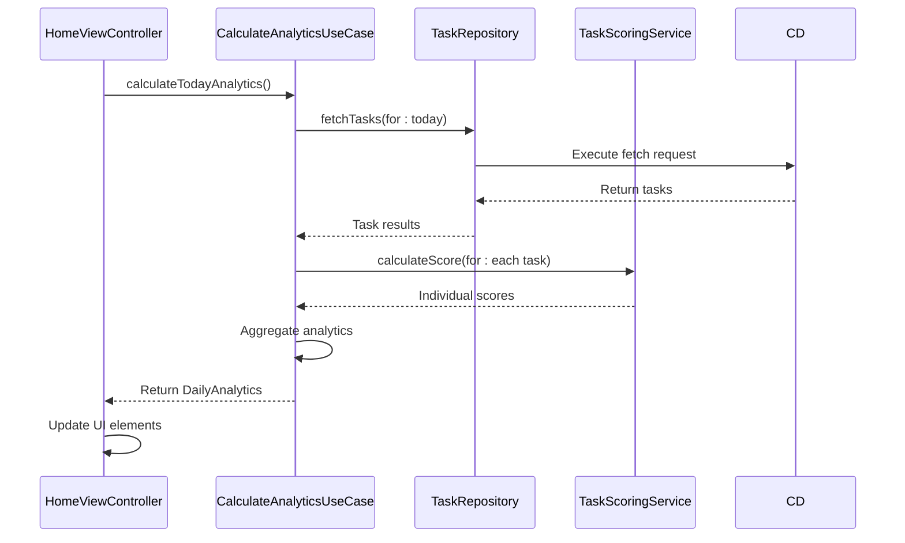

<docs>
# UI Integration and Score Display

<cite>
**Referenced Files in This Document**   
- [HomeViewController.swift](file://To%20Do%20List/ViewControllers/HomeViewController.swift) - *Updated to use CalculateAnalyticsUseCase*
- [TaskScoringService.swift](file://To%20Do%20List/Services/TaskScoringService.swift) - *Updated to use TaskPriorityConfig*
- [ChartCard.swift](file://To%20Do%20List/Views/Cards/ChartCard.swift)
- [HomeBackdropView.swift](file://To%20Do%20List/View/HomeBackdropView.swift)
- [AddTaskBackdropView.swift](file://To%20Do%20List/View/AddTaskBackdropView.swift)
- [CalculateAnalyticsUseCase.swift](file://To%20Do%20List/UseCases/Analytics/CalculateAnalyticsUseCase.swift) - *Added in recent commit*
- [TaskPriorityConfig.swift](file://To%20Do%20List/Domain/Models/TaskPriorityConfig.swift) - *Added in recent commit*
</cite>

## Update Summary
**Changes Made**   
- Updated score display integration to use new CalculateAnalyticsUseCase
- Added documentation for TaskPriorityConfig and centralized scoring
- Enhanced dependency injection details for analytics use case
- Updated code examples to reflect new scoring system
- Added new section for analytics use case integration
- Updated diagram to show new analytics use case flow
- Fixed outdated references to legacy scoring methods

## Table of Contents
1. [Introduction](#introduction)
2. [Score Update Lifecycle](#score-update-lifecycle)
3. [Analytics Use Case Integration](#analytics-use-case-integration)
4. [Dependency Injection and Service Integration](#dependency-injection-and-service-integration)
5. [UI Elements and Score Display](#ui-elements-and-score-display)
6. [Thread-Safe UI Updates](#thread-safe-ui-updates)
7. [Loading States and Error Handling](#loading-states-and-error-handling)
8. [Accessibility and Dynamic Type](#accessibility-and-dynamic-type)
9. [Animation Patterns](#animation-patterns)
10. [Real-Time Score Updates](#real-time-score-updates)
11. [Conclusion](#conclusion)

## Introduction
This document details the integration of scoring data into the user interface of the Tasker application, with a primary focus on the HomeViewController. It explains how score updates are triggered during view lifecycle events, how the CalculateAnalyticsUseCase is integrated, and how various UI elements display scoring information including daily score, streak, and efficiency metrics. The document also covers implementation details for thread-safe updates, error handling, accessibility, and animation patterns that enhance the user experience when scores change. Recent updates have introduced a new analytics use case pattern and centralized priority configuration system.

## Score Update Lifecycle

The HomeViewController implements a comprehensive score update system that is triggered at key points in the view lifecycle. The primary method responsible for score updates is `updateDailyScore()`, which is called from multiple lifecycle events to ensure the displayed score is always current.

The `viewDidAppear(_:)` method serves as a critical trigger point for score updates. When the view appears, the system refreshes the navigation pie chart and ensures any dummy table views are fixed, providing a clean slate for the updated score display. This lifecycle method guarantees that users see the most current score information whenever they navigate to the home screen.

Additional score update triggers include:
- `viewWillAppear(_:)` for pre-display preparation
- Calendar date changes via `updateDailyScore(for: date)`
- Task completion events through notification observers
- Manual refresh actions initiated by the user

These multiple entry points ensure that score calculations are performed whenever relevant data changes, maintaining data consistency across the application.

**Section sources**
- [HomeViewController.swift](file://To%20Do%20List/ViewControllers/HomeViewController.swift#L298)
- [HomeViewController.swift](file://To%20Do%20List/ViewControllers/HomeViewController.swift#L405)
- [HomeViewController.swift](file://To%20Do%20List/ViewControllers/HomeViewController.swift#L981)
- [HomeCalendarExtention.swift](file://To%20Do%20List/ViewControllers/Delegates/HomeCalendarExtention.swift#L200)

## Analytics Use Case Integration

The scoring system has been updated to use the new CalculateAnalyticsUseCase pattern, which provides a clean separation of concerns between data fetching, calculation, and presentation. This use case encapsulates all analytics functionality including daily score calculation, streak tracking, and productivity metrics.

The CalculateAnalyticsUseCase is initialized with dependencies including TaskRepositoryProtocol, TaskScoringServiceProtocol, and an optional CacheServiceProtocol. This dependency injection pattern allows for easy testing and swapping of implementations.

```swift
public final class CalculateAnalyticsUseCase {
    
    private let taskRepository: TaskRepositoryProtocol
    private let scoringService: TaskScoringServiceProtocol
    private let cacheService: CacheServiceProtocol?
    
    public init(
        taskRepository: TaskRepositoryProtocol,
        scoringService: TaskScoringServiceProtocol? = nil,
        cacheService: CacheServiceProtocol? = nil
    ) {
        self.taskRepository = taskRepository
        self.scoringService = scoringService ?? DefaultTaskScoringService()
        self.cacheService = cacheService
    }
}
```

The use case provides several methods for calculating different types of analytics:
- `calculateTodayAnalytics()` - Calculates analytics for the current day
- `calculateDailyAnalytics(for:)` - Calculates analytics for a specific date
- `calculateWeeklyAnalytics()` - Calculates weekly analytics with daily breakdown
- `calculateMonthlyAnalytics()` - Calculates monthly analytics with weekly breakdown
- `calculateStreak()` - Calculates current completion streak

These methods use a Result-based completion pattern to handle both success and failure cases, ensuring robust error handling.



**Diagram sources**
- [CalculateAnalyticsUseCase.swift](file://To%20Do%20List/UseCases/Analytics/CalculateAnalyticsUseCase.swift#L20-L150)
- [HomeViewController.swift](file://To%20Do%20List/ViewControllers/HomeViewController.swift#L981)

**Section sources**
- [CalculateAnalyticsUseCase.swift](file://To%20Do%20List/Use