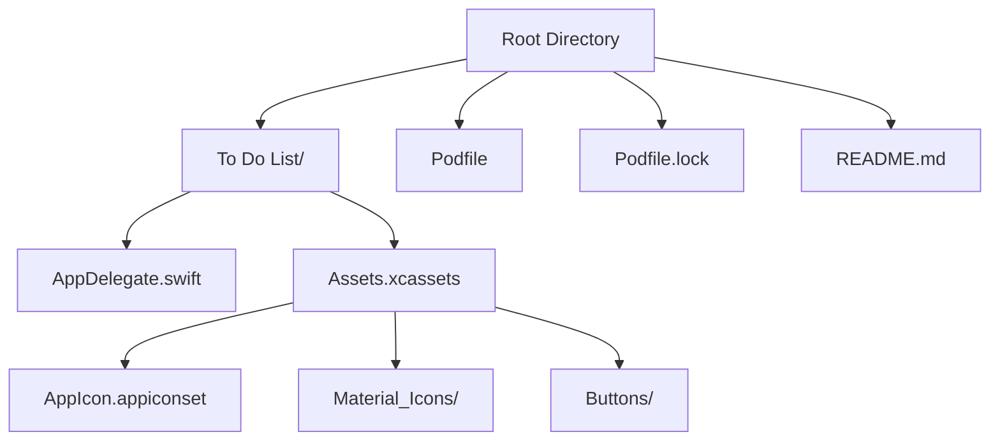
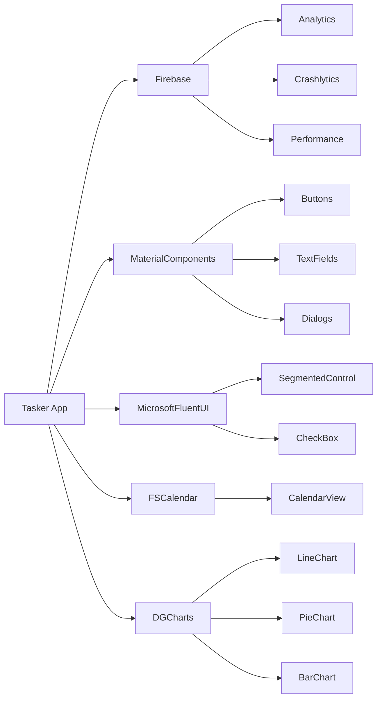
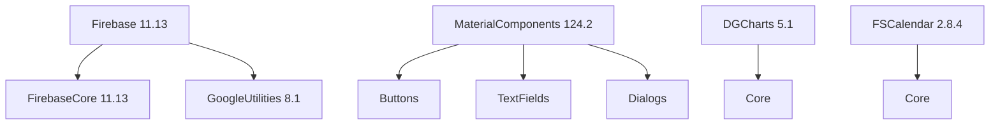

# Build & Dependency Management

<cite>
**Referenced Files in This Document**   
- [Podfile](file://Podfile#L1-L39)
- [Podfile.lock](file://Podfile.lock#L1-L1078)
- [AppDelegate.swift](file://To%20Do%20List/AppDelegate.swift#L1-L193)
- [README.md](file://README.md#L1-L1500)
</cite>

## Table of Contents
1. [Introduction](#introduction)
2. [Project Structure](#project-structure)
3. [Core Dependencies Overview](#core-dependencies-overview)
4. [Podfile Configuration](#podfile-configuration)
5. [Version Pinning and Compatibility](#version-pinning-and-compatibility)
6. [Integration with Xcode](#integration-with-xcode)
7. [Dependency Update Strategy](#dependency-update-strategy)
8. [Troubleshooting Common Issues](#troubleshooting-common-issues)
9. [App Size Optimization](#app-size-optimization)
10. [Security Considerations](#security-considerations)

## Introduction
This document provides a comprehensive overview of the build and dependency management system for the Tasker iOS application. The project uses CocoaPods as its primary dependency manager to integrate third-party libraries such as Firebase, MaterialComponents, MicrosoftFluentUI, DGCharts, and FSCalendar. The configuration ensures compatibility with iOS 16.0 and above, with a structured approach to versioning, integration, and maintenance. This guide details the Podfile setup, version strategies, Xcode integration, update procedures, troubleshooting, and security practices.

**Section sources**
- [Podfile](file://Podfile#L1-L39)
- [README.md](file://README.md#L1356-L1389)

## Project Structure
The project follows a modular architecture with clear separation between UI components, business logic, data models, and services. The root directory contains assets, configuration files, and documentation, while the main application code resides in the "To Do List" directory. Key structural elements include:
- **Assets.xcassets**: Contains all image assets including app icons and Material Design icons
- **Podfile and Podfile.lock**: Define and lock dependency versions
- **AppDelegate.swift**: Entry point for application initialization
- **README.md**: Contains high-level documentation on architecture and dependencies



**Diagram sources**
- [Podfile](file://Podfile#L1-L39)
- [README.md](file://README.md#L1449-L1500)

**Section sources**
- [Podfile](file://Podfile#L1-L39)
- [README.md](file://README.md#L1449-L1500)

## Core Dependencies Overview
The application relies on several key third-party libraries for analytics, UI components, and functionality:

### Firebase Suite
- **Firebase/Analytics**: User behavior tracking and event logging
- **Firebase/Crashlytics**: Real-time crash reporting and diagnostics
- **Firebase/Performance**: Application performance monitoring

### UI Frameworks
- **MaterialComponents**: Google's Material Design implementation for iOS
- **MicrosoftFluentUI**: Microsoft's design language components
- **FSCalendar**: Feature-rich calendar interface
- **DGCharts**: Advanced data visualization charts

### Utility Libraries
- **EasyPeasy**: Auto Layout helper
- **TinyConstraints**: Constraint management
- **Timepiece**: Date manipulation utilities
- **ViewAnimator**: View transition animations



**Diagram sources**
- [Podfile](file://Podfile#L1-L39)
- [README.md](file://README.md#L1035-L1055)

**Section sources**
- [Podfile](file://Podfile#L1-L39)
- [README.md](file://README.md#L1356-L1389)

## Podfile Configuration
The Podfile defines all external dependencies with specific version constraints and platform requirements.

### Platform Specification
```ruby
platform :ios, '16.0'
```
This sets the minimum iOS deployment target to version 16.0, ensuring compatibility with modern iOS features and security updates.

### Target Configuration
```ruby
target 'Tasker' do
  use_frameworks!
```
The `use_frameworks!` directive enables dynamic framework linking, which is required for Swift compatibility and reduces build times compared to static libraries.

### Firebase Dependencies
```ruby
pod 'Firebase/Analytics',   '~> 11.13'
pod 'Firebase/Crashlytics', '~> 11.13'
pod 'Firebase/Performance', '~> 11.13'
```
These subspecs provide modular Firebase functionality while sharing common core components.

### UI and Utility Dependencies
```ruby
pod 'MaterialComponents',      '~> 124.2'
pod 'MicrosoftFluentUI', '~> 0.33.2'
pod 'FSCalendar',              '~> 2.8.1'
pod 'DGCharts',                '~> 5.1'
```
These libraries provide comprehensive UI components following Google and Microsoft design guidelines.

### Post-Install Hook
```ruby
post_install do |installer|
  installer.pods_project.targets.each do |t|
    t.build_configurations.each do |c|
      c.build_settings['IPHONEOS_DEPLOYMENT_TARGET'] = '16.0'
    end
  end
end
```
This hook ensures all pods maintain the iOS 16.0 deployment target, preventing potential compatibility issues.

**Section sources**
- [Podfile](file://Podfile#L1-L39)

## Version Pinning and Compatibility
The project employs a strategic version pinning approach to balance stability and feature access.

### Version Constraint Strategy
The `~>` operator (known as "twiddle-wakka") is used throughout the Podfile:
- `~> 11.13` allows updates to 11.13.x but not 11.14 or higher
- This provides security patches and bug fixes while preventing breaking changes
- Ensures predictable dependency updates

### iOS Version Compatibility
Despite the Podfile specifying iOS 16.0, the README indicates a minimum supported version of iOS 13.0:
- **Build Target**: iOS 16.0 (for development and new features)
- **Minimum Supported**: iOS 13.0 (for broader device compatibility)
- This dual approach allows leveraging newer APIs while maintaining backward compatibility

### Dependency Tree Analysis
From Podfile.lock, we can see the complete dependency graph:
- Firebase 11.13.0 depends on FirebaseCore 11.13.0 and GoogleUtilities 8.1.0
- MaterialComponents 124.2.0 includes over 50 subspecs for individual components
- DGCharts 5.1.0 has no additional dependencies beyond its core module



**Diagram sources**
- [Podfile](file://Podfile#L1-L39)
- [Podfile.lock](file://Podfile.lock#L1-L1078)

**Section sources**
- [Podfile](file://Podfile#L1-L39)
- [Podfile.lock](file://Podfile.lock#L1-L1078)
- [README.md](file://README.md#L1402-L1411)

## Integration with Xcode
The CocoaPods integration with Xcode follows standard practices with proper initialization.

### Workspace Structure
CocoaPods generates a `.xcworkspace` file that contains:
- The main application project
- The Pods project with all dependency libraries
- Shared build settings and configurations

### Firebase Initialization
Firebase is configured in AppDelegate.swift:
```swift
import Firebase

func application(_ application: UIApplication, didFinishLaunchingWithOptions launchOptions: [UIApplication.LaunchOptionsKey: Any]?) -> Bool {
    FirebaseApp.configure()
    // ... other initialization code
    return true
}
```
This single call initializes all Firebase services specified in the Podfile.

### Build Phases
The integration automatically adds necessary build phases:
- **Copy Pods Resources**: Copies asset catalogs and resource bundles
- **Embed Pods Frameworks**: Embeds dynamic frameworks into the app bundle
- No manual configuration is required due to CocoaPods automation

**Section sources**
- [AppDelegate.swift](file://To%20Do%20List/AppDelegate.swift#L1-L193)
- [Podfile](file://Podfile#L1-L39)

## Dependency Update Strategy
The project maintains a safe and controlled approach to dependency updates.

### Safe Update Procedure
1. **Check for Updates**: Run `pod outdated` to see available updates
2. **Review Changelogs**: Examine release notes for breaking changes
3. **Update Dependencies**: Run `pod update` to update to latest compatible versions
4. **Verify Build**: Ensure the project compiles successfully
5. **Test Functionality**: Validate all features, especially those using updated libraries

### Handling Breaking Changes
When major version updates are required:
- Create a feature branch for the update
- Update one dependency at a time
- Address deprecation warnings and API changes
- Run comprehensive tests before merging

### Lock File Importance
Podfile.lock ensures reproducible builds by:
- Recording exact versions of all dependencies
- Preventing unexpected updates in CI/CD environments
- Allowing team members to use identical dependency versions

**Section sources**
- [Podfile](file://Podfile#L1-L39)
- [Podfile.lock](file://Podfile.lock#L1-L1078)

## Troubleshooting Common Issues
This section addresses frequent CocoaPods-related problems and their solutions.

### Installation Failures
**Symptom**: `pod install` fails with network or permission errors
**Solution**:
- Clear CocoaPods cache: `pod cache clean --all`
- Update local specs: `pod repo update`
- Use verbose mode: `pod install --verbose`
- Check network connectivity and firewall settings

### Linking Errors
**Symptom**: "Symbol not found" or "Undefined symbols" during linking
**Solution**:
- Clean build folder: `Product > Clean Build Folder`
- Delete derived data
- Ensure `use_frameworks!` is present in Podfile
- Verify all targets have correct search paths

### Version Conflicts
**Symptom**: Incompatible dependency versions
**Solution**:
- Run `pod deintegrate` followed by `pod install`
- Check for multiple Podfile.lock files
- Ensure all team members use the same CocoaPods version
- Resolve conflicts by updating Podfile constraints

### Firebase-Specific Issues
**Symptom**: Firebase not initializing
**Solution**:
- Verify GoogleService-Info.plist is in the project
- Check bundle identifier matches Firebase project
- Ensure FirebaseApp.configure() is called in didFinishLaunching
- Validate CocoaPods installation with `pod install`

**Section sources**
- [Podfile](file://Podfile#L1-L39)
- [AppDelegate.swift](file://To%20Do%20List/AppDelegate.swift#L1-L193)

## App Size Optimization
The project employs several strategies to minimize app bundle size.

### Selective Subspecs
Instead of importing entire libraries, specific subspecs are used:
- `Firebase/Analytics` instead of full Firebase
- Individual MaterialComponents subspecs rather than the complete suite
- This reduces binary size by excluding unused functionality

### Unused Dependency Removal
Regular audit of dependencies to remove unused libraries:
- Check import statements across the codebase
- Remove pods that are no longer referenced
- Use tools like `slather` to identify unused code

### Image Asset Optimization
- Use xcassets for proper image scaling
- Remove duplicate or unused images
- Compress PNGs and use appropriate formats

### Framework vs Static Library
Using `use_frameworks!` enables:
- Better build times through incremental compilation
- Reduced binary size through dead code elimination
- Easier debugging with dSYM files

**Section sources**
- [Podfile](file://Podfile#L1-L39)
- [README.md](file://README.md#L1356-L1389)

## Security Considerations
The project addresses security concerns related to third-party dependencies.

### Vulnerability Scanning
Regular checks for known vulnerabilities:
- Use `bundle exec pod outdated` to identify outdated dependencies
- Integrate with security tools like Snyk or GitHub Dependabot
- Monitor for security advisories related to used libraries

### Firebase Security
- Analytics data collection follows privacy best practices
- Crash reports are anonymized
- Performance monitoring does not capture sensitive data
- App Transport Security (ATS) is enforced for network requests

### Code Review Practices
- All new dependencies require team approval
- Security implications are considered during library selection
- Regular dependency audits are performed
- Minimum iOS version ensures security patch availability

### Supply Chain Security
- Podfile.lock prevents dependency version drift
- Use official pods from trusted sources
- Verify podspecs before installation
- Monitor for compromised or abandoned libraries

**Section sources**
- [Podfile](file://Podfile#L1-L39)
- [Podfile.lock](file://Podfile.lock#L1-L1078)
- [README.md](file://README.md#L1402-L1411)