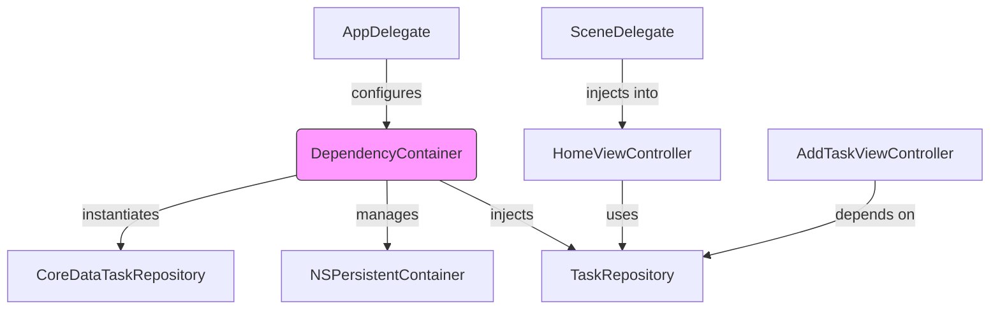
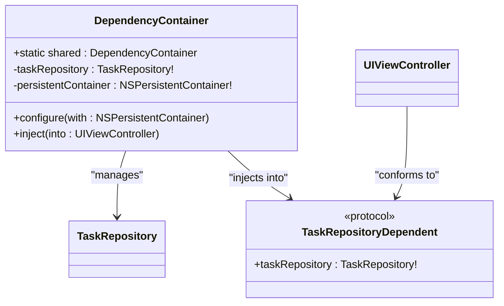
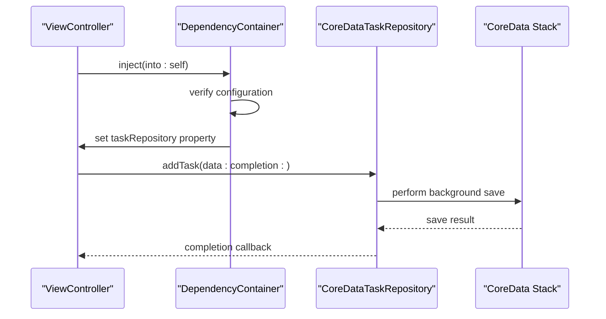
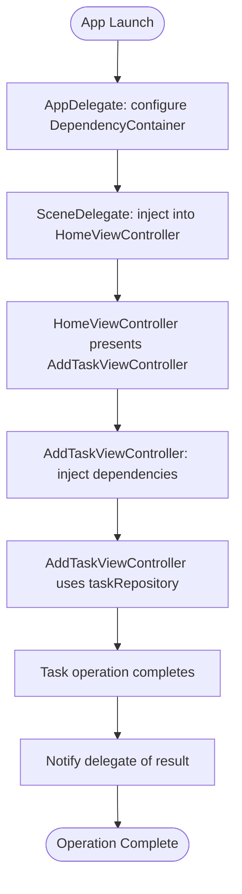

# Dependency Injection Container

<cite>
**Referenced Files in This Document**   
- [DependencyContainer.swift](file://To%20Do%20List/Managers/DependencyContainer.swift)
- [AppDelegate.swift](file://To%20Do%20List/AppDelegate.swift)
- [SceneDelegate.swift](file://To%20Do%20List/SceneDelegate.swift)
- [AddTaskViewController.swift](file://To%20Do%20List/ViewControllers/AddTaskViewController.swift)
- [HomeViewController.swift](file://To%20Do%20List/ViewControllers/HomeViewController.swift)
- [CoreDataTaskRepository.swift](file://To%20Do%20List/Repositories/CoreDataTaskRepository.swift)
- [TaskRepository.swift](file://To%20Do%20List/Repositories/TaskRepository.swift)
</cite>

## Table of Contents
1. [Introduction](#introduction)
2. [Architecture Overview](#architecture-overview)
3. [Core Components](#core-components)
4. [Detailed Component Analysis](#detailed-component-analysis)
5. [Dependency Resolution Flow](#dependency-resolution-flow)
6. [Service Lifecycle Management](#service-lifecycle-management)
7. [Testing and Mock Injection](#testing-and-mock-injection)
8. [Common Issues and Solutions](#common-issues-and-solutions)
9. [Best Practices](#best-practices)
10. [Conclusion](#conclusion)

## Introduction

The DependencyContainer class serves as the central dependency injection mechanism in the Tasker application, providing a structured approach to service instantiation and object lifecycle management. This container pattern replaces direct singleton access with a more controlled and testable dependency management system, enabling better separation of concerns and improved code maintainability. The container acts as a registry for application services, allowing components to declare their dependencies without knowing the concrete implementation details.

**Section sources**
- [DependencyContainer.swift](file://To%20Do%20List/Managers/DependencyContainer.swift#L1-L80)

## Architecture Overview

The DependencyContainer implements a singleton pattern with lazy initialization, ensuring a single instance manages all application dependencies. It integrates with the Core Data stack during application startup and provides dependency injection capabilities to view controllers throughout the app lifecycle. The container follows a configuration-over-convention approach, requiring explicit setup before use, which enhances predictability and reduces runtime errors.



**Diagram sources**
- [DependencyContainer.swift](file://To%20Do%20List/Managers/DependencyContainer.swift#L1-L80)
- [AppDelegate.swift](file://To%20Do%20List/AppDelegate.swift#L1-L192)

## Core Components

The DependencyContainer system comprises several key components that work together to provide dependency injection capabilities. The container itself manages service instances, while the TaskRepository protocol defines the interface for data access operations. View controllers declare their dependency on services through protocol conformance, enabling the container to perform property injection using runtime reflection.

**Section sources**
- [DependencyContainer.swift](file://To%20Do%20List/Managers/DependencyContainer.swift#L1-L80)
- [TaskRepository.swift](file://To%20Do%20List/Repositories/TaskRepository.swift#L1-L117)

## Detailed Component Analysis

### DependencyContainer Analysis

The DependencyContainer class implements a thread-safe singleton pattern with private initialization, ensuring only one instance exists throughout the application lifecycle. It provides methods for configuration and dependency injection, with comprehensive logging to aid debugging and monitoring.

#### Class Diagram


**Diagram sources**
- [DependencyContainer.swift](file://To%20Do%20List/Managers/DependencyContainer.swift#L1-L80)

**Section sources**
- [DependencyContainer.swift](file://To%20Do%20List/Managers/DependencyContainer.swift#L1-L80)

### TaskRepository Implementation

The CoreDataTaskRepository provides a concrete implementation of the TaskRepository protocol, using Core Data for persistence. It employs a dual-context strategy with separate view and background contexts to ensure thread safety and optimal performance.

#### Sequence Diagram


**Diagram sources**
- [CoreDataTaskRepository.swift](file://To%20Do%20List/Repositories/CoreDataTaskRepository.swift#L1-L454)
- [TaskRepository.swift](file://To%20Do%20List/Repositories/TaskRepository.swift#L1-L117)

**Section sources**
- [CoreDataTaskRepository.swift](file://To%20Do%20List/Repositories/CoreDataTaskRepository.swift#L1-L454)
- [TaskRepository.swift](file://To%20Do%20List/Repositories/TaskRepository.swift#L1-L117)

## Dependency Resolution Flow

The dependency resolution process begins at application launch and continues throughout the app lifecycle. The container is configured with essential services and then used to inject dependencies into view controllers as they are instantiated.

#### Flowchart


**Diagram sources**
- [AppDelegate.swift](file://To%20Do%20List/AppDelegate.swift#L1-L192)
- [SceneDelegate.swift](file://To%20Do%20List/SceneDelegate.swift#L1-L71)

**Section sources**
- [AppDelegate.swift](file://To%20Do%20List/AppDelegate.swift#L1-L192)
- [SceneDelegate.swift](file://To%20Do%20List/SceneDelegate.swift#L1-L71)

## Service Lifecycle Management

The DependencyContainer manages service lifecycles through a combination of singleton patterns and controlled instantiation. Services are created during container configuration and persist for the application lifetime, ensuring consistent state and reducing instantiation overhead.

### Registration Patterns

Services are registered through the configure method, which accepts the Core Data persistent container and initializes dependent services:

```swift
func configure(with container: NSPersistentContainer) {
    self.persistentContainer = container
    self.taskRepository = CoreDataTaskRepository(container: container)
}
```

This approach ensures all services are properly initialized before use and maintains a clear dependency graph.

### Retrieval Patterns

Services are retrieved through property injection into view controllers:

```swift
func inject(into viewController: UIViewController) {
    if let dependentVC = viewController as? TaskRepositoryDependent {
        dependentVC.taskRepository = taskRepository
    }
}
```

The container uses protocol conformance to identify dependent components and inject services via reflection.

**Section sources**
- [DependencyContainer.swift](file://To%20Do%20List/Managers/DependencyContainer.swift#L1-L80)

## Testing and Mock Injection

The dependency injection pattern significantly improves testability by allowing mock implementations to be injected during unit tests. The TaskRepository protocol enables substitution of the concrete implementation with test doubles that simulate various scenarios.

### Test Example

```swift
class MockTaskRepository: TaskRepository {
    var addTaskCalled = false
    var addTaskCompletion: ((Result<NTask, Error>) -> Void)?
    
    func addTask(data: TaskData, completion: ((Result<NTask, Error>) -> Void)?) {
        addTaskCalled = true
        addTaskCompletion = completion
    }
}
```

During testing, the mock repository can be injected directly or through the container, allowing comprehensive testing of view controller logic without relying on persistent storage.

**Section sources**
- [TaskRepository.swift](file://To%20Do%20List/Repositories/TaskRepository.swift#L1-L117)
- [AddTaskViewController.swift](file://To%20Do%20List/ViewControllers/AddTaskViewController.swift#L1-L517)

## Common Issues and Solutions

### Service Override Conflicts

The current implementation does not support service overrides, which could lead to conflicts if multiple components attempt to reconfigure the container. The singleton nature prevents reconfiguration after initial setup.

**Solution**: Implement a validation check in the configure method to prevent multiple configurations:

```swift
guard persistentContainer == nil else {
    print("⚠️ DependencyContainer already configured")
    return
}
```

### Memory Leaks from Strong References

The container maintains strong references to all services, which could contribute to memory leaks if not managed properly. View controllers also maintain strong references to injected services.

**Solution**: Consider using weak references for service properties in view controllers or implementing a deinitialization pattern to break reference cycles.

### Initialization Order Dependencies

The container requires explicit configuration before use, creating initialization order dependencies. Accessing services before configuration results in nil values and potential crashes.

**Solution**: Implement a defensive programming approach with fallback mechanisms:

```swift
if taskRepository == nil {
    DependencyContainer.shared.inject(into: self)
}
```

**Section sources**
- [DependencyContainer.swift](file://To%20Do%20List/Managers/DependencyContainer.swift#L1-L80)
- [AddTaskViewController.swift](file://To%20Do%20List/ViewControllers/AddTaskViewController.swift#L1-L517)

## Best Practices

### Registering New Services

When adding new services to the container:

1. Define a protocol for the service interface
2. Add the service property to DependencyContainer
3. Initialize the service in the configure method
4. Create a dependent protocol for injection targets
5. Update relevant view controllers to conform to the dependent protocol

### Avoiding Circular Dependencies

To prevent circular dependencies:

- Use protocol-oriented design to break direct dependencies
- Implement lazy loading for interdependent services
- Consider using dependency inversion for complex relationships
- Regularly review the dependency graph for potential cycles

### Performance Considerations

The current implementation performs reflection at injection time, which has performance implications. For optimal performance:

- Cache reflection results when possible
- Minimize the number of injected dependencies per component
- Consider using constructor injection for critical paths
- Profile injection performance during application startup

**Section sources**
- [DependencyContainer.swift](file://To%20Do%20List/Managers/DependencyContainer.swift#L1-L80)
- [TaskRepository.swift](file://To%20Do%20List/Repositories/TaskRepository.swift#L1-L117)

## Conclusion

The DependencyContainer provides a robust foundation for dependency management in the Tasker application, enabling better code organization, improved testability, and enhanced maintainability. By centralizing service instantiation and providing a clear injection mechanism, it addresses many of the limitations of direct singleton access. The container's integration with the application lifecycle ensures services are available when needed, while its protocol-based design supports future extensibility. Continued refinement of the injection patterns and lifecycle management will further enhance the architecture's resilience and performance.