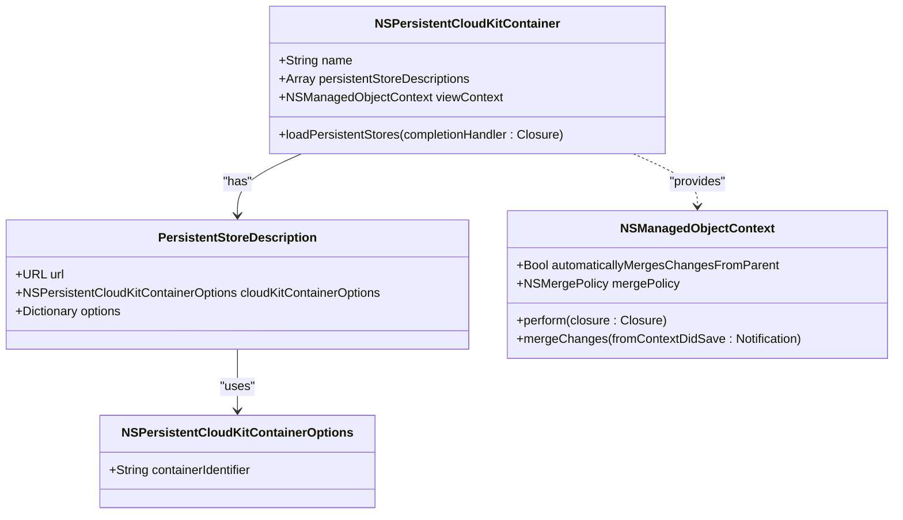
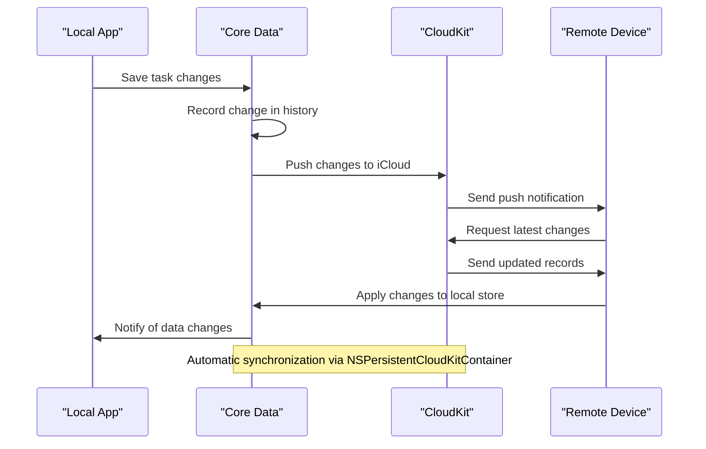
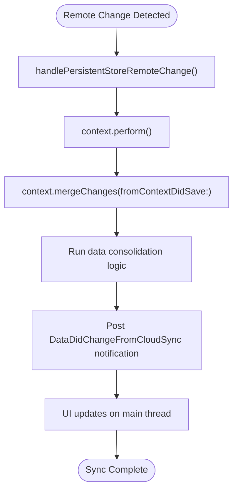

# Cloud Synchronization

<cite>
**Referenced Files in This Document**   
- [AppDelegate.swift](file://To%20Do%20List/AppDelegate.swift#L1-L192)
- [NTask+CoreDataProperties.swift](file://To%20Do%20List/NTask+CoreDataProperties.swift#L1-L53)
- [CoreDataTaskRepository.swift](file://To%20Do%20List/Repositories/CoreDataTaskRepository.swift#L1-L454)
</cite>

## Table of Contents
1. [Introduction](#introduction)
2. [Core Data and CloudKit Integration Overview](#core-data-and-cloudkit-integration-overview)
3. [NSPersistentCloudKitContainer Configuration](#nspersistentcloudkitcontainer-configuration)
4. [CloudKit Container and Ubiquity Setup](#cloudkit-container-and-ubiquity-setup)
5. [Synchronization Mechanism](#synchronization-mechanism)
6. [Remote Change Handling](#remote-change-handling)
7. [Background Sync and Push Notifications](#background-sync-and-push-notifications)
8. [Conflict Resolution Strategy](#conflict-resolution-strategy)
9. [CloudKit Event Monitoring](#cloudkit-event-monitoring)
10. [Common Issues and Debugging](#common-issues-and-debugging)
11. [Performance Considerations](#performance-considerations)
12. [Conclusion](#conclusion)

## Introduction
This document provides a comprehensive overview of how Tasker implements iCloud synchronization using Apple's NSPersistentCloudKitContainer framework. The integration enables seamless, automatic synchronization of task data across all user devices through CloudKit, leveraging Core Data's built-in cloud capabilities. The implementation ensures that local changes are pushed to iCloud and remote changes are pulled automatically, maintaining data consistency without requiring manual intervention.

## Core Data and CloudKit Integration Overview
Tasker utilizes NSPersistentCloudKitContainer to bridge Core Data and CloudKit, enabling automatic synchronization of task entities across devices. This integration transforms a standard Core Data stack into a cloud-backed persistent container that manages the bidirectional flow of data between local storage and iCloud. The system handles record creation, updates, deletions, and conflict resolution transparently, allowing developers to work primarily with Core Data APIs while CloudKit manages the underlying synchronization infrastructure.

**Section sources**
- [AppDelegate.swift](file://To%20Do%20List/AppDelegate.swift#L1-L192)

## NSPersistentCloudKitContainer Configuration
The persistent container is lazily initialized in AppDelegate as an NSPersistentCloudKitContainer instance named "TaskModel". This configuration automatically sets up both the Core Data stack and CloudKit integration. The container is configured with specific options to enable history tracking and remote change notifications, which are essential for robust synchronization.

Key configuration steps include:
- Setting the CloudKit container identifier to "iCloud.TaskerCloudKit"
- Enabling NSPersistentHistoryTrackingKey for change history
- Activating NSPersistentStoreRemoteChangeNotificationPostOptionKey for remote change events
- Configuring the view context to automatically merge changes from parent contexts

**Diagram sources**
- [AppDelegate.swift](file://To%20Do%20List/AppDelegate.swift#L100-L150)

**Section sources**
- [AppDelegate.swift](file://To%20Do%20List/AppDelegate.swift#L100-L150)

## CloudKit Container and Ubiquity Setup
The CloudKit container is configured with the identifier "iCloud.TaskerCloudKit", which must be registered in the Apple Developer portal and properly configured in the app's entitlements. This identifier establishes the namespace for all CloudKit records and ensures they are synchronized within the correct iCloud container.

Ubiquity is enabled through the persistent store description's cloudKitContainerOptions property. When the container loads its persistent stores, it automatically establishes the ubiquity relationship and begins monitoring for changes. The system creates corresponding CloudKit records for each Core Data entity, maintaining a mapping between local managed objects and their cloud counterparts.

**Section sources**
- [AppDelegate.swift](file://To%20Do%20List/AppDelegate.swift#L115-L125)

## Synchronization Mechanism
Tasker's synchronization mechanism operates automatically through the NSPersistentCloudKitContainer infrastructure. Local changes made to tasks are automatically pushed to iCloud, while changes from other devices are pulled and merged into the local store. The process works as follows:

1. Local changes are saved to the persistent store
2. Core Data's history tracking captures the changes
3. NSPersistentCloudKitContainer detects changes and creates CloudKit operations
4. Changes are uploaded to iCloud in the background
5. Remote devices receive push notifications about changes
6. Remote devices download changes and update their local stores

**Diagram sources**
- [AppDelegate.swift](file://To%20Do%20List/AppDelegate.swift#L100-L150)
- [CoreDataTaskRepository.swift](file://To%20Do%20List/Repositories/CoreDataTaskRepository.swift#L50-L70)

**Section sources**
- [AppDelegate.swift](file://To%20Do%20List/AppDelegate.swift#L100-L150)
- [CoreDataTaskRepository.swift](file://To%20Do%20List/Repositories/CoreDataTaskRepository.swift#L50-L70)

## Remote Change Handling
The application observes NSPersistentStoreRemoteChange notifications to handle changes that originate from other devices. When a remote change is detected, the view context merges the changes from the parent context, ensuring the UI reflects the latest data. This notification is posted automatically by Core Data when changes from iCloud are processed.

The handlePersistentStoreRemoteChange method performs several critical functions:
- Merges changes into the main context on the appropriate queue
- Triggers data consolidation logic to fix any missing project or task data
- Posts custom notifications to inform the repository system of data changes
- Ensures UI components are updated to reflect synchronized data

**Diagram sources**
- [AppDelegate.swift](file://To%20Do%20List/AppDelegate.swift#L155-L190)

**Section sources**
- [AppDelegate.swift](file://To%20Do%20List/AppDelegate.swift#L155-L190)

## Background Sync and Push Notifications
To enable silent push notifications for CloudKit changes, the application registers for remote notifications during launch. This allows the app to be woken up in the background when changes occur on other devices, ensuring timely synchronization even when the app is not actively running.

The background synchronization process is fully managed by NSPersistentCloudKitContainer, which:
- Automatically downloads changes when the app is launched or backgrounded
- Processes CloudKit zone updates and record changes
- Maintains local caches of cloud data to minimize network usage
- Handles authentication and account status changes transparently

**Section sources**
- [AppDelegate.swift](file://To%20Do%20List/AppDelegate.swift#L35-L40)
- [AppDelegate.swift](file://To%20Do%20List/AppDelegate.swift#L155-L190)

## Conflict Resolution Strategy
Tasker employs NSMergeByPropertyStoreTrumpMergePolicy as its merge strategy, which means that when conflicts occur between local and remote changes, the values from the persistent store (typically the most recent) take precedence over the current context values. This policy helps prevent data loss during concurrent edits across devices.

The system automatically detects conflicts during the merge process and applies the merge policy to resolve them. For task data, this typically means that the most recently saved change will be preserved. The application also runs data consolidation logic after every sync operation to ensure data integrity and fix any missing default values.

**Section sources**
- [AppDelegate.swift](file://To%20Do%20List/AppDelegate.swift#L145-L148)

## CloudKit Event Monitoring
For debugging and monitoring purposes, the application observes NSPersistentCloudKitContainer.eventChangedNotification. This notification provides detailed information about CloudKit operations, including:
- Record imports and exports
- Zone synchronization status
- Error conditions and retry attempts
- Network activity and progress

Each event is logged to the console with its type and any associated errors, providing valuable insight into the synchronization process during development and troubleshooting.

**Section sources**
- [AppDelegate.swift](file://To%20Do%20List/AppDelegate.swift#L60-L95)

## Common Issues and Debugging
Several common issues may arise with CloudKit synchronization:

**NSPersistentStoreRemoteChange Handling**: Ensure the notification observer is properly set up in AppDelegate and that changes are merged on the correct context queue to avoid threading issues.

**Account Status Checking**: The app should verify that the user is signed in to iCloud and has sufficient permissions for the CloudKit container. This can be checked using CKContainer's accountStatus APIs.

**Debugging Sync Problems**: Use the CloudKit Dashboard to inspect records, zones, and subscriptions. Enable detailed logging in AppDelegate to monitor CloudKit events and errors.

**Entitlements Configuration**: Verify that the CloudKit container identifier matches exactly between the code, entitlements file, and Apple Developer account.

**Section sources**
- [AppDelegate.swift](file://To%20Do%20List/AppDelegate.swift#L60-L95)
- [AppDelegate.swift](file://To%20Do%20List/AppDelegate.swift#L155-L190)

## Performance Considerations
When dealing with large datasets, consider the following performance optimizations:

**Minimize Data Transfer**: Only sync essential task properties and avoid storing large binary data in CloudKit. Use references to external files when possible.

**Batch Processing**: For bulk operations, use background contexts and batch saves to reduce memory usage and improve efficiency.

**Fetch Request Optimization**: Use appropriate predicates and sort descriptors to limit the amount of data fetched from the persistent store.

**Context Management**: Use dedicated background contexts for heavy operations to prevent blocking the main thread and affecting UI responsiveness.

**Change Monitoring**: Be selective about which changes trigger UI updates to avoid unnecessary refreshes.

The current implementation already incorporates several best practices, including using background contexts for repository operations and configuring automatic merging of changes.

**Section sources**
- [CoreDataTaskRepository.swift](file://To%20Do%20List/Repositories/CoreDataTaskRepository.swift#L1-L454)
- [AppDelegate.swift](file://To%20Do%20List/AppDelegate.swift#L140-L148)

## Conclusion
Tasker's CloudKit integration provides a robust, automatic synchronization system for task data across devices. By leveraging NSPersistentCloudKitContainer, the application achieves seamless iCloud integration with minimal custom code. The implementation properly configures the persistent container, handles remote changes, monitors synchronization events, and resolves conflicts automatically. With proper debugging tools and performance considerations in place, this architecture provides a reliable foundation for cross-device data consistency.