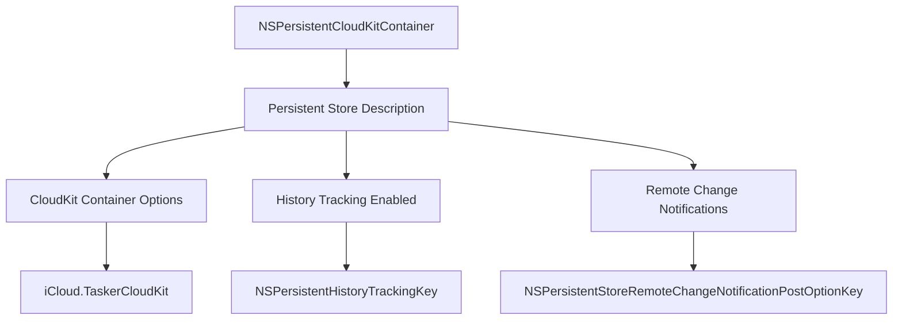
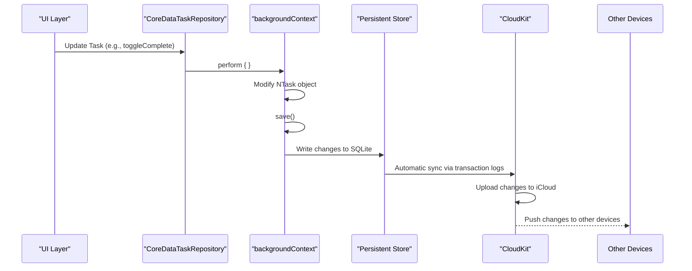
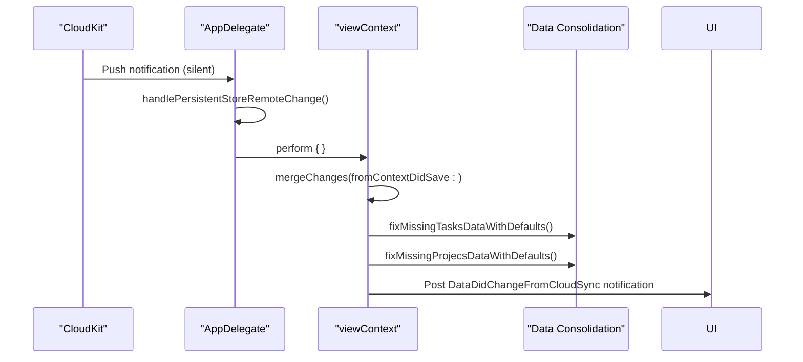

# Data Synchronization Mechanism

<cite>
**Referenced Files in This Document**   
- [CoreDataTaskRepository.swift](file://To%20Do%20List/Repositories/CoreDataTaskRepository.swift)
- [AppDelegate.swift](file://To%20Do%20List/AppDelegate.swift)
- [TaskRepository.swift](file://To%20Do%20List/Repositories/TaskRepository.swift)
- [TaskData.swift](file://To%20Do%20List/Models/TaskData.swift)
- [NTask+CoreDataProperties.swift](file://To%20Do%20List/NTask+CoreDataProperties.swift)
- [TaskManager.swift](file://To%20Do%20List/ViewControllers/TaskManager.swift)
</cite>

## Table of Contents
1. [Introduction](#introduction)
2. [Core Data Stack Configuration](#core-data-stack-configuration)
3. [Local Change Propagation Flow](#local-change-propagation-flow)
4. [Remote Change Handling](#remote-change-handling)
5. [Context Management and Concurrency](#context-management-and-concurrency)
6. [NSPersistentHistoryTracking and Transaction Logs](#nspersistenthistorytracking-and-transaction-logs)
7. [Error Handling and Data Integrity](#error-handling-and-data-integrity)
8. [Common Synchronization Pitfalls](#common-synchronization-pitfalls)
9. [Conclusion](#conclusion)

## Introduction
The Tasker application implements a robust data synchronization mechanism using Core Data's integration with CloudKit to ensure seamless task data consistency across devices. This document details the architecture and implementation of the synchronization system, focusing on how local changes are propagated to iCloud and how remote changes are merged into the local context. The system leverages NSPersistentCloudKitContainer, background contexts, change tracking, and remote change notifications to provide a reliable, offline-first experience with automatic cloud synchronization.

## Core Data Stack Configuration
The synchronization mechanism is built upon a properly configured NSPersistentCloudKitContainer that enables both CloudKit integration and advanced sync features. The container is initialized with specific options to support real-time synchronization and conflict resolution.



**Diagram sources**  
- [AppDelegate.swift](file://To%20Do%20List/AppDelegate.swift#L145-L175)

**Section sources**  
- [AppDelegate.swift](file://To%20Do%20List/AppDelegate.swift#L145-L175)

## Local Change Propagation Flow
The flow from UI interaction to cloud synchronization follows a structured path through Core Data's stack, ensuring thread safety and reliable persistence. When a user interacts with the UI to modify a task, the change flows through multiple contexts before being uploaded to iCloud.



**Diagram sources**  
- [CoreDataTaskRepository.swift](file://To%20Do%20List/Repositories/CoreDataTaskRepository.swift#L100-L130)
- [AppDelegate.swift](file://To%20Do%20List/AppDelegate.swift#L145-L175)

**Section sources**  
- [CoreDataTaskRepository.swift](file://To%20Do%20List/Repositories/CoreDataTaskRepository.swift#L100-L130)
- [AppDelegate.swift](file://To%20Do%20List/AppDelegate.swift#L145-L175)

## Remote Change Handling
When changes occur on other devices, CloudKit pushes notifications to the device, triggering the merging of remote changes into the local context. The system listens for NSPersistentStoreRemoteChange notifications and processes them to update the local data.



**Diagram sources**  
- [AppDelegate.swift](file://To%20Do%20List/AppDelegate.swift#L200-L230)

**Section sources**  
- [AppDelegate.swift](file://To%20Do%20List/AppDelegate.swift#L200-L230)

## Context Management and Concurrency
The synchronization system employs a multi-context architecture to ensure thread safety and prevent UI blocking during data operations. Two primary contexts are used: a view context for UI operations and a background context for data modifications.

```mermaid
classDiagram
class CoreDataTaskRepository {
-viewContext : NSManagedObjectContext
-backgroundContext : NSManagedObjectContext
+fetchTasks()
+addTask()
+toggleComplete()
+deleteTask()
+reschedule()
+updateTask()
+saveTask()
}
class NSManagedObjectContext {
+perform(block : ())
+performAndWait(block : ())
+automaticallyMergesChangesFromParent : Bool
+mergePolicy : NSMergePolicy
}
CoreDataTaskRepository --> NSManagedObjectContext : "uses"
CoreDataTaskRepository ..> "viewContext" : "read operations"
CoreDataTaskRepository ..> "backgroundContext" : "write operations"
class AppDelegate {
-persistentContainer : NSPersistentCloudKitContainer
+handlePersistentStoreRemoteChange()
}
AppDelegate --> CoreDataTaskRepository : "coordinates"
AppDelegate --> NSManagedObjectContext : "manages"
```

**Diagram sources**  
- [CoreDataTaskRepository.swift](file://To%20Do%20List/Repositories/CoreDataTaskRepository.swift#L15-L50)
- [AppDelegate.swift](file://To%20Do%20List/AppDelegate.swift#L145-L175)

**Section sources**  
- [CoreDataTaskRepository.swift](file://To%20Do%20List/Repositories/CoreDataTaskRepository.swift#L15-L50)
- [AppDelegate.swift](file://To%20Do%20List/AppDelegate.swift#L145-L175)

## NSPersistentHistoryTracking and Transaction Logs
The system enables NSPersistentHistoryTracking to maintain a detailed history of changes, which is critical for robust synchronization and conflict resolution. This feature works in conjunction with CloudKit's transaction logs to ensure data integrity across devices.

The persistent store description is configured with history tracking enabled, which allows Core Data to generate transaction logs for every change. These logs are automatically synchronized with CloudKit and can be queried to understand the change history. This mechanism provides several benefits:

- **Conflict Resolution**: When conflicts occur between devices, the system can analyze the transaction history to determine the most appropriate resolution.
- **Change Auditing**: Developers can inspect the history of changes for debugging and analytics purposes.
- **Selective Sync**: Applications can query for changes that occurred within specific time ranges.
- **Data Recovery**: In case of data corruption, the transaction history can be used to reconstruct the data state.

The transaction processing follows this flow:
1. Local changes are saved to the persistent store
2. Core Data generates transaction logs with NSPersistentHistoryTracking
3. NSPersistentCloudKitContainer monitors these transactions
4. Transactions are packaged and uploaded to CloudKit
5. CloudKit distributes transactions to other devices
6. Remote devices apply transactions to their local stores

**Section sources**  
- [AppDelegate.swift](file://To%20Do%20List/AppDelegate.swift#L165-L170)

## Error Handling and Data Integrity
The synchronization mechanism includes comprehensive error handling and data integrity checks to ensure reliability. When changes are merged from remote stores, the system performs post-sync validation and cleanup to maintain data consistency.

After merging remote changes, the system calls consolidation logic to fix any data inconsistencies:

```mermaid
flowchart TD
A[Remote Change Notification] --> B[handlePersistentStoreRemoteChange]
B --> C[mergeChanges(fromContextDidSave:)]
C --> D[fixMissingTasksDataWithDefaults]
D --> E[fixMissingProjecsDataWithDefaults]
E --> F[Post DataDidChangeFromCloudSync]
F --> G[UI Updates]
C --> H{Merge Errors?}
H --> |Yes| I[Log Error: "⛔️ error:"]
H --> |No| J[Continue Processing]
```

**Diagram sources**  
- [AppDelegate.swift](file://To%20Do%20List/AppDelegate.swift#L200-L230)

**Section sources**  
- [AppDelegate.swift](file://To%20Do%20List/AppDelegate.swift#L200-L230)

## Common Synchronization Pitfalls
Despite the robust architecture, several common pitfalls can affect the synchronization system. Understanding these issues is critical for maintaining a reliable user experience.

### Missed Change Notifications
Missed change notifications can occur when the app is terminated during a sync operation or when network connectivity is unstable. The system mitigates this through:
- Local-first architecture ensuring data is always available
- Automatic resumption of sync when the app becomes active
- Periodic background fetch to check for missed changes

### Delayed Sync
Sync delays can happen due to network conditions or CloudKit throttling. The system handles this by:
- Providing immediate local feedback to users
- Displaying sync status indicators
- Implementing exponential backoff for retry logic

### Large Batch Updates
Processing large numbers of changes can impact performance. The system addresses this through:
- Background context operations to prevent UI blocking
- Batch processing of changes
- Efficient fetching with predicates and sort descriptors

### Conflict Resolution
Conflicts are handled through the configured merge policy:
- **NSMergeByPropertyStoreTrumpMergePolicy**: Remote changes override local changes for conflicting properties
- Post-sync consolidation to resolve application-level inconsistencies
- User-facing conflict resolution when necessary

**Section sources**  
- [CoreDataTaskRepository.swift](file://To%20Do%20List/Repositories/CoreDataTaskRepository.swift#L50-L100)
- [AppDelegate.swift](file://To%20Do%20List/AppDelegate.swift#L200-L230)

## Conclusion
The Tasker application implements a comprehensive data synchronization mechanism using Core Data's integration with CloudKit. The system leverages NSPersistentCloudKitContainer with history tracking and remote change notifications to provide seamless cross-device synchronization. By using a multi-context architecture with dedicated view and background contexts, the system ensures thread safety and responsive UI performance. The implementation includes robust error handling, data integrity checks, and conflict resolution strategies to maintain data consistency across devices. This architecture provides a reliable, offline-first experience where local changes are automatically propagated to the cloud and remote changes are efficiently merged into the local context.