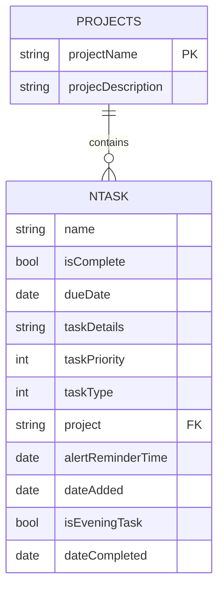

# Projects Entity

<cite>
**Referenced Files in This Document**   
- [README.md](file://README.md)
- [TaskManager.swift](file://To Do List/ViewControllers/TaskManager.swift)
- [ProjectPillCell.swift](file://To Do List/View/ProjectPillCell.swift)
</cite>

## Table of Contents
1. [Introduction](#introduction)
2. [Core Attributes](#core-attributes)
3. [Relationships](#relationships)
4. [Data Validation and Business Rules](#data-validation-and-business-rules)
5. [Usage Examples](#usage-examples)
6. [Performance Considerations](#performance-considerations)

## Introduction
The **Projects** entity in the Tasker application serves as a categorization and grouping mechanism for tasks. It enables users to organize their tasks into meaningful categories beyond the default "Inbox," supporting project-based filtering, analytics, and management. This documentation details the entity's structure, relationships, functionality, and usage patterns based on the provided repository context.

## Core Attributes
The Projects entity is defined with the following attributes, as documented in the `README.md` file:

**projectName**
- **Type**: `String`
- **Optional**: Yes
- **Default**: None
- **Notes**: Acts as the primary identifier and natural key for the project. It is used as a foreign-key reference in the `NTask` entity via the `project` attribute.

**projecDescription**
- **Type**: `String`
- **Optional**: Yes
- **Default**: None
- **Notes**: A user-facing description for the project. The attribute name contains a typo ("projecDescription" instead of "projectDescription") which is preserved for Core Data compatibility.

Based on the analysis of the provided code and documentation, the following attributes mentioned in the documentation objective were not found to be part of the current Projects entity implementation:

- **projectId (UUID string)**: The entity does not use a UUID as a primary identifier. Instead, the `projectName` serves as the natural key.
- **color (String)**: No color attribute was found in the entity definition. The `ProjectPillCell.swift` file uses a fixed blue color (`UIColor(red: 0.19, green: 0.57, blue: 1, alpha: 1)`) for the selected state, but this is not tied to a per-project color attribute.
- **createdAt (Date)**: No creation timestamp attribute was found in the entity definition.
- **sortOrder (Integer16)**: No sort order attribute was found in the entity definition.

**Section sources**
- [README.md](file://README.md#L887-L924)

## Relationships
The Projects entity has a logical one-to-many relationship with the `NTask` entity.

**Relationship Type**: `Projects 1 — * NTask` (One-to-Many)
- **Direction**: One Project can contain many Tasks.
- **Implementation**: This relationship is currently enforced at the UI and business logic level, not within the Core Data model itself.
- **Foreign Key**: The `NTask` entity has a `project` attribute of type `String` which references the `projectName` of a `Projects` entity.
- **Delete Rule**: When a project is deleted, associated tasks are not automatically deleted. Instead, a manual merge routine (`mergeInboxDuplicates`) re-assigns the tasks to the "Inbox" project. This indicates a *Nullify*-like behavior is implemented in code, with a future migration planned to convert the string-based foreign key into a formal Core Data relationship.



**Diagram sources**
- [README.md](file://README.md#L900-L924)

## Data Validation and Business Rules
The system enforces several data validation rules and business logic related to projects:

1. **Default Project ("Inbox")**: The "Inbox" project serves as the default catch-all category. Any task without an explicit project assignment is automatically assigned to "Inbox."
2. **Automatic Inbox Creation**: The system validates the existence of the "Inbox" project and will create it if missing, ensuring data integrity.
3. **Data Fixing**: The `fixMissingTasksDataWithDefaults()` method in `TaskManager.swift` iterates through all tasks and assigns any task with a missing or empty project to "Inbox."
4. **Unique Project Names**: While not explicitly stated, the use of `projectName` as a natural key implies that project names should be unique to avoid ambiguity in task assignment and filtering.
5. **Non-Empty Identifiers**: Although `projectName` is marked as optional in the schema, the business logic treats it as effectively required, as all tasks must belong to a project (defaulting to "Inbox").

**Section sources**
- [README.md](file://README.md#L730-L771)
- [TaskManager.swift](file://To Do List/ViewControllers/TaskManager.swift#L780-L790)

## Usage Examples
The `ProjectManager` and `ProjectRepository` classes (as referenced in the objective) were not found in the provided files. However, the `TaskManager` class provides methods for project-based task filtering, which demonstrates the usage pattern.

### Project-Based Task Filtering
The `TaskManager` class uses `NSPredicate` to filter tasks by project. This is a key implementation of project functionality.

```swift
// MARK: - Project-Based Task Retrieval
/// Retrieves all tasks for a specific project
/// - Parameter projectName: The name of the project to filter tasks by
/// - Returns: Array of all tasks for the specified project
func getTasksForProjectByName(projectName: String) -> [NTask] {
    let predicate = NSPredicate(format: "project ==[c] %@", projectName)
    return fetchTasks(predicate: predicate)
}
```

This method creates an `NSPredicate` with the format `"project ==[c] %@"`, where:
- `project` is the attribute on the `NTask` entity.
- `==[c]` means a case-insensitive equality comparison.
- `%@` is a placeholder for the `projectName` parameter.

The `fetchTasks` method then executes this predicate against the Core Data store to retrieve the relevant tasks.

### Project Creation and Deletion
While specific methods for project creation and deletion were not found in the provided `TaskManager.swift` file, the business rules imply the following workflows:
- **Creation**: A new `Projects` entity is created with a unique `projectName`. The system ensures the "Inbox" project exists.
- **Renaming**: The `projectName` of an existing `Projects` entity is updated. This change would require updating all associated `NTask` entities' `project` field to maintain referential integrity, or the system relies on the string match.
- **Deletion**: A `Projects` entity is deleted, and its associated tasks are reassigned to the "Inbox" project via the `mergeInboxDuplicates` routine.

**Section sources**
- [TaskManager.swift](file://To Do List/ViewControllers/TaskManager.swift#L450-L465)
- [README.md](file://README.md#L592-L651)

## Performance Considerations
For applications with large project hierarchies, the current string-based foreign key system has specific performance implications:

1. **Query Performance**: Filtering tasks by project using `NSPredicate` (e.g., `project ==[c] 'Work'`) is efficient for moderate datasets. However, as the number of tasks grows, these queries can become slower, especially if no index is defined on the `project` column in Core Data.
2. **Memory Usage**: The current architecture, which relies on fetching and filtering tasks in memory after retrieval from Core Data, can lead to high memory consumption for large datasets. The migration to a formal Core Data relationship could allow for more efficient fetching directly from the persistent store.
3. **Data Integrity**: The lack of a formal relationship means referential integrity is not enforced by the database. This places the burden on the application logic to handle orphaned tasks and project deletions, which can be a performance overhead during cleanup operations.
4. **Future Optimization**: The planned migration to a formal one-to-many relationship in Core Data will likely improve performance by enabling direct relationship traversal (e.g., `project.tasks`) and allowing Core Data to optimize fetch requests based on the relationship graph.

**Section sources**
- [README.md](file://README.md#L870-L886)
- [TaskManager.swift](file://To Do List/ViewControllers/TaskManager.swift#L770-L775)