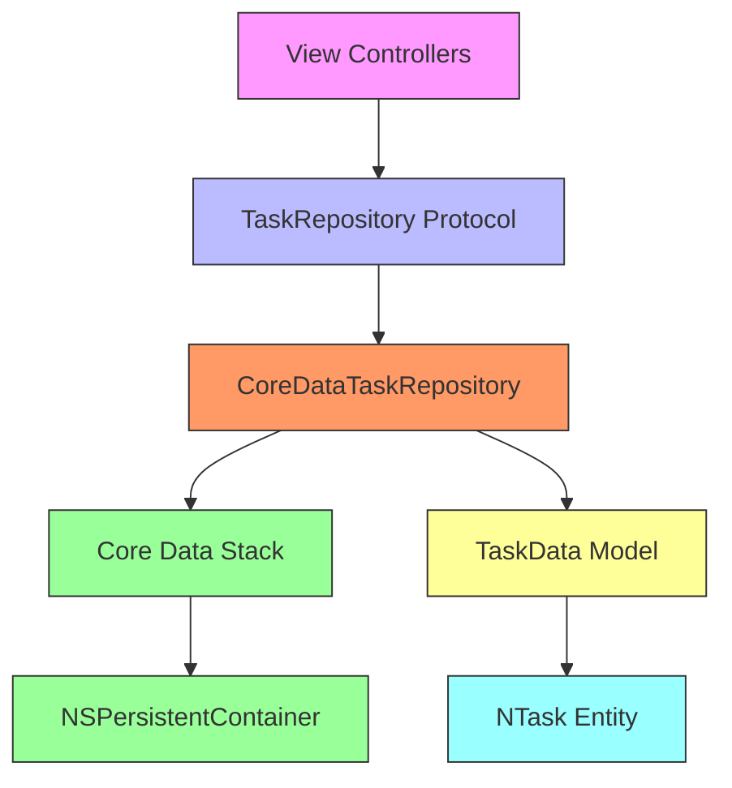
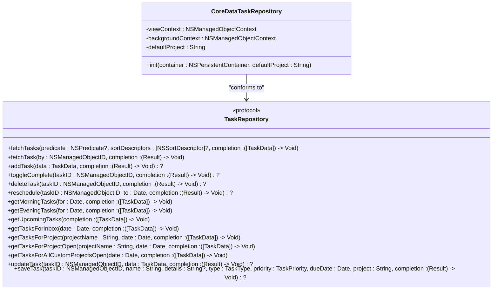
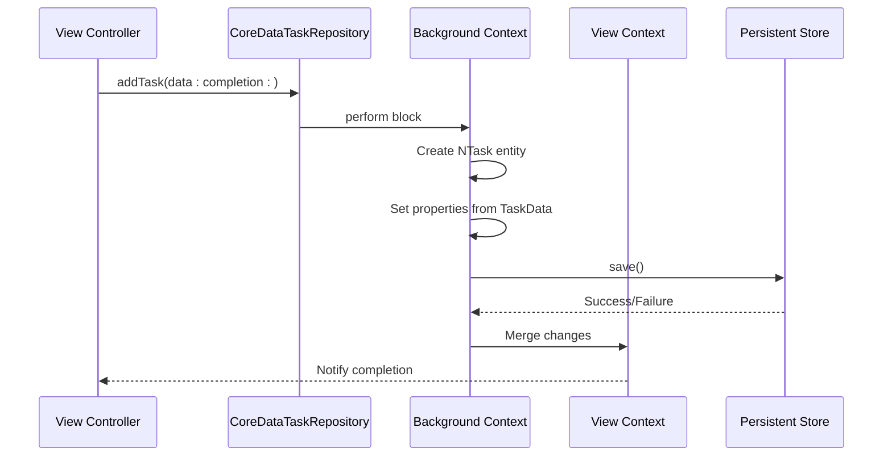
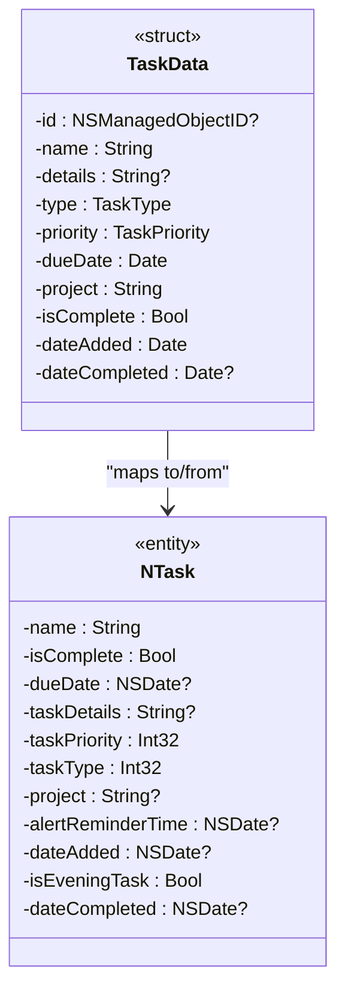

# Core Data Repository Implementation

<cite>
**Referenced Files in This Document**   
- [CoreDataTaskRepository.swift](file://To%20Do%20List/Repositories/CoreDataTaskRepository.swift)
- [TaskRepository.swift](file://To%20Do%20List/Repositories/TaskRepository.swift)
- [TaskData.swift](file://To%20Do%20List/Models/TaskData.swift)
- [NTask+CoreDataProperties.swift](file://NTask+CoreDataProperties.swift)
- [AppDelegate.swift](file://To%20Do%20List/AppDelegate.swift)
- [README.md](file://README.md)
</cite>

## Table of Contents
1. [Introduction](#introduction)
2. [Core Data Repository Architecture](#core-data-repository-architecture)
3. [TaskRepository Protocol Definition](#taskrepository-protocol-definition)
4. [CoreDataTaskRepository Implementation](#coredatataskrepository-implementation)
5. [Managed Object Context Configuration](#managed-object-context-configuration)
6. [Entity-to-Model Mapping](#entity-to-model-mapping)
7. [CRUD Operations Implementation](#crud-operations-implementation)
8. [NSFetchedResultsController Integration](#nsfetchedresultscontroller-integration)
9. [Thread Safety and Concurrency Patterns](#thread-safety-and-concurrency-patterns)
10. [Error Handling Strategies](#error-handling-strategies)
11. [Batch Processing and Performance Optimization](#batch-processing-and-performance-optimization)
12. [Core Data Migration Strategy](#core-data-migration-strategy)
13. [Conclusion](#conclusion)

## Introduction
The Core Data repository implementation in the Tasker application represents a modern approach to data persistence and retrieval in iOS applications. This documentation provides a comprehensive analysis of the Core Data repository pattern as implemented in the Tasker project, focusing on the CoreDataTaskRepository and its adherence to the TaskRepository protocol. The implementation demonstrates best practices in Core Data usage, including proper context management, thread safety, and efficient data fetching patterns. The repository pattern abstraction allows for better testability and separation of concerns between the data layer and presentation layer.

**Section sources**
- [README.md](file://README.md#L572-L590)
- [README.md](file://README.md#L1546-L1549)

## Core Data Repository Architecture
The Core Data repository architecture in Tasker follows a clean separation of concerns, implementing the repository pattern to abstract data access operations. The architecture consists of three main components: the protocol definition, the concrete implementation, and the presentation model. This design enables dependency injection, making the codebase more testable and maintainable. The repository pattern serves as a bridge between the Core Data persistence layer and the application's business logic, providing a clean API for data operations without exposing the underlying implementation details.



**Diagram sources**
- [CoreDataTaskRepository.swift](file://To%20Do%20List/Repositories/CoreDataTaskRepository.swift#L1-L455)
- [TaskRepository.swift](file://To%20Do%20List/Repositories/TaskRepository.swift#L1-L118)

**Section sources**
- [CoreDataTaskRepository.swift](file://To%20Do%20List/Repositories/CoreDataTaskRepository.swift#L1-L455)
- [TaskRepository.swift](file://To%20Do%20List/Repositories/TaskRepository.swift#L1-L118)

## TaskRepository Protocol Definition
The TaskRepository protocol defines the contract for all task repository implementations, enabling dependency injection and testability. The protocol specifies a comprehensive set of methods for task data operations, including fetching, creating, updating, and deleting tasks. Each method uses completion handlers to support asynchronous operations, which is essential for maintaining UI responsiveness during data operations. The protocol also includes specialized methods for common filtering scenarios, such as retrieving morning tasks, evening tasks, and tasks for specific projects.



**Diagram sources**
- [TaskRepository.swift](file://To%20Do%20List/Repositories/TaskRepository.swift#L1-L118)

**Section sources**
- [TaskRepository.swift](file://To%20Do%20List/Repositories/TaskRepository.swift#L1-L118)

## CoreDataTaskRepository Implementation
The CoreDataTaskRepository class provides a concrete implementation of the TaskRepository protocol using Core Data as the persistence mechanism. The implementation leverages two managed object contexts: a view context for UI-related operations and a background context for data modifications. This separation ensures that long-running operations do not block the main thread, maintaining application responsiveness. The repository is initialized with an NSPersistentContainer, from which it obtains the view context and creates a dedicated background context for concurrent operations.



**Diagram sources**
- [CoreDataTaskRepository.swift](file://To%20Do%20List/Repositories/CoreDataTaskRepository.swift#L1-L455)

**Section sources**
- [CoreDataTaskRepository.swift](file://To%20Do%20List/Repositories/CoreDataTaskRepository.swift#L1-L455)

## Managed Object Context Configuration
The managed object context configuration in CoreDataTaskRepository implements best practices for Core Data concurrency. The repository maintains two contexts: a view context connected to the main queue for UI operations, and a background context for data modifications. The view context is configured to automatically merge changes from parent contexts, ensuring that UI updates reflect the latest data state. The background context uses the NSMergeByPropertyObjectTrumpMergePolicy to resolve merge conflicts by favoring changes from the background context.

```swift
// Context configuration in CoreDataTaskRepository
self.viewContext.automaticallyMergesChangesFromParent = true
self.backgroundContext.mergePolicy = NSMergeByPropertyObjectTrumpMergePolicy
```

The background context is created using container.newBackgroundContext(), which automatically configures it for private queue concurrency. All operations on the background context are performed using perform or performAndWait blocks to ensure thread safety. This configuration allows for concurrent data operations without blocking the main thread, improving application performance and responsiveness.

**Section sources**
- [CoreDataTaskRepository.swift](file://To%20Do%20List/Repositories/CoreDataTaskRepository.swift#L25-L35)

## Entity-to-Model Mapping
The entity-to-model mapping in the Tasker application separates the Core Data persistence model from the presentation model through the TaskData struct. This separation decouples the UI layer from Core Data implementation details, making the code more maintainable and testable. The TaskData struct serves as a plain Swift value type that can be easily passed between components without the complexities of managed object lifecycle management.



The mapping is implemented in the TaskData initializers, which convert between NTask managed objects and TaskData instances. This conversion handles the translation between Core Data types (e.g., NSDate) and Swift types (e.g., Date), as well as between raw integer values and type-safe enums for task priority and type.

**Diagram sources**
- [TaskData.swift](file://To%20Do%20List/Models/TaskData.swift#L1-L57)
- [NTask+CoreDataProperties.swift](file://NTask+CoreDataProperties.swift#L1-L20)

**Section sources**
- [TaskData.swift](file://To%20Do%20List/Models/TaskData.swift#L1-L57)

## CRUD Operations Implementation
The CRUD (Create, Read, Update, Delete) operations in CoreDataTaskRepository are implemented with attention to thread safety and error handling. Each operation uses the appropriate managed object context and performs its work in a background queue to prevent UI blocking. The operations follow a consistent pattern: perform the operation in the background context, handle any errors, and notify the caller on the main queue.

### Create Operation
The addTask method creates a new task from TaskData:
```swift
func addTask(data: TaskData, completion: ((Result<NTask, Error>) -> Void)?) {
    backgroundContext.perform {
        let managed = NTask(context: self.backgroundContext)
        // Set properties from data
        do {
            try self.backgroundContext.save()
            // Retrieve object in main context
            DispatchQueue.main.async { completion?(.success(mainContextTask)) }
        } catch {
            DispatchQueue.main.async { completion?(.failure(error)) }
        }
    }
}
```

### Read Operations
Fetch operations use the view context to ensure the latest data is retrieved:
```swift
func fetchTasks(predicate: NSPredicate?, sortDescriptors: [NSSortDescriptor]?, completion: @escaping ([TaskData]) -> Void) {
    viewContext.perform {
        let request: NSFetchRequest<NTask> = NTask.fetchRequest()
        request.predicate = predicate
        request.sortDescriptors = sortDescriptors
        do {
            let results = try self.viewContext.fetch(request)
            let data = results.map { TaskData(managedObject: $0) }
            DispatchQueue.main.async { completion(data) }
        } catch {
            DispatchQueue.main.async { completion([]) }
        }
    }
}
```

### Update Operations
The updateTask method modifies an existing task:
```swift
func updateTask(taskID: NSManagedObjectID, data: TaskData, completion: ((Result<Void, Error>) -> Void)?) {
    backgroundContext.perform {
        do {
            guard let task = try self.backgroundContext.existingObject(with: taskID) as? NTask else {
                throw NSError(domain: "TaskRepository", code: 404, userInfo: [NSLocalizedDescriptionKey: "Task not found"])
            }
            // Update all task properties
            try self.backgroundContext.save()
            DispatchQueue.main.async { completion?(.success(())) }
        } catch {
            DispatchQueue.main.async { completion?(.failure(error)) }
        }
    }
}
```

### Delete Operation
The deleteTask method removes a task from persistence:
```swift
func deleteTask(taskID: NSManagedObjectID, completion: ((Result<Void, Error>) -> Void)?) {
    backgroundContext.perform {
        do {
            let toDelete = try self.backgroundContext.existingObject(with: taskID)
            self.backgroundContext.delete(toDelete)
            try self.backgroundContext.save()
            DispatchQueue.main.async { completion?(.success(())) }
        } catch {
            DispatchQueue.main.async { completion?(.failure(error)) }
        }
    }
}
```

**Section sources**
- [CoreDataTaskRepository.swift](file://To%20Do%20List/Repositories/CoreDataTaskRepository.swift#L50-L100)

## NSFetchedResultsController Integration
The Tasker application leverages NSFetchedResultsController for efficient table view updates, although the CoreDataTaskRepository itself does not directly implement this pattern. Instead, the repository provides the data that can be used with NSFetchedResultsController in view controllers. The fetchTasks method and its specialized variants return data in a format suitable for NSFetchedResultsController, allowing view controllers to create fetch requests with appropriate predicates and sort descriptors.

When used with NSFetchedResultsController, the repository pattern enables efficient UI updates by:
1. Providing a stable data source for the results controller
2. Supporting predicate-based filtering for different view types
3. Enabling sorted results through sort descriptors
4. Facilitating automatic UI updates when data changes

The view context's automatic merging of changes from parent contexts ensures that NSFetchedResultsController receives change notifications when background operations complete, triggering automatic UI updates without requiring manual refresh.

**Section sources**
- [README.md](file://README.md#L270-L280)
- [CoreDataTaskRepository.swift](file://To%20Do%20List/Repositories/CoreDataTaskRepository.swift#L25-L35)

## Thread Safety and Concurrency Patterns
The CoreDataTaskRepository implements robust thread safety using Core Data's concurrency patterns. The repository uses two managed object contexts with different queue types: a main queue context for the view context and a private queue context for the background context. This separation ensures that data modifications do not block the main thread, preserving UI responsiveness.

All operations on the background context are performed within perform blocks, which safely execute code on the context's private queue:
```swift
backgroundContext.perform {
    // Perform data operations here
    // This code runs on a background queue
}
```

Similarly, read operations on the view context use perform to ensure thread safety:
```swift
viewContext.perform {
    // Fetch operations here
}
```

After completing operations on the background context, the repository dispatches completion callbacks to the main queue using DispatchQueue.main.async, ensuring that any UI updates occur on the main thread:
```swift
DispatchQueue.main.async { completion?(.success(())) }
```

This pattern prevents common threading issues such as frozen UI, data corruption, and crashes due to improper context access.

**Section sources**
- [CoreDataTaskRepository.swift](file://To%20Do%20List/Repositories/CoreDataTaskRepository.swift#L25-L35)
- [CoreDataTaskRepository.swift](file://To%20Do%20List/Repositories/CoreDataTaskRepository.swift#L50-L100)

## Error Handling Strategies
The CoreDataTaskRepository implements comprehensive error handling strategies to manage Core Data exceptions and validation failures. Each operation uses Swift's Result type in completion handlers to explicitly communicate success or failure states. This approach provides type-safe error handling and makes error conditions explicit in the API.

For Core Data operations, the repository uses do-catch blocks to handle errors from fetch, save, and object retrieval operations:
```swift
do {
    try self.backgroundContext.save()
    DispatchQueue.main.async { completion?(.success(())) }
} catch {
    print("❌ Task save error: \(error)")
    DispatchQueue.main.async { completion?(.failure(error)) }
}
```

The repository also handles specific error conditions, such as attempting to access a non-existent task:
```swift
guard let task = try self.backgroundContext.existingObject(with: taskID) as? NTask else {
    throw NSError(domain: "TaskRepository", code: 404, userInfo: [NSLocalizedDescriptionKey: "Task not found"])
}
```

Additionally, the repository posts notifications for significant events like task completion changes, allowing other parts of the application to respond appropriately:
```swift
NotificationCenter.default.post(name: NSNotification.Name("TaskCompletionChanged"), object: nil)
```

This comprehensive error handling ensures that the application can gracefully handle data access issues and provide appropriate feedback to users.

**Section sources**
- [CoreDataTaskRepository.swift](file://To%20Do%20List/Repositories/CoreDataTaskRepository.swift#L50-L100)
- [CoreDataTaskRepository.swift](file://To%20Do%20List/Repositories/CoreDataTaskRepository.swift#L105-L120)

## Batch Processing and Performance Optimization
The Core Data repository implementation includes several performance optimizations for efficient data processing. The use of background contexts for data modifications prevents UI blocking during potentially long-running operations. The repository also leverages Core Data's batch processing capabilities through the use of fetch requests with predicates, allowing for efficient filtering and sorting at the database level rather than in memory.

For specific use cases, the repository implements optimized fetch methods with compound predicates:
```swift
func getTasksForInbox(date: Date, completion: @escaping ([TaskData]) -> Void) {
    // Combine multiple predicates with OR for efficient fetching
    let combinedPredicate = NSCompoundPredicate(
        orPredicateWithSubpredicates: [dueTodayPredicate, completedTodayPredicate, overduePredicate]
    )
    // Use single fetch request instead of multiple
    fetchTasks(predicate: finalPredicate, sortDescriptors: sortDescriptors, completion: completion)
}
```

The repository avoids storing large result sets in memory by using fetch requests with appropriate fetch limits and batch sizes when necessary. The separation of view and background contexts also enables efficient change merging, reducing the overhead of propagating changes to the UI.

Additionally, the TaskData struct serves as a lightweight presentation model, reducing the memory footprint compared to passing managed objects directly to the UI layer.

**Section sources**
- [CoreDataTaskRepository.swift](file://To%20Do%20List/Repositories/CoreDataTaskRepository.swift#L200-L250)
- [CoreDataTaskRepository.swift](file://To%20Do%20List/Repositories/CoreDataTaskRepository.swift#L250-L300)

## Core Data Migration Strategy
The Tasker application employs lightweight migrations for Core Data schema evolution, as indicated in the project's README. The migration strategy is designed to be automatic and seamless for users, leveraging Xcode's built-in migration capabilities. The project roadmap includes creating lightweight migrations when schema changes are required, such as adding relationships between entities.

The current data model uses string-based project references in the NTask entity, with plans to convert this to a proper Core Data relationship:
```swift
// Current: String-based project reference
@NSManaged public var project: String?

// Planned: Core Data relationship
// Projects <-->> NTask (one-to-many)
```

When implementing this change, the project will use lightweight migration to automatically update the schema. This approach minimizes the need for custom migration code and reduces the risk of data loss during updates. The NSPersistentContainer handles the migration process transparently, ensuring that existing user data is preserved while updating to the new schema.

The migration strategy also includes maintaining backward compatibility during the transition period, allowing both old and new code paths to coexist until the migration is complete.

**Section sources**
- [README.md](file://README.md#L270-L280)
- [README.md](file://README.md#L974-L985)

## Conclusion
The Core Data repository implementation in the Tasker application demonstrates a well-architected approach to data persistence in iOS applications. By implementing the repository pattern with Core Data, the application achieves better separation of concerns, improved testability, and enhanced maintainability. The use of protocol-oriented design allows for dependency injection and makes it easier to swap implementations or create mocks for testing.

Key strengths of the implementation include:
- Proper concurrency management with dedicated view and background contexts
- Comprehensive error handling using Swift's Result type
- Efficient data fetching with predicate-based filtering
- Clean separation between persistence models and presentation models
- Support for modern Swift features like type-safe enums

The ongoing migration from legacy singleton patterns to the repository pattern represents a significant improvement in the application's architecture, paving the way for future enhancements and better code quality. As the migration progresses, more view controllers will adopt the repository pattern, further improving the application's maintainability and testability.