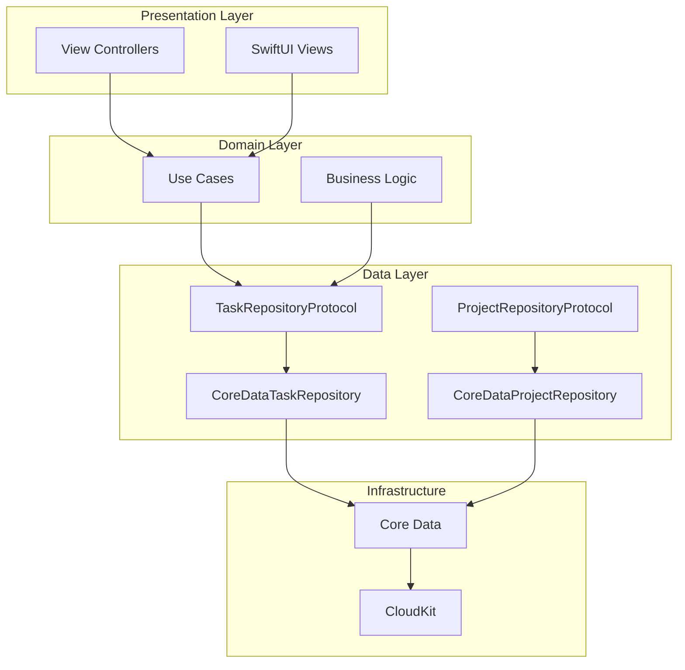
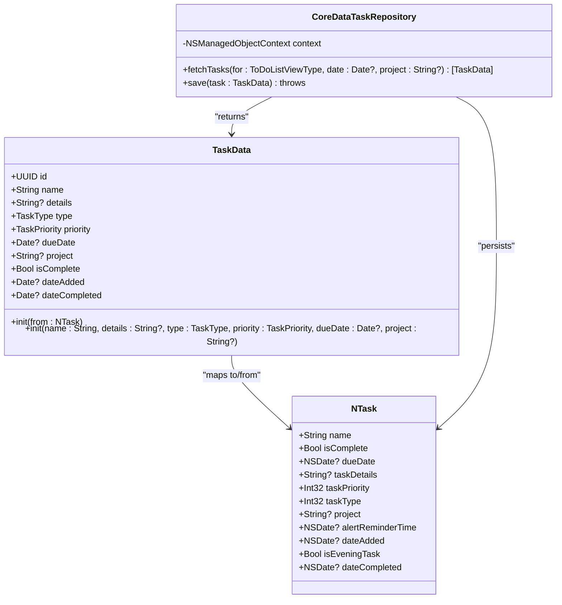
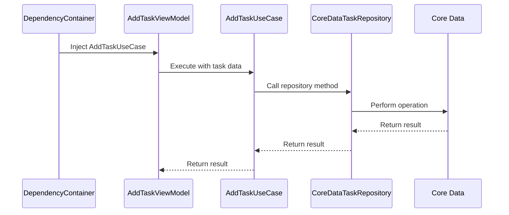
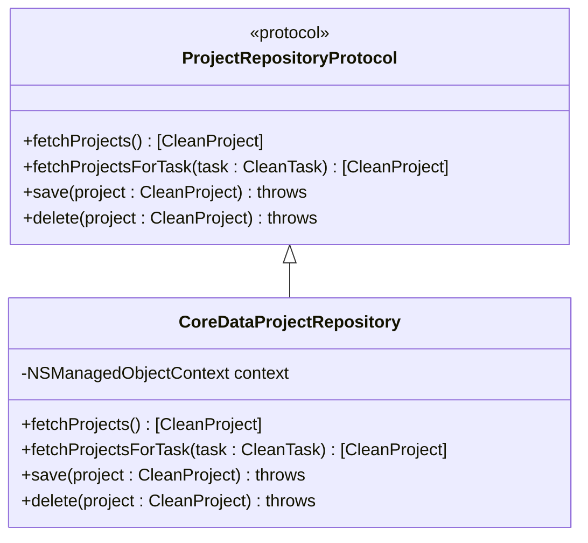

# Data Layer

<cite>
**Referenced Files in This Document**   
- [README.md](file://README.md)
</cite>

## Table of Contents
1. [Introduction](#introduction)
2. [Core Data Repository Pattern](#core-data-repository-pattern)
3. [CoreDataTaskRepository Implementation](#coredatataskrepository-implementation)
4. [Data Synchronization and Conflict Resolution](#data-synchronization-and-conflict-resolution)
5. [CRUD Operations](#crud-operations)
6. [Dependency Injection and Decoupling](#dependency-injection-and-decoupling)
7. [Performance Considerations](#performance-considerations)
8. [Extensibility and Future Development](#extensibility-and-future-development)

## Introduction
The Data Layer in the Tasker application implements a repository pattern to abstract data persistence and retrieval operations. This layer is responsible for managing interactions with Core Data and CloudKit, providing a clean interface between the domain logic and the underlying data storage mechanisms. The architecture is transitioning from a legacy singleton-based approach (`TaskManager`) to a modern protocol-oriented design using repositories and dependency injection. This documentation focuses on the current state of the data access layer, with emphasis on the `CoreDataTaskRepository` implementation and its role in the overall architecture.

## Core Data Repository Pattern

The repository pattern in Tasker abstracts Core Data operations behind protocol interfaces, enabling better testability, maintainability, and separation of concerns. The pattern decouples business logic from data persistence details, allowing use cases and view models to interact with data through well-defined contracts rather than direct Core Data access.

The architecture follows a layered approach where the Data Layer implements repository protocols defined in the Domain Layer. These repositories handle the conversion between domain entities and Core Data managed objects, manage the Core Data stack, and coordinate data synchronization with CloudKit.



**Diagram sources**
- [README.md](file://README.md#L1546-L1556)

**Section sources**
- [README.md](file://README.md#L1546-L1556)

## CoreDataTaskRepository Implementation

The `CoreDataTaskRepository` class provides a concrete implementation of the `TaskRepositoryProtocol` for task data access operations. It encapsulates all Core Data interactions for task entities, abstracting the complexity of managed object contexts, fetch requests, and data mapping.

### Initialization and Context Management
The repository is initialized with an `NSManagedObjectContext`, which it uses for all data operations. This design enables dependency injection and allows different contexts (main, background) to be injected based on the use case.

```swift
class CoreDataTaskRepository {
    private let context: NSManagedObjectContext
    
    init(context: NSManagedObjectContext) {
        self.context = context
    }
}
```

### Data Mapping with TaskData
The repository uses the `TaskData` struct as a presentation model to decouple the UI layer from Core Data managed objects. This struct serves as an intermediary between the domain layer and the data layer, facilitating clean data transformation.



**Diagram sources**
- [README.md](file://README.md#L524-L571)
- [README.md](file://README.md#L592-L651)

**Section sources**
- [README.md](file://README.md#L524-L571)
- [README.md](file://README.md#L592-L651)

## Data Synchronization and Conflict Resolution

### CloudKit Integration
The application uses `NSPersistentCloudKitContainer` for automatic CloudKit synchronization. This infrastructure component handles the bidirectional sync of Core Data changes across devices, managing the complexities of network operations, conflict detection, and data consistency.

The Data Layer abstracts these synchronization details, meaning that use cases and view models are unaware of whether data is being stored locally or synchronized with CloudKit. This abstraction is a key benefit of the repository pattern, as it allows the underlying synchronization mechanism to be changed without affecting higher-level components.

### Conflict Resolution Strategy
The current implementation relies on Core Data's built-in conflict resolution mechanisms provided by `NSPersistentCloudKitContainer`. When conflicts occur during synchronization (e.g., the same task being modified on multiple devices), Core Data applies default conflict resolution rules:

- **Last-write-wins**: The most recent change (based on timestamp) is typically preserved
- **Automatic merging**: Where possible, non-conflicting changes are merged
- **Error reporting**: Unresolvable conflicts are reported through the persistence stack

The repository pattern ensures that these conflict resolution details are contained within the Data Layer, preventing them from leaking into business logic or presentation code.

## CRUD Operations

### Fetch Operations
The `fetchTasks` method provides flexible querying capabilities based on different view types and filtering criteria:

```swift
func fetchTasks(for viewType: ToDoListViewType, date: Date? = nil, 
               project: String? = nil) -> [TaskData] {
    let request: NSFetchRequest<NTask> = NTask.fetchRequest()
    
    switch viewType {
    case .todayHomeView:
        request.predicate = NSPredicate(format: "dueDate >= %@ AND dueDate < %@", 
                                      Calendar.current.startOfDay(for: Date()) as NSDate,
                                      Calendar.current.date(byAdding: .day, value: 1, 
                                      to: Calendar.current.startOfDay(for: Date()))! as NSDate)
    case .projectView:
        if let project = project {
            request.predicate = NSPredicate(format: "project == %@", project)
        }
    case .upcomingView:
        request.predicate = NSPredicate(format: "dueDate > %@", Date() as NSDate)
    case .historyView:
        request.predicate = NSPredicate(format: "isComplete == YES")
    default:
        break
    }
    
    request.sortDescriptors = [
        NSSortDescriptor(key: "taskPriority", ascending: true),
        NSSortDescriptor(key: "dueDate", ascending: true)
    ]
    
    do {
        let managedTasks = try context.fetch(request)
        return managedTasks.map { TaskData(from: $0) }
    } catch {
        print("Error fetching tasks: \(error)")
        return []
    }
}
```

### Save Operations
The `save` method persists task data to Core Data, converting from the `TaskData` struct to a managed object:

```swift
func save(task: TaskData) throws {
    let managedTask = NTask(context: context)
    managedTask.name = task.name
    managedTask.taskDetails = task.details
    managedTask.taskType = task.type.rawValue
    managedTask.taskPriority = task.priority.rawValue
    managedTask.dueData = task.dueDate as NSDate?
    managedTask.project = task.project
    managedTask.isComplete = task.isComplete
    managedTask.dateAdded = task.dateAdded as NSDate?
    managedTask.dateCompleted = task.dateCompleted as NSDate?
    
    try context.save()
}
```

### Error Handling
The repository implements explicit error handling for data operations, contrasting with the legacy `TaskManager`'s silent failure approach:

```swift
// Modern: Explicit error handling
taskRepository.addTask(data: taskData) { result in
    switch result {
    case .success: // Handle success
    case .failure(let error): // Handle error
    }
}
```

**Section sources**
- [README.md](file://README.md#L592-L651)
- [README.md](file://README.md#L306-L326)

## Dependency Injection and Decoupling

### Dependency Injection Pattern
The repository pattern enables dependency injection, allowing components to receive their dependencies rather than creating them directly. This promotes loose coupling and enhances testability.



**Diagram sources**
- [README.md](file://README.md#L1574-L1578)

**Section sources**
- [README.md](file://README.md#L1574-L1578)

### Decoupling Business Logic from Persistence
The repository pattern effectively decouples business logic from persistence concerns by:

1. **Abstraction**: Use cases interact with protocol interfaces rather than concrete implementations
2. **Testability**: Repositories can be easily mocked for unit testing
3. **Flexibility**: Different implementations (e.g., in-memory, REST API) can be substituted
4. **Maintainability**: Changes to the persistence layer don't affect business logic

This decoupling is evident in the migration roadmap, where the legacy `TaskManager` singleton is being replaced with injectable repository instances.

## Performance Considerations

### Background Context Usage
The repository pattern facilitates the use of background managed object contexts, preventing UI blocking during data operations. While the specific implementation details aren't visible in the available code, the architecture supports this pattern through dependency injection of contexts.

### Memory Management
The implementation includes several performance optimizations:

- **Faulting**: Core Data's built-in faulting mechanism minimizes memory usage by loading data on-demand
- **Batch operations**: The use of fetch requests with predicates enables efficient querying
- **Proper context handling**: Each repository instance manages its own context, preventing memory leaks

### Transaction Management
The current implementation uses individual context saves for each operation. Future improvements could include:

- **Batch operations**: Grouping multiple changes into a single transaction
- **Background processing**: Offloading heavy operations to background queues
- **Change tracking**: Implementing more sophisticated change detection to minimize unnecessary saves

## Extensibility and Future Development

### Current Migration Status
The data layer is in a hybrid state, with partial migration from the legacy architecture:

| Layer | Legacy Component | Modern Replacement | Status |
|-------|-----------------|--------------------|--------|
| Data Access | `TaskManager` (singleton) | `TaskRepository` protocol + `CoreDataTaskRepository` | 60% migrated |
| Project Ops | `ProjectManager` | *Planned:* `ProjectRepository` | Not started |

**Section sources**
- [README.md](file://README.md#L974-L985)

### Project Repository Implementation
The `CoreDataProjectRepository` has not yet been implemented, with project operations still handled by the `ProjectManager`. The planned implementation will follow the same pattern as `CoreDataTaskRepository`:



**Section sources**
- [README.md](file://README.md#L1547-L1556)

### Extending to Alternative Backends
The repository pattern makes it straightforward to extend the application to support alternative backends:

1. **REST API Implementation**: Create a `RESTTaskRepository` that implements `TaskRepositoryProtocol` using network calls
2. **In-Memory Implementation**: Create an `InMemoryTaskRepository` for testing or demo purposes
3. **Hybrid Implementation**: Create a repository that combines local storage with remote synchronization

This extensibility is a key advantage of the pattern, allowing the application to evolve without major architectural changes.