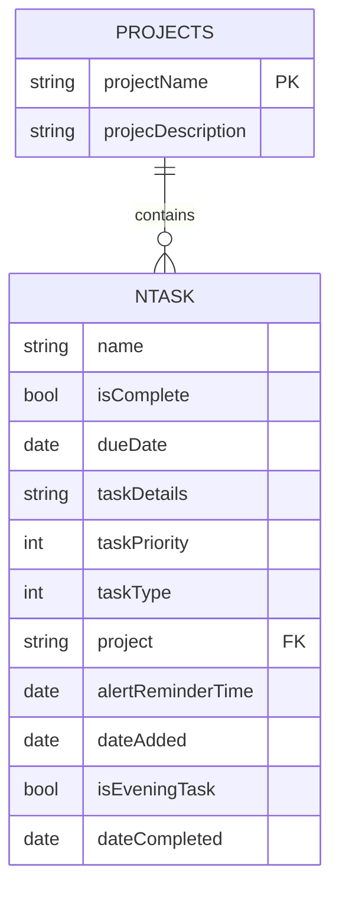
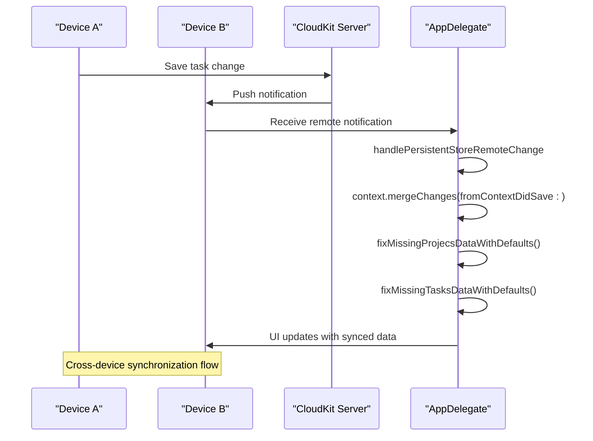

# Data Synchronization with CloudKit

<cite>
**Referenced Files in This Document**   
- [AppDelegate.swift](file://To%20Do%20List/AppDelegate.swift#L0-L192)
- [TaskManager.swift](file://To%20Do%20List/ViewControllers/TaskManager.swift#L0-L1004)
- [ProjectManager.swift](file://To%20Do%20List/ViewControllers/ProjectManager.swift#L0-L339)
- [README.md](file://README.md#L1300-L1499)
</cite>

## Table of Contents
1. [Introduction](#introduction)
2. [Core Data and CloudKit Integration](#core-data-and-cloudkit-integration)
3. [NSPersistentCloudKitContainer Configuration](#nspersistentcloudkitcontainer-configuration)
4. [Record Mapping and Metadata Synchronization](#record-mapping-and-metadata-synchronization)
5. [Conflict Resolution Strategies](#conflict-resolution-strategies)
6. [Background Sync and Remote Change Handling](#background-sync-and-remote-change-handling)
7. [Data Consolidation and Integrity](#data-consolidation-and-integrity)
8. [Troubleshooting Common Sync Issues](#troubleshooting-common-sync-issues)
9. [Performance Considerations](#performance-considerations)

## Introduction
The Tasker application implements a robust data synchronization mechanism using Apple's CloudKit framework integrated with Core Data. This system enables seamless cross-device syncing of task and project data while maintaining a local-first architecture. The synchronization is built on NSPersistentCloudKitContainer, which automatically handles the mapping between Core Data entities and CloudKit records, manages conflict resolution, and ensures data consistency across all of a user's devices. The system is designed with privacy in mind, storing all user data in their personal iCloud private database under the container identifier "iCloud.TaskerCloudKit". This document details the implementation, configuration, and operational aspects of this synchronization mechanism.

## Core Data and CloudKit Integration
The integration between Core Data and CloudKit in Tasker is implemented through the NSPersistentCloudKitContainer class, which extends NSPersistentContainer to provide native CloudKit synchronization capabilities. This integration allows the application to maintain a local Core Data store while automatically syncing changes to iCloud, enabling users to access their task data from multiple devices. The data model consists of two primary entities: NTask for individual tasks and Projects for task organization. These entities are automatically mapped to CloudKit records, with each Core Data entity instance becoming a corresponding CKRecord in the user's private database. The relationship between tasks and projects is maintained through a string-based foreign key (the project attribute in NTask references the projectName in Projects), which is enforced at the application level rather than through Core Data relationships.



**Diagram sources**
- [README.md](file://README.md#L887-L924)

**Section sources**
- [README.md](file://README.md#L870-L924)

## NSPersistentCloudKitContainer Configuration
The CloudKit integration is configured in the AppDelegate.swift file through the lazy initialization of the persistentContainer property. This container is initialized with the name "TaskModel", which corresponds to the Core Data model file. The configuration includes several critical options that enable robust synchronization. The cloudKitContainerOptions are set with the container identifier "iCloud.TaskerCloudKit", establishing a dedicated CloudKit container for the application. History tracking is enabled using the NSPersistentHistoryTrackingKey option, which allows the system to track changes to the persistent store and resolve conflicts effectively. Remote change notifications are enabled through the NSPersistentStoreRemoteChangeNotificationPostOptionKey, allowing the app to receive silent push notifications when changes occur on other devices. The container is also configured with NSMergeByPropertyStoreTrumpMergePolicy, which determines how conflicts are resolved during synchronization.

```swift
lazy var persistentContainer: NSPersistentCloudKitContainer = {
    let container = NSPersistentCloudKitContainer(name: "TaskModel")
    
    guard let description = container.persistentStoreDescriptions.first else {
        fatalError("### AppDelegate ### Failed to retrieve a persistent store description.")
    }
    
    description.cloudKitContainerOptions = NSPersistentCloudKitContainerOptions(containerIdentifier: "iCloud.TaskerCloudKit")
    
    description.setOption(true as NSNumber, forKey: NSPersistentHistoryTrackingKey)
    description.setOption(true as NSNumber, forKey: NSPersistentStoreRemoteChangeNotificationPostOptionKey)
    
    container.loadPersistentStores(completionHandler: { (storeDescription, error) in
        if let error = error as NSError? {
            fatalError("Unresolved error \(error), \(error.userInfo)")
        }
        
        print("Successfully loaded persistent store: \(storeDescription.url?.lastPathComponent ?? "N/A") with CloudKit options: \(storeDescription.cloudKitContainerOptions?.containerIdentifier ?? "None")")
    })
    
    container.viewContext.automaticallyMergesChangesFromParent = true
    container.viewContext.mergePolicy = NSMergeByPropertyStoreTrumpMergePolicy
    
    return container
}()
```

**Section sources**
- [AppDelegate.swift](file://To%20Do%20List/AppDelegate.swift#L100-L192)

## Record Mapping and Metadata Synchronization
The NSPersistentCloudKitContainer automatically handles the mapping between Core Data managed objects and CloudKit records. Each instance of the NTask and Projects entities is synchronized as a corresponding CKRecord in the user's private database. The record types are automatically derived from the entity names (NTask and Projects), and all attributes are mapped to record fields. The system handles the synchronization of metadata such as creation and modification dates, ensuring that these timestamps are consistent across devices. The container also manages record zone hierarchies, using the default zone for all records since no custom zones are configured. Record IDs are automatically generated and managed by the framework, with the system ensuring that each managed object has a stable identifier that persists across synchronization cycles. The synchronization includes all scalar attributes (strings, integers, booleans, dates) and handles the conversion between Core Data types and CloudKit field types transparently.

**Section sources**
- [AppDelegate.swift](file://To%20Do%20List/AppDelegate.swift#L100-L192)
- [README.md](file://README.md#L1300-L1499)

## Conflict Resolution Strategies
Tasker employs a comprehensive conflict resolution strategy that combines server-side winning semantics with intelligent client merge policies. The primary conflict resolution mechanism is the NSMergeByPropertyStoreTrumpMergePolicy, which is configured on the view context. This merge policy resolves conflicts by favoring changes from the persistent store (server) over local changes when there are conflicting modifications to the same property. This "store trump" approach ensures that the most recent server state prevails in case of conflicts, maintaining data consistency across devices. The system is further enhanced by enabling NSPersistentHistoryTrackingKey, which provides detailed change history that the framework uses to detect and resolve conflicts more intelligently. When conflicts are detected during synchronization, the system merges changes at the property level rather than discarding entire records, preserving as much user data as possible. This approach minimizes data loss and provides a seamless user experience even when simultaneous edits occur on multiple devices.

**Section sources**
- [AppDelegate.swift](file://To%20Do%20List/AppDelegate.swift#L180-L192)
- [README.md](file://README.md#L1300-L1499)

## Background Sync and Remote Change Handling
The synchronization system implements robust background sync operations through the handling of remote change notifications. In the application's didFinishLaunchingWithOptions method, the app registers for remote notifications and sets up an observer for NSPersistentStoreRemoteChange notifications. This observer triggers the handlePersistentStoreRemoteChange method whenever changes are detected from other devices. The method performs the merge operation on the managed object context's queue to ensure thread safety, calling context.mergeChanges(fromContextDidSave: notification) to incorporate the remote changes. This background synchronization occurs automatically without user intervention, ensuring that the local data store is always up-to-date. The system also monitors CloudKit container events through NSPersistentCloudKitContainer.eventChangedNotification, logging events and errors for debugging purposes. Silent push notifications are used to wake the app in the background when changes occur, enabling near real-time synchronization across devices.



**Diagram sources**
- [AppDelegate.swift](file://To%20Do%20List/AppDelegate.swift#L150-L192)

**Section sources**
- [AppDelegate.swift](file://To%20Do%20List/AppDelegate.swift#L150-L192)

## Data Consolidation and Integrity
After synchronization operations, Tasker performs critical data consolidation to maintain integrity and consistency. This process is implemented in the handlePersistentStoreRemoteChange method, which calls consolidation logic immediately after merging remote changes. The system invokes both ProjectManager.sharedInstance.fixMissingProjecsDataWithDefaults() and TaskManager.sharedInstance.fixMissingTasksDataWithDefaults() to validate and repair data inconsistencies that may arise from concurrent modifications on different devices. The project consolidation logic ensures that exactly one "Inbox" project exists, creating it if missing, standardizing its properties, and merging any duplicate inbox projects by reassigning their tasks to the primary inbox. The task consolidation logic ensures that all tasks have a valid project assignment, defaulting to "inbox" if the project field is empty or null. This post-sync validation prevents data corruption and maintains the application's expected behavior, providing a robust defense against edge cases that could arise from distributed modifications.

```swift
@objc
func handlePersistentStoreRemoteChange(_ notification: Notification) {
    let context = persistentContainer.viewContext
    context.perform {
        context.mergeChanges(fromContextDidSave: notification)
        
        ProjectManager.sharedInstance.fixMissingProjecsDataWithDefaults()
        TaskManager.sharedInstance.fixMissingTasksDataWithDefaults()
        
        NotificationCenter.default.post(name: Notification.Name("DataDidChangeFromCloudSync"), object: nil)
    }
}
```

**Section sources**
- [AppDelegate.swift](file://To%20Do%20List/AppDelegate.swift#L170-L192)
- [ProjectManager.swift](file://To%20Do%20List/ViewControllers/ProjectManager.swift#L0-L339)
- [TaskManager.swift](file://To%20Do%20List/ViewControllers/TaskManager.swift#L0-L1004)

## Troubleshooting Common Sync Issues
Several common synchronization issues can occur in the CloudKit integration, and the system includes mechanisms to detect and address them. Permission errors may occur if the user has not granted iCloud access, which can be resolved by checking the device's iCloud settings and ensuring the app has permission to use CloudKit. Quota limits are managed automatically by CloudKit, but developers should monitor the NSPersistentCloudKitContainer events for any quota-related warnings or errors. Network failures are handled gracefully by the local-first architecture, which allows the app to function normally when offline and automatically syncs changes when connectivity is restored. Developers can monitor synchronization status by observing the NSPersistentCloudKitContainer.eventChangedNotification, which provides detailed information about sync operations and any errors that occur. The system logs CloudKit events and errors to the console, aiding in debugging sync issues during development. If synchronization problems persist, users can try signing out of and back into their iCloud account, or restarting the application to reinitialize the persistent container.

**Section sources**
- [AppDelegate.swift](file://To%20Do%20List/AppDelegate.swift#L150-L192)
- [README.md](file://README.md#L1300-L1499)

## Performance Considerations
The synchronization implementation includes several performance optimizations to handle large datasets efficiently. The system uses background contexts for data operations to prevent UI blocking, ensuring a responsive user experience even during extensive sync operations. The repository pattern, implemented through CoreDataTaskRepository, facilitates efficient data access with predicate-driven fetching that minimizes memory usage by eliminating redundant storage of task arrays. For large datasets, the system benefits from Core Data's built-in batching and faulting mechanisms, which load data on-demand rather than keeping everything in memory. Background sync operations are designed to be lightweight, with the merge process occurring on a background queue to avoid impacting the main thread. The use of NSFetchedResultsController in view controllers provides efficient UI updates by only reloading the specific rows that have changed, rather than refreshing the entire interface. These optimizations ensure that the application remains performant even with thousands of tasks and projects across multiple devices.

**Section sources**
- [README.md](file://README.md#L326-L371)
- [CoreDataTaskRepository.swift](file://To%20Do%20List/Repositories/CoreDataTaskRepository.swift#L0-L651)