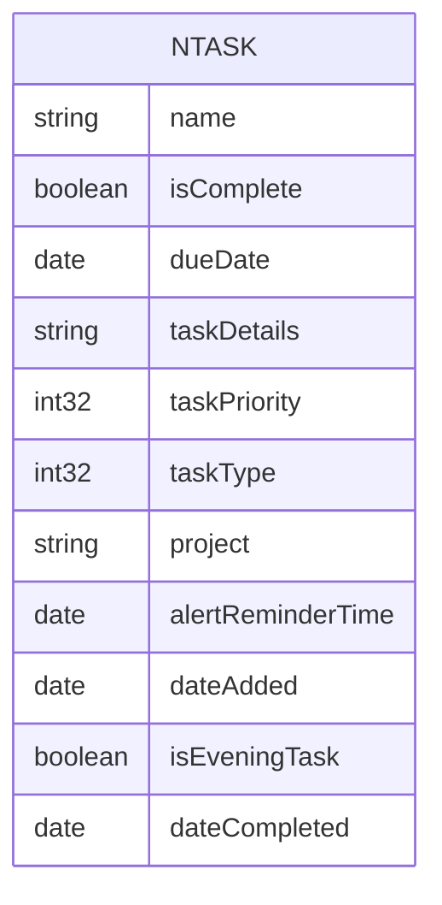
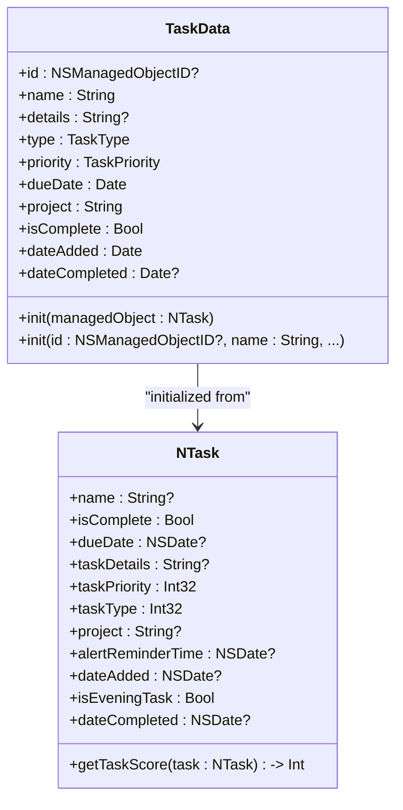
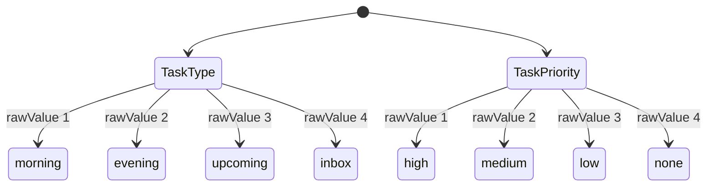
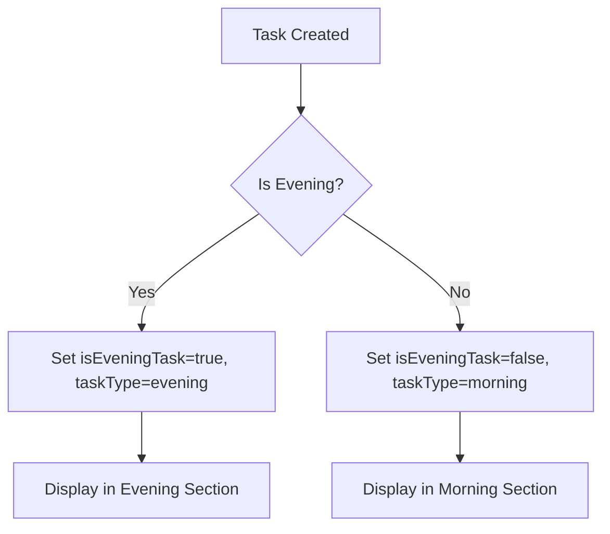
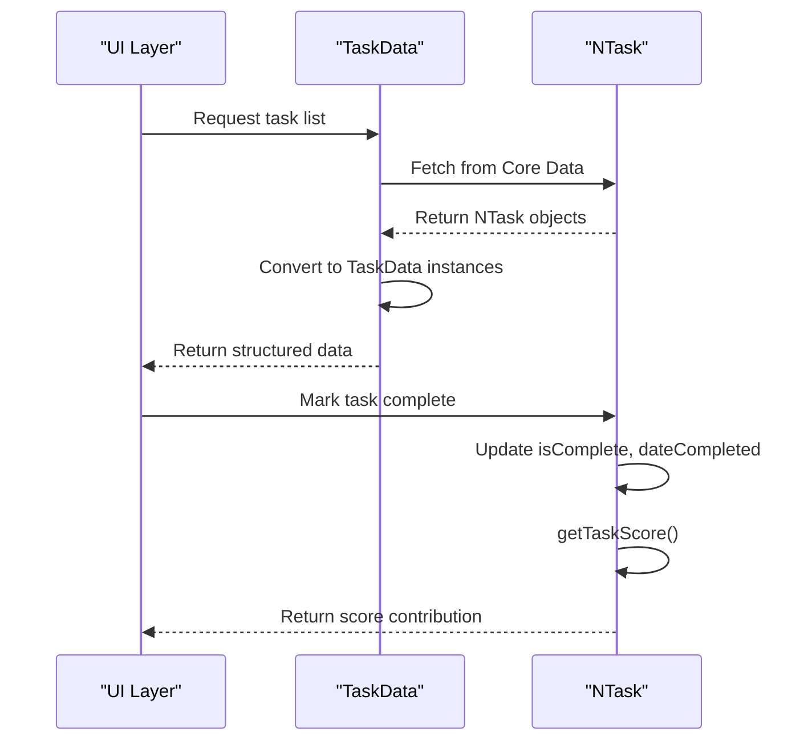

# Data Model Design

<cite>
**Referenced Files in This Document**   
- [NTask+CoreDataProperties.swift](file://To%20Do%20List/NTask+CoreDataProperties.swift)
- [NTask+Extensions.swift](file://To%20Do%20List/NTask+Extensions.swift)
- [TaskData.swift](file://To%20Do%20List/Models/TaskData.swift)
</cite>

## Table of Contents
1. [Introduction](#introduction)
2. [Core Data Entity: NTask](#core-data-entity-ntask)
3. [Value-Type Wrapper: TaskData](#value-type-wrapper-taskdata)
4. [Attribute Definitions](#attribute-definitions)
5. [Enumerations and Type Safety](#enumerations-and-type-safety)
6. [Relationships and Grouping](#relationships-and-grouping)
7. [Indexing and Query Optimization](#indexing-and-query-optimization)
8. [Data Validation Rules](#data-validation-rules)
9. [Deletion Handling](#deletion-handling)
10. [Sample Data Instances](#sample-data-instances)
11. [Daily Scoring Algorithm Support](#daily-scoring-algorithm-support)
12. [Conclusion](#conclusion)

## Introduction
This document provides a comprehensive overview of the NTask data model used in the Tasker application. It details the Core Data entity structure, its mapping to a value-type wrapper for UI consumption, and the supporting logic that enables efficient task management, grouping, and scoring. The model is designed to support time-based categorization (morning/evening/upcoming), project grouping, and priority-based scoring.

## Core Data Entity: NTask

The `NTask` entity is the primary Core Data managed object representing a task in the system. It stores all persistent attributes and provides methods for calculating task scores.



**Diagram sources**
- [NTask+CoreDataProperties.swift](file://To%20Do%20List/NTask+CoreDataProperties.swift#L10-L30)

**Section sources**
- [NTask+CoreDataProperties.swift](file://To%20Do%20List/NTask+CoreDataProperties.swift#L1-L54)

## Value-Type Wrapper: TaskData

The `TaskData` struct serves as a type-safe, immutable value object that wraps the `NTask` managed object for use in the presentation layer. This separation ensures that UI components are not tightly coupled to Core Data implementation details.



**Diagram sources**
- [TaskData.swift](file://To%20Do%20List/Models/TaskData.swift#L5-L57)
- [NTask+CoreDataProperties.swift](file://To%20Do%20List/NTask+CoreDataProperties.swift#L10-L30)

**Section sources**
- [TaskData.swift](file://To%20Do%20List/Models/TaskData.swift#L1-L57)

## Attribute Definitions

| Attribute | Type | Description | Default Value |
|---------|------|-------------|---------------|
| **name** | String? | The title of the task | None (required in UI) |
| **details** | String? | Additional description or notes | nil |
| **type** | TaskType | Categorizes task by time: morning, evening, upcoming, inbox | .morning |
| **priority** | TaskPriority | Priority level: high, medium, low, none | .medium |
| **dueDate** | Date | Deadline for task completion | Required |
| **isComplete** | Boolean | Completion status | false |
| **project** | String? | Project group this task belongs to | "Inbox" |
| **dateAdded** | Date | Timestamp when task was created | Current date |
| **dateCompleted** | Date? | Timestamp when task was marked complete | nil |
| **alertReminderTime** | NSDate? | Optional reminder time | nil |
| **isEveningTask** | Boolean | Legacy flag for evening tasks | false |

**Section sources**
- [NTask+CoreDataProperties.swift](file://To%20Do%20List/NTask+CoreDataProperties.swift#L10-L30)
- [TaskData.swift](file://To%20Do%20List/Models/TaskData.swift#L5-L57)

## Enumerations and Type Safety

The model uses Swift enums to provide type safety over raw integer values stored in Core Data.



**Diagram sources**
- [NTask+Extensions.swift](file://To%20Do%20List/NTask+Extensions.swift#L15-L50)

**Section sources**
- [NTask+Extensions.swift](file://To%20Do%20List/NTask+Extensions.swift#L1-L76)

## Relationships and Grouping

Tasks are grouped primarily by **project** and secondarily by **time category** (morning/evening/upcoming). The `project` attribute acts as a logical container, while the `type` enum enables temporal organization.

The `updateEveningTaskStatus(_:)` method ensures consistency between the `isEveningTask` boolean flag and the `taskType` enum value, maintaining data integrity during state transitions.



**Diagram sources**
- [NTask+Extensions.swift](file://To%20Do%20List/NTask+Extensions.swift#L25-L35)

## Indexing and Query Optimization

While explicit index declarations are not visible in the provided code, the following attributes are likely indexed for efficient querying:
- `dueDate`: For sorting tasks by deadline
- `isComplete`: For filtering completed vs. pending tasks
- `taskType`: For fast grouping by time category
- `project`: For filtering by project

These indices support common access patterns such as retrieving all incomplete morning tasks or finding overdue items.

**Section sources**
- [NTask+CoreDataProperties.swift](file://To%20Do%20List/NTask+CoreDataProperties.swift#L10-L30)

## Data Validation Rules

The model enforces several validation rules:
- `name` must not be empty (enforced at UI layer via default "Untitled Task")
- `project` defaults to "Inbox" if not specified
- `priority` defaults to `.medium` if raw value is invalid
- `type` defaults to `.morning` if raw value is invalid
- `dueDate`, `dateAdded`, and `name` are required in `TaskData` despite being optional in Core Data

These rules ensure data consistency even when underlying managed objects have missing values.

**Section sources**
- [TaskData.swift](file://To%20Do%20List/Models/TaskData.swift#L15-L30)
- [NTask+Extensions.swift](file://To%20Do%20List/NTask+Extensions.swift#L15-L20)

## Deletion Handling

Deletion behavior is not explicitly defined in the provided files, but follows standard Core Data rules:
- Tasks are deleted directly via managed object context
- No cascade deletion rules are evident (tasks are leaf nodes)
- Deletion should be performed on the main context to ensure UI synchronization
- Undo functionality may be supported through context undo manager

**Section sources**
- [NTask+CoreDataProperties.swift](file://To%20Do%20List/NTask+CoreDataProperties.swift#L1-L54)

## Sample Data Instances

```json
{
  "name": "Review Q2 Goals",
  "details": "Prepare feedback for team review",
  "type": "morning",
  "priority": "high",
  "dueDate": "2025-06-10T08:00:00Z",
  "isComplete": false,
  "project": "Work",
  "dateAdded": "2025-06-06T14:30:00Z"
}
```

```json
{
  "name": "Evening Walk",
  "details": "30-minute walk after dinner",
  "type": "evening",
  "priority": "medium",
  "dueDate": "2025-06-06T19:00:00Z",
  "isComplete": true,
  "project": "Health",
  "dateCompleted": "2025-06-06T19:25:00Z"
}
```

**Section sources**
- [TaskData.swift](file://To%20Do%20List/Models/TaskData.swift#L15-L57)

## Daily Scoring Algorithm Support

The `getTaskScore(task:)` method implements a scoring system where:
- High priority (P0): 7 points
- Medium-high (P1): 4 points
- Medium (P2): 3 points
- Low (P3/P4): 2 points
- Invalid/unknown: 1 point

This scoring mechanism allows the app to calculate daily productivity scores based on completed tasks and their priorities, incentivizing users to complete higher-priority items.



**Diagram sources**
- [NTask+CoreDataProperties.swift](file://To%20Do%20List/NTask+CoreDataProperties.swift#L35-L50)
- [TaskData.swift](file://To%20Do%20List/Models/TaskData.swift#L15-L57)

**Section sources**
- [NTask+CoreDataProperties.swift](file://To%20Do%20List/NTask+CoreDataProperties.swift#L32-L50)

## Conclusion

The NTask data model effectively balances persistence concerns with clean architectural separation. By using a Core Data managed object (`NTask`) for storage and a Swift struct (`TaskData`) for presentation, the system achieves both performance and type safety. The model supports key features including project grouping, time-based categorization, priority scoring, and consistent state management through well-defined extensions and conversion logic.