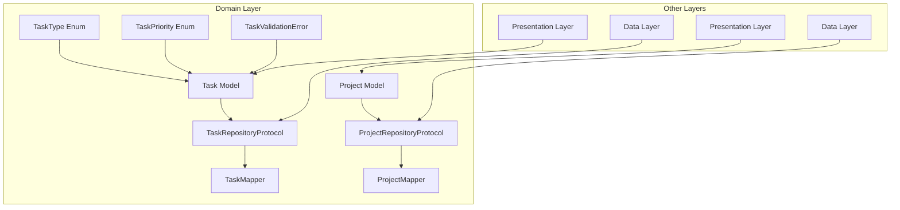
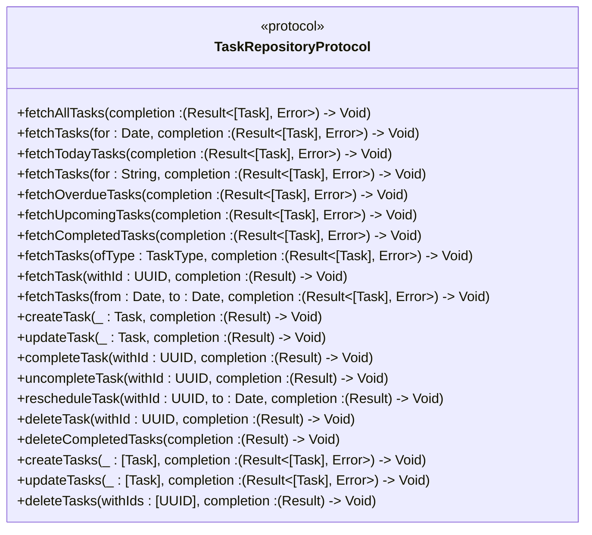
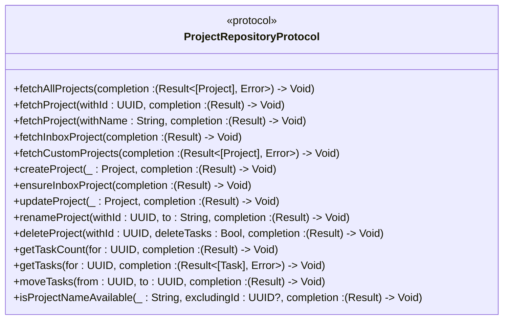
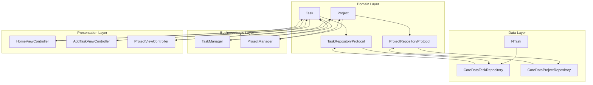

# Domain Layer

<cite>
**Referenced Files in This Document**   
- [TaskRepositoryProtocol.swift](file://To%20Do%20List/Domain/Interfaces/TaskRepositoryProtocol.swift#L1-L83) - *Updated in commit 2f1b824*
- [ProjectRepositoryProtocol.swift](file://To%20Do%20List/Domain/Interfaces/ProjectRepositoryProtocol.swift#L1-L67) - *Added in commit 2f1b824*
- [Task.swift](file://To%20Do%20List/Domain/Models/Task.swift#L1-L140)
- [CoreDataTaskRepository+Domain.swift](file://To%20Do%20List/State/Repositories/CoreDataTaskRepository+Domain.swift#L1-L405)
- [TaskMapper.swift](file://To%20Do%20List/Domain/Mappers/TaskMapper.swift#L1-L150)
</cite>

## Update Summary
**Changes Made**   
- Added documentation for new ProjectRepositoryProtocol
- Updated domain layer overview diagram to include project management components
- Enhanced integration diagram to show project repository relationships
- Added new section for ProjectRepositoryProtocol
- Updated referenced files list to include new protocol

## Table of Contents
1. [Introduction](#introduction)
2. [Domain Layer Overview](#domain-layer-overview)
3. [Core Domain Models](#core-domain-models)
4. [Domain Interfaces and Protocols](#domain-interfaces-and-protocols)
5. [ProjectRepositoryProtocol](#projectrepositoryprotocol)
6. [Domain Layer Implementation](#domain-layer-implementation)
7. [Integration with Other Layers](#integration-with-other-layers)
8. [Practical Examples](#practical-examples)
9. [Troubleshooting Guide](#troubleshooting-guide)
10. [Conclusion](#conclusion)

## Introduction
The Domain Layer in the Tasker application represents the core business logic and entities that define the application's purpose and functionality. This layer implements Clean Architecture principles by maintaining independence from infrastructure concerns such as data persistence and user interface. The domain layer encapsulates the essential business rules, data models, and interfaces that govern task management operations, providing a stable foundation that can be easily tested and evolved over time. By separating domain concerns from implementation details, the architecture enhances maintainability, testability, and flexibility.

## Domain Layer Overview

**Diagram sources**
- [Task.swift](file://To%20Do%20List/Domain/Models/Task.swift#L1-L140)
- [TaskRepositoryProtocol.swift](file://To%20Do%20List/Domain/Interfaces/TaskRepositoryProtocol.swift#L1-L83)
- [Project.swift](file://To%20Do%20List/Domain/Models/Project.swift#L1-L85)
- [ProjectRepositoryProtocol.swift](file://To%20Do%20List/Domain/Interfaces/ProjectRepositoryProtocol.swift#L1-L67)

**Section sources**
- [Task.swift](file://To%20Do%20List/Domain/Models/Task.swift#L1-L140)
- [TaskRepositoryProtocol.swift](file://To%20Do%20List/Domain/Interfaces/TaskRepositoryProtocol.swift#L1-L83)
- [Project.swift](file://To%20Do%20List/Domain/Models/Project.swift#L1-L85)
- [ProjectRepositoryProtocol.swift](file://To%20Do%20List/Domain/Interfaces/ProjectRepositoryProtocol.swift#L1-L67)

## Core Domain Models

The Task model serves as the central domain entity in the Tasker application, representing a pure Swift implementation of a task with no dependencies on external frameworks. This struct encapsulates all essential properties of a task including name, details, type, priority, due date, project association, completion status, and timestamps. The model includes comprehensive business logic through computed properties that determine task scoring, overdue status, and temporal characteristics. Validation rules are implemented through a dedicated validation method that checks for empty names, excessive character counts, and other data integrity constraints. The domain model adheres to Swift best practices by conforming to Equatable and Hashable protocols, enabling reliable comparison and hashing operations.

**Section sources**
- [Task.swift](file://To%20Do%20List/Domain/Models/Task.swift#L1-L140)

## Domain Interfaces and Protocols

**Diagram sources**
- [TaskRepositoryProtocol.swift](file://To%20Do%20List/Domain/Interfaces/TaskRepositoryProtocol.swift#L1-L83)

**Section sources**
- [TaskRepositoryProtocol.swift](file://To%20Do%20List/Domain/Interfaces/TaskRepositoryProtocol.swift#L1-L83)

## ProjectRepositoryProtocol
The ProjectRepositoryProtocol defines the interface for all project-related operations in the Tasker application. This protocol abstracts project management functionality, enabling dependency injection and facilitating testing through mock implementations. The protocol includes comprehensive methods for CRUD operations, project validation, and task association management. Key features include project creation with name validation, retrieval of both default and custom projects, project renaming with task migration, and deletion with configurable task handling (either deletion or reassignment to Inbox). The protocol also supports task association operations such as retrieving tasks within a project, counting project tasks, and moving tasks between projects. All operations use Swift's Result type for error handling, ensuring type-safe asynchronous operations.

**Diagram sources**
- [ProjectRepositoryProtocol.swift](file://To%20Do%20List/Domain/Interfaces/ProjectRepositoryProtocol.swift#L1-L67)

**Section sources**
- [ProjectRepositoryProtocol.swift](file://To%20Do%20List/Domain/Interfaces/ProjectRepositoryProtocol.swift#L1-L67)
- [Project.swift](file://To%20Do%20List/Domain/Models/Project.swift#L1-L85)

## Domain Layer Implementation

The domain layer implementation in Tasker follows Clean Architecture principles by providing a clear separation between business logic and infrastructure concerns. The TaskRepositoryProtocol defines a comprehensive contract for all task-related operations, enabling dependency injection and facilitating testing through mock implementations. This protocol includes methods for all CRUD operations, specialized fetching scenarios, and batch processing capabilities. The implementation leverages Swift's Result type for error handling, ensuring type-safe asynchronous operations that maintain UI responsiveness. The domain layer communicates with the data layer through mappers that convert between domain models and persistence entities, maintaining the independence of business logic from storage mechanisms.

**Section sources**
- [TaskRepositoryProtocol.swift](file://To%20Do%20List/Domain/Interfaces/TaskRepositoryProtocol.swift#L1-L83)
- [CoreDataTaskRepository+Domain.swift](file://To%20Do%20List/State/Repositories/CoreDataTaskRepository+Domain.swift#L1-L405)
- [TaskMapper.swift](file://To%20Do%20List/Domain/Mappers/TaskMapper.swift#L1-L150)

## Integration with Other Layers

**Diagram sources**
- [Task.swift](file://To%20Do%20List/Domain/Models/Task.swift#L1-L140)
- [TaskRepositoryProtocol.swift](file://To%20Do%20List/Domain/Interfaces/TaskRepositoryProtocol.swift#L1-L83)
- [CoreDataTaskRepository+Domain.swift](file://To%20Do%20List/State/Repositories/CoreDataTaskRepository+Domain.swift#L1-L405)
- [Project.swift](file://To%20Do%20List/Domain/Models/Project.swift#L1-L85)
- [ProjectRepositoryProtocol.swift](file://To%20Do%20List/Domain/Interfaces/ProjectRepositoryProtocol.swift#L1-L67)
- [CoreDataProjectRepository.swift](file://To%20Do%20List/State/Repositories/CoreDataProjectRepository.swift#L1-L365)

The domain layer integrates with other architectural layers through well-defined interfaces and dependency injection. The data layer implements the TaskRepositoryProtocol through the CoreDataTaskRepository class, which handles the conversion between the domain Task model and the Core Data NTask entity using the TaskMapper. Similarly, the ProjectRepositoryProtocol is implemented by CoreDataProjectRepository, managing project-related operations. Business logic components such as TaskManager and ProjectManager interact with domain models directly, leveraging their built-in validation and business rules. The presentation layer receives domain models for display and passes user actions to repository interfaces, maintaining separation of concerns. This integration pattern ensures that business logic remains independent of UI and persistence details, allowing for easier testing and future modifications.

**Section sources**
- [Task.swift](file://To%20Do%20List/Domain/Models/Task.swift#L1-L140)
- [TaskRepositoryProtocol.swift](file://To%20Do%20List/Domain/Interfaces/TaskRepositoryProtocol.swift#L1-L83)
- [CoreDataTaskRepository+Domain.swift](file://To%20Do%20List/State/Repositories/CoreDataTaskRepository+Domain.swift#L1-L405)
- [Project.swift](file://To%20Do%20List/Domain/Models/Project.swift#L1-L85)
- [ProjectRepositoryProtocol.swift](file://To%20Do%20List/Domain/Interfaces/ProjectRepositoryProtocol.swift#L1-L67)
- [CoreDataProjectRepository.swift](file://To%20Do%20List/State/Repositories/CoreDataProjectRepository.swift#L1-L365)

## Practical Examples

### Creating a New Task
To create a new task, clients of the domain layer instantiate a Task struct with the desired properties and pass it to the createTask method of a TaskRepositoryProtocol implementation. The domain model automatically validates the input data and assigns default values where appropriate. The repository handles the persistence details while returning a Result type that indicates success or failure.

### Fetching Tasks by Date
Clients can retrieve tasks for a specific date by calling the fetchTasks(for:completion:) method on the repository. This operation returns all tasks scheduled for the specified date, allowing the presentation layer to display time-specific task lists. The domain layer handles the filtering logic through appropriate predicates applied to the underlying data store.

### Managing Projects
To create a new project, clients instantiate a Project struct and pass it to the createProject method of a ProjectRepositoryProtocol implementation. The repository validates the project name for uniqueness before creation. To move tasks between projects, clients use the moveTasks(from:to:completion:) method, specifying the source and target project IDs. The repository handles the migration of all tasks from the source project to the target project.

**Section sources**
- [Task.swift](file://To%20Do%20List/Domain/Models/Task.swift#L1-L140)
- [TaskRepositoryProtocol.swift](file://To%20Do%20List/Domain/Interfaces/TaskRepositoryProtocol.swift#L1-L83)
- [Project.swift](file://To%20Do%20List/Domain/Models/Project.swift#L1-L85)
- [ProjectRepositoryProtocol.swift](file://To%20Do%20List/Domain/Interfaces/ProjectRepositoryProtocol.swift#L1-L67)

## Troubleshooting Guide

Common issues in the domain layer typically relate to data validation, type mismatches, and asynchronous operation handling. When encountering validation errors during task creation, verify that the task name is not empty and does not exceed 200 characters, and that details do not exceed 1000 characters. For issues with task retrieval, ensure that date parameters are properly formatted and that the repository implementation is correctly handling predicates. When debugging asynchronous operations, confirm that completion handlers are being called on the appropriate queue (typically the main queue for UI updates). If domain model properties are not being updated as expected, verify that value types are being properly reassigned, as structs are copied rather than referenced. For project-related issues, ensure that project names are unique and that operations on the default Inbox project follow the appropriate constraints.

**Section sources**
- [Task.swift](file://To%20Do%20List/Domain/Models/Task.swift#L1-L140)
- [TaskRepositoryProtocol.swift](file://To%20Do%20List/Domain/Interfaces/TaskRepositoryProtocol.swift#L1-L83)
- [Project.swift](file://To%20Do%20List/Domain/Models/Project.swift#L1-L85)
- [ProjectRepositoryProtocol.swift](file://To%20Do%20List/Domain/Interfaces/ProjectRepositoryProtocol.swift#L1-L67)

## Conclusion
The Domain Layer in the Tasker application successfully implements Clean Architecture principles by encapsulating business logic in framework-independent models and protocols. The Task struct provides a robust domain model with built-in validation and business rules, while the TaskRepositoryProtocol defines a comprehensive interface for data operations that enables dependency injection and testing. The addition of the ProjectRepositoryProtocol extends these benefits to project management functionality, creating a cohesive domain layer for both tasks and projects. This separation of concerns enhances the application's maintainability, testability, and flexibility, allowing for easier evolution of both business rules and implementation details. The domain layer serves as a stable foundation that can be easily integrated with different data persistence mechanisms and user interface technologies, ensuring long-term sustainability of the application architecture.