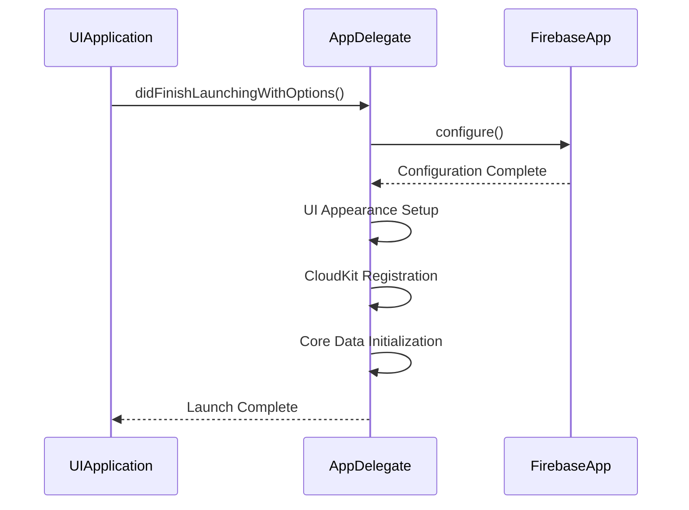
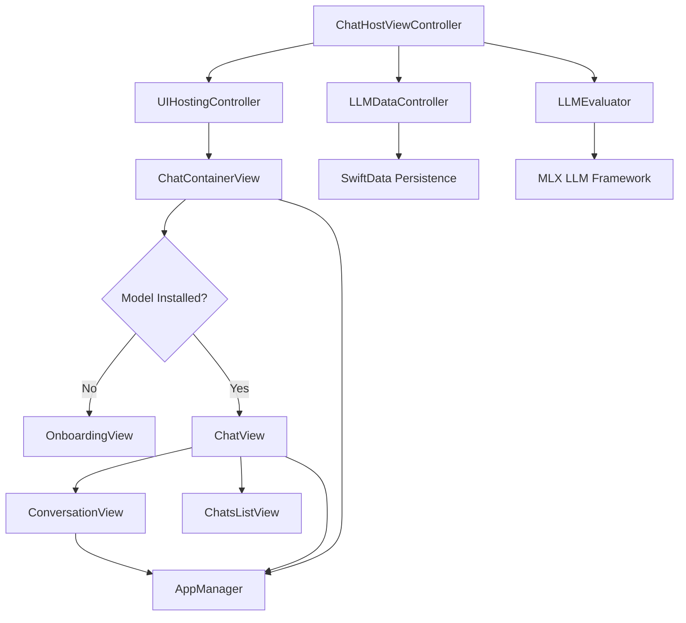
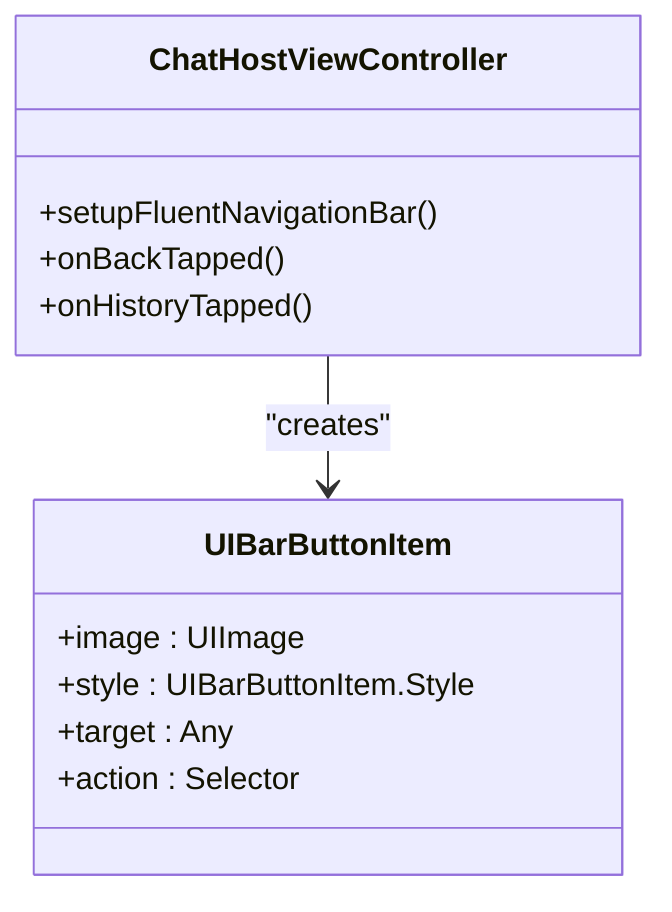

# External Integrations

<cite>
**Referenced Files in This Document**   
- [AppDelegate.swift](file://To%20Do%20List/AppDelegate.swift) - *Updated Firebase initialization and FluentUI configuration*
- [Podfile](file://Podfile) - *Updated FluentUI and FluentIcons versions*
- [ChatHostViewController.swift](file://To%20Do%20List/LLM/ChatHostViewController.swift) - *Added in recent commit for AI integration*
</cite>

## Update Summary
**Changes Made**   
- Updated FluentUI library version and configuration details in Third-Party Libraries section
- Added comprehensive documentation for AI integration through ChatHostViewController
- Enhanced Firebase integration details with updated initialization sequence
- Added new section for AI Integration Architecture
- Updated version compatibility and licensing information

## Table of Contents
1. [Introduction](#introduction)
2. [Firebase Integration](#firebase-integration)
3. [Third-Party Libraries](#third-party-libraries)
4. [AI Integration](#ai-integration)
5. [Setup and Configuration](#setup-and-configuration)
6. [Troubleshooting Common Issues](#troubleshooting-common-issues)
7. [Conclusion](#conclusion)

## Introduction
This document provides comprehensive documentation for all external integrations in the Tasker iOS application. It details the Firebase services used for analytics, crash reporting, and performance monitoring, as well as third-party libraries that enhance the app's user interface and functionality. The integration points, configuration requirements, version compatibility, licensing considerations, and setup procedures are thoroughly explained to ensure maintainability and scalability of the application. Recent updates include the integration of AI-powered chat functionality through ChatHostViewController and an update to the FluentUI library.

**Section sources**
- [AppDelegate.swift](file://To%20Do%20List/AppDelegate.swift#L1-L20)
- [Podfile](file://Podfile#L1-L5)

## Firebase Integration

### Overview
Tasker leverages Firebase for three core services: Analytics, Crashlytics, and Performance Monitoring. These services are initialized at app launch in `AppDelegate.swift` to enable real-time insights into user behavior, stability, and performance.

### Initialization in AppDelegate
Firebase is initialized via `FirebaseApp.configure()` during the `application(_:didFinishLaunchingWithOptions:)` lifecycle method. This single call activates all Firebase modules declared in the Podfile, including:
- **Firebase/Analytics**: Tracks user engagement, screen views, and custom events.
- **Firebase/Crashlytics**: Automatically captures unhandled crashes and provides detailed stack traces.
- **Firebase/Performance**: Monitors network requests, screen rendering times, and custom performance traces.

The initialization occurs early in the launch sequence to ensure maximum data capture from the start of the user session, immediately followed by UI appearance setup and CloudKit registration.

**Diagram sources**
- [AppDelegate.swift](file://To%20Do%20List/AppDelegate.swift#L25-L30)

### Impact on Performance
Firebase SDKs are designed to minimize performance overhead:
- Data is batched and uploaded during periods of low network activity.
- Crash reports are compressed and sent on next app startup.
- Performance monitoring uses lightweight instrumentation that adds negligible latency.

Initialization is synchronous but fast, with no measurable impact on app launch time under normal conditions.

### Privacy Considerations
All Firebase data collection complies with Apple's App Tracking Transparency framework:
- No IDFA collection occurs without explicit user consent.
- Users can disable analytics through device-level settings.
- Crashlytics does not capture personally identifiable information (PII) by default.

Data is transmitted securely using TLS encryption and stored in Google's GDPR-compliant infrastructure.

**Section sources**
- [AppDelegate.swift](file://To%20Do%20List/AppDelegate.swift#L25-L30)
- [Podfile](file://Podfile#L6-L11)

## Third-Party Libraries

### DGCharts
**Purpose**: Used for rendering interactive charts and graphs in analytics dashboards.  
**Integration Points**: Embedded in view controllers displaying task completion statistics and productivity trends.  
**Configuration**: Requires no additional setup beyond CocoaPods installation.  
**Version**: 5.1 (compatible with iOS 16+)  
**License**: Apache 2.0  
**Alternatives**: Charts (v4.x), SwiftPlot  
**Section sources**
- [Podfile](file://Podfile#L18)

### CircleMenu
**Purpose**: Provides a circular, animated menu for quick navigation between core app sections.  
**Integration Points**: Integrated into the main tab bar interface for gesture-based access.  
**Configuration**: Customizable via storyboard or code; supports dynamic item insertion.  
**Version**: 4.1.0  
**License**: MIT  
**Alternatives**: RAMAnimatedTabBarController, FoldingTabBar  
**Section sources**
- [Podfile](file://Podfile#L19)

### FluentUI
**Purpose**: Implements Microsoft's Fluent Design language for consistent navigation and UI components.  
**Integration Points**: Used in navigation controllers, modal sheets, and action sheets, including the AI chat interface.  
**Configuration**: Requires importing `MicrosoftFluentUI` and `FluentIcons` pods with specific build settings to resolve Objective-C selector conflicts.  
**Version**: FluentUI 0.34.0, FluentIcons 1.1.302  
**License**: MIT  
**Configuration Notes**: The post_install hook in Podfile includes specific fixes for subtitle conflicts using GCC_PREPROCESSOR_DEFINITIONS and OTHER_SWIFT_FLAGS.
**Alternatives**: MaterialComponents, SwiftUI with custom design system  
**Section sources**
- [Podfile](file://Podfile#L24-L25)

### FSCalendar
**Purpose**: Delivers a fully-featured calendar interface for task scheduling and date selection.  
**Integration Points**: Embedded in task creation and project planning screens.  
**Configuration**: Highly customizable appearance and behavior via delegate methods.  
**Version**: 2.8.1  
**License**: MIT  
**Alternatives**: JTAppleCalendar, iOS native CalendarKit  
**Section sources**
- [Podfile](file://Podfile#L22)

### SemiModalViewController
**Purpose**: Enables presentation of view controllers as semi-modal sheets, enhancing UX fluidity.  
**Integration Points**: Used for settings panels, filters, and contextual actions.  
**Configuration**: Integrated programmatically using `presentSemiViewController` method.  
**Version**: 1.0.1  
**License**: MIT  
**Alternatives**: Apple's native sheet presentation (iOS 15+), PulleyViewController  
**Section sources**
- [Podfile](file://Podfile#L18)

## AI Integration

### ChatHostViewController Architecture
The **ChatHostViewController** serves as the primary interface for the AI-powered chat assistant in Tasker, acting as a UIKit wrapper that embeds a SwiftUI-based chat interface. This hybrid approach enables interaction with a locally running large language model (LLM) while maintaining compatibility with the existing UIKit navigation structure.

**Diagram sources**
- [ChatHostViewController.swift](file://To%20Do%20List/LLM/ChatHostViewController.swift#L1-L141)
- [ChatView.swift](file://To%20Do%20List/LLM/Views/Chat/ChatView.swift#L1-L442)
- [LLMEvaluator.swift](file://To%20Do%20List/LLM/Models/LLMEvaluator.swift#L1-L167)

### Core Components
The **ChatHostViewController** integrates several key components:
- **UIHostingController**: Embeds the SwiftUI chat interface.
- **AppManager**: Manages app state, preferences, and haptics.
- **LLMEvaluator**: Handles LLM model loading, generation, and streaming.
- **LLMDataController**: Provides a shared SwiftData container for persistent message storage.
- **ChatContainerView**: Determines whether to show onboarding or chat UI.
- **ChatView**: Implements the main chat interface with input and message display.
- **ConversationView**: Renders individual messages with support for streaming and thinking indicators.

These components work together to provide a seamless chat experience with real-time response streaming and persistent chat history.

**Section sources**
- [ChatHostViewController.swift](file://To%20Do%20List/LLM/ChatHostViewController.swift#L1-L141)
- [ChatView.swift](file://To%20Do%20List/LLM/Views/Chat/ChatView.swift#L1-L442)
- [ConversationView.swift](file://To%20Do%20List/LLM/Views/Chat/ConversationView.swift#L1-L240)

### Integration with FluentUI
The AI chat interface leverages FluentUI for navigation elements, including the custom navigation bar with back and history buttons. The `setupFluentNavigationBar()` method configures these elements, with the history button posting a notification to toggle the chat history sheet.

**Diagram sources**
- [ChatHostViewController.swift](file://To%20Do%20List/LLM/ChatHostViewController.swift#L77-L115)

### Performance Considerations
The AI integration implements several performance optimizations:
- **Throttled UI Updates**: The **LLMEvaluator** updates the UI every N tokens (default 4) to reduce overhead.
- **Lazy Loading**: Models are loaded only when needed and cached for subsequent use.
- **Efficient Data Fetching**: SwiftData queries are optimized with **FetchDescriptor** and **@Query**.
- **Memory Management**: The GPU cache limit is set to 20MB to prevent excessive memory usage.
- **Background Processing**: LLM generation runs on a background task to avoid blocking the main thread.

**Section sources**
- [ChatHostViewController.swift](file://To%20Do%20List/LLM/ChatHostViewController.swift#L1-L141)
- [LLMEvaluator.swift](file://To%20Do%20List/LLM/Models/LLMEvaluator.swift#L1-L167)

## Setup and Configuration

### Firebase Configuration Files
To enable Firebase services:
1. Download `GoogleService-Info.plist` from the Firebase Console.
2. Add the file to the Xcode project under the `To Do List` target.
3. Ensure the file is included in the app bundle (check Target Membership).
4. Verify `FirebaseApp.configure()` is called in `AppDelegate`.

The Podfile specifies version `~> 11.13`, ensuring compatibility with iOS 16 and Swift 5.7+.

### FluentUI Configuration
The updated FluentUI integration requires specific build settings to resolve Objective-C selector conflicts:
1. Add `FLUENTUI_NAVIGATION_SUBTITLE_FIX=1` to GCC_PREPROCESSOR_DEFINITIONS
2. Add `-DFLUENTUI_DISABLE_SUBTITLE_EXTENSION` to OTHER_SWIFT_FLAGS for MicrosoftFluentUI target
3. Ensure both MicrosoftFluentUI and FluentIcons pods are included in Podfile

### Version Compatibility
All listed pods are compatible with:
- **iOS Deployment Target**: 16.0
- **Xcode**: 14.3+
- **Swift**: 5.7+
- **CocoaPods**: 1.11+

The `post_install` hook in the Podfile enforces the deployment target across all pods.

### Licensing Summary
| Library | License | Notes |
|--------|-------|-------|
| Firebase | BSD | Google-owned |
| DGCharts | Apache 2.0 | Permissive |
| CircleMenu | MIT | Open source |
| FluentUI | MIT | Microsoft-owned, updated version with conflict fixes |
| FSCalendar | MIT | Actively maintained |
| SemiModalViewController | MIT | Lightweight |
| MLX LLM Framework | MIT | Local AI processing |

**Section sources**
- [Podfile](file://Podfile#L1-L40)

## Troubleshooting Common Issues

### Firebase Not Initializing
**Symptoms**: No analytics events, crash reports not appearing.  
**Causes**: Missing `GoogleService-Info.plist`, incorrect bundle identifier.  
**Fix**: Verify plist file exists in bundle, match Firebase project settings.

### Pod Installation Failures
**Symptoms**: `pod install` fails with dependency conflicts.  
**Fix**: Run `pod repo update`, then `pod install`. Clear CocoaPods cache if needed.

### UI Library Rendering Issues
**Symptoms**: FSCalendar or CircleMenu not displaying correctly.  
**Cause**: Auto Layout constraints not properly set.  
**Fix**: Ensure hosting view has fixed dimensions or proper constraints.

### Performance Monitoring Gaps
**Symptoms**: Missing network performance data.  
**Cause**: Custom URL sessions not instrumented.  
**Fix**: Use `URLSession.shared` or manually enable Firebase Performance instrumentation.

### AI Chat Interface Issues
**Symptoms**: Onboarding view always shows despite model installation.  
**Cause**: The **AppManager.installedModels** array is not updated.  
**Fix**: Ensure **addInstalledModel()** is called after successful model download and that **UserDefaults** storage works correctly.

**Section sources**
- [AppDelegate.swift](file://To%20Do%20List/AppDelegate.swift#L25-L30)
- [Podfile](file://Podfile#L6-L11)
- [ChatHostViewController.swift](file://To%20Do%20List/LLM/ChatHostViewController.swift#L1-L141)

## Conclusion
The external integrations in Tasker significantly enhance its functionality, reliability, and user experience. Firebase provides robust backend services for monitoring and analytics, while third-party libraries deliver polished UI components with minimal development overhead. The recent addition of AI-powered chat functionality through ChatHostViewController expands the app's capabilities with local LLM processing. Proper configuration and awareness of licensing ensure long-term maintainability. Developers should follow the documented setup and troubleshooting guidelines to ensure seamless integration and optimal performance.