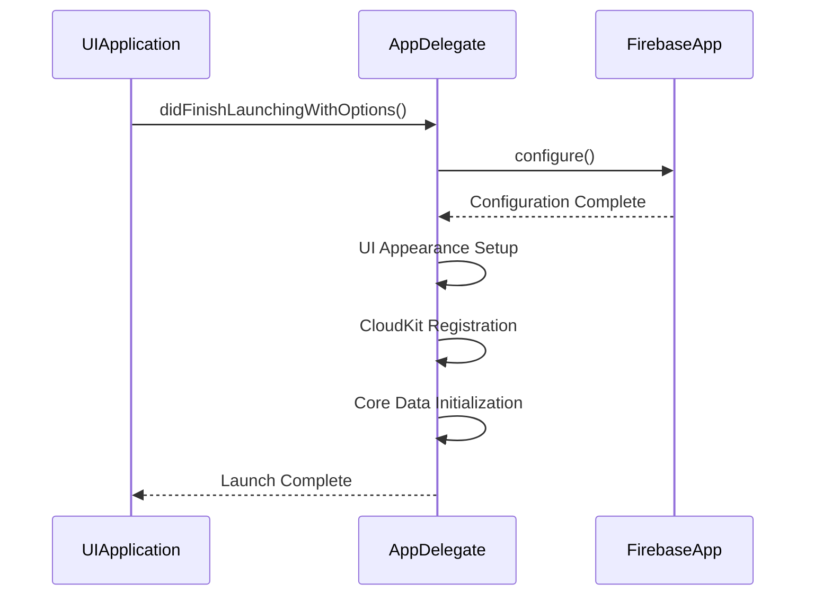
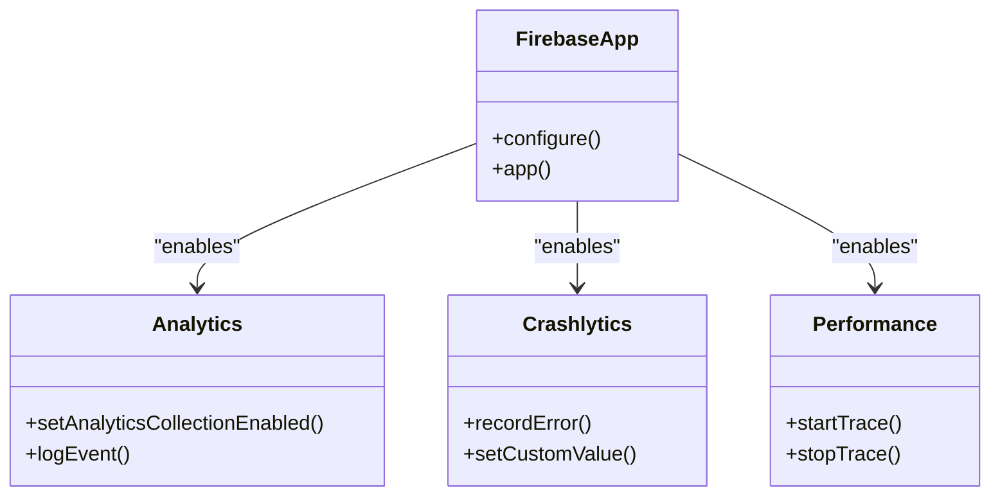

# Firebase Integration

<cite>
**Referenced Files in This Document**   
- [AppDelegate.swift](file://To%20Do%20List/AppDelegate.swift)
- [GoogleService-Info.plist](file://GoogleService-Info.plist)
- [Podfile](file://Podfile)
</cite>

## Table of Contents
1. [Introduction](#introduction)
2. [Project Structure and Firebase Setup](#project-structure-and-firebase-setup)
3. [Firebase Initialization in AppDelegate](#firebase-initialization-in-appdelegate)
4. [Firebase Services Configuration](#firebase-services-configuration)
5. [Event Logging and Performance Monitoring](#event-logging-and-performance-monitoring)
6. [Privacy and User Consent Considerations](#privacy-and-user-consent-considerations)
7. [Troubleshooting Common Firebase Issues](#troubleshooting-common-firebase-issues)
8. [Conclusion](#conclusion)

## Introduction
This document provides comprehensive documentation for the integration of Firebase services in the Tasker iOS application. It details the setup and configuration of Firebase Analytics, Crashlytics, and Performance Monitoring to support crash reporting, user behavior tracking, and app performance optimization. The integration is primarily handled during app launch in the `AppDelegate.swift` file, where Firebase is initialized and configured with the appropriate settings. This guide explains the technical implementation, best practices for privacy compliance, and troubleshooting strategies for common issues encountered during Firebase integration.

## Project Structure and Firebase Setup
The Tasker project includes Firebase configuration through CocoaPods dependency management and a Firebase configuration file. The `Podfile` specifies Firebase dependencies, while the `GoogleService-Info.plist` file contains essential configuration parameters for connecting the app to the Firebase backend. This file must be included in the app bundle and contains project-specific identifiers, API keys, and other metadata required for Firebase services to function correctly.

```mermaid
graph TB
A[Tasker App] --> B[GoogleService-Info.plist]
A --> C[Podfile]
C --> D[Firebase SDKs]
B --> E[FirebaseApp.configure()]
D --> F[Crashlytics]
D --> G[Analytics]
D --> H[Performance Monitoring]
```

**Diagram sources**
- [GoogleService-Info.plist](file://GoogleService-Info.plist)
- [Podfile](file://Podfile)

**Section sources**
- [GoogleService-Info.plist](file://GoogleService-Info.plist)
- [Podfile](file://Podfile)

## Firebase Initialization in AppDelegate
Firebase is initialized in the `application(_:didFinishLaunchingWithOptions:)` method of `AppDelegate.swift`. The `FirebaseApp.configure()` method is called early in the app launch sequence to ensure all Firebase services are ready before they are used. This initialization reads configuration from the `GoogleService-Info.plist` file and sets up the Firebase runtime environment.

The placement of `FirebaseApp.configure()` is critical—it occurs before any other Firebase-dependent operations, ensuring that services like Analytics and Crashlytics can capture events from the very beginning of the app lifecycle. This also enables Crashlytics to detect crashes that occur during startup.



**Diagram sources**
- [AppDelegate.swift](file://To%20Do%20List/AppDelegate.swift#L25-L30)

**Section sources**
- [AppDelegate.swift](file://To%20Do%20List/AppDelegate.swift#L1-L50)

## Firebase Services Configuration
The Firebase integration in Tasker includes multiple services that operate transparently after initialization:

- **Firebase Analytics**: Automatically collects user engagement data, screen views, and system events.
- **Crashlytics**: Monitors for crashes and reports detailed stack traces to the Firebase console.
- **Performance Monitoring**: Tracks app startup time, network requests, and UI responsiveness.

Although the codebase does not explicitly configure these services beyond `FirebaseApp.configure()`, their presence is confirmed by the inclusion of Firebase pods and the import statement in `AppDelegate.swift`. The Firebase SDK automatically enables core features when initialized, with advanced configurations typically handled via Firebase console settings or additional API calls.



**Diagram sources**
- [AppDelegate.swift](file://To%20Do%20List/AppDelegate.swift#L11)
- [Podfile](file://Podfile)

**Section sources**
- [AppDelegate.swift](file://To%20Do%20List/AppDelegate.swift#L10-L30)

## Event Logging and Performance Monitoring
While the current implementation does not include explicit event logging calls, Firebase Analytics automatically captures key user interactions such as screen transitions and app lifecycle events. Developers can extend this functionality by manually logging custom events using `Analytics.logEvent()` with appropriate parameters.

Performance Monitoring would automatically track app startup duration and other system-level metrics once enabled. For more granular tracking, custom performance traces can be implemented around critical code paths such as data loading or complex calculations.

```mermaid
flowchart TD
A[App Launch] --> B[FirebaseApp.configure()]
B --> C{Services Enabled?}
C --> |Yes| D[Analytics: Screen View Tracking]
C --> |Yes| E[Crashlytics: Crash Monitoring]
C --> |Yes| F[Performance: Startup Time]
D --> G[Data Sent to Firebase]
E --> G
F --> G
G --> H[Firebase Console]
```

**Diagram sources**
- [AppDelegate.swift](file://To%20Do%20List/AppDelegate.swift#L25-L30)

**Section sources**
- [AppDelegate.swift](file://To%20Do%20List/AppDelegate.swift#L20-L40)

## Privacy and User Consent Considerations
The current implementation initializes Firebase unconditionally, which may have implications for user privacy and compliance with regulations such as GDPR or CCPA. Best practices recommend implementing a user consent mechanism before enabling data collection.

Strategies for privacy compliance include:
- Delaying `FirebaseApp.configure()` until after user consent is obtained
- Using `Analytics.setAnalyticsCollectionEnabled(false)` by default and enabling only after consent
- Providing clear privacy policy disclosure in the app
- Allowing users to disable analytics in app settings

The `GoogleService-Info.plist` file contains sensitive configuration data that should not be exposed publicly, and version control systems should be configured to prevent accidental sharing.

**Section sources**
- [AppDelegate.swift](file://To%20Do%20List/AppDelegate.swift#L25)
- [GoogleService-Info.plist](file://GoogleService-Info.plist)

## Troubleshooting Common Firebase Issues
Common issues in Firebase integration and their solutions include:

### Initialization Failures
- **Symptom**: Missing logs or data in Firebase console
- **Cause**: `GoogleService-Info.plist` missing or incorrectly configured
- **Solution**: Verify file exists in app bundle and matches correct Firebase project

### Missing Crash Reports
- **Symptom**: Crashes not appearing in Crashlytics dashboard
- **Cause**: Build process not including Crashlytics run script
- **Solution**: Ensure `run` script is added in Xcode build phases for FirebaseCrashlytics

### Pod Version Conflicts
- **Symptom**: Compilation errors or runtime crashes
- **Cause**: Incompatible Firebase pod versions
- **Solution**: Use consistent versions across all Firebase pods and update via `pod update`

### Analytics Data Delays
- **Symptom**: Events not appearing in real-time dashboard
- **Cause**: Data batching and processing latency
- **Solution**: Enable debug mode with `-FIRDebugEnabled` launch argument for testing

**Section sources**
- [Podfile](file://Podfile)
- [AppDelegate.swift](file://To%20Do%20List/AppDelegate.swift#L25)
- [GoogleService-Info.plist](file://GoogleService-Info.plist)

## Conclusion
The Firebase integration in Tasker provides a foundation for monitoring app stability, performance, and user engagement through Firebase Crashlytics, Performance Monitoring, and Analytics. The initialization in `AppDelegate.swift` ensures early setup of Firebase services, enabling comprehensive data collection from app launch. To enhance privacy compliance, future improvements should include user consent mechanisms and configurable data collection. Proper maintenance of Firebase dependencies and configuration files is essential for reliable operation. With appropriate troubleshooting practices, developers can ensure robust Firebase integration that supports ongoing app improvement and user experience optimization.