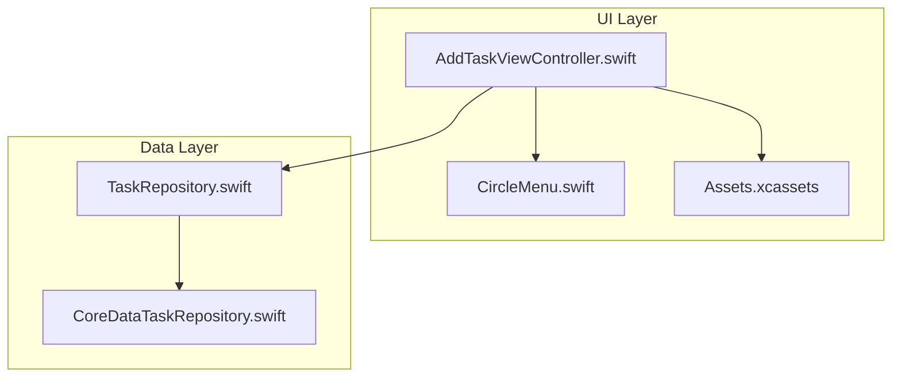
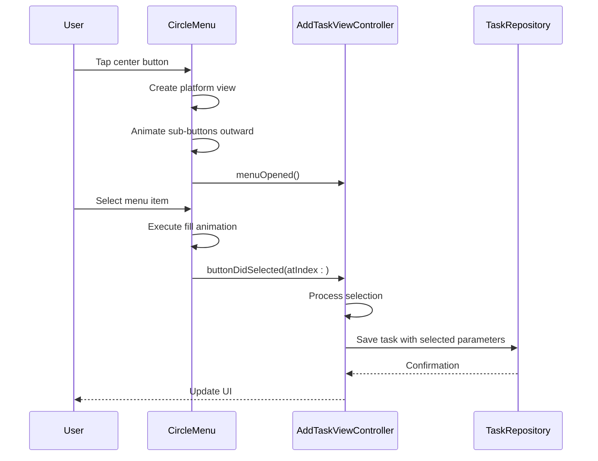
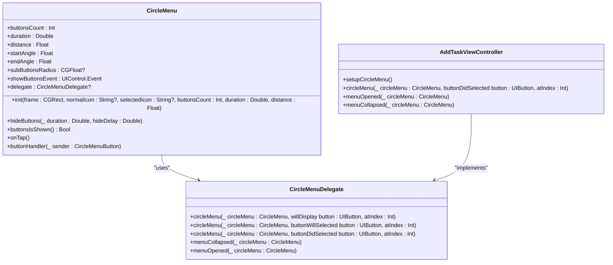
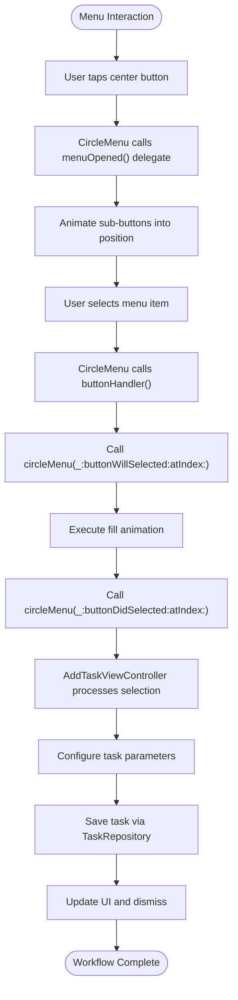
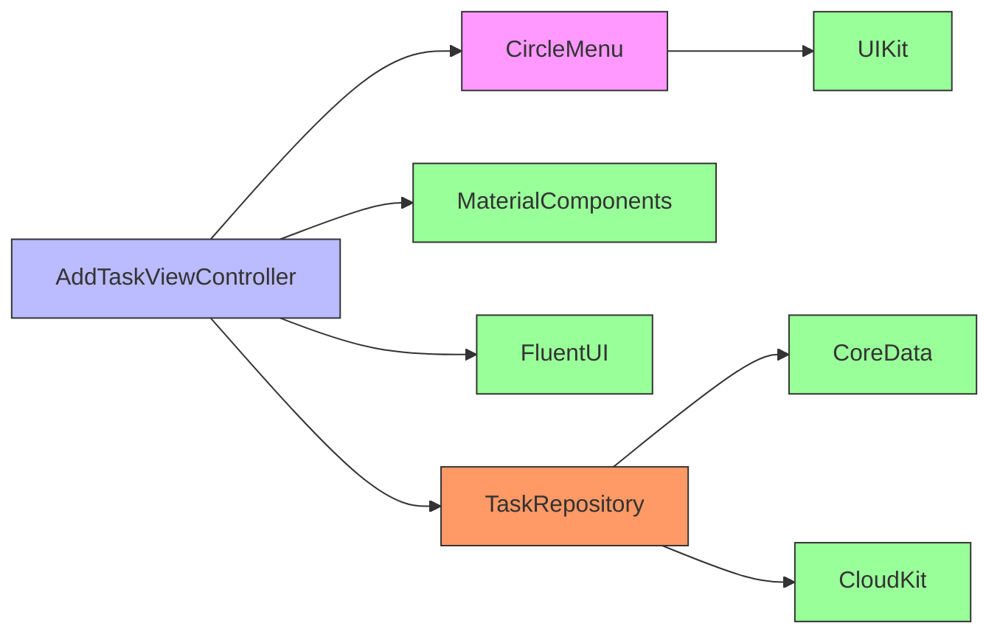

# CircleMenu Implementation

<cite>
**Referenced Files in This Document**   
- [CircleMenu.swift](file://Pods/CircleMenu/CircleMenuLib/CircleMenu.swift)
- [AddTaskViewController.swift](file://To Do List/ViewControllers/AddTaskViewController.swift)
- [Podfile](file://Podfile)
</cite>

## Table of Contents
1. [Introduction](#introduction)
2. [Project Structure](#project-structure)
3. [Core Components](#core-components)
4. [Architecture Overview](#architecture-overview)
5. [Detailed Component Analysis](#detailed-component-analysis)
6. [Dependency Analysis](#dependency-analysis)
7. [Performance Considerations](#performance-considerations)
8. [Troubleshooting Guide](#troubleshooting-guide)
9. [Conclusion](#conclusion)

## Introduction
The CircleMenu component in the Tasker application provides a radial menu interaction system that enables users to quickly access task creation shortcuts and navigation options. Integrated within the AddTaskViewController, this UI element enhances user experience by offering an intuitive, gesture-driven interface for initiating common actions. The implementation leverages the CircleMenu third-party library (version 4.1.0) with extensive customization to align with the app's Material Design aesthetic. This documentation details the integration, configuration, and behavior of the CircleMenu, including its delegate patterns, animation characteristics, and coordination with the task creation workflow.

## Project Structure
The CircleMenu functionality is implemented across multiple components within the Tasker project structure. The primary implementation resides in the AddTaskViewController, which manages the presentation and interaction logic for task creation. The CircleMenu library is integrated via CocoaPods and located in the Pods directory, while asset resources for menu icons are stored within the Assets.xcassets catalog. The integration follows a layered architecture where UI presentation, business logic, and data management responsibilities are separated.

**Diagram sources**
- [AddTaskViewController.swift](file://To Do List/ViewControllers/AddTaskViewController.swift#L1-L518)
- [CircleMenu.swift](file://Pods/CircleMenu/CircleMenuLib/CircleMenu.swift#L1-L551)

**Section sources**
- [AddTaskViewController.swift](file://To Do List/ViewControllers/AddTaskViewController.swift#L1-L518)
- [Podfile](file://Podfile#L1-L40)

## Core Components
The CircleMenu implementation consists of two primary components: the CircleMenu library itself, which provides the radial menu functionality, and the AddTaskViewController, which integrates and configures the menu for task creation workflows. The CircleMenu component exposes configurable properties for animation duration, button layout, and visual appearance, while the AddTaskViewController sets up the menu items, handles user interactions through delegate callbacks, and coordinates with the task repository for data persistence. The integration follows a delegate pattern where the view controller responds to menu events such as item selection and menu state changes.

**Section sources**
- [CircleMenu.swift](file://Pods/CircleMenu/CircleMenuLib/CircleMenu.swift#L1-L551)
- [AddTaskViewController.swift](file://To Do List/ViewControllers/AddTaskViewController.swift#L1-L518)

## Architecture Overview
The CircleMenu architecture follows a component-based design where the radial menu operates as a self-contained UI element that communicates with its host view controller through a well-defined delegate protocol. When activated, the CircleMenu creates a platform view to contain its sub-buttons and animates them into position along a circular path defined by the startAngle and endAngle properties. The AddTaskViewController acts as the delegate, receiving notifications about menu state changes and button selections, which it then translates into appropriate actions within the task creation workflow.

**Diagram sources**
- [CircleMenu.swift](file://Pods/CircleMenu/CircleMenuLib/CircleMenu.swift#L1-L551)
- [AddTaskViewController.swift](file://To Do List/ViewControllers/AddTaskViewController.swift#L1-L518)

## Detailed Component Analysis

### CircleMenu Configuration and Setup
The CircleMenu is configured within the AddTaskViewController to provide quick access to task creation options. The menu is initialized with specific parameters that define its appearance and behavior, including the number of buttons, animation duration, and radial distance. The setup process involves creating the CircleMenu instance, configuring its visual properties, and establishing the delegate relationship that enables event handling.

**Diagram sources**
- [CircleMenu.swift](file://Pods/CircleMenu/CircleMenuLib/CircleMenu.swift#L1-L551)

### Event Handling and Delegate Pattern
The CircleMenu employs a delegate pattern to communicate state changes and user interactions to the AddTaskViewController. When a menu item is selected, the buttonHandler method is triggered, which notifies the delegate through the circleMenu(_:buttonDidSelected:atIndex:) callback. This enables the view controller to respond appropriately by configuring task parameters based on the selected menu item and proceeding with task creation. The delegate pattern ensures loose coupling between the UI component and the business logic, allowing for flexible configuration and easy maintenance.

**Diagram sources**
- [CircleMenu.swift](file://Pods/CircleMenu/CircleMenuLib/CircleMenu.swift#L1-L551)
- [AddTaskViewController.swift](file://To Do List/ViewControllers/AddTaskViewController.swift#L1-L518)

**Section sources**
- [CircleMenu.swift](file://Pods/CircleMenu/CircleMenuLib/CircleMenu.swift#L1-L551)
- [AddTaskViewController.swift](file://To Do List/ViewControllers/AddTaskViewController.swift#L1-L518)

## Dependency Analysis
The CircleMenu implementation has several key dependencies that enable its functionality and integration within the Tasker application. The primary dependency is the CircleMenu library itself, which is managed through CocoaPods and specified in the Podfile with version constraint '~> 4.1.0'. This library depends on UIKit for all UI components and animations. The AddTaskViewController has dependencies on MaterialComponents for text field styling, FluentUI for button styling, and Core Data for task persistence. The integration also relies on the TaskRepository protocol for dependency injection, allowing for testability and separation of concerns.

**Diagram sources**
- [Podfile](file://Podfile#L1-L40)
- [CircleMenu.swift](file://Pods/CircleMenu/CircleMenuLib/CircleMenu.swift#L1-L551)
- [AddTaskViewController.swift](file://To Do List/ViewControllers/AddTaskViewController.swift#L1-L518)

**Section sources**
- [Podfile](file://Podfile#L1-L40)
- [CircleMenu.swift](file://Pods/CircleMenu/CircleMenuLib/CircleMenu.swift#L1-L551)

## Performance Considerations
The CircleMenu implementation includes several performance considerations to ensure smooth animations and responsive interactions, particularly on older devices. The animation system uses UIView property animations with spring damping for the center button bounce effect and CA animations for icon rotation and opacity changes. These animations are optimized to run on the main thread without blocking user interactions. The menu creates its sub-buttons and platform view only when needed (on first tap) and removes them after selection, minimizing memory usage. However, the radial animation of multiple buttons simultaneously may impact performance on devices with limited GPU capabilities, particularly when combined with other UI elements like the FSCalendar widget.

The CircleMenu library uses Core Animation for its visual effects, which are generally well-optimized by iOS. The fill animation that occurs when a menu item is selected uses a custom CircleMenuLoader that draws a circular progress indicator, which could be computationally intensive if multiple animations occur in quick succession. To mitigate performance issues, the implementation limits the animation duration and uses moderate spring damping values that balance visual appeal with performance.

**Section sources**
- [CircleMenu.swift](file://Pods/CircleMenu/CircleMenuLib/CircleMenu.swift#L1-L551)

## Troubleshooting Guide
Common issues with the CircleMenu implementation typically relate to delegate configuration, animation glitches, or layout problems. If menu items are not responding to taps, verify that the delegate is properly set and that the buttonHandler method is being called. Animation issues may occur if the superview constraints prevent proper layout of the platform view; ensure that the AddTaskViewController's view hierarchy allows the CircleMenu to insert its platform below the center button. For accessibility concerns, implement VoiceOver support by adding appropriate accessibility labels to menu items and ensuring that the radial layout does not interfere with screen reader navigation order.

When debugging animation problems, check that the duration, distance, and showDelay properties are set to reasonable values, as extreme values can cause unexpected behavior. If the menu appears clipped or positioned incorrectly, verify that the superview has sufficient space for the expanded menu (determined by the distance property multiplied by 2). For issues with button selection, confirm that the tag values of the CircleMenuButton instances correctly correspond to their index positions, as these are used to identify which menu item was selected.

**Section sources**
- [CircleMenu.swift](file://Pods/CircleMenu/CircleMenuLib/CircleMenu.swift#L1-L551)
- [AddTaskViewController.swift](file://To Do List/ViewControllers/AddTaskViewController.swift#L1-L518)

## Conclusion
The CircleMenu implementation in Tasker provides an intuitive radial interface for quick task creation and navigation, enhancing the user experience through gesture-driven interactions. The integration with AddTaskViewController demonstrates effective use of the delegate pattern to separate UI concerns from business logic, allowing for flexible configuration and easy maintenance. The component is highly customizable in terms of layout, animation, and appearance, enabling it to match the application's design language. While the implementation performs well on modern devices, attention should be paid to animation optimization for older hardware. Future improvements could include enhanced accessibility support and dynamic menu item configuration based on user preferences or context.