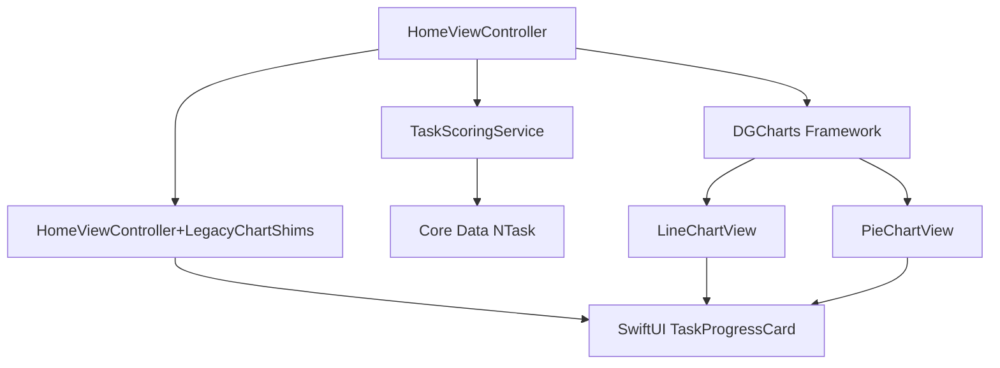
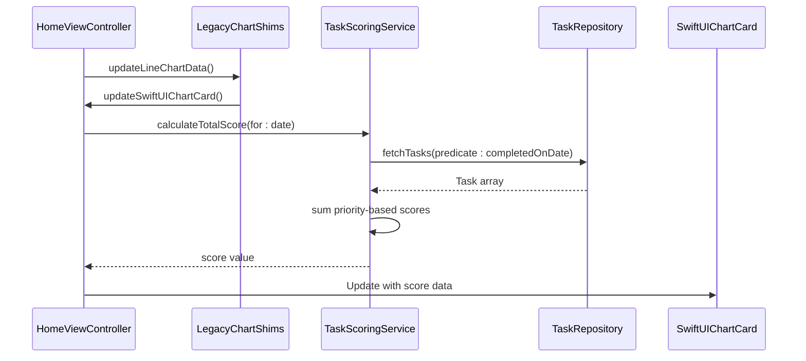
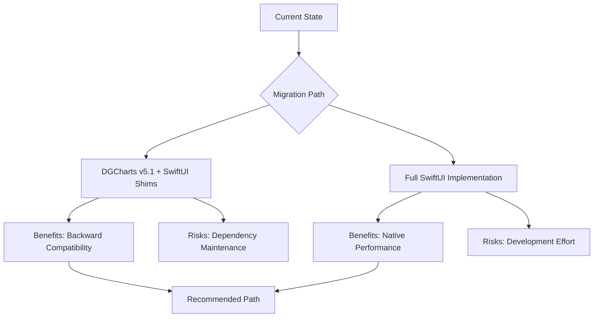

# DGCharts Integration

<cite>
**Referenced Files in This Document**   
- [Podfile](file://Podfile#L1-L39)
- [HomeViewController+LegacyChartShims.swift](file://To%20Do%20List/ViewControllers/HomeViewController+LegacyChartShims.swift#L1-L40)
- [TaskScoringService.swift](file://To%20Do%20List/Services/TaskScoringService.swift#L1-L153)
- [README.md](file://README.md#L1035-L1319)
</cite>

## Table of Contents
1. [Introduction](#introduction)
2. [Project Structure and Integration Context](#project-structure-and-integration-context)
3. [DGCharts Configuration and Usage](#dgcharts-configuration-and-usage)
4. [Data Binding from TaskScoringService](#data-binding-from-taskscoringservice)
5. [Chart Customization and Theming](#chart-customization-and-theming)
6. [Dynamic Updates and Event Handling](#dynamic-updates-and-event-handling)
7. [Performance Considerations](#performance-considerations)
8. [Accessibility and Responsiveness](#accessibility-and-responsiveness)
9. [Version Compatibility and Upgrade Paths](#version-compatibility-and-upgrade-paths)
10. [Conclusion](#conclusion)

## Introduction
This document provides comprehensive documentation on the integration of DGCharts within the Tasker application, specifically in the HomeViewController. It details how task completion analytics and daily scoring visualizations are rendered using the DGCharts framework. The documentation covers chart configuration, data binding from the TaskScoringService, visual customization, dynamic updates, performance optimization, accessibility, and version compatibility. Although legacy charting code has been migrated to SwiftUI, DGCharts remains a critical dependency for backward compatibility and transitional support.

**Section sources**
- [README.md](file://README.md#L1035-L1055)

## Project Structure and Integration Context
The DGCharts integration is primarily managed within the HomeViewController and its associated extensions. While the original implementation used DGCharts directly, the current architecture has transitioned to SwiftUI-based components with legacy shims maintaining compatibility. The charting functionality is supported by the TaskScoringService, which calculates scores based on task priority and completion status. The Podfile specifies DGCharts version 5.1 as a dependency, indicating a stable integration point for visualization features.

**Diagram sources**
- [Podfile](file://Podfile#L1-L39)
- [HomeViewController+LegacyChartShims.swift](file://To%20Do%20List/ViewControllers/HomeViewController+LegacyChartShims.swift#L1-L40)

**Section sources**
- [Podfile](file://Podfile#L1-L39)
- [HomeViewController+LegacyChartShims.swift](file://To%20Do%20List/ViewControllers/HomeViewController+LegacyChartShims.swift#L1-L40)

## DGCharts Configuration and Usage
DGCharts is configured to render two primary visualization types within the HomeViewController: line charts for score trend analysis and pie/bar charts for priority distribution and completion ratios. The line charts display historical productivity trends with cubic Bezier curve smoothing, while pie charts visualize task completion ratios. Although direct chart instantiation now occurs in SwiftUI components, the legacy Objective-C compatible methods in HomeViewController+LegacyChartShims maintain the interface contract with DGCharts.

The framework supports interactive features including touch-enabled data point exploration, custom markers, and balloon tooltips. Chart types are selected based on the analytical context: line charts for temporal trends and pie/bar charts for categorical distributions. The configuration includes dynamic scaling for daily, weekly, and monthly views, synchronized with the FSCalendar component.

**Section sources**
- [README.md](file://README.md#L1269-L1319)

## Data Binding from TaskScoringService
Data for DGCharts visualizations is sourced from the TaskScoringService, which calculates task scores based on priority levels (high: 7 points, medium: 4 points, low: 2 points, very low: 1 point). The service provides methods to calculate total daily scores, efficiency percentages, and streak counts by querying completed tasks from the Core Data repository.

The data binding flow begins with the HomeViewController invoking scoring calculations through the shared TaskScoringService instance. Results are then formatted into chart data entries (ChartDataEntry objects) and assigned to the appropriate chart datasets. For line charts, time-series data is generated by calculating scores across consecutive days. The updateLineChartData method orchestrates this process, though it now delegates to SwiftUI components rather than directly manipulating DGCharts views.

**Diagram sources**
- [TaskScoringService.swift](file://To%20Do%20List/Services/TaskScoringService.swift#L1-L153)
- [HomeViewController+LegacyChartShims.swift](file://To%20Do%20List/ViewControllers/HomeViewController+LegacyChartShims.swift#L1-L40)

**Section sources**
- [TaskScoringService.swift](file://To%20Do%20List/Services/TaskScoringService.swift#L1-L153)

## Chart Customization and Theming
Visual elements of DGCharts are customized to align with the app's design language, which combines FluentUI and Material Design components. Chart colors are derived from the ToDoColors system, with primary and secondary accent colors applied to data series. The theming includes shadow effects for visual depth, responsive font sizing based on score magnitude, and dynamic center text in pie charts.

Animations are configured for smooth transitions when data updates, though the legacy animateLineChart method is now a no-op as animation is handled natively within the SwiftUI components. The setupChartsInBackdrop method ensures the SwiftUI chart container is initialized when needed, maintaining the visual layout within the app's backdrop design system.

**Section sources**
- [README.md](file://README.md#L1356-L1389)

## Dynamic Updates and Event Handling
Charts are updated dynamically in response to task state changes through a combination of legacy shims and modern SwiftUI integration. When tasks are completed or modified, the HomeViewController triggers chart updates via the updateLineChartData method, which forwards the request to the SwiftUI TaskProgressCard component. This bridging pattern allows the gradual migration from UIKit-based charts to SwiftUI while maintaining functionality.

The real-time update system leverages Core Data's NSFetchedResultsController integration to detect changes and trigger UI updates on the main thread. Score calculations are performed asynchronously to prevent blocking the main thread, with results dispatched back for chart rendering. The legacy shims ensure that existing code paths continue to function during the transition period.

**Section sources**
- [HomeViewController+LegacyChartShims.swift](file://To%20Do%20List/ViewControllers/HomeViewController+LegacyChartShims.swift#L1-L40)

## Performance Considerations
Performance optimization for chart rendering focuses on efficient data processing and smooth animations. The TaskScoringService limits streak calculations to a maximum of 30 days to prevent excessive database queries. Score calculations are performed on background queues to avoid UI blocking, with results delivered via completion handlers.

For large datasets, the system employs lazy loading and background processing to maintain 60fps animations. The migration to SwiftUI has improved rendering performance by leveraging declarative updates and efficient diffing algorithms. The legacy DGCharts implementation included cubic Bezier smoothing for elegant visualization, which was optimized to balance visual quality with rendering performance.

**Section sources**
- [TaskScoringService.swift](file://To%20Do%20List/Services/TaskScoringService.swift#L1-L153)

## Accessibility and Responsiveness
The charting system supports accessibility features including screen reader compatibility and Dynamic Type font scaling. Visual elements maintain clarity across different text sizes and device dimensions, with responsive layout adjustments ensuring readability on all screen sizes. The SwiftUI migration has enhanced accessibility by providing better semantic information to assistive technologies.

Interactive chart elements include touch exploration with custom markers and balloon tooltips that provide detailed information about data points. The color system ensures sufficient contrast for users with visual impairments, and alternative visual indicators are available for color-blind users through the app's theming system.

**Section sources**
- [README.md](file://README.md#L1170-L1207)

## Version Compatibility and Upgrade Paths
DGCharts is integrated at version 5.1, as specified in the Podfile, with compatibility targeting iOS 16.0 and later. The dependency is managed through CocoaPods, ensuring consistent versioning across development environments. The current implementation represents a transitional state, with legacy DGCharts code being gradually replaced by SwiftUI components.

Future upgrade paths include complete migration to SwiftUI-native charting, which would eliminate the dependency on DGCharts. However, the current shim architecture allows for incremental migration while maintaining backward compatibility. The Podfile configuration includes version pinning (~> 5.1) to prevent breaking changes from automatic updates.

**Diagram sources**
- [Podfile](file://Podfile#L1-L39)

**Section sources**
- [Podfile](file://Podfile#L1-L39)

## Conclusion
The DGCharts integration in Tasker provides robust visualization capabilities for task completion analytics and daily scoring. While the architecture is transitioning to SwiftUI-based components, DGCharts remains a critical part of the codebase through legacy shims that ensure backward compatibility. The system effectively binds data from the TaskScoringService, customizes visual elements to match the app's theme, and handles dynamic updates with performance optimizations. The current implementation balances modern SwiftUI advantages with the stability of the established DGCharts framework, providing a solid foundation for future enhancements.