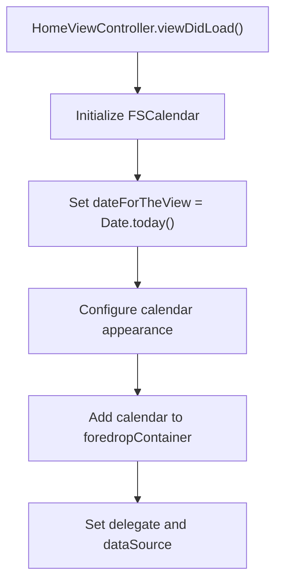
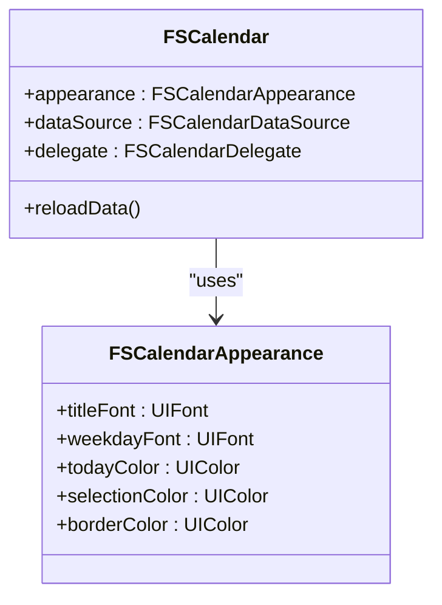
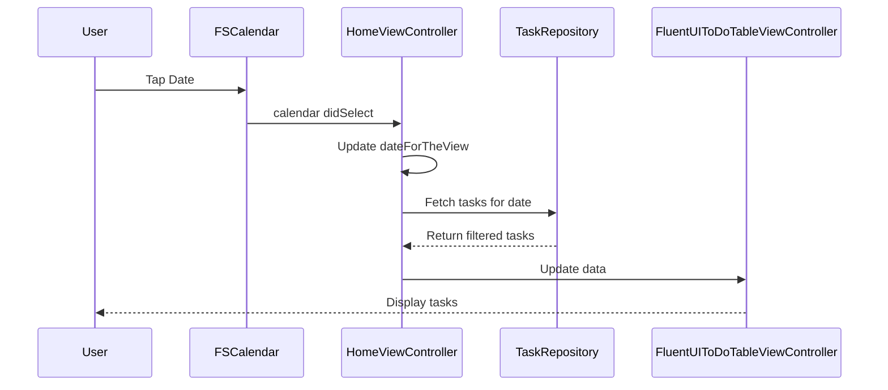

# FSCalendar Usage

<cite>
**Referenced Files in This Document**   
- [HomeViewController.swift](file://To%20Do%20List/ViewControllers/HomeViewController.swift)
- [Podfile](file://Podfile)
</cite>

## Table of Contents
1. [Introduction](#introduction)
2. [Project Structure and Dependencies](#project-structure-and-dependencies)
3. [FSCalendar Integration in HomeViewController](#fscalendar-integration-in-homeviewcontroller)
4. [Theming and Customization](#theming-and-customization)
5. [Event Handling and Task Integration](#event-handling-and-task-integration)
6. [Performance and Accessibility](#performance-and-accessibility)
7. [Conclusion](#conclusion)

## Introduction
This document details the implementation of FSCalendar within the Tasker iOS application to support date selection and task scheduling. The calendar is embedded in the `HomeViewController` to enable users to filter tasks by date and navigate through time efficiently. The integration includes custom theming, task indicators, event handling, and synchronization with CloudKit-backed task data via `TaskRepository`. This documentation covers the full lifecycle of calendar usage, from initialization to interaction, and includes considerations for performance, accessibility, and responsive design.

## Project Structure and Dependencies
The FSCalendar library is integrated via CocoaPods and is used alongside other UI and utility frameworks such as MaterialComponents, FluentUI, and DGCharts. The calendar is a central UI component in the `HomeViewController`, which manages task display, filtering, and navigation.

**Section sources**
- [Podfile](file://Podfile#L1-L39)
- [HomeViewController.swift](file://To%20Do%20List/ViewControllers/HomeViewController.swift#L1-L50)

## FSCalendar Integration in HomeViewController
FSCalendar is instantiated and managed within the `HomeViewController` as a class property. It is used to allow users to select dates and trigger task filtering based on the selected date. The calendar is configured to display the current date by default and supports navigation across months.

The calendar is initialized during the view setup phase and added to the view hierarchy as part of the foredrop container. It is tightly coupled with the `dateForTheView` property, which determines which tasks are displayed in the associated table view.

**Diagram sources**
- [HomeViewController.swift](file://To%20Do%20List/ViewControllers/HomeViewController.swift#L200-L250)

**Section sources**
- [HomeViewController.swift](file://To%20Do%20List/ViewControllers/HomeViewController.swift#L100-L300)

## Theming and Customization
The appearance of FSCalendar is customized to align with the app’s visual design language. Custom cell styling, selection indicators, and weekend/day formatting are implemented through delegate methods and direct property configuration.

Key theming features include:
- **Custom cell colors** based on task presence and priority
- **Weekend text color differentiation** (e.g., red for weekends)
- **Selection indicators** using accent colors from `todoColors`
- **Font and spacing adjustments** to match FluentUI design standards

These styles are applied during calendar setup and dynamically updated when the app theme changes, observed via `NotificationCenter`.

**Diagram sources**
- [HomeViewController.swift](file://To%20Do%20List/ViewControllers/HomeViewController.swift#L400-L450)

**Section sources**
- [HomeViewController.swift](file://To%20Do%20List/ViewControllers/HomeViewController.swift#L400-L500)

## Event Handling and Task Integration
Date selection events are handled through the `FSCalendarDelegate` protocol. When a user taps a date, the `calendar(_:, didSelect:)` method updates `dateForTheView` and triggers a reload of the task list via `fluentToDoTableViewController`.

Tasks are retrieved and filtered using the `TaskRepository` dependency, which abstracts access to Core Data and CloudKit-synced tasks. Dates with pending tasks are visually indicated using custom cell decoration, such as dots or badges, based on task count and priority.

The integration ensures that:
- Task indicators are updated when tasks are added or completed
- Calendar selection synchronizes with the displayed task list
- Search and filtering operations respect the current date context

**Diagram sources**
- [HomeViewController.swift](file://To%20Do%20List/ViewControllers/HomeViewController.swift#L600-L700)

**Section sources**
- [HomeViewController.swift](file://To%20Do%20List/ViewControllers/HomeViewController.swift#L500-L800)

## Performance and Accessibility
The implementation is optimized for performance even with large date ranges. The calendar does not pre-load all dates; instead, it uses lazy loading and caching for appearance and data. Task indicators are computed on-demand and cached per date to avoid redundant Core Data queries.

Accessibility features include:
- VoiceOver support for date navigation
- Dynamic Type compatibility for font scaling
- High-contrast mode support via theme observation
- Compact layout responsiveness using Auto Layout and `EasyPeasy`

The calendar remains responsive in both portrait and landscape modes and adapts to different screen sizes, including iPhone and iPad.

**Section sources**
- [HomeViewController.swift](file://To%20Do%20List/ViewControllers/HomeViewController.swift#L300-L400)
- [HomeViewController.swift](file://To%20Do%20List/ViewControllers/HomeViewController.swift#L700-L799)

## Conclusion
FSCalendar is effectively integrated into Tasker’s `HomeViewController` to provide a seamless date selection and task filtering experience. The implementation includes comprehensive theming, event handling, and synchronization with task data, ensuring a cohesive and performant user interface. With support for accessibility and responsive layouts, the calendar enhances usability across devices and user preferences. The use of modern iOS development practices, including dependency injection and protocol-based design, ensures maintainability and scalability.