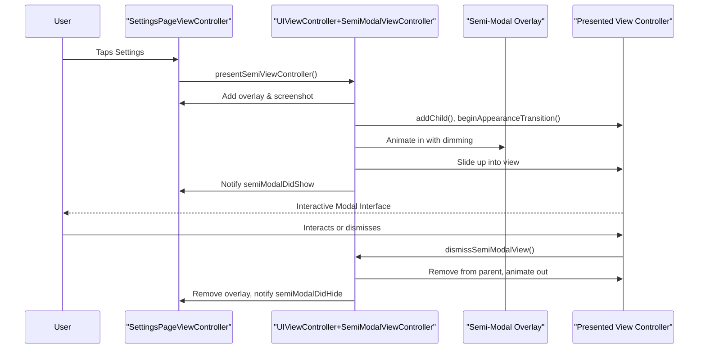
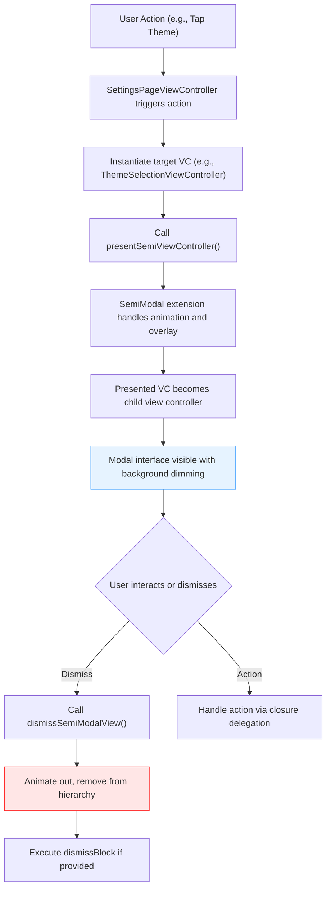
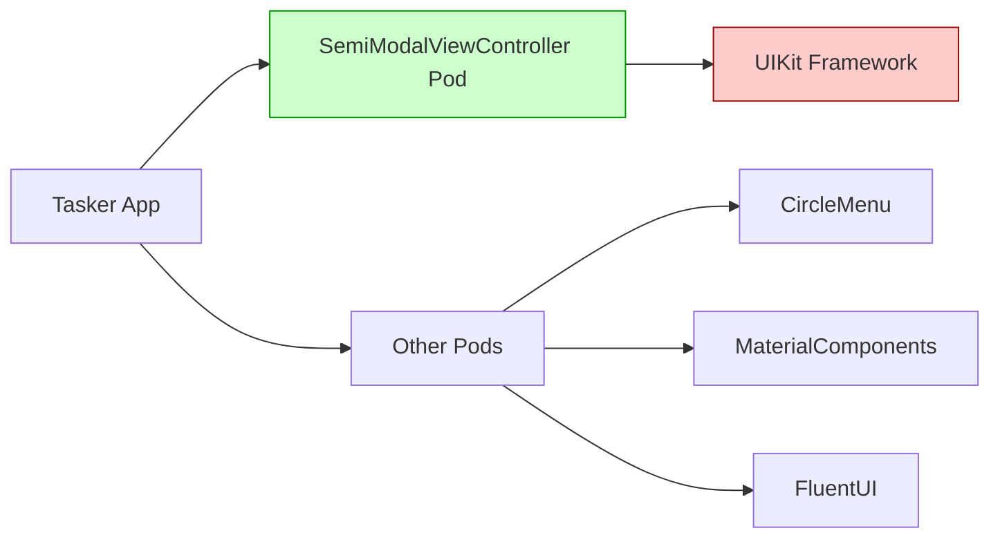

# SemiModalViewController Patterns

<cite>
**Referenced Files in This Document**  
- [SettingsPageViewController.swift](file://To Do List/ViewControllers/SettingsPageViewController.swift)
- [UIViewController+SemiModalViewController.swift](file://Pods/SemiModalViewController/Source/UIViewController+SemiModalViewController.swift)
- [UIView+SemiModalViewController.swift](file://Pods/SemiModalViewController/Source/UIView+SemiModalViewController.swift)
- [UIDevice+SemiModalViewController.swift](file://Pods/SemiModalViewController/Source/UIDevice+SemiModalViewController.swift)
- [Podfile](file://Podfile)
</cite>

## Table of Contents
1. [Introduction](#introduction)
2. [Project Structure](#project-structure)
3. [Core Components](#core-components)
4. [Architecture Overview](#architecture-overview)
5. [Detailed Component Analysis](#detailed-component-analysis)
6. [Dependency Analysis](#dependency-analysis)
7. [Performance Considerations](#performance-considerations)
8. [Troubleshooting Guide](#troubleshooting-guide)
9. [Conclusion](#conclusion)

## Introduction
This document details the implementation and usage of `SemiModalViewController` within the Tasker iOS application to present non-blocking modal interfaces such as settings or task details. It explains the presentation logic initiated from `SettingsPageViewController`, including animation styles, dismissal gestures, callback handling, and customization options like presentation height, background dimming, and edge swipe behavior. The integration with view controller lifecycle events, advantages over standard modals, accessibility considerations, keyboard avoidance strategies, and version compatibility are also discussed.

## Project Structure
The project structure reveals a modular organization focused on view controllers and UI assets. The core functionality for semi-modal presentation resides in the `Pods/SemiModalViewController` directory, while the primary consumer of this functionality is `SettingsPageViewController.swift` located in the `ViewControllers` folder. Assets and UI components are organized under `Assets.xcassets`, supporting visual elements for buttons, icons, and themes.

```mermaid
graph TB
subgraph "UI Layer"
SettingsPageViewController["SettingsPageViewController.swift"]
ThemeSelectionCell["ThemeSelectionCell.swift"]
ProjectManagementViewControllerEmbedded["ProjectManagementViewControllerEmbedded.swift"]
end
subgraph "Pods"
SemiModalViewController["SemiModalViewController (Pod)"]
UIDeviceExtension["UIDevice+SemiModalViewController.swift"]
UIViewExtension["UIView+SemiModalViewController.swift"]
UIViewControllerExtension["UIViewController+SemiModalViewController.swift"]
end
subgraph "Assets"
Assets["Assets.xcassets"]
end
SettingsPageViewController --> SemiModalViewController : "Uses"
SemiModalViewController --> UIDeviceExtension : "Extends"
SemiModalViewController --> UIViewExtension : "Extends"
SemiModalViewController --> UIViewControllerExtension : "Extends"
```

**Diagram sources**
- [SettingsPageViewController.swift](file://To Do List/ViewControllers/SettingsPageViewController.swift#L1-L562)
- [UIViewController+SemiModalViewController.swift](file://Pods/SemiModalViewController/Source/UIViewController+SemiModalViewController.swift#L1-L263)

**Section sources**
- [SettingsPageViewController.swift](file://To Do List/ViewControllers/SettingsPageViewController.swift#L1-L562)
- [Podfile](file://Podfile#L1-L39)

## Core Components
The core components involved in the semi-modal presentation pattern include the `SettingsPageViewController` as the presenting view controller and the `SemiModalViewController` pod that provides the presentation logic through category extensions on `UIViewController`, `UIView`, and `UIDevice`. These components work together to enable a modern, non-intrusive user interface for settings and configuration screens.

**Section sources**
- [SettingsPageViewController.swift](file://To Do List/ViewControllers/SettingsPageViewController.swift#L1-L562)
- [UIViewController+SemiModalViewController.swift](file://Pods/SemiModalViewController/Source/UIViewController+SemiModalViewController.swift#L1-L263)

## Architecture Overview
The architecture leverages a category-based extension model where `UIViewController` gains new presentation capabilities via the `presentSemiViewController` and `presentSemiView` methods. This design allows any view controller to present semi-modal content without subclassing, promoting reusability and loose coupling. The presentation is managed through associated objects and view tagging, ensuring clean encapsulation of state.



**Diagram sources**
- [UIViewController+SemiModalViewController.swift](file://Pods/SemiModalViewController/Source/UIViewController+SemiModalViewController.swift#L50-L250)
- [SettingsPageViewController.swift](file://To Do List/ViewControllers/SettingsPageViewController.swift#L100-L110)

## Detailed Component Analysis

### SettingsPageViewController Integration
The `SettingsPageViewController` serves as the entry point for presenting semi-modal interfaces in Tasker. It uses standard UIKit navigation patterns but relies on the `SemiModalViewController` extension for non-blocking presentation of child view controllers such as theme selection or project management.

#### Presentation Flow


**Diagram sources**
- [SettingsPageViewController.swift](file://To Do List/ViewControllers/SettingsPageViewController.swift#L150-L160)
- [UIViewController+SemiModalViewController.swift](file://Pods/SemiModalViewController/Source/UIViewController+SemiModalViewController.swift#L50-L100)

#### Delegate and Callback Handling
The semi-modal system uses block-based callbacks rather than formal delegate protocols. When presenting a view controller, an optional `dismissBlock` can be provided to handle post-dismissal logic. This pattern is used to coordinate state changes after user interaction in the modal.

**Section sources**
- [SettingsPageViewController.swift](file://To Do List/ViewControllers/SettingsPageViewController.swift#L140-L170)
- [UIViewController+SemiModalViewController.swift](file://Pods/SemiModalViewController/Source/UIViewController+SemiModalViewController.swift#L50-L80)

### SemiModalViewController Implementation
The `SemiModalViewController` library extends `UIViewController` with presentation capabilities using Objective-C associated objects to maintain state. It manages a custom view hierarchy including an overlay, screenshot of the parent, and the modal view itself.

#### Key Presentation Options
| Option | Type | Default | Description |
|-------|------|---------|-------------|
| `traverseParentHierarchy` | Bool | false | Whether to traverse up the parent view controller hierarchy to find the root |
| `pushParentBack` | Bool | false | Applies a 3D-like perspective animation to the background |
| `animationDuration` | TimeInterval | 0.3 | Duration of presentation/dismissal animations |
| `parentAlpha` | Double | 0.5 | Opacity of the dimmed background view |
| `parentScale` | Double | 0.95 | Scale factor applied to background when pushParentBack is enabled |
| `shadowOpacity` | Double | 0.3 | Shadow intensity under the modal view |
| `transitionStyle` | SemiModalTransitionStyle | slideUp | Animation style: slideUp, fadeInOut, fadeIn, fadeOut |
| `disableCancel` | Bool | false | If true, tapping the overlay will not dismiss the modal |
| `backgroundView` | UIView | nil | Custom view to use as the overlay instead of default black dimming |

**Section sources**
- [UIViewController+SemiModalViewController.swift](file://Pods/SemiModalViewController/Source/UIViewController+SemiModalViewController.swift#L20-L45)

#### Animation and Layout Logic
The presentation height is determined by the frame size of the view being presented. The modal is positioned at the bottom of the screen and slides up into place. On iPad, it centers horizontally; on iPhone, it spans the full width.

```mermaid
classDiagram
class UIViewController {
+presentSemiViewController(_ : options : completion : dismissBlock)
+presentSemiView(_ : options : completion)
+dismissSemiModalView()
+dismissSemiModalViewWithCompletion(_ : )
}
class UIView {
+width
+height
+x
+y
}
class UIDevice {
+isPad() bool
}
UIViewController --> UIView : "Uses frame properties"
UIViewController --> UIDevice : "Checks device type"
UIViewController ..> "Associated Objects" : "Stores vc, dismissBlock"
UIViewController ..> "Notifications" : "Posts semiModalDidShow/Hid"
note right of UIViewController
Manages presentation lifecycle using
tags (10001-10003) and associated objects.
Uses animateWithDuration for smooth transitions.
end note
```

**Diagram sources**
- [UIViewController+SemiModalViewController.swift](file://Pods/SemiModalViewController/Source/UIViewController+SemiModalViewController.swift#L100-L250)
- [UIView+SemiModalViewController.swift](file://Pods/SemiModalViewController/Source/UIView+SemiModalViewController.swift#L1-L40)
- [UIDevice+SemiModalViewController.swift](file://Pods/SemiModalViewController/Source/UIDevice+SemiModalViewController.swift#L1-L9)

## Dependency Analysis
The `SemiModalViewController` functionality is integrated via CocoaPods, as specified in the Podfile. It has no external dependencies beyond UIKit and is designed as a lightweight category extension.



**Diagram sources**
- [Podfile](file://Podfile#L1-L39)

**Section sources**
- [Podfile](file://Podfile#L1-L39)
- [UIViewController+SemiModalViewController.swift](file://Pods/SemiModalViewController/Source/UIViewController+SemiModalViewController.swift#L1-L10)

## Performance Considerations
The semi-modal implementation captures a screenshot of the parent view during presentation, which may impact performance on older devices or complex view hierarchies. However, the rasterization of the modal view layer improves rendering performance during animations. The use of associated objects and view tagging ensures minimal memory overhead, and the animation duration is configurable to balance visual appeal with responsiveness.

## Troubleshooting Guide
Common issues when using `SemiModalViewController` include view hierarchy conflicts, incorrect frame sizing, and dismissal callback not firing. Ensure that the presented view controller's view has a defined height before presentation. Avoid presenting multiple semi-modals simultaneously to prevent overlay stacking. If the dimming effect does not appear, verify that the `backgroundView` option is not set to a non-transparent view.

**Section sources**
- [UIViewController+SemiModalViewController.swift](file://Pods/SemiModalViewController/Source/UIViewController+SemiModalViewController.swift#L150-L200)
- [SettingsPageViewController.swift](file://To Do List/ViewControllers/SettingsPageViewController.swift#L100-L120)

## Conclusion
The `SemiModalViewController` provides a flexible and modern approach to presenting non-blocking modal interfaces in Tasker. Its category-based design allows seamless integration with existing view controllers like `SettingsPageViewController`, enabling rich user experiences with minimal code changes. The customizable presentation options, combined with smooth animations and proper lifecycle integration, make it a superior alternative to standard fullscreen modals for settings and detail views. Care should be taken with accessibility and keyboard presentation to ensure a consistent user experience across all device configurations.