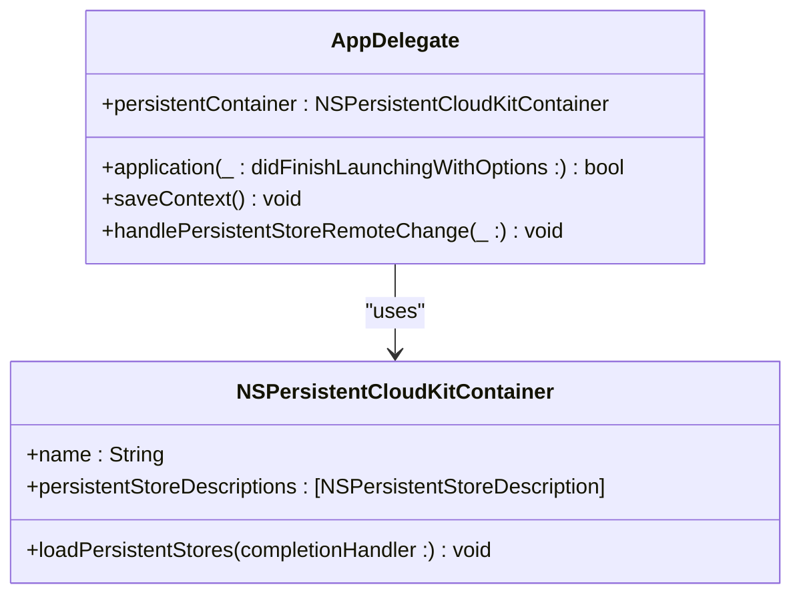
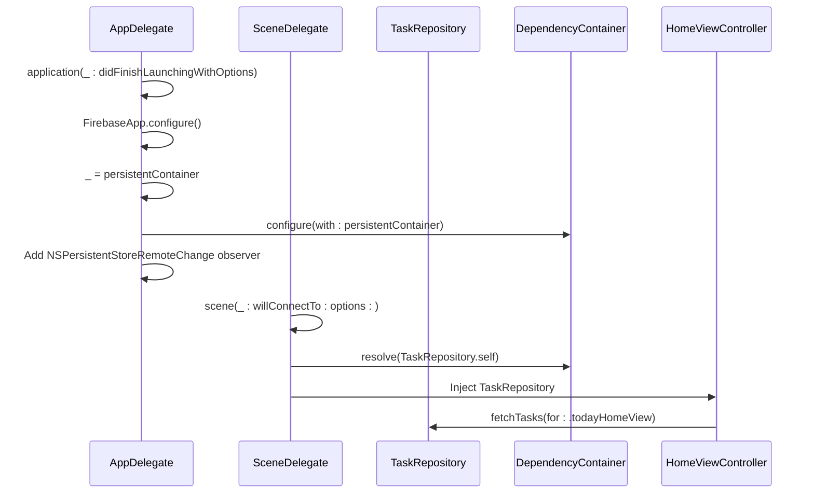

# Getting Started

<cite>
**Referenced Files in This Document**   
- [Podfile](file://Podfile)
- [AppDelegate.swift](file://To Do List/AppDelegate.swift)
- [SceneDelegate.swift](file://To Do List/SceneDelegate.swift)
- [TaskManager.swift](file://To Do List/TaskManager.swift)
- [ProjectManager.swift](file://To Do List/ProjectManager.swift)
- [HomeViewController.swift](file://To Do List/HomeViewController.swift)
- [AddTaskViewController.swift](file://To Do List/AddTaskViewController.swift)
</cite>

## Table of Contents
1. [Prerequisites](#prerequisites)
2. [Environment Setup](#environment-setup)
3. [Project Configuration](#project-configuration)
4. [Running the Application](#running-the-application)
5. [Basic App Usage](#basic-app-usage)
6. [Configuration Files and Code Structure](#configuration-files-and-code-structure)
7. [Troubleshooting](#troubleshooting)

## Prerequisites

Before setting up the Tasker development environment, ensure you have the following prerequisites installed and configured:

- **Xcode 16.0 or later**: The project requires iOS 16.0 as the minimum deployment target, as specified in the Podfile.
- **Apple ID with iCloud enabled**: Required for CloudKit synchronization and testing iCloud functionality.
- **CocoaPods 1.10.0 or later**: Used for dependency management.
- **Firebase account**: Necessary for Analytics, Crashlytics, and Performance Monitoring.
- **Physical iOS device (recommended)**: For testing iCloud and push notifications, as simulator limitations may affect CloudKit functionality.

**Section sources**
- [Podfile](file://Podfile#L1-L2)
- [AppDelegate.swift](file://To Do List/AppDelegate.swift#L1-L10)

## Environment Setup

Follow these steps to set up the Tasker development environment:

### 1. Clone the Repository
```bash
git clone https://github.com/saransh1337/Tasker.git
cd Tasker
```

### 2. Install CocoaPods Dependencies
Run the following command to install all required dependencies:
```bash
pod install
```

This will install the following key dependencies:
- **Firebase/Analytics**, **Firebase/Crashlytics**, **Firebase/Performance**: For analytics and monitoring
- **DGCharts**: For data visualization and analytics dashboard
- **FSCalendar**: For calendar integration and date-based views
- **MicrosoftFluentUI**: For modern UI components and FluentUI design system
- **BEMCheckBox**: For inline checkboxes and task completion UI
- **CircleMenu**: For custom menu components

After installation, always open the workspace file (not the project file) in Xcode:
```bash
open Tasker.xcworkspace
```

**Section sources**
- [Podfile](file://Podfile#L4-L39)

## Project Configuration

### Firebase Configuration
1. Create a Firebase project at [Firebase Console](https://console.firebase.google.com/)
2. Register your iOS app with the bundle identifier `com.saransh1337.Tasker`
3. Download the `GoogleService-Info.plist` file and add it to the `To Do List` directory in Xcode
4. Ensure the file is included in the app target

### iCloud Configuration
1. In Xcode, select the project target and go to the "Signing & Capabilities" tab
2. Add the "iCloud" capability
3. Enable CloudKit and check the "iCloud Documents" option
4. Ensure the container identifier matches `iCloud.TaskerCloudKit` as specified in AppDelegate.swift

The Core Data stack is configured with `NSPersistentCloudKitContainer` for automatic CloudKit synchronization. The container is initialized in the `persistentContainer` lazy property in AppDelegate.swift.



**Diagram sources**
- [AppDelegate.swift](file://To Do List/AppDelegate.swift#L50-L150)

**Section sources**
- [AppDelegate.swift](file://To Do List/AppDelegate.swift#L50-L150)

## Running the Application

### On Simulator
1. Select a simulator device (iOS 16.0 or later)
2. Build and run the application (Cmd+R)
3. Note: Some iCloud features may be limited in the simulator

### On Physical Device
1. Connect your iOS device to your Mac
2. Select your device as the run destination in Xcode
3. Ensure your Apple ID is signed in on the device with iCloud enabled
4. Build and run the application

The app will automatically configure Firebase and register for remote notifications for CloudKit synchronization.

## Basic App Usage

### Launching the App
When the app launches, the following sequence occurs:
1. Firebase is configured in `application(_:didFinishLaunchingWithOptions:)`
2. The Core Data stack is initialized with CloudKit synchronization
3. Data integrity checks are performed to fix missing data
4. The dependency container is configured for dependency injection

### Navigating the Home Screen
The home screen displays tasks categorized by type (Morning, Evening, Upcoming, Inbox). Navigation is handled through the bottom app bar with Material Design components.

### Creating a Sample Task
1. Tap the floating action button (CircleMenu)
2. Enter a task name in the input field (TintTextField)
3. Set priority, project, and due date as needed
4. Tap "Save" to create the task

The task creation process involves:
- Calling `TaskManager.sharedInstance.createTask(...)` 
- Saving the context through the managed object context
- Automatic synchronization with CloudKit

### Completing a Task
1. Tap the checkbox (BEMCheckBox) next to a task
2. The task is marked as complete with automatic scoring
3. The UI updates to show the completed task with strike-through text

The completion logic is handled in `TaskManager.toggleTaskComplete(task:)` which updates the task's `isComplete` status and records the completion timestamp.

**Section sources**
- [AppDelegate.swift](file://To Do List/AppDelegate.swift#L20-L45)
- [TaskManager.swift](file://To Do List/TaskManager.swift#L100-L150)
- [HomeViewController.swift](file://To Do List/HomeViewController.swift#L200-L250)
- [AddTaskViewController.swift](file://To Do List/AddTaskViewController.swift#L50-L100)

## Configuration Files and Code Structure

### Key Configuration Files

#### Podfile
Specifies project dependencies and iOS deployment target (16.0). Contains Firebase, DGCharts, FSCalendar, and other UI components.

#### AppDelegate.swift
- Initializes the Core Data stack with CloudKit synchronization
- Configures Firebase
- Sets up remote notification handling for CloudKit
- Manages the persistent container and context merging

#### SceneDelegate.swift
Handles scene lifecycle and window management. Contains dependency injection setup for view controllers.



**Diagram sources**
- [AppDelegate.swift](file://To Do List/AppDelegate.swift#L20-L190)
- [SceneDelegate.swift](file://To Do List/SceneDelegate.swift#L1-L50)

**Section sources**
- [AppDelegate.swift](file://To Do List/AppDelegate.swift#L1-L193)
- [SceneDelegate.swift](file://To Do List/SceneDelegate.swift#L1-L100)

### Enabling iCloud Capabilities
To enable iCloud capabilities in Xcode:
1. Go to the project target's "Signing & Capabilities" tab
2. Click "+ Capability" and add "iCloud"
3. Enable CloudKit and select the container
4. Verify the container identifier matches `iCloud.TaskerCloudKit` in code

The Core Data stack automatically handles CloudKit synchronization through `NSPersistentCloudKitContainer` with history tracking enabled.

## Troubleshooting

### Common Pod Installation Issues
**Issue**: `pod install` fails with dependency resolution errors
**Solution**: 
- Run `pod repo update` to update the local CocoaPods repository
- Delete `Podfile.lock` and `Pods/` directory, then run `pod install` again
- Ensure Xcode command line tools are selected: `xcode-select --install`

**Issue**: Firebase pods not found
**Solution**: 
- Ensure you have a stable internet connection
- Run `pod cache clean --all` and try again
- Verify CocoaPods version with `pod --version`

### Code Signing Errors
**Issue**: Code signing fails when running on physical device
**Solution**:
- Ensure your Apple ID is added in Xcode Preferences > Accounts
- Check that your device is properly connected and trusted
- Verify the bundle identifier matches your provisioning profile
- Try automatic signing first, then switch to manual if needed

### iCloud and CloudKit Issues
**Issue**: CloudKit data not syncing between devices
**Solution**:
- Ensure iCloud Drive is enabled on both devices
- Verify the same Apple ID is used on all devices
- Check that "iCloud Documents" is enabled in the iCloud settings
- Review the console logs for CloudKit event errors

**Issue**: Persistent store remote change notifications not working
**Solution**:
- Verify `NSPersistentStoreRemoteChange` notification observer is added
- Check that `automaticallyMergesChangesFromParent = true` is set on the view context
- Ensure the container identifier in code matches the one configured in Xcode

### Firebase Configuration Issues
**Issue**: Firebase Analytics not reporting data
**Solution**:
- Verify `GoogleService-Info.plist` is in the project and included in the target
- Check that `FirebaseApp.configure()` is called in `application(_:didFinishLaunchingWithOptions:)`
- Ensure the bundle identifier matches the one registered in Firebase Console

### Core Data and CloudKit Debugging
The app includes comprehensive logging for CloudKit events:
```swift
NotificationCenter.default.addObserver(
    forName: NSPersistentCloudKitContainer.eventChangedNotification,
    object: persistentContainer,
    queue: .main
) { note in
    // Logs all CloudKit events and errors
    print("📡 CloudKit event:", event.type)
    if let err = event.error {
        print("   ⛔️ error:", err)
    }
}
```

This logging can be found in AppDelegate.swift and helps diagnose synchronization issues.

**Section sources**
- [AppDelegate.swift](file://To Do List/AppDelegate.swift#L100-L150)
- [Podfile](file://Podfile#L1-L40)