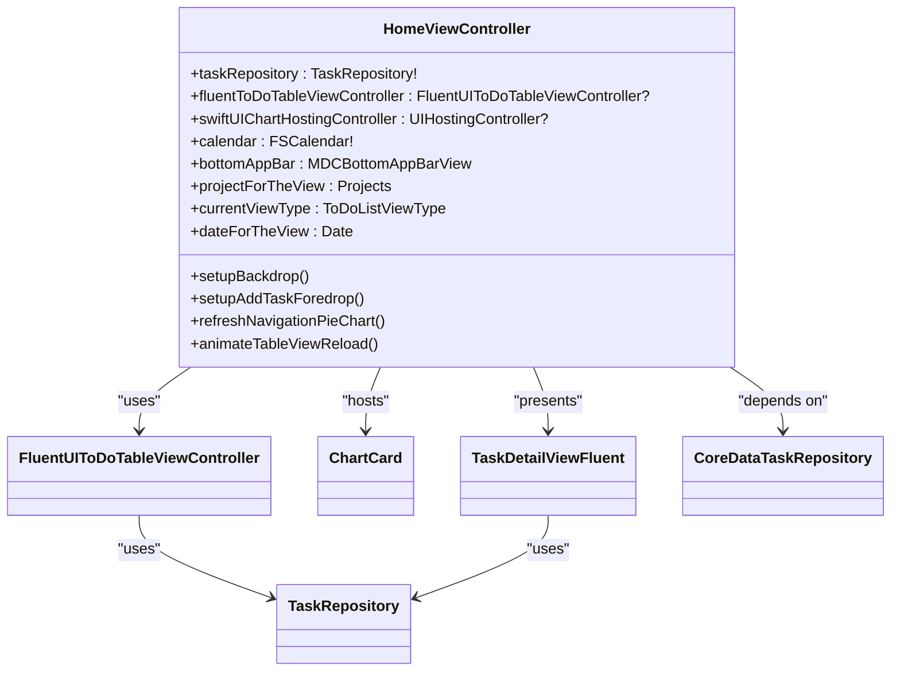
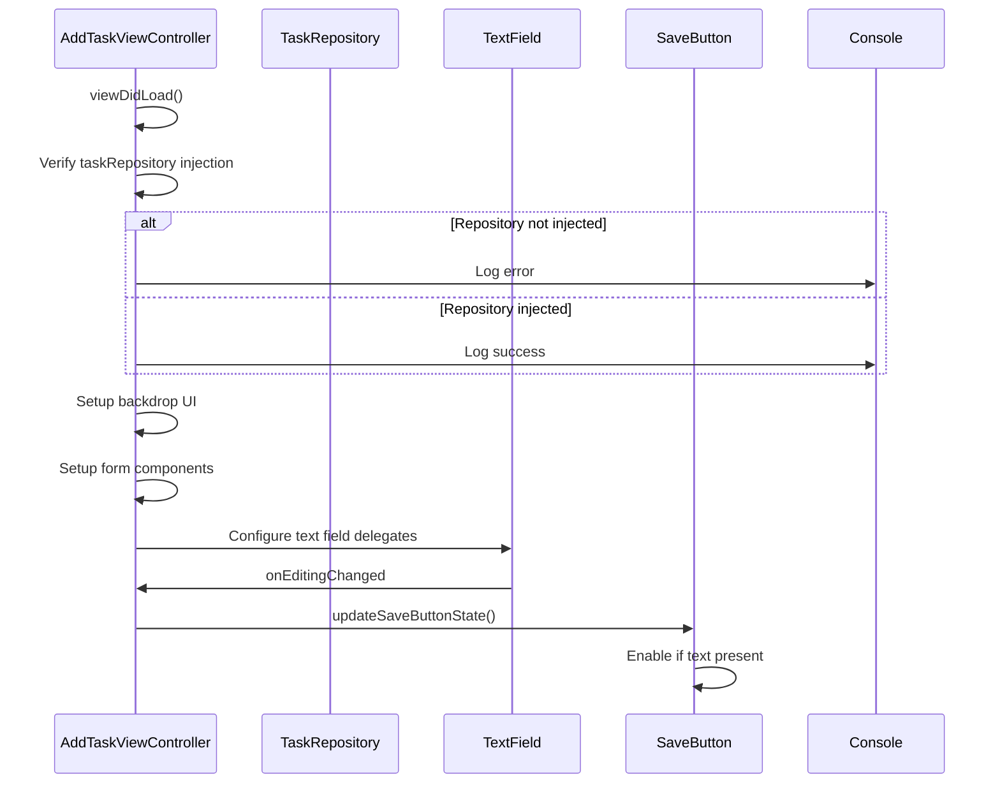
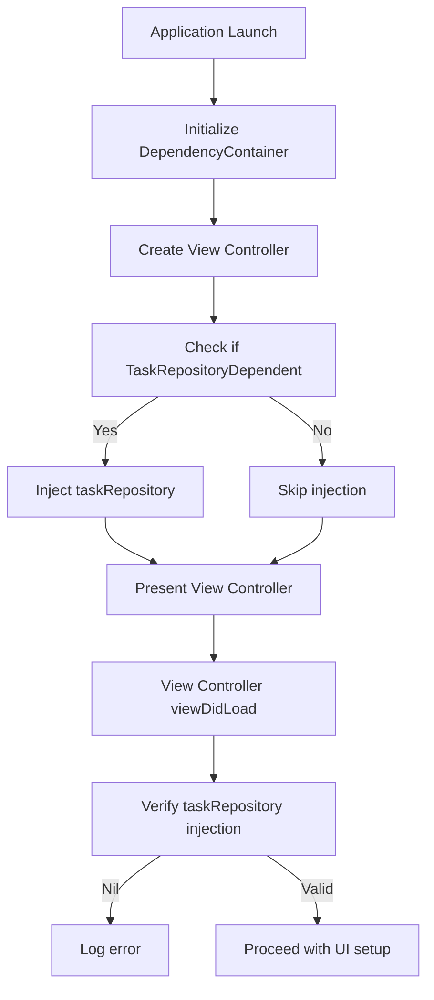
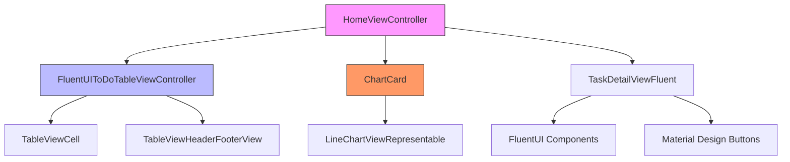

# Presentation Layer

<cite>
**Referenced Files in This Document**   
- [HomeViewController.swift](file://To%20Do%20List/ViewControllers/HomeViewController.swift)
- [AddTaskViewController.swift](file://To%20Do%20List/ViewControllers/AddTaskViewController.swift)
- [FluentUIToDoTableViewController.swift](file://To%20Do%20List/ViewControllers/FluentUIToDoTableViewController.swift)
- [TaskDetailViewFluent.swift](file://To%20Do%20List/View/TaskDetailViewFluent.swift)
- [ChartCard.swift](file://To%20Do%20List/Views/Cards/ChartCard.swift)
- [CoreDataTaskRepository.swift](file://To%20Do%20List/Repositories/CoreDataTaskRepository.swift)
- [TaskRepository.swift](file://To%20Do%20List/Repositories/TaskRepository.swift)
- [DependencyContainer.swift](file://To%20Do%20List/Managers/DependencyContainer.swift)
- [TaskData.swift](file://To%20Do%20List/Models/TaskData.swift)
- [AddTaskForedropView.swift](file://To%20Do%20List/View/AddTaskForedropView.swift)
</cite>

## Table of Contents
1. [Introduction](#introduction)
2. [Core View Controllers](#core-view-controllers)
3. [HomeViewController: Central Dashboard](#homeviewcontroller-central-dashboard)
4. [AddTaskViewController: Task Creation Interface](#addtaskviewcontroller-task-creation-interface)
5. [ViewModels and Data Binding](#viewmodels-and-data-binding)
6. [Dependency Injection Patterns](#dependency-injection-patterns)
7. [UI Components and Integration](#ui-components-and-integration)
8. [Integration with UI Components](#integration-with-ui-components)
9. [Practical Examples](#practical-examples)
10. [Troubleshooting Guidance](#troubleshooting-guidance)

## Introduction
This document provides a comprehensive analysis of the presentation layer in the Tasker iOS application, focusing on its implementation within the Clean Architecture pattern. The documentation details the role of view controllers, ViewModel patterns, dependency injection mechanisms, and integration with UI components. The presentation layer serves as the user-facing interface, orchestrating interactions between the user and the underlying business logic and data layers. It follows a clean separation of concerns, utilizing protocol-based dependencies and repository patterns to ensure testability and maintainability. The layer incorporates modern iOS development practices including UIKit with storyboard integration, programmatic constraints via TinyConstraints, and hybrid SwiftUI components for advanced visualizations.

## Core View Controllers
The presentation layer of the Tasker application is primarily composed of two key view controllers that handle the main user interactions: task management and task creation. These controllers follow a clean architecture pattern with dependency injection for data access, ensuring separation of concerns and testability.

### HomeViewController Overview
HomeViewController serves as the central dashboard of the application, managing the display of task lists, analytics cards, and navigation controls. It integrates multiple UI frameworks including UIKit, FluentUI, and SwiftUI for chart rendering, creating a hybrid interface that combines the strengths of different UI paradigms.

### AddTaskViewController Overview
AddTaskViewController provides a form-based interface for creating and editing tasks, featuring Material Design components for text input and selection controls. It implements a modal presentation pattern with a backdrop-foredrop design that provides a modern, layered user experience.

**Section sources**
- [HomeViewController.swift](file://To%20Do%20List/ViewControllers/HomeViewController.swift)
- [AddTaskViewController.swift](file://To%20Do%20List/ViewControllers/AddTaskViewController.swift)

## HomeViewController: Central Dashboard
HomeViewController acts as the primary interface for task management, serving as the central dashboard that orchestrates multiple UI components. It manages task list display, analytics visualization, and navigation to key features. The controller uses a combination of UIKit, FluentUI, and SwiftUI to create a rich user interface, leveraging FluentUI for consistent styling and TinyConstraints for Auto Layout. It supports multiple view modes (Today, Custom Date, Project Grouped), handles user interactions like task completion and editing, and provides smooth animations for UI transitions.

The controller is implemented as a UIViewController subclass that conforms to multiple protocols for table view management, chart interaction, and task repository dependency. It manages the lifecycle of multiple UI elements including calendar widgets, chart views, and navigation controls, coordinating their behavior based on user interactions. The layout uses programmatic constraints with the TinyConstraints library to ensure proper positioning across different device sizes and orientations.



**Diagram sources**
- [HomeViewController.swift](file://To%20Do%20List/ViewControllers/HomeViewController.swift#L50-L200)
- [FluentUIToDoTableViewController.swift](file://To%20Do%20List/ViewControllers/FluentUIToDoTableViewController.swift#L20-L50)
- [TaskDetailViewFluent.swift](file://To%20Do%20List/View/TaskDetailViewFluent.swift#L10-L30)

**Section sources**
- [HomeViewController.swift](file://To%20Do%20List/ViewControllers/HomeViewController.swift#L1-L500)

## AddTaskViewController: Task Creation Interface
AddTaskViewController provides a comprehensive form interface for creating and editing tasks, featuring text input fields, date selection, priority selection, project assignment, and task type designation. The interface follows Material Design principles with proper spacing, typography, and interactive feedback.

The controller is implemented as a UIViewController subclass with extensive use of Material Components for iOS. Key implementation features include a vertical stack layout using UIStackView as the primary container for form elements, MDCFilledTextField for title and description inputs, dynamic form updates that adjust the save button state based on form content, and proper keyboard handling. The controller's lifecycle methods handle dependency injection verification and UI setup, including diagnostic logging to verify that dependency injection has occurred properly before proceeding with UI setup.



**Diagram sources**
- [AddTaskViewController.swift](file://To%20Do%20List/ViewControllers/AddTaskViewController.swift#L50-L200)

**Section sources**
- [AddTaskViewController.swift](file://To%20Do%20List/ViewControllers/AddTaskViewController.swift#L1-L300)

## ViewModels and Data Binding
The presentation layer implements a manual data binding pattern between UI components and underlying models. Form inputs are synchronized with in-memory properties that serve as the single source of truth for form state. These properties are updated in real-time through UITextFieldDelegate methods and control event handlers, then used to construct TaskData instances for persistence.

The TaskData struct acts as a presentation-layer model that abstracts Core Data implementation details, providing type-safe access to task attributes through enums like TaskPriority and TaskType. This model is passed to the TaskRepository for persistence, with the repository handling conversion between TaskData and NTask managed objects. This approach maintains separation between the UI layer and data persistence concerns while enabling type safety and compile-time checking.

```mermaid
erDiagram
TASKDATA {
NSManagedObjectID? id
String name
String? details
TaskType type
TaskPriority priority
Date dueDate
String project
Bool isComplete
Date dateAdded
Date? dateCompleted
}
TASKPRIORITY {
Int32 low
Int32 medium
high
}
TASKTYPE {
Int32 morning
Int32 evening
}
TASKDATA }|--|| TASKPRIORITY : "has"
TASKDATA }|--|| TASKTYPE : "has"
class AddTaskViewController {
String currentTaskInMaterialTextBox
String currentTaskDescription
String currenttProjectForAddTaskView
TaskPriority currentTaskPriority
Bool isThisEveningTask
}
AddTaskViewController ..> TASKDATA : "constructs"
AddTaskViewController --> MDCFilledTextField : "binds title"
AddTaskViewController --> MDCFilledTextField : "binds description"
AddTaskViewController --> PillButtonBar : "binds project"
AddTaskViewController --> UISwitch : "binds evening"
AddTaskViewController --> SegmentedControl : "binds priority"
```

**Diagram sources**
- [AddTaskViewController.swift](file://To%20Do%20List/ViewControllers/AddTaskViewController.swift#L1-L518)
- [TaskData.swift](file://To%20Do%20List/Models/TaskData.swift#L1-L57)
- [NTask+Extensions.swift](file://To%20Do%20List/NTask+Extensions.swift#L1-L76)

**Section sources**
- [TaskData.swift](file://To%20Do%20List/Models/TaskData.swift)
- [AddTaskViewController.swift](file://To%20Do%20List/ViewControllers/AddTaskViewController.swift)

## Dependency Injection Patterns
The application uses a protocol-based dependency injection system centered around the TaskRepositoryDependent protocol. This protocol is adopted by view controllers that require access to task data, creating a consistent interface for dependency injection. The DependencyContainer class manages the injection process, checking if a view controller conforms to TaskRepositoryDependent and injecting the task repository instance if it does.

Dependency injection occurs before view controllers are presented to the user, ensuring that all dependencies are available before the UI is displayed. This approach prevents runtime errors due to missing services and promotes testability by allowing easy mocking of dependencies. The container pattern enables centralized management of dependencies while maintaining loose coupling between components.



**Diagram sources**
- [DependencyContainer.swift](file://To%20Do%20List/Managers/DependencyContainer.swift#L77-L80)
- [HomeViewController.swift](file://To%20Do%20List/ViewControllers/HomeViewController.swift#L50-L60)
- [AddTaskViewController.swift](file://To%20Do%20List/ViewControllers/AddTaskViewController.swift#L30-L40)

**Section sources**
- [DependencyContainer.swift](file://To%20Do%20List/Managers/DependencyContainer.swift)
- [TaskRepositoryDependent.swift](file://To%20Do%20List/Protocols/TaskRepositoryDependent.swift)

## UI Components and Integration
The presentation layer extensively uses FluentUI for consistent visual design across components, including TableViewCell, FluentTextField, Button, and Label components with theme-aware styling. The FluentUIToDoTableViewController demonstrates this integration by using FluentUI components for the task list interface.

The application leverages Material Components for iOS to implement Google's Material Design guidelines, including MDCFilledTextField for text fields with floating labels, MDCBottomAppBarView for bottom navigation, MDCFloatingButton for primary actions, and MDCRippleTouchController for touch feedback. These components provide a modern, tactile user experience consistent with Material Design principles.

The application incorporates SwiftUI for advanced chart rendering through the ChartCard component, which implements a SwiftUI view that displays task analytics. This hybrid approach allows the application to leverage SwiftUI's declarative syntax for complex visualizations while maintaining UIKit for the primary navigation structure.



**Diagram sources**
- [FluentUIToDoTableViewController.swift](file://To%20Do%20List/ViewControllers/FluentUIToDoTableViewController.swift#L20-L50)
- [ChartCard.swift](file://To%20Do%20List/Views/Cards/ChartCard.swift#L20-L50)
- [TaskDetailViewFluent.swift](file://To%20Do%20List/View/TaskDetailViewFluent.swift#L20-L50)

**Section sources**
- [FluentUIToDoTableViewController.swift](file://To%20Do%20List/ViewControllers/FluentUIToDoTableViewController.swift)
- [ChartCard.swift](file://To%20Do%20List/Views/Cards/ChartCard.swift)
- [TaskDetailViewFluent.swift](file://To%20Do%20List/View/TaskDetailViewFluent.swift)

## Integration with UI Components
The presentation layer integrates with various UI components through a combination of programmatic layout and storyboard integration. The HomeViewController uses a backdrop-foredrop design pattern with separate containers for background elements and primary interactive content. The layout employs programmatic constraints with the TinyConstraints library to ensure proper positioning across different device sizes and orientations.

The AddTaskViewController uses a vertical stack layout with UIStackView as the primary container for form elements, arranged in a logical order with consistent spacing and margins. The pill bar for project selection is dynamically populated from ProjectManager.sharedInstance.displayedProjects, ensuring consistency with the application's project system. The floating action button serves as the primary action button, with its visibility and state tied to the validity of the task title input.

**Section sources**
- [HomeViewController.swift](file://To%20Do%20List/ViewControllers/HomeViewController.swift)
- [AddTaskViewController.swift](file://To%20Do%20List/ViewControllers/AddTaskViewController.swift)
- [AddTaskForedropView.swift](file://To%20Do%20List/View/AddTaskForedropView.swift)

## Practical Examples
The presentation layer demonstrates several practical implementation patterns. The HomeViewController shows how to integrate multiple UI frameworks (UIKit, FluentUI, SwiftUI) within a single interface, managing the lifecycle of hybrid components. The AddTaskViewController illustrates form-based input with real-time validation, where the Done button's visibility is tied to whether the title field contains text.

The dependency injection pattern is demonstrated through the TaskRepositoryDependent protocol and DependencyContainer, showing how to manage service dependencies in a clean, testable way. The data binding pattern is exemplified by the AddTaskViewController's synchronization of form inputs with in-memory properties, which are then used to construct TaskData instances for persistence.

**Section sources**
- [HomeViewController.swift](file://To%20Do%20List/ViewControllers/HomeViewController.swift)
- [AddTaskViewController.swift](file://To%20Do%20List/ViewControllers/AddTaskViewController.swift)
- [DependencyContainer.swift](file://To%20Do%20List/Managers/DependencyContainer.swift)

## Troubleshooting Guidance
Common issues with the presentation layer and their solutions include:

- **Blank Table View**: Ensure that fluentToDoTableViewController is properly initialized and that setupTableView() is called in viewDidLoad. Verify that ToDoListSections is populated with data before calling reloadData().
- **Chart Not Updating**: Check that the TaskCompletionChanged notification is being posted when tasks are completed. Verify that updateSwiftUIChartCard() is called in response to this notification.
- **UI Layout Issues**: Ensure that Auto Layout constraints are properly set up for all views. Use viewDidLayoutSubviews to debug frame calculations.
- **Dependency Injection Failures**: Check that view controllers conform to TaskRepositoryDependent and that DependencyContainer.injectDependencies() is called before presentation. The AddTaskViewController includes fallback injection in viewWillAppear as a defensive measure.
- **Performance Issues**: Profile the application using Instruments to identify bottlenecks. Consider optimizing Core Data fetch requests and reducing the frequency of UI updates for large datasets.

**Section sources**
- [HomeViewController.swift](file://To%20Do%20List/ViewControllers/HomeViewController.swift)
- [AddTaskViewController.swift](file://To%20Do%20List/ViewControllers/AddTaskViewController.swift)
- [TaskRepository.swift](file://To%20Do%20List/Repositories/TaskRepository.swift)