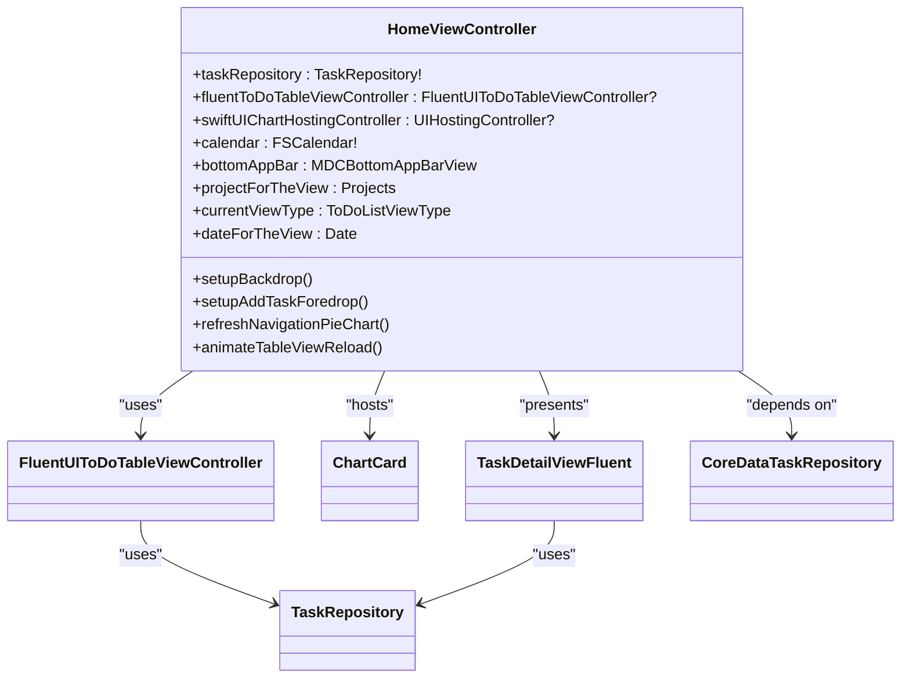
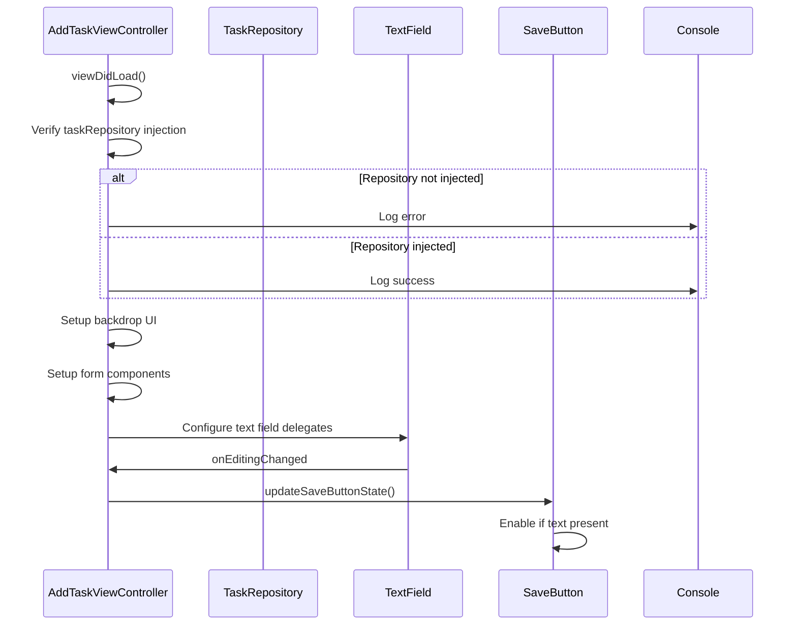
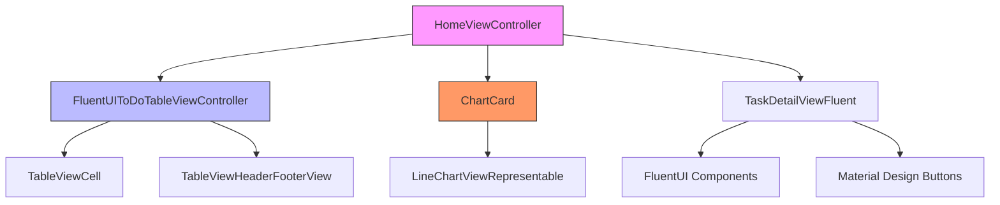
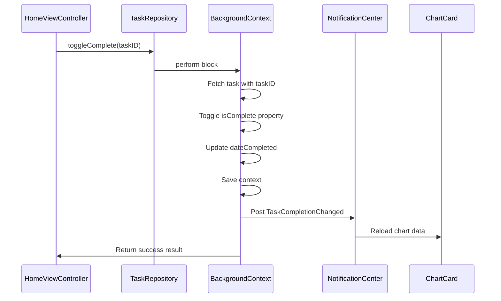
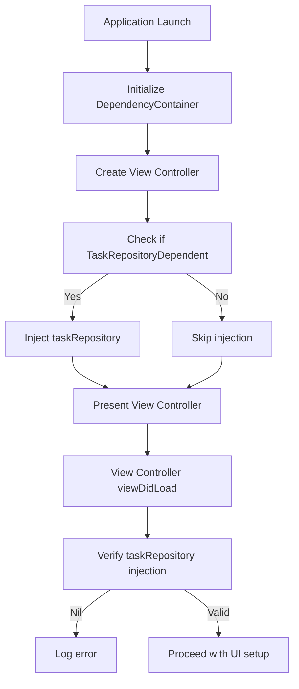

# Presentation Layer

<cite>
**Referenced Files in This Document**   
- [HomeViewController.swift](file://To%20Do%20List/ViewControllers/HomeViewController.swift)
- [AddTaskViewController.swift](file://To%20Do%20List/ViewControllers/AddTaskViewController.swift)
- [FluentUIToDoTableViewController.swift](file://To%20Do%20List/ViewControllers/FluentUIToDoTableViewController.swift)
- [TaskDetailViewFluent.swift](file://To%20Do%20List/View/TaskDetailViewFluent.swift)
- [ChartCard.swift](file://To%20Do%20List/Views/Cards/ChartCard.swift)
- [CoreDataTaskRepository.swift](file://To%20Do%20List/Repositories/CoreDataTaskRepository.swift)
- [TaskRepository.swift](file://To%20Do%20List/Repositories/TaskRepository.swift)
- [DependencyContainer.swift](file://To%20Do%20List/Managers/DependencyContainer.swift)
</cite>

## Table of Contents
1. [Introduction](#introduction)
2. [Core View Controllers](#core-view-controllers)
3. [HomeViewController: Central Dashboard](#homeviewcontroller-central-dashboard)
4. [AddTaskViewController: Task Creation Interface](#addtaskviewcontroller-task-creation-interface)
5. [UI Components and Integration](#ui-components-and-integration)
6. [Data Flow and Repository Integration](#data-flow-and-repository-integration)
7. [Dependency Injection Mechanism](#dependency-injection-mechanism)
8. [Best Practices and Recommendations](#best-practices-and-recommendations)

## Introduction
This document provides a comprehensive analysis of the presentation layer in the Tasker iOS application, focusing on the two primary view controllers: HomeViewController and AddTaskViewController. The documentation details their roles, implementation patterns, integration with UI frameworks, and interaction with the underlying data layer. The analysis covers UIKit implementation with storyboard integration, programmatic constraints, and the use of FluentUI and Material Design components for consistent visual design. Special attention is given to navigation patterns, table view management, and common UI issues such as keyboard handling and accessibility.

## Core View Controllers

The presentation layer of the Tasker application is primarily composed of two key view controllers that handle the main user interactions: task management and task creation. These controllers follow a clean architecture pattern with dependency injection for data access, ensuring separation of concerns and testability.

### HomeViewController Overview
HomeViewController serves as the central dashboard of the application, managing the display of task lists, analytics cards, and navigation controls. It integrates multiple UI frameworks including UIKit, FluentUI, and SwiftUI for chart rendering, creating a hybrid interface that combines the strengths of different UI paradigms.

### AddTaskViewController Overview
AddTaskViewController provides a form-based interface for creating and editing tasks, featuring Material Design components for text input and selection controls. It implements a modal presentation pattern with a backdrop-foredrop design that provides a modern, layered user experience.

**Section sources**
- [HomeViewController.swift](file://To%20Do%20List/ViewControllers/HomeViewController.swift)
- [AddTaskViewController.swift](file://To%20Do%20List/ViewControllers/AddTaskViewController.swift)

## HomeViewController: Central Dashboard

### Role and Responsibilities
HomeViewController acts as the primary interface for task management, serving as the central dashboard that orchestrates multiple UI components:

- **Task List Management**: Displays tasks grouped by project or date using a FluentUI table view
- **Analytics Display**: Shows task completion analytics through integrated chart components
- **Navigation Hub**: Provides access to different views and functionality through the bottom app bar
- **State Management**: Maintains the current view state, selected date, and filtering options

The controller manages the lifecycle of multiple UI elements including calendar widgets, chart views, and navigation controls, coordinating their behavior based on user interactions.

### Architecture and Implementation
HomeViewController is implemented as a UIViewController subclass that conforms to multiple protocols for table view management, chart interaction, and task repository dependency:

```swift
class HomeViewController: UIViewController, ChartViewDelegate, MDCRippleTouchControllerDelegate, UITableViewDataSource, UITableViewDelegate, SearchBarDelegate, TaskRepositoryDependent
```

This multi-protocol approach allows the controller to handle various responsibilities while maintaining a single point of coordination for the home screen interface.

### UI Components and Layout
The controller implements a sophisticated layout system with multiple container views:

- **Backdrop Container**: Contains background elements like the calendar and decorative graphics
- **Foredrop Container**: Houses the primary interactive content
- **Bottom Bar Container**: Manages the navigation bar at the bottom of the screen

The layout uses programmatic constraints with the TinyConstraints library to ensure proper positioning across different device sizes and orientations.



**Diagram sources**
- [HomeViewController.swift](file://To%20Do%20List/ViewControllers/HomeViewController.swift#L50-L200)
- [FluentUIToDoTableViewController.swift](file://To%20Do%20List/ViewControllers/FluentUIToDoTableViewController.swift#L20-L50)
- [TaskDetailViewFluent.swift](file://To%20Do%20List/View/TaskDetailViewFluent.swift#L10-L30)

**Section sources**
- [HomeViewController.swift](file://To%20Do%20List/ViewControllers/HomeViewController.swift#L1-L500)

## AddTaskViewController: Task Creation Interface

### Form-Based Interface Design
AddTaskViewController provides a comprehensive form interface for creating and editing tasks, featuring:

- **Text Input Fields**: Material Design text fields for task title and description
- **Date Selection**: Calendar integration for setting task due dates
- **Priority Selection**: Segmented control for setting task priority
- **Project Assignment**: Pill button bar for selecting project associations
- **Task Type Selection**: Segmented control for morning/evening task designation

The interface follows Material Design principles with proper spacing, typography, and interactive feedback.

### Implementation Details
The controller is implemented as a UIViewController subclass with extensive use of Material Components for iOS:

```swift
class AddTaskViewController: UIViewController, UITextFieldDelegate, PillButtonBarDelegate, UIScrollViewDelegate, TaskRepositoryDependent
```

Key implementation features include:

- **Vertical Stack Layout**: Uses a UIStackView as the primary container for form elements
- **Material Text Fields**: Implements MDCFilledTextField for title and description inputs
- **Dynamic Form Updates**: Updates the save button state based on form content
- **Keyboard Handling**: Properly manages keyboard appearance and dismissal

### Lifecycle Management
The controller's lifecycle methods handle dependency injection verification and UI setup:

```swift
override func viewDidLoad() {
    super.viewDidLoad()
    print("🚀 AddTaskViewController: viewDidLoad called")
    
    // Verify dependency injection
    if taskRepository == nil {
        print("❌ AddTaskViewController: taskRepository is nil in.viewDidLoad!")
    } else {
        print("✅ AddTaskViewController: taskRepository is properly injected")
    }
    
    // Setup UI components
    setupBackdrop()
    setupAddTaskForedrop()
    setupAddTaskTextField()
    setupDescriptionTextField()
    setupSamplePillBar()
    setupPrioritySC()
    setupDoneButton()
}
```

The viewDidLoad method includes diagnostic logging to verify that dependency injection has occurred properly before proceeding with UI setup.



**Diagram sources**
- [AddTaskViewController.swift](file://To%20Do%20List/ViewControllers/AddTaskViewController.swift#L50-L200)

**Section sources**
- [AddTaskViewController.swift](file://To%20Do%20List/ViewControllers/AddTaskViewController.swift#L1-L300)

## UI Components and Integration

### FluentUI Integration
The application extensively uses FluentUI for consistent visual design across components:

- **TableViewCell**: Custom table view cells with FluentUI styling
- **FluentTextField**: Text input fields with Microsoft Fluent Design System styling
- **Button**: Material-inspired buttons with various styles (accent, outline, etc.)
- **Label**: Styled labels with theme-aware text colors and fonts

The FluentUIToDoTableViewController demonstrates this integration by using FluentUI components for the task list interface:

```swift
private func setupTableView() {
    tableView.register(TableViewCell.self, forCellReuseIdentifier: TableViewCell.identifier)
    tableView.register(TableViewHeaderFooterView.self, forHeaderFooterViewReuseIdentifier: TableViewHeaderFooterView.identifier)
    tableView.backgroundColor = UIColor.clear
}
```

### Material Design Components
The application leverages Material Components for iOS to implement Google's Material Design guidelines:

- **MDCFilledTextField**: Text fields with floating labels and material styling
- **MDCBottomAppBarView**: Bottom navigation bar with material design
- **MDCFloatingButton**: Floating action button for primary actions
- **MDCRippleTouchController**: Ripple animation for touch feedback

These components provide a modern, tactile user experience consistent with Material Design principles.

### SwiftUI Integration
The application incorporates SwiftUI for advanced chart rendering through the ChartCard component:

```swift
var swiftUIChartHostingController: UIHostingController<AnyView>?
var swiftUIChartContainer: UIView?
```

The ChartCard struct implements a SwiftUI view that displays task analytics:

```swift
struct ChartCard: View {
    let title: String
    let subtitle: String?
    let referenceDate: Date?
    @State private var chartData: [ChartDataEntry] = []
    @State private var isLoading = true
}
```

This hybrid approach allows the application to leverage SwiftUI's declarative syntax for complex visualizations while maintaining UIKit for the primary navigation structure.



**Diagram sources**
- [FluentUIToDoTableViewController.swift](file://To%20Do%20List/ViewControllers/FluentUIToDoTableViewController.swift#L20-L50)
- [ChartCard.swift](file://To%20Do%20List/Views/Cards/ChartCard.swift#L20-L50)
- [TaskDetailViewFluent.swift](file://To%20Do%20List/View/TaskDetailViewFluent.swift#L20-L50)

**Section sources**
- [FluentUIToDoTableViewController.swift](file://To%20Do%20List/ViewControllers/FluentUIToDoTableViewController.swift#L1-L100)
- [ChartCard.swift](file://To%20Do%20List/Views/Cards/ChartCard.swift#L1-L100)
- [TaskDetailViewFluent.swift](file://To%20Do%20List/View/TaskDetailViewFluent.swift#L1-L100)

## Data Flow and Repository Integration

### Repository Protocol
The application uses a protocol-oriented approach for data access through the TaskRepository protocol:

```swift
protocol TaskRepository {
    func fetchTasks(predicate: NSPredicate?, sortDescriptors: [NSSortDescriptor]?, completion: @escaping ([TaskData]) -> Void)
    func fetchTask(by taskID: NSManagedObjectID, completion: @escaping (Result<NTask, Error>) -> Void)
    func addTask(data: TaskData, completion: ((Result<NTask, Error>) -> Void)?)
    func toggleComplete(taskID: NSManagedObjectID, completion: ((Result<Void, Error>) -> Void)?)
    // Additional methods...
}
```

This protocol defines a comprehensive interface for task management operations, enabling dependency injection and testability.

### Concrete Implementation
The CoreDataTaskRepository provides the concrete implementation using Core Data:

```swift
final class CoreDataTaskRepository: TaskRepository {
    private let viewContext: NSManagedObjectContext
    private let backgroundContext: NSManagedObjectContext
}
```

Key features of the implementation:

- **Background Context**: Uses a dedicated background context for data modifications
- **Main Context**: Uses the view context for fetching data to ensure UI consistency
- **Error Handling**: Comprehensive error handling with diagnostic logging
- **Notification Posting**: Posts notifications when task completion changes

### Data Flow Example
The flow for toggling a task's completion status demonstrates the complete data flow:

```swift
func toggleComplete(taskID: NSManagedObjectID, completion: ((Result<Void, Error>) -> Void)?) {
    backgroundContext.perform {
        do {
            guard let task = try self.backgroundContext.existingObject(with: taskID) as? NTask else {
                throw NSError(domain: "TaskRepository", code: 404, userInfo: [NSLocalizedDescriptionKey: "Task not found"])
            }
            
            task.isComplete.toggle()
            task.dateCompleted = task.isComplete ? Date() as NSDate : nil
            
            try self.backgroundContext.save()
            
            // Notify that charts should be refreshed
            DispatchQueue.main.async {
                NotificationCenter.default.post(name: NSNotification.Name("TaskCompletionChanged"), object: nil)
                completion?(.success(()))
            }
        } catch {
            print("❌ Task toggle complete error: \(error)")
            DispatchQueue.main.async { completion?(.failure(error)) }
        }
    }
}
```



**Diagram sources**
- [TaskRepository.swift](file://To%20Do%20List/Repositories/TaskRepository.swift#L10-L50)
- [CoreDataTaskRepository.swift](file://To%20Do%20List/Repositories/CoreDataTaskRepository.swift#L50-L100)

**Section sources**
- [TaskRepository.swift](file://To%20Do%20List/Repositories/TaskRepository.swift#L1-L100)
- [CoreDataTaskRepository.swift](file://To%20Do%20List/Repositories/CoreDataTaskRepository.swift#L1-L200)

## Dependency Injection Mechanism

### Protocol-Based Dependency
The application uses a protocol-based dependency injection system centered around the TaskRepositoryDependent protocol:

```swift
protocol TaskRepositoryDependent: AnyObject {
    var taskRepository: TaskRepository! { get set }
}
```

This protocol is adopted by view controllers that require access to task data, creating a consistent interface for dependency injection.

### Dependency Container
The DependencyContainer class manages the injection process:

```swift
extension DependencyContainer {
    func injectDependencies(into viewController: UIViewController) {
        if let dependent = viewController as? TaskRepositoryDependent {
            dependent.taskRepository = self.taskRepository
            print("✅ DependencyContainer: Injected TaskRepository into \(type(of: viewController))")
        }
        // Additional dependency injections...
    }
}
```

The container checks if a view controller conforms to TaskRepositoryDependent and injects the task repository instance if it does.

### Injection Timing
Dependency injection occurs before view controllers are presented to the user:

1. **Initialization**: The DependencyContainer is initialized with the necessary services
2. **Presentation**: Before presenting a view controller, dependencies are injected
3. **Verification**: View controllers verify their dependencies in viewDidLoad

This approach ensures that all dependencies are available before the UI is displayed, preventing runtime errors due to missing services.



**Diagram sources**
- [DependencyContainer.swift](file://To%20Do%20List/Managers/DependencyContainer.swift#L77-L80)
- [HomeViewController.swift](file://To%20Do%20List/ViewControllers/HomeViewController.swift#L50-L60)
- [AddTaskViewController.swift](file://To%20Do%20List/ViewControllers/AddTaskViewController.swift#L30-L40)

**Section sources**
- [DependencyContainer.swift](file://To%20Do%20List/Managers/DependencyContainer.swift#L70-L80)

## Best Practices and Recommendations

### View Controller Organization
The application demonstrates several best practices for view controller organization:

- **Single Responsibility**: Each view controller has a clear, focused responsibility
- **Protocol Conformance**: Uses protocols to define responsibilities and enable dependency injection
- **Modular Components**: Breaks down complex UI into reusable components
- **Lifecycle Management**: Properly manages view controller lifecycle events

### Code-Behind Complexity Reduction
To minimize code-behind complexity, the application employs several strategies:

- **Component Extraction**: Moves complex UI elements into separate view classes (e.g., TaskDetailViewFluent)
- **Extension Usage**: Uses extensions to organize code by functionality
- **Delegate Patterns**: Uses delegates to communicate between components
- **Protocol-Oriented Design**: Uses protocols to define interfaces and enable dependency injection

### UI Best Practices
The application follows modern iOS UI best practices:

- **Accessibility**: Supports dynamic type and provides proper accessibility labels
- **Rotation Support**: Uses Auto Layout and programmatic constraints for adaptive layouts
- **Keyboard Handling**: Properly manages keyboard appearance and dismissal
- **Performance**: Uses background contexts for data operations to prevent UI blocking

### Recommendations for Improvement
Based on the analysis, several recommendations can be made:

1. **Enhanced Error Handling**: Implement more comprehensive error handling with user-friendly error messages
2. **Unit Testing**: Add unit tests for view controllers and repository implementations
3. **Documentation**: Improve code documentation with detailed comments and Swift documentation
4. **State Management**: Consider implementing a more robust state management system for complex view states
5. **Memory Management**: Add weak references where appropriate to prevent retain cycles

These recommendations would further improve the maintainability, reliability, and user experience of the application.

**Section sources**
- [HomeViewController.swift](file://To%20Do%20List/ViewControllers/HomeViewController.swift)
- [AddTaskViewController.swift](file://To%20Do%20List/ViewControllers/AddTaskViewController.swift)
- [FluentUIToDoTableViewController.swift](file://To%20Do%20List/ViewControllers/FluentUIToDoTableViewController.swift)
- [TaskDetailViewFluent.swift](file://To%20Do%20List/View/TaskDetailViewFluent.swift)
- [ChartCard.swift](file://To%20Do%20List/Views/Cards/ChartCard.swift)
- [CoreDataTaskRepository.swift](file://To%20Do%20List/Repositories/CoreDataTaskRepository.swift)
- [TaskRepository.swift](file://To%20Do%20List/Repositories/TaskRepository.swift)
- [DependencyContainer.swift](file://To%20Do%20List/Managers/DependencyContainer.swift)