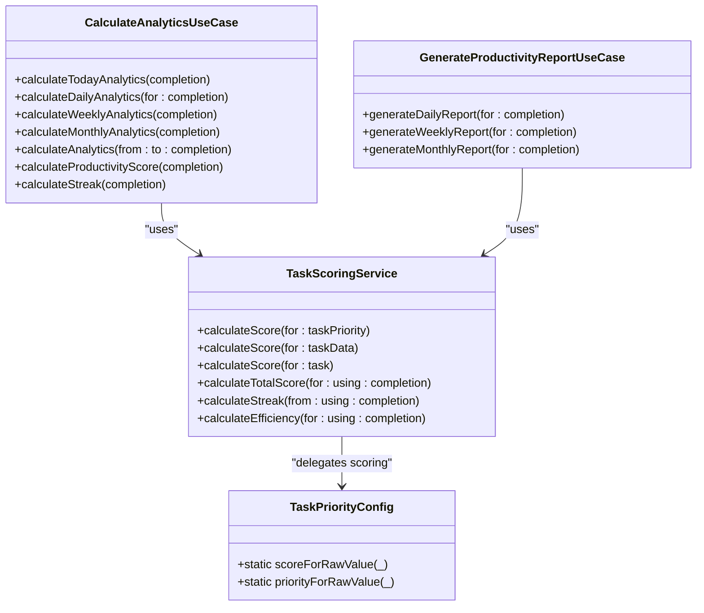
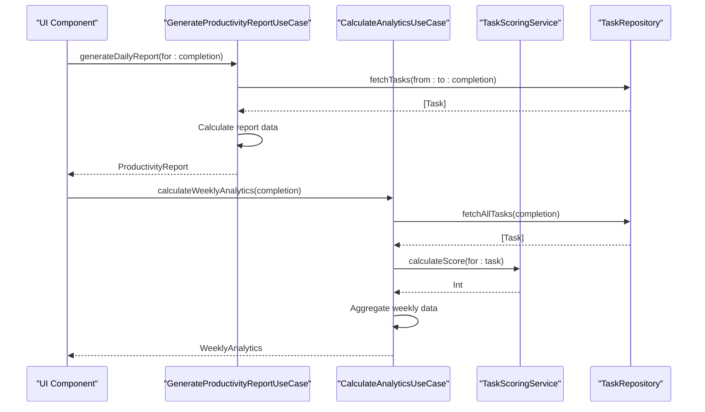
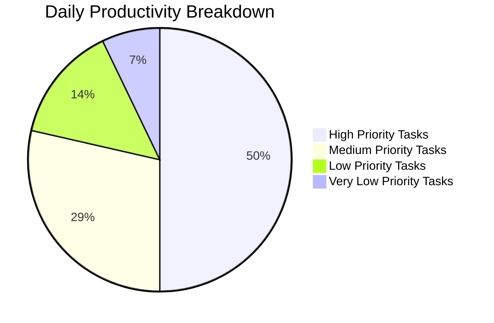

# Productivity Reporting

<cite>
**Referenced Files in This Document**   
- [GenerateProductivityReportUseCase.swift](file://To%20Do%20List/UseCases/Analytics/GenerateProductivityReportUseCase.swift)
- [CalculateAnalyticsUseCase.swift](file://To%20Do%20List/UseCases/Analytics/CalculateAnalyticsUseCase.swift)
- [TaskScoringService.swift](file://To%20Do%20List/Services/TaskScoringService.swift)
- [TaskPriority.swift](file://To%20Do%20List/Domain/Models/TaskPriority.swift)
- [TaskPriorityConfig.swift](file://To%20Do%20List/Domain/Models/TaskPriorityConfig.swift)
- [README.md](file://README.md)
- [Analytics & Gamification.md](file://repowiki/en/content/Analytics%20&%20Gamification/Analytics%20&%20Gamification.md)
- [Analytics and Daily Scoring.md](file://repowiki/en/content/Analytics%20and%20Daily%20Scoring/Analytics%20and%20Daily%20Scoring.md)
</cite>

## Table of Contents
1. [Introduction](#introduction)
2. [Core Components](#core-components)
3. [API Interfaces](#api-interfaces)
4. [Integration Patterns](#integration-patterns)
5. [Practical Examples](#practical-examples)
6. [Troubleshooting Guidance](#troubleshooting-guidance)
7. [Performance Considerations](#performance-considerations)

## Introduction
The Productivity Reporting feature in the Tasker application provides comprehensive analytics and gamification elements that transform task completion into a measurable and motivating experience. This system enables users to track their productivity through detailed reports, score calculations, and visual representations of their performance over time. The architecture follows Clean Architecture principles with clear separation between use cases, services, and data layers, ensuring maintainability and testability. The reporting system integrates seamlessly with the task management workflow, automatically updating metrics whenever tasks are completed or modified. Key components include the CalculateAnalyticsUseCase for comprehensive analytics, GenerateProductivityReportUseCase for report generation, and TaskScoringService for score calculation based on task priority.

**Section sources**
- [README.md](file://README.md#L1281-L1296)
- [Analytics & Gamification.md](file://repowiki/en/content/Analytics%20&%20Gamification/Analytics%20&%20Gamification.md#L1-L25)
- [Analytics and Daily Scoring.md](file://repowiki/en/content/Analytics%20and%20Daily%20Scoring/Analytics%20and%20Daily%20Scoring.md#L1-L20)

## Core Components

The Productivity Reporting system consists of several key components that work together to provide comprehensive analytics. The CalculateAnalyticsUseCase serves as the primary engine for calculating productivity metrics across various timeframes, including daily, weekly, and monthly analytics. This use case orchestrates data retrieval from the task repository and applies business logic to generate meaningful insights. The GenerateProductivityReportUseCase specializes in creating structured reports for specific periods, providing summarized data that can be easily consumed by UI components or exported. The TaskScoringService implements the scoring algorithm that assigns points to completed tasks based on their priority level, forming the foundation of the gamification system. These components follow a dependency inversion principle, relying on protocols rather than concrete implementations, which enhances testability and flexibility.



**Diagram sources**
- [CalculateAnalyticsUseCase.swift](file://To%20Do%20List/UseCases/Analytics/CalculateAnalyticsUseCase.swift#L20-L50)
- [GenerateProductivityReportUseCase.swift](file://To%20Do%20List/UseCases/Analytics/GenerateProductivityReportUseCase.swift#L20-L30)
- [TaskScoringService.swift](file://To%20Do%20List/Services/TaskScoringService.swift#L20-L40)

**Section sources**
- [CalculateAnalyticsUseCase.swift](file://To%20Do%20List/UseCases/Analytics/CalculateAnalyticsUseCase.swift#L1-L100)
- [GenerateProductivityReportUseCase.swift](file://To%20Do%20List/UseCases/Analytics/GenerateProductivityReportUseCase.swift#L1-L80)
- [TaskScoringService.swift](file://To%20Do%20List/Services/TaskScoringService.swift#L1-L50)

## API Interfaces

The Productivity Reporting system exposes several well-defined interfaces for accessing analytics data and generating reports. The CalculateAnalyticsUseCase provides methods for retrieving analytics at different granularities, including daily, weekly, and monthly views. Each method accepts a completion handler that returns a Result type containing either the requested analytics data or an error. The GenerateProductivityReportUseCase offers a simpler interface focused on generating structured reports for specific time periods, with the ability to customize the report period through the ReportPeriod enum. The TaskScoringService exposes methods for calculating individual task scores, total daily scores, streak information, and efficiency metrics, all using asynchronous completion handlers to maintain responsiveness.



**Diagram sources**
- [GenerateProductivityReportUseCase.swift](file://To%20Do%20List/UseCases/Analytics/GenerateProductivityReportUseCase.swift#L30-L80)
- [CalculateAnalyticsUseCase.swift](file://To%20Do%20List/UseCases/Analytics/CalculateAnalyticsUseCase.swift#L100-L200)
- [TaskScoringService.swift](file://To%20Do%20List/Services/TaskScoringService.swift#L50-L100)

**Section sources**
- [GenerateProductivityReportUseCase.swift](file://To%20Do%20List/UseCases/Analytics/GenerateProductivityReportUseCase.swift#L20-L80)
- [CalculateAnalyticsUseCase.swift](file://To%20Do%20List/UseCases/Analytics/CalculateAnalyticsUseCase.swift#L50-L200)
- [TaskScoringService.swift](file://To%20Do%20List/Services/TaskScoringService.swift#L40-L150)

## Integration Patterns

The Productivity Reporting system integrates with the rest of the application through well-defined patterns that ensure loose coupling and maintainability. The primary integration point is through protocol-based dependencies, with use cases accepting protocol interfaces rather than concrete implementations. This allows for easy testing and substitution of components. The system listens for task completion events through a notification mechanism, specifically the "TaskCompletionChanged" notification, which triggers updates to analytics displays. Data flows from the Core Data persistence layer through repository abstractions to the analytics use cases, maintaining separation between data access and business logic. The UI components consume analytics data through asynchronous completion handlers, ensuring that potentially expensive calculations do not block the main thread.

```mermaid
flowchart TD
Start([Application Start]) --> Setup["Setup Dependency Injection"]
Setup --> Repository["Initialize TaskRepository"]
Setup --> ScoringService["Initialize TaskScoringService"]
Setup --> AnalyticsUseCase["Initialize CalculateAnalyticsUseCase"]
Setup --> ReportUseCase["Initialize GenerateProductivityReportUseCase"]
Repository --> AnalyticsUseCase : "injected"
Repository --> ReportUseCase : "injected"
ScoringService --> AnalyticsUseCase : "injected"
ScoringService --> ReportUseCase : "injected"
TaskCompletion["Task Completion"] --> Notification["Post TaskCompletionChanged"]
Notification --> HomeViewController["HomeViewController observes"]
HomeViewController --> AnalyticsUseCase["Request updated analytics"]
AnalyticsUseCase --> Repository["Fetch relevant tasks"]
Repository -- Data --> AnalyticsUseCase
AnalyticsUseCase -- Analytics --> HomeViewController
HomeViewController --> UpdateUI["Update UI components"]
```

**Diagram sources**
- [CalculateAnalyticsUseCase.swift](file://To%20Do%20List/UseCases/Analytics/CalculateAnalyticsUseCase.swift#L20-L50)
- [GenerateProductivityReportUseCase.swift](file://To%20Do%20List/UseCases/Analytics/GenerateProductivityReportUseCase.swift#L20-L30)
- [TaskScoringService.swift](file://To%20Do%20List/Services/TaskScoringService.swift#L20-L40)

**Section sources**
- [CalculateAnalyticsUseCase.swift](file://To%20Do%20List/UseCases/Analytics/CalculateAnalyticsUseCase.swift#L1-L100)
- [GenerateProductivityReportUseCase.swift](file://To%20Do%20List/UseCases/Analytics/GenerateProductivityReportUseCase.swift#L1-L80)
- [TaskScoringService.swift](file://To%20Do%20List/Services/TaskScoringService.swift#L1-L50)

## Practical Examples

The Productivity Reporting system can be utilized in various practical scenarios to enhance user experience and provide valuable insights. For daily reporting, the GenerateProductivityReportUseCase can be used to create a summary of completed tasks and total score for the current day. Weekly analytics can be displayed in a dashboard view, showing trends in productivity over time. The scoring system can be integrated into gamification features, such as achievement badges or level progression, to motivate users. Historical data can be visualized using charts to help users identify patterns in their productivity. The system also supports custom date ranges, allowing users to analyze performance during specific periods, such as work weeks or project timelines.



**Diagram sources**
- [Analytics and Daily Scoring.md](file://repowiki/en/content/Analytics%20and%20Daily%20Scoring/Analytics%20and%20Daily%20Scoring.md#L120-L130)

**Section sources**
- [Analytics and Daily Scoring.md](file://repowiki/en/content/Analytics%20and%20Daily%20Scoring/Analytics%20and%20Daily%20Scoring.md#L80-L140)
- [Analytics & Gamification.md](file://repowiki/en/content/Analytics%20&%20Gamification/Analytics%20&%20Gamification.md#L100-L140)

## Troubleshooting Guidance

Several common issues may arise when working with the Productivity Reporting system, along with their solutions. Inaccurate score calculations can occur if task completion dates are not properly recorded in the Core Data store. This can be resolved by ensuring that the dateCompleted field is updated when a task's completion status changes. Streak calculation errors may result from timezone inconsistencies, which can be addressed by using Calendar.current.startOfDay(for:) to normalize dates. Performance issues during analytics calculation can be mitigated by implementing caching mechanisms and ensuring that data processing occurs on background threads. Data inconsistency between the UI and analytics results may occur if notifications are not properly observed, which can be fixed by verifying that the "TaskCompletionChanged" notification is correctly registered and handled.

**Section sources**
- [Analytics & Gamification.md](file://repowiki/en/content/Analytics%20&%20Gamification/Analytics%20&%20Gamification.md#L140-L170)
- [TaskScoringService.swift](file://To%20Do%20List/Services/TaskScoringService.swift#L100-L140)
- [CalculateAnalyticsUseCase.swift](file://To%20Do%20List/UseCases/Analytics/CalculateAnalyticsUseCase.swift#L500-L580)

## Performance Considerations

The Productivity Reporting system incorporates several performance optimizations to ensure responsive user experience. Analytics calculations are performed asynchronously on background threads to prevent UI blocking, with results dispatched back to the main thread for display. The system minimizes database access by fetching all required tasks once and filtering them in memory, rather than making multiple fetch requests. For large datasets, the CalculateAnalyticsUseCase processes data in chunks and provides intermediate results when possible. The TaskScoringService uses a centralized TaskPriorityConfig to avoid redundant calculations and improve efficiency. Caching mechanisms can be implemented through the optional cacheService dependency in CalculateAnalyticsUseCase, allowing frequently accessed analytics data to be stored and retrieved quickly. The notification-based update system ensures that analytics are only recalculated when necessary, reducing unnecessary processing.

**Section sources**
- [CalculateAnalyticsUseCase.swift](file://To%20Do%20List/UseCases/Analytics/CalculateAnalyticsUseCase.swift#L20-L50)
- [TaskScoringService.swift](file://To%20Do%20List/Services/TaskScoringService.swift#L50-L100)
- [Analytics & Gamification.md](file://repowiki/en/content/Analytics%20&%20Gamification/Analytics%20&%20Gamification.md#L150-L170)