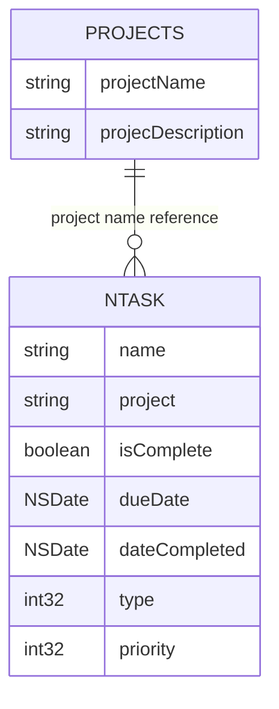
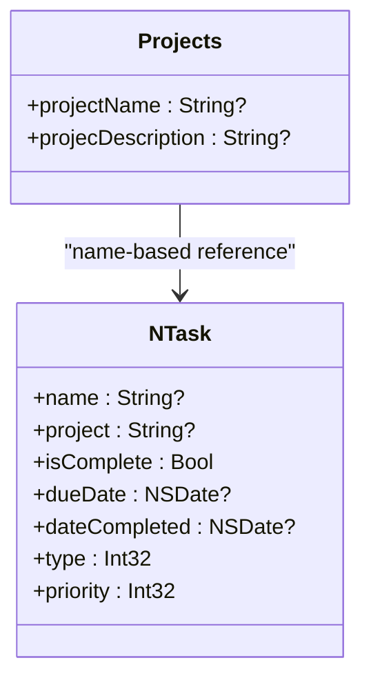
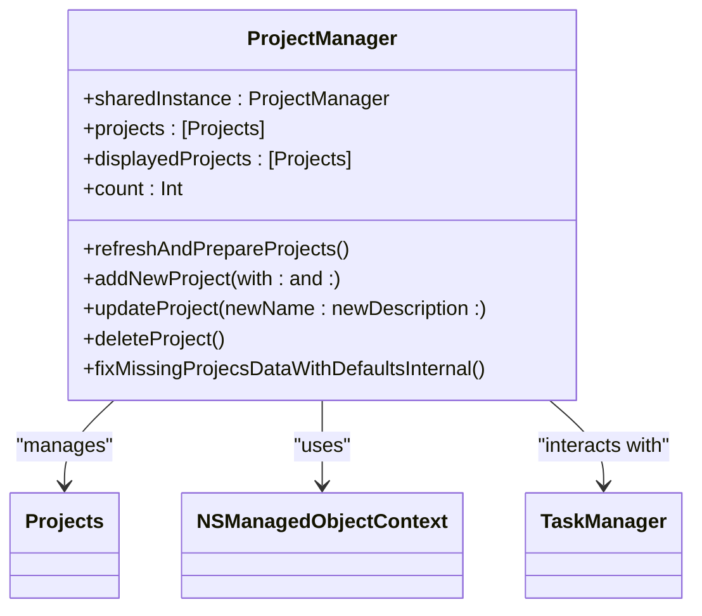
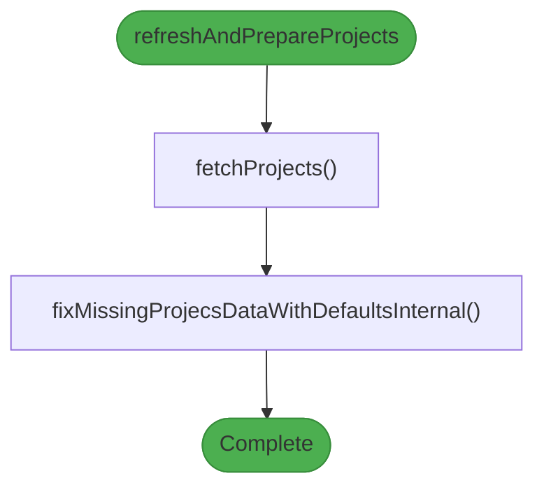
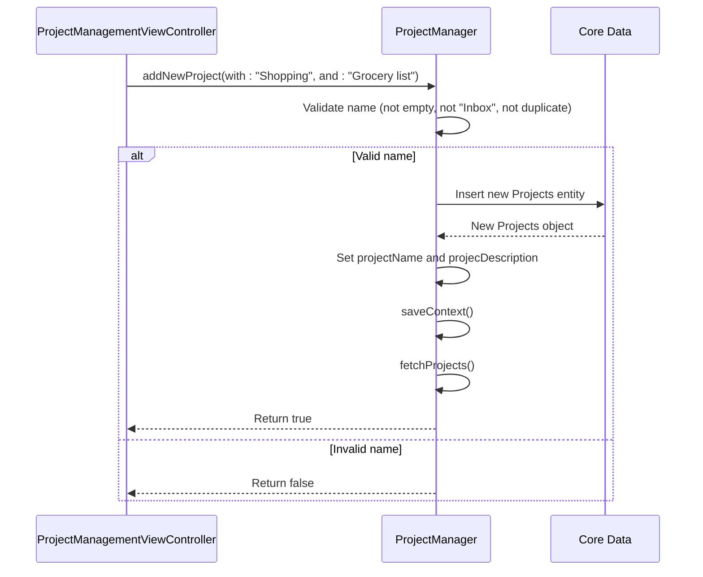
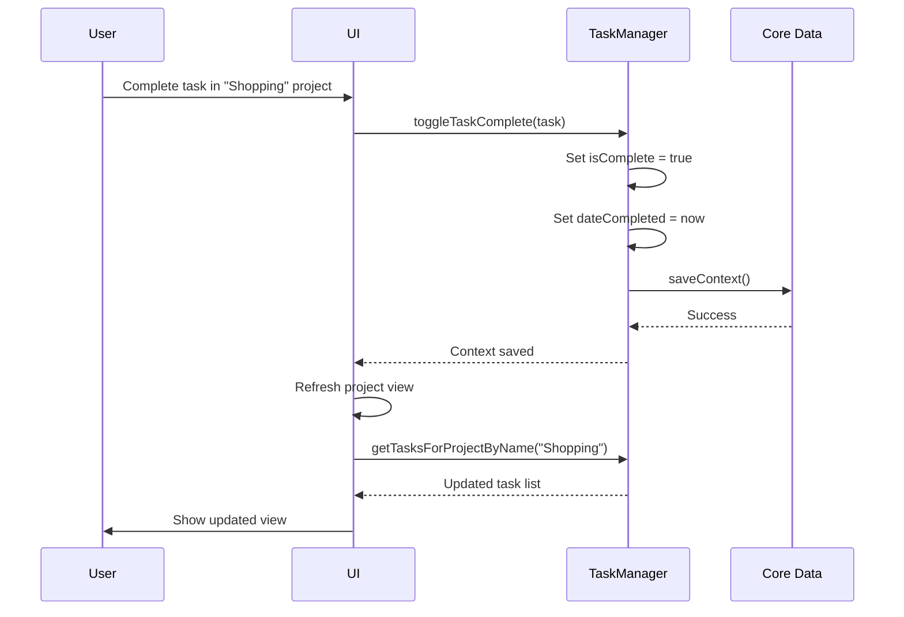
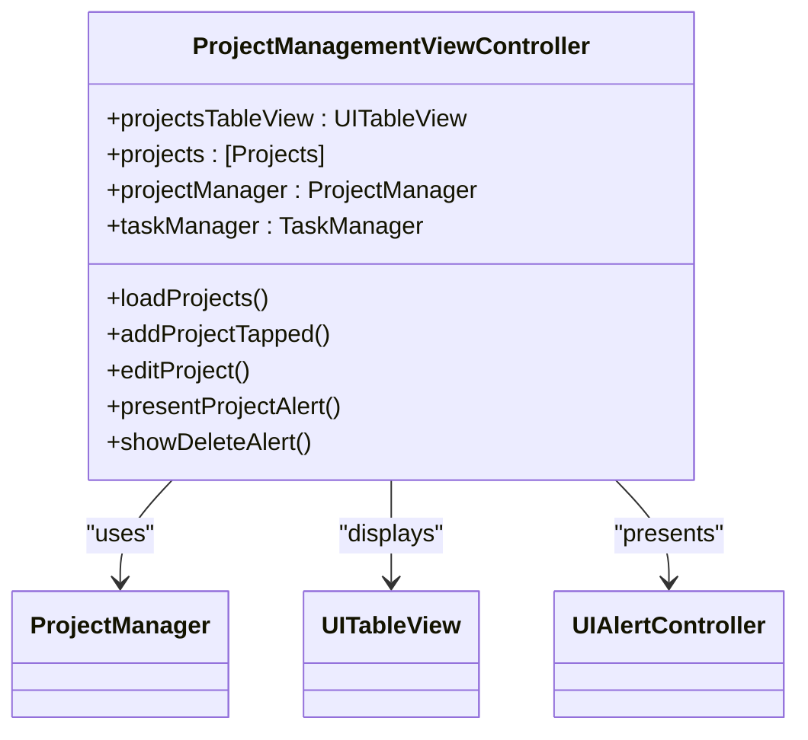
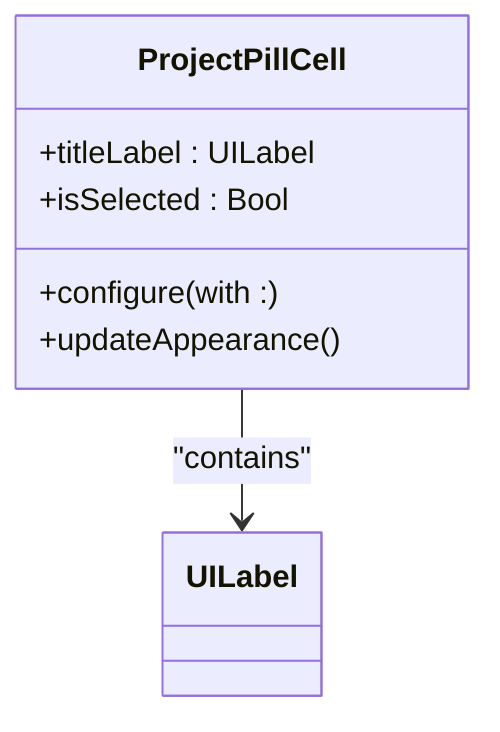

# Project Management

<cite>
**Referenced Files in This Document**   
- [ProjectManager.swift](file://To%20Do%20List/ViewControllers/ProjectManager.swift)
- [Projects+CoreDataClass.swift](file://Projects+CoreDataClass.swift)
- [Projects+CoreDataProperties.swift](file://Projects+CoreDataProperties.swift)
- [ProjectManagementViewController.swift](file://To%20Do%20List/ViewControllers/ProjectManagementViewController.swift)
- [ProjectPillCell.swift](file://To%20Do%20List/View/ProjectPillCell.swift)
- [ProjectPickerViewController.swift](file://To%20Do%20List/ViewControllers/ProjectPickerViewController.swift)
- [TaskManager.swift](file://To%20Do%20List/ViewControllers/TaskManager.swift)
</cite>

## Table of Contents
1. [Introduction](#introduction)
2. [Core Data Model](#core-data-model)
3. [ProjectManager Implementation](#projectmanager-implementation)
4. [Project Creation and Management Workflow](#project-creation-and-management-workflow)
5. [Task Categorization and Filtering](#task-categorization-and-filtering)
6. [UI Components and User Interaction](#ui-components-and-user-interaction)
7. [Data Integrity and Error Handling](#data-integrity-and-error-handling)
8. [Performance Considerations](#performance-considerations)

## Introduction

The Tasker application implements a comprehensive project management system that enables users to organize tasks into projects, filter them by various criteria, and maintain data integrity. This document details the implementation of the project management functionality, focusing on the `ProjectManager` class, its interaction with Core Data, and the supporting UI components. The system is designed around a clean architecture with clear separation between data persistence, business logic, and user interface layers.

The project management system centers around the concept of organizing tasks into logical groups called projects, with a special default "Inbox" project serving as the catch-all for unassigned tasks. Users can create custom projects, assign tasks to them, and view tasks within specific project contexts. The system ensures data consistency through automatic validation and cleanup routines, and provides dynamic filtering capabilities based on project, date, and priority criteria.

**Section sources**
- [ProjectManager.swift](file://To%20Do%20List/ViewControllers/ProjectManager.swift#L1-L339)
- [Projects+CoreDataProperties.swift](file://Projects+CoreDataProperties.swift#L1-L23)

## Core Data Model

The project management system is built on Core Data, Apple's object graph and persistence framework. The data model consists of two primary entities: `Projects` and `NTask`, which are connected through a string-based relationship rather than a direct Core Data relationship.



**Diagram sources**
- [Projects+CoreDataProperties.swift](file://Projects+CoreDataProperties.swift#L1-L23)
- [TaskManager.swift](file://To%20Do%20List/ViewControllers/TaskManager.swift#L1-L1004)

The `Projects` entity has two properties:
- **projectName**: String - The name of the project, used as the primary identifier
- **projecDescription**: String - A description of the project's purpose or contents

The relationship between projects and tasks is implemented through the `project` string property in the `NTask` entity, which stores the name of the associated project. This design choice allows for flexible task assignment and efficient filtering, though it requires careful management to maintain referential integrity.



**Diagram sources**
- [Projects+CoreDataProperties.swift](file://Projects+CoreDataProperties.swift#L1-L23)
- [TaskManager.swift](file://To%20Do%20List/ViewControllers/TaskManager.swift#L1-L1004)

This string-based relationship approach provides several advantages:
- Simplified querying and filtering operations
- Easy task reassignment between projects
- Efficient sorting and display of tasks within project contexts
- Compatibility with the existing data model and migration path

However, it also requires explicit management of referential integrity, which is handled by the `ProjectManager` and `TaskManager` classes through various validation and cleanup methods.

**Section sources**
- [Projects+CoreDataClass.swift](file://Projects+CoreDataClass.swift#L1-L16)
- [Projects+CoreDataProperties.swift](file://Projects+CoreDataProperties.swift#L1-L23)
- [TaskManager.swift](file://To%20Do%20List/ViewControllers/TaskManager.swift#L1-L1004)

## ProjectManager Implementation

The `ProjectManager` class serves as the central coordinator for all project-related operations in the Tasker application. Implemented as a singleton, it provides a consistent interface for creating, retrieving, updating, and deleting projects while ensuring data integrity.



**Diagram sources**
- [ProjectManager.swift](file://To%20Do%20List/ViewControllers/ProjectManager.swift#L1-L339)

The `ProjectManager` class is initialized with a reference to the Core Data managed object context obtained from the application delegate. It maintains an `@Published` array of `projects` that serves as the single source of truth for UI updates, enabling reactive programming patterns through the Combine framework.

```swift
private init() {
    let appDelegate = UIApplication.shared.delegate as! AppDelegate
    context = appDelegate.persistentContainer.viewContext
}
```

The class implements several key properties and methods:

**displayedProjects**: A computed property that returns the projects array with the "Inbox" project moved to the top of the list for consistent UI presentation:

```swift
var displayedProjects: [Projects] {
    var localProjects = projects.uniqued()
    
    if let inboxIndex = localProjects.firstIndex(where: { $0.projectName?.lowercased() == defaultProject.lowercased() }) {
        let inboxProject = localProjects.remove(at: inboxIndex)
        localProjects.insert(inboxProject, at: 0)
    }
    return localProjects
}
```

**refreshAndPrepareProjects**: The central method that orchestrates data loading and integrity checks:



**Diagram sources**
- [ProjectManager.swift](file://To%20Do%20List/ViewControllers/ProjectManager.swift#L1-L339)

This method first fetches all projects from Core Data and then ensures the integrity of the default "Inbox" project by calling `fixMissingProjecsDataWithDefaultsInternal()`.

The `fetchProjects()` method retrieves all `Projects` entities from Core Data and updates the `@Published projects` array:

```swift
private func fetchProjects() {
    let fetchRequest = NSFetchRequest<NSManagedObject>(entityName: "Projects")
    do {
        let results = try context.fetch(fetchRequest)
        DispatchQueue.main.async {
            self.projects = results as? [Projects] ?? []
        }
    } catch let error as NSError {
        print("ProjectManager: Could not fetch projects! \(error), \(error.userInfo)")
        DispatchQueue.main.async {
            self.projects = []
        }
    }
}
```

**Section sources**
- [ProjectManager.swift](file://To%20Do%20List/ViewControllers/ProjectManager.swift#L1-L339)

## Project Creation and Management Workflow

The project creation and management workflow is implemented through a combination of the `ProjectManager` class and the `ProjectManagementViewController`, which provides the user interface for these operations.

### Project Creation

Creating a new project involves several validation steps to ensure data integrity:



**Diagram sources**
- [ProjectManager.swift](file://To%20Do%20List/ViewControllers/ProjectManager.swift#L1-L339)
- [ProjectManagementViewController.swift](file://To%20Do%20List/ViewControllers/ProjectManagementViewController.swift#L1-L290)

The `addNewProject(with:and:)` method performs the following validation checks:
- Ensures the project name is not empty after trimming whitespace
- Prevents creation of a project with the reserved name "Inbox"
- Checks for duplicate project names (case-insensitive)

```swift
func addNewProject(with name: String, and description: String) -> Bool {
    let trimmedName = name.trimmingCharacters(in: .whitespacesAndNewlines)
    if trimmedName.isEmpty {
        return false
    }
    if trimmedName.lowercased() == defaultProject.lowercased() {
        return false
    }
    if self.projects.contains(where: { $0.projectName?.lowercased() == trimmedName.lowercased() }) {
        return false
    }
    
    let proj = NSEntityDescription.insertNewObject(forEntityName: "Projects", into: context) as! Projects
    proj.projectName = trimmedName
    proj.projecDescription = description
    
    saveContext()
    fetchProjects()
    return true
}
```

### Project Update

Updating a project involves similar validation to prevent naming conflicts and maintain system integrity:

```swift
func updateProject(_ projectToUpdate: Projects, newName: String, newDescription: String) -> Bool {
    let trimmedName = newName.trimmingCharacters(in: .whitespacesAndNewlines)
    if trimmedName.isEmpty { return false }
    
    let oldProjectName = projectToUpdate.projectName
    
    // Prevent renaming a normal project to "Inbox"
    if trimmedName.lowercased() == defaultProject.lowercased() && oldProjectName?.lowercased() != defaultProject.lowercased() {
        return false
    }
    // Prevent renaming the "Inbox" project to something else
    if oldProjectName?.lowercased() == defaultProject.lowercased() && trimmedName.lowercased() != defaultProject.lowercased() {
        return false
    }
    
    // Check for name conflicts if the name is actually changing
    if trimmedName.lowercased() != oldProjectName?.lowercased() {
        if self.projects.contains(where: { $0.objectID != projectToUpdate.objectID && $0.projectName?.lowercased() == trimmedName.lowercased() }) {
            return false
        }
    }
    
    projectToUpdate.projectName = trimmedName
    projectToUpdate.projecDescription = newDescription
    
    if let oldName = oldProjectName, oldName != trimmedName {
        updateTasksForProjectRename(oldName: oldName, newName: trimmedName)
    }
    saveContext() 
    fetchProjects() 
    return true
}
```

When a project is renamed, the `updateTasksForProjectRename(oldName:newName:)` method updates all tasks associated with the project:

```swift
private func updateTasksForProjectRename(oldName: String, newName: String) {
    let tasksToUpdate = TaskManager.sharedInstance.getTasksForProjectByName(projectName: oldName)
    if !tasksToUpdate.isEmpty {
        for task in tasksToUpdate {
            task.project = newName
        }
        TaskManager.sharedInstance.saveContext()
    }
}
```

### Project Deletion

Deleting a project involves reassigning its tasks to the "Inbox" project to prevent orphaned tasks:

```swift
func deleteProject(_ projectToDelete: Projects) -> Bool {
    if projectToDelete.projectName?.lowercased() == defaultProject.lowercased() {
        return false
    }
    
    if let deletedProjectName = projectToDelete.projectName, !deletedProjectName.isEmpty {
        reassignTasksToInbox(fromProject: deletedProjectName)
    }
    
    context.delete(projectToDelete)
    saveContext()
    fetchProjects()
    return true
}
```

The `reassignTasksToInbox(fromProject:)` method finds all tasks belonging to the deleted project and moves them to the "Inbox":

```swift
private func reassignTasksToInbox(fromProject: String) {
    let tasksToReassign = TaskManager.sharedInstance.getTasksForProjectByName(projectName: fromProject)
    if !tasksToReassign.isEmpty {
        for task in tasksToReassign where !task.isComplete {
            task.project = defaultProject
        }
        TaskManager.sharedInstance.saveContext()
    }
}
```

**Section sources**
- [ProjectManager.swift](file://To%20Do%20List/ViewControllers/ProjectManager.swift#L1-L339)
- [ProjectManagementViewController.swift](file://To%20Do%20List/ViewControllers/ProjectManagementViewController.swift#L1-L290)

## Task Categorization and Filtering

The task categorization and filtering system is implemented through the `TaskManager` class, which provides numerous methods for retrieving tasks based on project, date, and priority criteria.

### Project-Based Filtering

The primary method for retrieving tasks by project is `getTasksForProjectByName(projectName:)`:

```swift
func getTasksForProjectByName(projectName: String) -> [NTask] {
    let predicate = NSPredicate(format: "project CONTAINS[c] %@", projectName)
    
    return fetchTasks(
        predicate: predicate,
        sortDescriptors: [NSSortDescriptor(key: "dueDate", ascending: true)]
    )
}
```

This method uses a case-insensitive contains predicate to find tasks with matching project names. The system also provides specialized methods for retrieving tasks from the "Inbox" project:

```swift
func getAllInboxTasks() -> [NTask] {
    let predicate = NSPredicate(format: "project ==[c] %@", ProjectManager.sharedInstance.defaultProject)
    return fetchTasks(predicate: predicate, sortDescriptors: nil)
}
```

For date-specific filtering within projects, the system provides methods like `getTasksForProjectByNameForDate_Open(projectName:date:)`:

```swift
func getTasksForProjectByNameForDate_Open(projectName: String, date: Date) -> [NTask] {
    let startOfDay = date.startOfDay
    let endOfDay = Calendar.current.date(byAdding: .day, value: 1, to: startOfDay)!
    
    let projectPredicate = NSPredicate(format: "project CONTAINS[c] %@", projectName)
    
    let dueTodayAndOpenPredicate = NSPredicate(
        format: "dueDate >= %@ AND dueDate < %@ AND isComplete == NO",
        startOfDay as NSDate,
        endOfDay as NSDate
    )
    
    let completedTodayPredicate = NSPredicate(
        format: "dateCompleted >= %@ AND dateCompleted < %@",
        startOfDay as NSDate,
        endOfDay as NSDate
    )
    
    var finalPredicate: NSPredicate
    
    if Calendar.current.isDateInToday(date) {
        let overduePredicate = NSPredicate(
            format: "dueDate < %@ AND isComplete == NO",
            startOfDay as NSDate
        )
        
        let datePredicate = NSCompoundPredicate(orPredicateWithSubpredicates: [
            dueTodayAndOpenPredicate,
            completedTodayPredicate,
            overduePredicate
        ])
        
        finalPredicate = NSCompoundPredicate(andPredicateWithSubpredicates: [projectPredicate, datePredicate])
    } else {
        let datePredicate = NSCompoundPredicate(orPredicateWithSubpredicates: [
            dueTodayAndOpenPredicate,
            completedTodayPredicate
        ])
        
        finalPredicate = NSCompoundPredicate(andPredicateWithSubpredicates: [projectPredicate, datePredicate])
    }
    
    return fetchTasks(
        predicate: finalPredicate, 
        sortDescriptors: [NSSortDescriptor(key: "dueDate", ascending: true)]
    )
}
```

This method implements different logic for today versus other dates, including overdue tasks in the current day's view while showing only due and completed tasks for past dates.

### Priority-Based Filtering

Tasks can also be filtered by priority using the `TaskPriority` enum:

```swift
enum TaskPriority: Int32, CaseIterable {
    case low = 1
    case medium = 2
    case high = 3
    case veryLow = 4
    
    var scoreValue: Int {
        switch self {
        case .high:      return 3
        case .medium:    return 2
        case .low:       return 1
        case .veryLow:   return 0
        }
    }
}
```

While the code doesn't show explicit filtering by priority, the `scoreValue` property suggests that priority is used in task scoring and sorting algorithms.

### Dynamic View Updates

Project-based views update dynamically when tasks are added or completed through the reactive programming pattern enabled by the `@Published` properties and Combine framework. When a task is modified, the `TaskManager` saves the context, which triggers a fetch in the relevant view controllers, resulting in updated UI displays.



**Diagram sources**
- [TaskManager.swift](file://To%20Do%20List/ViewControllers/TaskManager.swift#L1-L1004)
- [ProjectManager.swift](file://To%20Do%20List/ViewControllers/ProjectManager.swift#L1-L339)

**Section sources**
- [TaskManager.swift](file://To%20Do%20List/ViewControllers/TaskManager.swift#L1-L1004)

## UI Components and User Interaction

The user interface for project management is implemented through several components that work together to provide a seamless user experience.

### Project Management View Controller

The `ProjectManagementViewController` provides the main interface for managing projects:



**Diagram sources**
- [ProjectManagementViewController.swift](file://To%20Do%20List/ViewControllers/ProjectManagementViewController.swift#L1-L290)

The view controller implements a table view that displays all projects, with special styling for the "Inbox" project:

```swift
func tableView(_ tableView: UITableView, cellForRowAt indexPath: IndexPath) -> UITableViewCell {
    let cell = tableView.dequeueReusableCell(withIdentifier: "projectCell", for: indexPath)
    let project = projects[indexPath.row]
    
    let trimmed = project.projectName?.trimmingCharacters(in: .whitespacesAndNewlines).lowercased()
    
    cell.textLabel?.text = project.projectName
    cell.detailTextLabel?.text = project.projecDescription
    
    if trimmed == projectManager.defaultProject.lowercased() {
        cell.textLabel?.textColor = .gray
        cell.accessoryView = nil
        cell.selectionStyle = .none
    } else {
        cell.textLabel?.textColor = .label
        
        let deleteBtn = UIButton(type: .system)
        deleteBtn.setImage(UIImage(systemName: "trash"), for: .normal)
        deleteBtn.tintColor = .systemRed
        deleteBtn.tag = indexPath.row
        deleteBtn.addTarget(self, action: #selector(deleteButtonTapped(_:)), for: .touchUpInside)
        deleteBtn.sizeToFit()
        cell.accessoryView = deleteBtn
        
        cell.selectionStyle = .default
    }
    
    return cell
}
```

The "Inbox" project is displayed with gray text and no delete button, indicating its special status, while custom projects have a red trash icon for deletion.

### Project Selection Components

The `ProjectPillCell` class implements a pill-shaped UI element for displaying project names:



**Diagram sources**
- [ProjectPillCell.swift](file://To%20Do%20List/View/ProjectPillCell.swift#L1-L70)

This component is used in project selection interfaces, with visual feedback for selection state:

```swift
private func updateAppearance() {
    if isSelected {
        contentView.backgroundColor = UIColor(red: 0.19, green: 0.57, blue: 1, alpha: 1)
        titleLabel.textColor = .white
        contentView.layer.borderColor = UIColor(red: 0.19, green: 0.57, blue: 1, alpha: 1).cgColor
    } else {
        contentView.backgroundColor = .systemBackground
        titleLabel.textColor = .label
        contentView.layer.borderColor = UIColor.systemGray4.cgColor
    }
}
```

The `ProjectPickerViewController` provides a modal interface for selecting projects:

```swift
class ProjectPickerViewController: UIViewController, UITableViewDataSource, UITableViewDelegate {
    let tableView = UITableView()
    let projects: [Projects]
    var selectedProject: Projects?
    var onProjectSelected: ((Projects?) -> Void)?
}
```

This view controller displays a list of projects and calls the `onProjectSelected` closure when a project is chosen, enabling integration with task creation and editing workflows.

**Section sources**
- [ProjectManagementViewController.swift](file://To%20Do%20List/ViewControllers/ProjectManagementViewController.swift#L1-L290)
- [ProjectPillCell.swift](file://To%20Do%20List/View/ProjectPillCell.swift#L1-L70)
- [ProjectPickerViewController.swift](file://To%20Do%20List/ViewControllers/ProjectPickerViewController.swift#L1-L66)

## Data Integrity and Error Handling

The project management system includes several mechanisms to ensure data integrity and handle potential errors.

### Default Project Management

The `fixMissingProjecsDataWithDefaultsInternal()` method ensures the integrity of the default "Inbox" project:

```swift
private func fixMissingProjecsDataWithDefaultsInternal() {
    let localProjectsCopy = self.projects
    var allFoundInboxProjects: [Projects] = []
    var otherNonInboxProjects: [Projects] = []

    for project in localProjectsCopy {
        if project.projectName?.trimmingCharacters(in: .whitespacesAndNewlines).lowercased() == defaultProject.lowercased() {
            allFoundInboxProjects.append(project)
        } else {
            otherNonInboxProjects.append(project)
        }
    }

    var requiresCoreDataSave = false

    if allFoundInboxProjects.isEmpty {
        // Create default Inbox project
        let newInbox = NSEntityDescription.insertNewObject(forEntityName: "Projects", into: context) as! Projects
        newInbox.projectName = defaultProject
        newInbox.projecDescription = defaultProjectDescription
        requiresCoreDataSave = true
    } else {
        let primaryInbox = allFoundInboxProjects.removeFirst() 
        
        // Fix Inbox project properties if needed
        if primaryInbox.projectName != defaultProject {
            primaryInbox.projectName = defaultProject
            requiresCoreDataSave = true
        }
        if primaryInbox.projecDescription != defaultProjectDescription {
            primaryInbox.projecDescription = defaultProjectDescription
            requiresCoreDataSave = true
        }

        // Merge duplicate Inbox projects
        if !allFoundInboxProjects.isEmpty {
            for duplicateInbox in allFoundInboxProjects {
                if let duplicateName = duplicateInbox.projectName, !duplicateName.isEmpty {
                    let tasksToReassign = TaskManager.sharedInstance.getTasksForProjectByName(projectName: duplicateName)
                    if !tasksToReassign.isEmpty {
                        for task in tasksToReassign { task.project = primaryInbox.projectName }
                        TaskManager.sharedInstance.saveContext()
                    }
                }
                context.delete(duplicateInbox)
                requiresCoreDataSave = true
            }
        }
    }

    if requiresCoreDataSave {
        saveContext()
        fetchProjects()
    }
}
```

This method handles several potential data integrity issues:
- Creates the "Inbox" project if it doesn't exist
- Ensures the "Inbox" project has the correct name and description
- Merges multiple "Inbox" projects into a single instance
- Reassigns tasks from duplicate "Inbox" projects to the primary instance

### Orphaned Task Prevention

The system prevents orphaned tasks through several mechanisms:

1. When a project is deleted, its tasks are automatically reassigned to the "Inbox" project
2. When a project is renamed, tasks are updated to reference the new project name
3. The `fixMissingTasksDataWithDefaults()` method in `TaskManager` ensures all tasks have a project assigned:

```swift
func fixMissingTasksDataWithDefaults() {
    let allTasks = fetchTasks(predicate: nil)
    
    for each in allTasks {
        if each.project?.isEmpty ?? true {
            each.project = "inbox"
            saveContext()
        }
    }
}
```

### Error Handling

The system implements comprehensive error handling for Core Data operations:

```swift
private func fetchProjects() {
    let fetchRequest = NSFetchRequest<NSManagedObject>(entityName: "Projects")
    do {
        let results = try context.fetch(fetchRequest)
        DispatchQueue.main.async {
            self.projects = results as? [Projects] ?? []
        }
    } catch let error as NSError {
        print("ProjectManager: Could not fetch projects! \(error), \(error.userInfo)")
        DispatchQueue.main.async {
            self.projects = []
        }
    }
}
```

Error handling includes:
- Try-catch blocks for Core Data operations
- Graceful degradation when errors occur (e.g., returning empty arrays)
- Detailed error logging for debugging
- Main thread dispatch for UI updates

The system also validates user input before performing operations, returning boolean success indicators and logging specific error messages for debugging.

**Section sources**
- [ProjectManager.swift](file://To%20Do%20List/ViewControllers/ProjectManager.swift#L1-L339)
- [TaskManager.swift](file://To%20Do%20List/ViewControllers/TaskManager.swift#L1-L1004)

## Performance Considerations

The project management system includes several performance optimizations to ensure responsiveness, especially with large datasets.

### Efficient Fetch Requests

The system uses targeted fetch requests with predicates to retrieve only the data needed:

```swift
private func fetchTasks(predicate: NSPredicate?, sortDescriptors: [NSSortDescriptor]? = nil) -> [NTask] {
    let request: NSFetchRequest<NTask> = NTask.fetchRequest()
    request.predicate = predicate
    request.sortDescriptors = sortDescriptors
    
    do {
        return try context.fetch(request)
    } catch {
        print("❌ TaskManager fetch error: \(error)")
        return []
    }
}
```

This approach is more efficient than fetching all data and filtering in memory, especially as the dataset grows.

### Reactive Programming Pattern

The use of the `@Published` property wrapper with Combine enables efficient UI updates:

```swift
@Published var projects: [Projects] = []
```

This reactive pattern ensures that UI components are only updated when data changes, reducing unnecessary refreshes.

### Batch Operations

For operations that affect multiple tasks, the system processes them in batches:

```swift
private func reassignTasksToInbox(fromProject: String) {
    let tasksToReassign = TaskManager.sharedInstance.getTasksForProjectByName(projectName: fromProject)
    if !tasksToReassign.isEmpty {
        for task in tasksToReassign where !task.isComplete {
            task.project = defaultProject
        }
        TaskManager.sharedInstance.saveContext()
    }
}
```

By updating all affected tasks before saving, the system minimizes the number of Core Data save operations.

### Memory Management

The system avoids maintaining redundant in-memory data structures. Instead of keeping a separate array of tasks, it relies on Core Data fetch requests with predicates to retrieve data as needed.

### Large Project Hierarchy Considerations

For large project hierarchies, the following considerations apply:

1. The string-based project relationship allows for efficient indexing and querying
2. The `displayedProjects` computed property operates on a uniqued copy of the projects array to prevent duplicates
3. Fetch requests are optimized with appropriate sort descriptors
4. UI updates are performed on the main thread to maintain responsiveness

The system could be further optimized for very large datasets by implementing:
- Pagination for project and task lists
- Background fetching for large datasets
- Caching mechanisms for frequently accessed data
- Indexing on Core Data attributes used in predicates

**Section sources**
- [ProjectManager.swift](file://To%20Do%20List/ViewControllers/ProjectManager.swift#L1-L339)
- [TaskManager.swift](file://To%20Do%20List/ViewControllers/TaskManager.swift#L1-L1004)