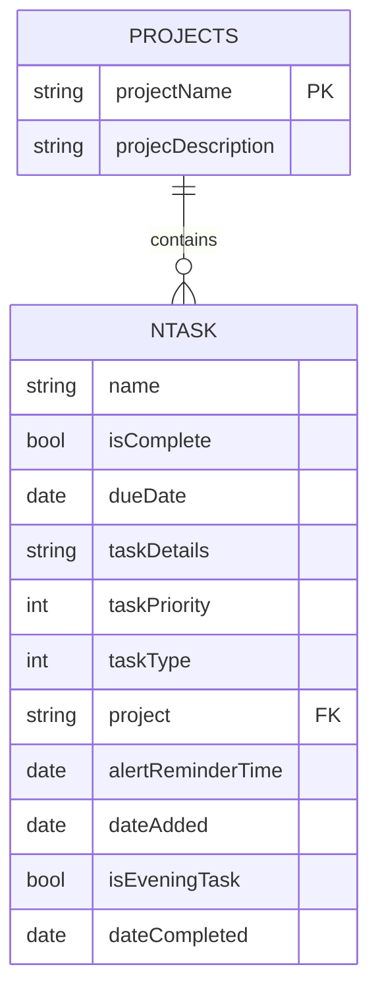
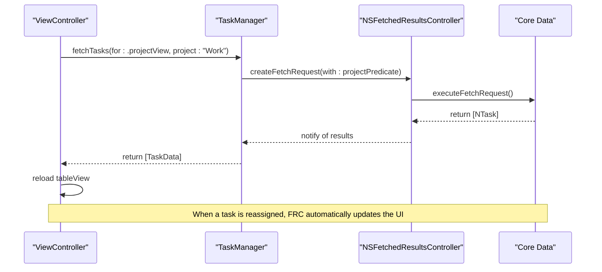

# Task Categorization

<cite>
**Referenced Files in This Document**   
- [TaskManager.swift](file://To%20Do%20List/ViewControllers/TaskManager.swift)
- [ProjectManager.swift](file://To%20Do%20List/ViewControllers/ProjectManager.swift)
- [NTask+CoreDataProperties.swift](file://To%20Do%20List/NTask+CoreDataProperties.swift)
- [Projects+CoreDataProperties.swift](file://Projects+CoreDataProperties.swift)
- [README.md](file://README.md)
</cite>

## Table of Contents
1. [Introduction](#introduction)
2. [Core Data Model and Relationships](#core-data-model-and-relationships)
3. [Task-Project Assignment Mechanism](#task-project-assignment-mechanism)
4. [TaskData Presentation Model](#taskdata-presentation-model)
5. [Reassigning Tasks Between Projects](#reassigning-tasks-between-projects)
6. [Project-Based Filtering and Display](#project-based-filtering-and-display)
7. [Common Issues and Best Practices](#common-issues-and-best-practices)

## Introduction
Tasker is an iOS productivity application that enables users to organize tasks into projects for better categorization and tracking. This document details how task categorization is implemented, focusing on the relationship between tasks and projects, the mechanisms for assigning tasks to projects, and the patterns used for filtering and displaying project-based data. The system leverages Core Data for persistence, with a string-based foreign key linking tasks to projects, and is in the process of migrating toward a formal Core Data relationship model.

## Core Data Model and Relationships

The application's data model is built around two primary Core Data entities: `NTask` and `Projects`. These entities are logically connected through a one-to-many relationship, where a single project can contain multiple tasks.

### NTask Entity
The `NTask` entity represents an individual task and contains the following key attributes:

**NTask Attributes**
- `name`: String - The title of the task
- `isComplete`: Bool - Completion status
- `dueDate`: NSDate? - The scheduled date for completion
- `taskPriority`: Int32 - The priority level (mapped to `TaskPriority` enum)
- `taskType`: Int32 - The category (e.g., morning, evening; mapped to `TaskType` enum)
- `project`: String? - The name of the associated project (acts as a foreign key)
- `dateCompleted`: NSDate? - Timestamp when the task was marked complete

The `project` attribute is a string that references the `projectName` of a `Projects` entity. This design choice allows for flexible project assignment without requiring a formal Core Data relationship, though it necessitates manual management of referential integrity.

### Projects Entity
The `Projects` entity represents a project category and contains the following attributes:

**Projects Attributes**
- `projectName`: String? - The unique identifier for the project
- `projecDescription`: String? - A description of the project (note the typo, preserved for compatibility)

### Relationship and Deletion Rules
The relationship between `Projects` and `NTask` is currently logical rather than enforced by Core Data. The `project` string in `NTask` serves as a foreign key to `Projects.projectName`. 

**Deletion Rule**: When a project is deleted, all tasks associated with that project are reassigned to the default "Inbox" project. This is handled manually in code via the `reassignTasksToInbox(fromProject:)` method in `ProjectManager`, rather than through a Core Data cascade delete rule. This approach prevents data loss and maintains a consistent user experience.



**Diagram sources**
- [README.md](file://README.md#L887-L924)
- [NTask+CoreDataProperties.swift](file://To%20Do%20List/NTask+CoreDataProperties.swift#L10-L25)
- [Projects+CoreDataProperties.swift](file://Projects+CoreDataProperties.swift#L10-L15)

**Section sources**
- [README.md](file://README.md#L887-L924)
- [NTask+CoreDataProperties.swift](file://To%20Do%20List/NTask+CoreDataProperties.swift#L10-L25)
- [Projects+CoreDataProperties.swift](file://Projects+CoreDataProperties.swift#L10-L15)

## Task-Project Assignment Mechanism

Tasks are assigned to projects through a combination of default behavior and explicit user actions. The `ProjectManager` and `TaskManager` classes work together to manage this process.

### Default Project Assignment
When a new task is created without an explicit project, it is automatically assigned to the "Inbox" project. This is managed by the `defaultProject` constant in `ProjectManager`, which is set to "Inbox". The `fixMissingProjecsDataWithDefaultsInternal()` method ensures that an "Inbox" project always exists, creating it if necessary.

### Project Creation and Task Assignment
New projects are created through the `addNewProject(with:and:)` method in `ProjectManager`. Once a project exists, tasks can be assigned to it by setting the `project` attribute of an `NTask` object to the project's name.

```swift
func addNewProject(with name: String, and description: String) -> Bool {
    let trimmedName = name.trimmingCharacters(in: .whitespacesAndNewlines)
    // Validation logic...
    
    let proj = NSEntityDescription.insertNewObject(forEntityName: "Projects", into: context) as! Projects
    proj.projectName = trimmedName
    proj.projecDescription = description
    
    saveContext()
    fetchProjects() 
    return true
}
```

**Section sources**
- [ProjectManager.swift](file://To%20Do%20List/ViewControllers/ProjectManager.swift#L240-L260)

### Inverse Relationship Management
The inverse relationship—from tasks back to their project—is managed by the `getTasksForProjectByName(projectName:)` method in `TaskManager`. This method uses an `NSPredicate` to fetch all tasks where the `project` attribute matches the given project name.

```swift
func getTasksForProjectByName(projectName: String) -> [NTask] {
    let predicate = NSPredicate(format: "project CONTAINS[c] %@", projectName)
    return fetchTasks(predicate: predicate, sortDescriptors: [NSSortDescriptor(key: "dueDate", ascending: true)])
}
```

This method is case-insensitive and uses `CONTAINS[c]` to allow for partial matches, though in practice, it is used with exact project names.

**Section sources**
- [TaskManager.swift](file://To%20Do%20List/ViewControllers/TaskManager.swift#L130-L138)

## TaskData Presentation Model

To decouple the UI from Core Data, the application uses a `TaskData` struct as a presentation model. This struct is populated from an `NTask` managed object and exposes project association through the `project` property.

```swift
struct TaskData {
    let id: UUID
    let name: String
    let details: String?
    let type: TaskType
    let priority: TaskPriority
    let dueDate: Date?
    let project: String?
    let isComplete: Bool
    let dateAdded: Date?
    let dateCompleted: Date?
    
    init(from managedObject: NTask) {
        self.id = managedObject.objectID.uriRepresentation().absoluteString
        self.name = managedObject.name ?? ""
        self.details = managedObject.taskDetails
        self.type = TaskType(rawValue: managedObject.taskType) ?? .morning
        self.priority = TaskPriority(rawValue: managedObject.taskPriority) ?? .medium
        self.dueDate = managedObject.dueDate as Date?
        self.project = managedObject.project
        self.isComplete = managedObject.isComplete
        self.dateAdded = managedObject.dateAdded as Date?
        self.dateCompleted = managedObject.dateCompleted as Date?
    }
}
```

View controllers interact with `TaskData` objects rather than `NTask` directly, which simplifies testing and allows for easier migration to a domain model in the future.

**Section sources**
- [README.md](file://README.md#L524-L571)

## Reassigning Tasks Between Projects

Tasks can be reassigned between projects through several mechanisms, including direct editing, project renaming, and project deletion.

### Direct Reassignment
A task's project can be changed by directly modifying its `project` attribute and saving the context.

```swift
// Example: Reassign a task to a new project
task.project = "Work"
do {
    try context.save()
} catch {
    print("Error saving context: \(error)")
}
```

### Batch Updates
The `ProjectManager` class provides methods for batch updates when a project is renamed or deleted. The `updateTasksForProjectRename(oldName:newName:)` method finds all tasks associated with the old project name and updates their `project` attribute to the new name.

```swift
private func updateTasksForProjectRename(oldName: String, newName: String) {
    let tasksToUpdate = TaskManager.sharedInstance.getTasksForProjectByName(projectName: oldName)
    if !tasksToUpdate.isEmpty {
        for task in tasksToUpdate {
            task.project = newName
        }
        TaskManager.sharedInstance.saveContext()
    }
}
```

Similarly, the `reassignTasksToInbox(fromProject:)` method is called when a project is deleted, moving all its tasks to the "Inbox" project.

**Section sources**
- [ProjectManager.swift](file://To%20Do%20List/ViewControllers/ProjectManager.swift#L310-L325)

### Handling Unassigned (Inbox) Tasks
Tasks that are not assigned to a specific project are categorized under the "Inbox" project. The `getAllInboxTasks()` method in `TaskManager` retrieves all tasks where the `project` attribute is "Inbox".

```swift
func getAllInboxTasks() -> [NTask] {
    let predicate = NSPredicate(format: "project ==[c] %@", ProjectManager.sharedInstance.defaultProject)
    return fetchTasks(predicate: predicate, sortDescriptors: nil)
}
```

This method uses a case-insensitive comparison (`==[c]`) to ensure robust matching.

**Section sources**
- [TaskManager.swift](file://To%20Do%20List/ViewControllers/TaskManager.swift#L110-L116)

## Project-Based Filtering and Display

The application supports multiple views for filtering and displaying tasks based on projects, using `NSPredicate` and `NSFetchedResultsController` for efficient data retrieval.

### Filtering with Predicates
Project-based filtering is implemented using `NSPredicate` in various `TaskManager` methods. For example, to display tasks for a specific project on a given date, the `getTasksForProjectByNameForDate_Open(projectName:date:)` method constructs a compound predicate.

```swift
func getTasksForProjectByNameForDate_Open(projectName: String, date: Date) -> [NTask] {
    let startOfDay = date.startOfDay
    let endOfDay = Calendar.current.date(byAdding: .day, value: 1, to: startOfDay)!
    
    let projectPredicate = NSPredicate(format: "project CONTAINS[c] %@", projectName)
    let dueTodayAndOpenPredicate = NSPredicate(
        format: "dueDate >= %@ AND dueDate < %@ AND isComplete == NO",
        startOfDay as NSDate,
        endOfDay as NSDate
    )
    
    let finalPredicate = NSCompoundPredicate(andPredicateWithSubpredicates: [projectPredicate, dueTodayAndOpenPredicate])
    
    return fetchTasks(predicate: finalPredicate, sortDescriptors: [NSSortDescriptor(key: "dueDate", ascending: true)])
}
```

### Fetched Results Controllers
For table views that display project-grouped tasks, the application uses `NSFetchedResultsController` to efficiently manage and update the displayed data. This controller monitors changes to the underlying data and provides change notifications to the table view, minimizing UI jitter during reassignment operations.



**Diagram sources**
- [TaskManager.swift](file://To%20Do%20List/ViewControllers/TaskManager.swift#L130-L138)
- [README.md](file://README.md#L592-L651)

**Section sources**
- [TaskManager.swift](file://To%20Do%20List/ViewControllers/TaskManager.swift#L130-L138)
- [README.md](file://README.md#L592-L651)

## Common Issues and Best Practices

### Common Issues
1. **Circular References**: The current architecture avoids circular references by using string-based project names instead of direct object relationships.
2. **Inconsistent State During Sync**: Because project assignment is managed in code, there is a risk of inconsistent state if Core Data saves fail. This is mitigated by saving the context immediately after any batch update.
3. **UI Jitter When Reassigning Tasks**: Using `NSFetchedResultsController` minimizes UI jitter by providing fine-grained update notifications rather than requiring a full table reload.

### Best Practices
1. **Maintaining Referential Integrity**: Always use the `ProjectManager` methods to create, rename, or delete projects to ensure that associated tasks are properly reassigned.
2. **Optimizing Fetch Requests**: Use specific `NSPredicate` filters to minimize the amount of data fetched, especially for large datasets. For example, fetching only open tasks for today's date rather than all tasks.
3. **Error Handling**: Wrap Core Data save operations in do-catch blocks and provide user feedback if an error occurs.
4. **Future Migration**: The README notes plans to convert the string-based project reference into a formal Core Data relationship with a *Nullify* delete rule, which would improve data integrity and simplify the code.

**Section sources**
- [README.md](file://README.md#L887-L924)
- [ProjectManager.swift](file://To%20Do%20List/ViewControllers/ProjectManager.swift#L150-L190)
- [TaskManager.swift](file://To%20Do%20List/ViewControllers/TaskManager.swift#L200-L400)