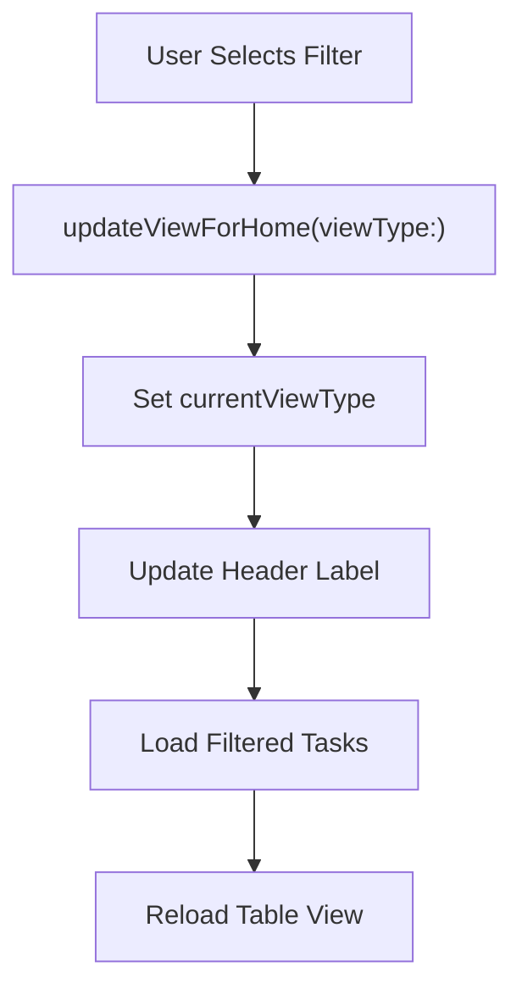
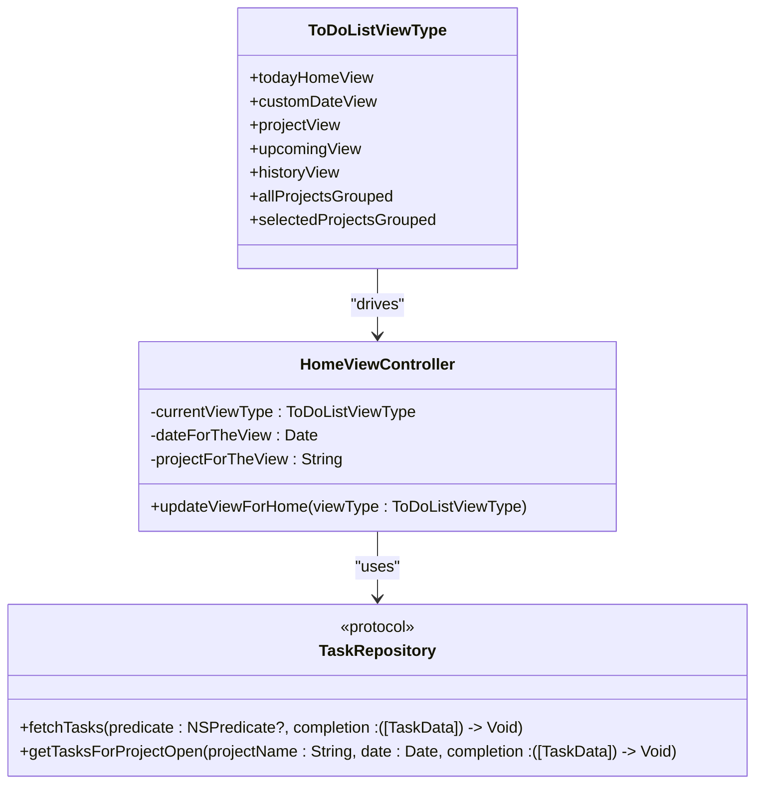

# Filter Contexts Management

<cite>
**Referenced Files in This Document**   
- [ToDoListViewType.swift](file://To%20Do%20List/Models/ToDoListViewType.swift)
- [HomeViewController.swift](file://To%20Do%20List/ViewControllers/HomeViewController.swift)
- [HomeViewController+ProjectFiltering.swift](file://To%20Do%20List/ViewControllers/HomeViewController+ProjectFiltering.swift)
- [TaskRepository.swift](file://To%20Do%20List/Repositories/TaskRepository.swift)
- [TaskData.swift](file://To%20Do%20List/Models/TaskData.swift)
</cite>

## Table of Contents
1. [Introduction](#introduction)
2. [Core Enum Definition: ToDoListViewType](#core-enum-definition-todolistviewtype)
3. [View Type to UI Mapping](#view-type-to-ui-mapping)
4. [Integration with HomeViewController](#integration-with-homeviewcontroller)
5. [Data Filtering and Fetch Logic](#data-filtering-and-fetch-logic)
6. [Extending the Enum with New Filter Types](#extending-the-enum-with-new-filter-types)
7. [State Preservation Across Navigation](#state-preservation-across-navigation)
8. [Common Issues and Debugging Strategies](#common-issues-and-debugging-strategies)
9. [Best Practices for Separation of Concerns](#best-practices-for-separation-of-concerns)
10. [Conclusion](#conclusion)

## Introduction
The **ToDoListViewType** enum serves as the central mechanism for managing filtering contexts within the Tasker application. It defines distinct modes through which users can view their tasks, enabling dynamic data display based on time, project, or completion status. This document provides a comprehensive analysis of how this enum drives filtering logic, integrates with view controllers, generates Core Data predicates, and supports extensible, type-safe navigation between different task views.

## Core Enum Definition: ToDoListViewType

The `ToDoListViewType` enum encapsulates all available filtering modes in the application. Each case represents a unique context for displaying tasks, allowing the UI to dynamically adapt its content based on user selection.

```swift
enum ToDoListViewType {
    case todayHomeView
    case customDateView
    case projectView
    case upcomingView
    case historyView
    case allProjectsGrouped
    case selectedProjectsGrouped
}
```

This design promotes type safety and clarity by eliminating string-based view identifiers. The enum is defined in a dedicated file, ensuring separation from view logic and facilitating reuse across components.

**Section sources**
- [ToDoListViewType.swift](file://To%20Do%20List/Models/ToDoListViewType.swift#L10)

## View Type to UI Mapping

Each case in the `ToDoListViewType` enum corresponds directly to a specific UI state in the `HomeViewController`. The mapping is handled via a switch statement in the `updateViewForHome` method, which updates both the visual header and internal state accordingly.

| View Type | Header Label | Data Context |
|----------|-------------|--------------|
| `.todayHomeView` | "Today" | Tasks due today |
| `.customDateView` | Formatted date (e.g., "Wed, Jun 5") | Tasks due on selected date |
| `.projectView` | Project name | Tasks assigned to specific project |
| `.upcomingView` | "Upcoming" | Future-dated tasks |
| `.historyView` | "History" | Completed tasks |
| `.allProjectsGrouped` | "All Projects" | All tasks grouped by project |
| `.selectedProjectsGrouped` | "Selected Projects" | Tasks from user-selected projects only |

This direct mapping ensures consistent UI behavior and simplifies localization efforts.

**Section sources**
- [HomeViewController+ProjectFiltering.swift](file://To%20Do%20List/ViewControllers/HomeViewController+ProjectFiltering.swift#L117-L160)

## Integration with HomeViewController

The `HomeViewController` maintains a `currentViewType` property that holds the active filtering mode. This property is updated whenever the user navigates between views, triggering a reload of the displayed tasks.

```swift
var currentViewType = ToDoListViewType.todayHomeView
```

When a new view type is selected (e.g., via a drawer menu or calendar interaction), the controller calls `updateViewForHome(viewType:)`, which sets the new mode and refreshes the UI.



**Diagram sources**
- [HomeViewController.swift](file://To%20Do%20List/ViewControllers/HomeViewController.swift#L292)
- [HomeViewController+ProjectFiltering.swift](file://To%20Do%20List/ViewControllers/HomeViewController+ProjectFiltering.swift#L117)

**Section sources**
- [HomeViewController.swift](file://To%20Do%20List/ViewControllers/HomeViewController.swift#L292)
- [HomeViewController+ProjectFiltering.swift](file://To%20Do%20List/ViewControllers/HomeViewController+ProjectFiltering.swift#L117)

## Data Filtering and Fetch Logic

While the current implementation primarily uses `TaskManager` for data access, the architecture supports the `TaskRepository` protocol for dependency injection and testability. Different view types trigger different data loading strategies:

### Date-Based Views (Today, Custom Date)
These views load all tasks for a given date using `TaskManager.sharedInstance.getAllTasksForDate(date:)`, then group them by project.

```swift
func loadTasksForDateGroupedByProject()
```

### Project-Based Views
For `.allProjectsGrouped` and `.selectedProjectsGrouped`, the system fetches open tasks per project using the repository pattern:

```swift
taskRepository.getTasksForProjectOpen(projectName: projectName, date: dateForTheView)
```

This asynchronous approach prevents blocking the main thread during data retrieval.

### Predicate Generation (Conceptual)
Although not explicitly shown in current code, ideal implementation would generate `NSPredicate` instances based on view type:

```swift
extension ToDoListViewType {
    func makePredicate(for date: Date) -> NSPredicate {
        switch self {
        case .todayHomeView, .customDateView:
            return NSPredicate(format: "dueDate == %@", date as NSDate)
        case .upcomingView:
            return NSPredicate(format: "dueDate > %@", Date() as NSDate)
        case .historyView:
            return NSPredicate(format: "isComplete == YES")
        case .projectView:
            return NSPredicate(format: "project == %@", projectForTheView)
        default:
            return NSPredicate(value: true)
        }
    }
}
```

**Section sources**
- [HomeViewController+ProjectFiltering.swift](file://To%20Do%20List/ViewControllers/HomeViewController+ProjectFiltering.swift#L300)
- [TaskRepository.swift](file://To%20Do%20List/Repositories/TaskRepository.swift#L6)

## Extending the Enum with New Filter Types

Adding new filter types is straightforward due to the enum's extensible nature. For example, to add a "Priority-Based" view:

```swift
enum ToDoListViewType {
    // existing cases...
    case priorityView(priority: TaskPriority)
}
```

Then update `updateViewForHome`:

```swift
case .priorityView(let priority):
    toDoListHeaderLabel.text = "Priority: \(priority.rawValue)"
    loadTasksByPriority(priority)
```

And implement `loadTasksByPriority(_:)` using `TaskRepository.fetchTasks(predicate:sortDescriptors:completion:)` with a priority-based predicate.

This pattern ensures type-safe transitions and compile-time validation of all view states.

**Section sources**
- [ToDoListViewType.swift](file://To%20Do%20List/Models/ToDoListViewType.swift#L10)
- [HomeViewController+ProjectFiltering.swift](file://To%20Do%20List/ViewControllers/HomeViewController+ProjectFiltering.swift#L117)

## State Preservation Across Navigation

Filter state is preserved through several mechanisms:

1. **Instance Variables**: `currentViewType`, `dateForTheView`, and `projectForTheView` are retained as long as the `HomeViewController` instance exists.
2. **ViewDidLoad Initialization**: On launch, the view defaults to `.todayHomeView`.
3. **Navigation Events**: The `viewWillAppear(_:)` method forces a reload to reflect any changes made while the view was inactive.

```swift
override func viewWillAppear(_ animated: Bool) {
    super.viewWillAppear(true)
    fluentToDoTableViewController?.tableView.reloadData()
}
```

For full lifecycle persistence (e.g., app termination), additional state restoration using `UserDefaults` or Core Data would be required.

**Section sources**
- [HomeViewController.swift](file://To%20Do%20List/ViewControllers/HomeViewController.swift#L292-L300)

## Common Issues and Debugging Strategies

### Issue 1: Incorrect Task Filtering for Edge Dates
**Symptom**: Tasks not appearing on expected date due to time zone or daylight saving mismatches.

**Solution**: Always compare dates using `Calendar.current.isDate(_:inSameDayAs:)` instead of direct comparison.

```swift
let today = Date().startOfDay
let taskDate = (task.dueDate as Date?).startOfDay
return calendar.isDate(taskDate, inSameDayAs: today)
```

### Issue 2: Project Hierarchy Not Respected
**Symptom**: Tasks not grouped correctly when project names have case variations.

**Solution**: Normalize project names using `.lowercased()` when grouping.

```swift
let projectName = task.project?.lowercased() ?? defaultProject
```

### Debugging Tools
- **Console Logging**: The app includes extensive logging in `loadTasksForDateGroupedByProject()` showing task counts per project.
- **Predicate Testing**: Use unit tests with mock `TaskRepository` to verify filtering logic.
- **UI Inspection**: Check `ToDoListSections` array in debugger to validate section generation.

**Section sources**
- [HomeViewController+ProjectFiltering.swift](file://To%20Do%20List/ViewControllers/HomeViewController+ProjectFiltering.swift#L300)

## Best Practices for Separation of Concerns

The current architecture demonstrates several best practices:

1. **Single Responsibility**: `ToDoListViewType` handles only view state definition.
2. **Dependency Injection**: `TaskRepositoryDependent` protocol allows testable data access.
3. **Type Safety**: Enum cases prevent invalid view states.
4. **Separation of UI and Data Logic**: View updates are decoupled from data fetching.

However, opportunities for improvement include:
- Moving predicate generation into the enum itself.
- Using Combine or async/await for reactive data updates.
- Implementing a dedicated `ViewState` manager to centralize filter state.



**Diagram sources**
- [ToDoListViewType.swift](file://To%20Do%20List/Models/ToDoListViewType.swift#L10)
- [HomeViewController.swift](file://To%20Do%20List/ViewControllers/HomeViewController.swift#L292)
- [TaskRepository.swift](file://To%20Do%20List/Repositories/TaskRepository.swift#L6)

**Section sources**
- [ToDoListViewType.swift](file://To%20Do%20List/Models/ToDoListViewType.swift#L10)
- [HomeViewController.swift](file://To%20Do%20List/ViewControllers/HomeViewController.swift#L292)
- [TaskRepository.swift](file://To%20Do%20List/Repositories/TaskRepository.swift#L6)

## Conclusion
The `ToDoListViewType` enum is a critical component in the Tasker application's architecture, providing a clean, type-safe mechanism for managing filtering contexts. By defining discrete view modes and integrating with the `HomeViewController`, it enables flexible task display while maintaining separation between UI state and data access logic. Future enhancements should focus on strengthening the predicate generation system and improving state persistence across app lifecycle events.