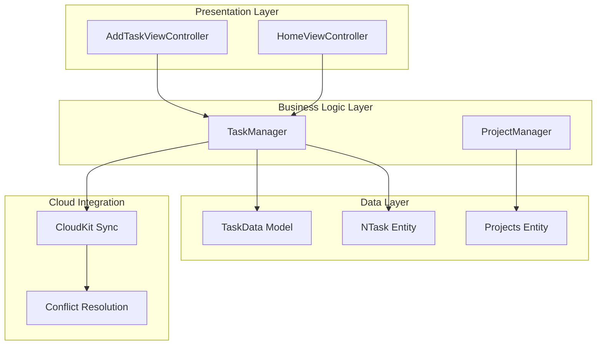
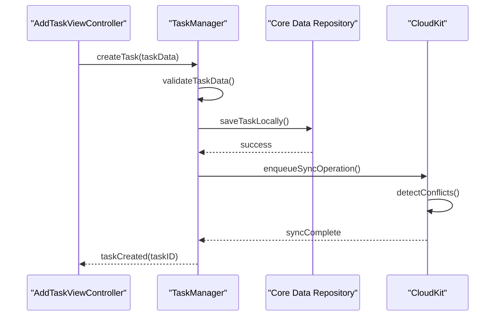
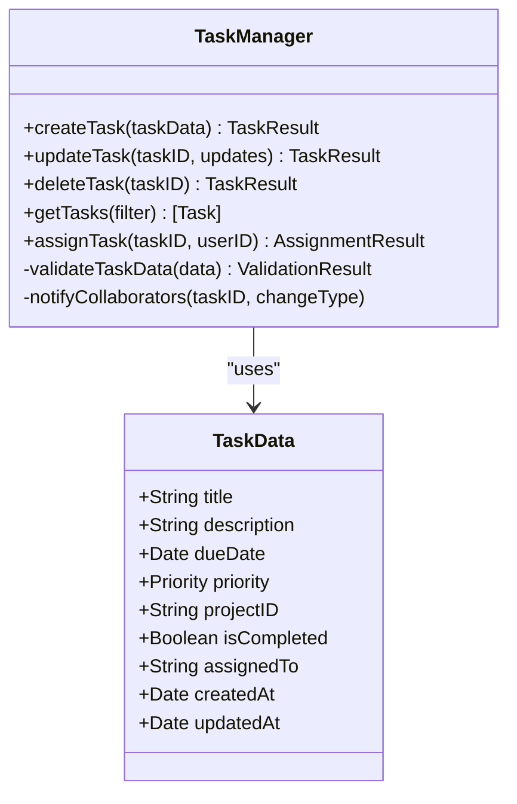
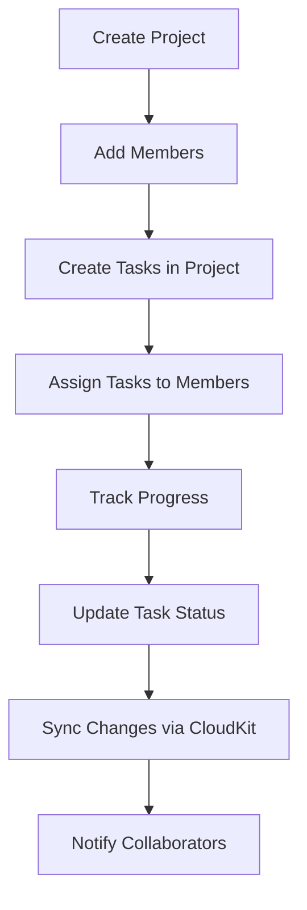
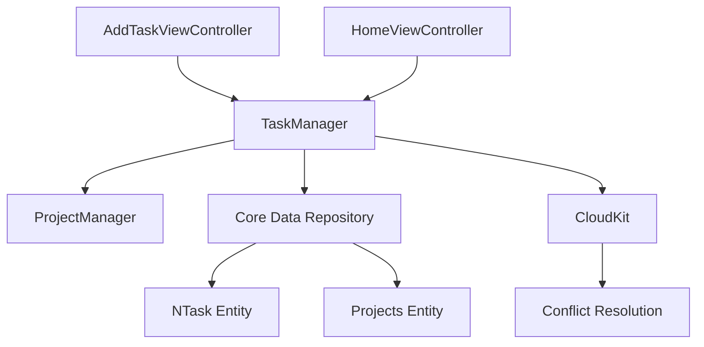

# Task Collaboration

<cite>
**Referenced Files in This Document**   
- [TaskManager.md](file://repowiki/en/content/Technical%20Architecture/Business%20Logic%20Layer/TaskManager.md)
- [Task CRUD Operations.md](file://repowiki/en/content/Task%20Management%20System/Task%20CRUD%20Operations.md)
- [Task Synchronization Mechanics.md](file://repowiki/en/content/Task%20Management%20System/Task%20Synchronization%20Mechanics.md)
- [CloudKit Configuration.md](file://repowiki/en/content/Cloud%20Synchronization/CloudKit%20Configuration.md)
- [Data Synchronization Mechanism.md](file://repowiki/en/content/Cloud%20Synchronization/Data%20Synchronization%20Mechanism.md)
- [Conflict Resolution.md](file://repowiki/en/content/Cloud%20Synchronization/Conflict%20Resolution.md)
- [ProjectManager.md](file://repowiki/en/content/Technical%20Architecture/Business%20Logic%20Layer/ProjectManager.md)
- [Task Categorization.md](file://repowiki/en/content/Project%20Management/Task%20Categorization.md)
- [AddTaskViewController.md](file://repowiki/en/content/Technical%20Architecture/Presentation%20Layer%20Architecture/AddTaskViewController.md)
- [HomeViewController.md](file://repowiki/en/content/Technical%20Architecture/Presentation%20Layer%20Architecture/HomeViewController.md)
- [TaskData Presentation Model.md](file://repowiki/en/content/Core%20Data%20Model/TaskData%20Presentation%20Model.md)
- [NTask Entity.md](file://repowiki/en/content/Core%20Data%20Model/NTask%20Entity.md)
</cite>

## Table of Contents
1. [Introduction](#introduction)
2. [Project Structure](#project-structure)
3. [Core Components](#core-components)
4. [Architecture Overview](#architecture-overview)
5. [Detailed Component Analysis](#detailed-component-analysis)
6. [Dependency Analysis](#dependency-analysis)
7. [Performance Considerations](#performance-considerations)
8. [Troubleshooting Guide](#troubleshooting-guide)
9. [Conclusion](#conclusion)

## Introduction
The Task Collaboration feature enables users to create, manage, and synchronize tasks across multiple devices and users within the Tasker application. This system supports real-time collaboration through cloud-based synchronization, task categorization, and project-based organization. The feature integrates tightly with CloudKit for data consistency and supports offline-first operations with intelligent conflict resolution. This documentation provides a comprehensive overview of its implementation, API interfaces, integration patterns, usage examples, and troubleshooting guidance.

## Project Structure
The Task Collaboration feature is implemented across multiple architectural layers: Presentation, Business Logic, and Data layers. Key directories include:
- `repowiki/en/content/Task Management System/`: Core task operations and lifecycle management
- `repowiki/en/content/Project Management/`: Project-based task grouping and categorization
- `repowiki/en/content/Cloud Synchronization/`: CloudKit integration and data sync logic
- `repowiki/en/content/Technical Architecture/Business Logic Layer/`: TaskManager and ProjectManager services
- `repowiki/en/content/Core Data Model/`: NTask and Projects entity definitions

The modular structure separates concerns between UI components, business logic, and data persistence, enabling scalable collaboration features.

**Diagram sources**
- [AddTaskViewController.md](file://repowiki/en/content/Technical%20Architecture/Presentation%20Layer%20Architecture/AddTaskViewController.md)
- [TaskManager.md](file://repowiki/en/content/Technical%20Architecture/Business%20Logic%20Layer/TaskManager.md)
- [NTask Entity.md](file://repowiki/en/content/Core%20Data%20Model/NTask%20Entity.md)
- [Task Synchronization Mechanics.md](file://repowiki/en/content/Task%20Management%20System/Task%20Synchronization%20Mechanics.md)

**Section sources**
- [TaskManager.md](file://repowiki/en/content/Technical%20Architecture/Business%20Logic%20Layer/TaskManager.md)
- [Task CRUD Operations.md](file://repowiki/en/content/Task%20Management%20System/Task%20CRUD%20Operations.md)

## Core Components
The Task Collaboration system revolves around three core components: TaskManager for handling business logic, NTask entity for data modeling, and CloudKit-based synchronization for cross-device collaboration. The TaskManager orchestrates task creation, updates, and deletion while ensuring data integrity. The NTask entity defines task attributes including title, priority, due date, project association, and completion status. Synchronization mechanics ensure changes propagate across devices with proper conflict handling.

**Section sources**
- [TaskManager.md](file://repowiki/en/content/Technical%20Architecture/Business%20Logic%20Layer/TaskManager.md)
- [NTask Entity.md](file://repowiki/en/content/Core%20Data%20Model/NTask%20Entity.md)
- [Task Synchronization Mechanics.md](file://repowiki/en/content/Task%20Management%20System/Task%20Synchronization%20Mechanics.md)

## Architecture Overview
The Task Collaboration architecture follows a clean separation between presentation, business logic, and data layers. The system uses a repository pattern to abstract data access, with TaskManager serving as the primary service interface. All task operations flow through TaskManager, which validates inputs, enforces business rules, and coordinates with the data layer. CloudKit provides backend storage with automatic conflict detection. The TaskData presentation model bridges Core Data entities with UI components, ensuring efficient data binding.

**Diagram sources**
- [AddTaskViewController.md](file://repowiki/en/content/Technical%20Architecture/Presentation%20Layer%20Architecture/AddTaskViewController.md)
- [TaskManager.md](file://repowiki/en/content/Technical%20Architecture/Business%20Logic%20Layer/TaskManager.md)
- [Data Synchronization Mechanism.md](file://repowiki/en/content/Cloud%20Synchronization/Data%20Synchronization%20Mechanism.md)

## Detailed Component Analysis

### Task Management Service
The TaskManager service implements all collaboration-related operations including task creation, assignment, status updates, and deletion. It enforces validation rules such as non-empty titles and valid date ranges. The service also handles batch operations for efficiency when syncing multiple tasks.

**Diagram sources**
- [TaskManager.md](file://repowiki/en/content/Technical%20Architecture/Business%20Logic%20Layer/TaskManager.md)
- [TaskData Presentation Model.md](file://repowiki/en/content/Core%20Data%20Model/TaskData%20Presentation%20Model.md)

**Section sources**
- [TaskManager.md](file://repowiki/en/content/Technical%20Architecture/Business%20Logic%20Layer/TaskManager.md)
- [Task CRUD Operations.md](file://repowiki/en/content/Task%20Management%20System/Task%20CRUD%20Operations.md)

### Project-Based Collaboration
Tasks can be organized into projects managed by the ProjectManager service. This enables team-based collaboration where members can view and modify tasks within shared projects. Project filtering allows users to focus on specific collaboration groups.

**Diagram sources**
- [ProjectManager.md](file://repowiki/en/content/Technical%20Architecture/Business%20Logic%20Layer/ProjectManager.md)
- [Task Categorization.md](file://repowiki/en/content/Project%20Management/Task%20Categorization.md)

**Section sources**
- [ProjectManager.md](file://repowiki/en/content/Technical%20Architecture/Business%20Logic%20Layer/ProjectManager.md)
- [Project Management.md](file://repowiki/en/content/Project%20Management/Project%20Management.md)

## Dependency Analysis
The Task Collaboration feature depends on several key components and external services. The primary dependency is CloudKit for data synchronization, which requires proper configuration in CloudKit Configuration.md. The system relies on Core Data for local persistence and uses the Repository Pattern to abstract data access. TaskManager depends on ProjectManager for project-related operations and collaborates with AddTaskViewController and HomeViewController for UI interactions.

**Diagram sources**
- [TaskManager.md](file://repowiki/en/content/Technical%20Architecture/Business%20Logic%20Layer/TaskManager.md)
- [ProjectManager.md](file://repowiki/en/content/Technical%20Architecture/Business%20Logic%20Layer/ProjectManager.md)
- [Repository Pattern Implementation.md](file://repowiki/en/content/Technical%20Architecture/Data%20Layer%20Architecture/Repository%20Pattern%20Implementation.md)
- [CloudKit Configuration.md](file://repowiki/en/content/Cloud%20Synchronization/CloudKit%20Configuration.md)

**Section sources**
- [TaskManager.md](file://repowiki/en/content/Technical%20Architecture/Business%20Logic%20Layer/TaskManager.md)
- [ProjectManager.md](file://repowiki/en/content/Technical%20Architecture/Business%20Logic%20Layer/ProjectManager.md)
- [Repository Pattern Implementation.md](file://repowiki/en/content/Technical%20Architecture/Data%20Layer%20Architecture/Repository%20Pattern%20Implementation.md)

## Performance Considerations
The system implements several performance optimizations for collaboration scenarios. Batch synchronization reduces network overhead by grouping multiple task updates. Local caching ensures responsive UI even during network outages. The TaskData presentation model minimizes Core Data faulting by pre-fetching related entities. Filtering and search operations use indexed attributes for fast lookups. Background sync operations prevent UI blocking during data transfer.

**Section sources**
- [Data Synchronization Strategy.md](file://repowiki/en/content/Technical%20Architecture/Data%20Layer%20Architecture/Data%20Synchronization%20Strategy.md)
- [Search Performance Optimization.md](file://repowiki/en/content/Search%20&%20Filtering%20System/Search%20Performance%20Optimization.md)
- [Data Fetching and Performance Optimization.md](file://repowiki/en/content/Technical%20Architecture/Architecture%20Overview/Data%20Fetching%20and%20Performance%20Optimization.md)

## Troubleshooting Guide
Common issues in Task Collaboration typically involve synchronization failures or data conflicts. When tasks don't appear across devices, verify CloudKit authentication and internet connectivity. For conflict resolution issues, check the conflict logs in the system diagnostics. If task assignments aren't propagating, ensure the user has proper project permissions. Performance issues may indicate inefficient filtering queries or excessive sync operations. Use the built-in analytics dashboard to monitor sync frequency and error rates.

**Section sources**
- [Conflict Resolution.md](file://repowiki/en/content/Cloud%20Synchronization/Conflict%20Resolution.md)
- [Data Synchronization Mechanism.md](file://repowiki/en/content/Cloud%20Synchronization/Data%20Synchronization%20Mechanism.md)
- [Task Synchronization Mechanics.md](file://repowiki/en/content/Task%20Management%20System/Task%20Synchronization%20Mechanics.md)

## Conclusion
The Task Collaboration feature provides a robust foundation for multi-user task management with seamless cross-device synchronization. By leveraging CloudKit and a clean architectural separation, the system ensures data consistency while supporting offline operations. The modular design allows for future enhancements such as real-time editing and advanced permission controls. Proper implementation of the documented patterns ensures reliable collaboration experiences for end users.