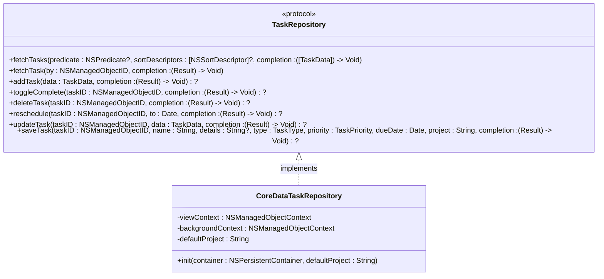
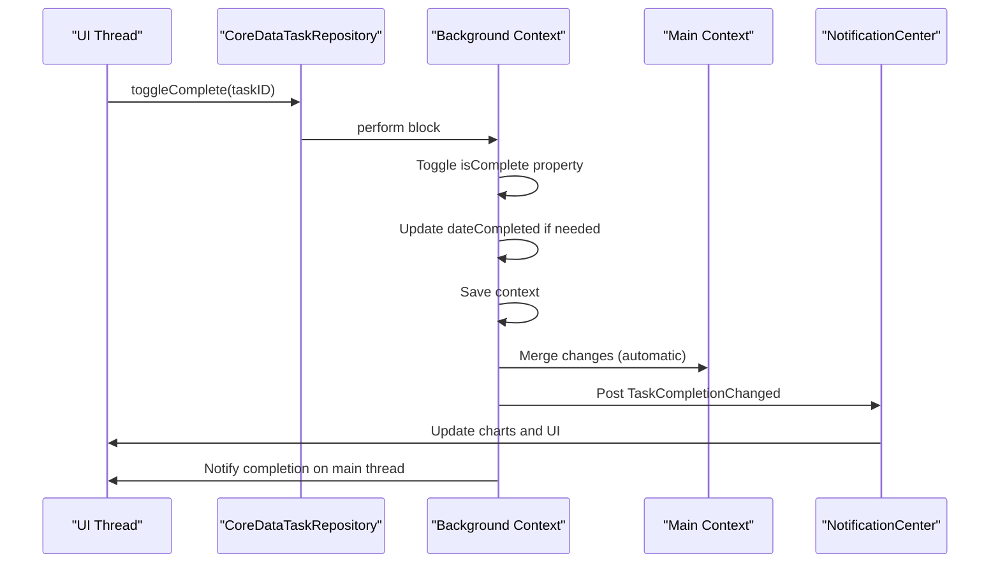
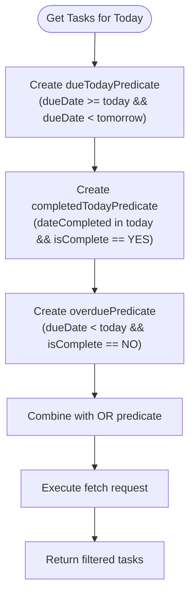
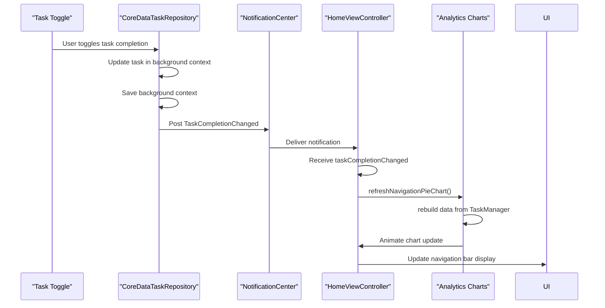
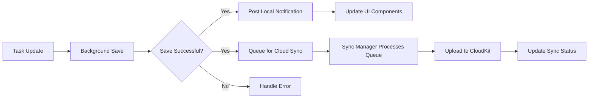
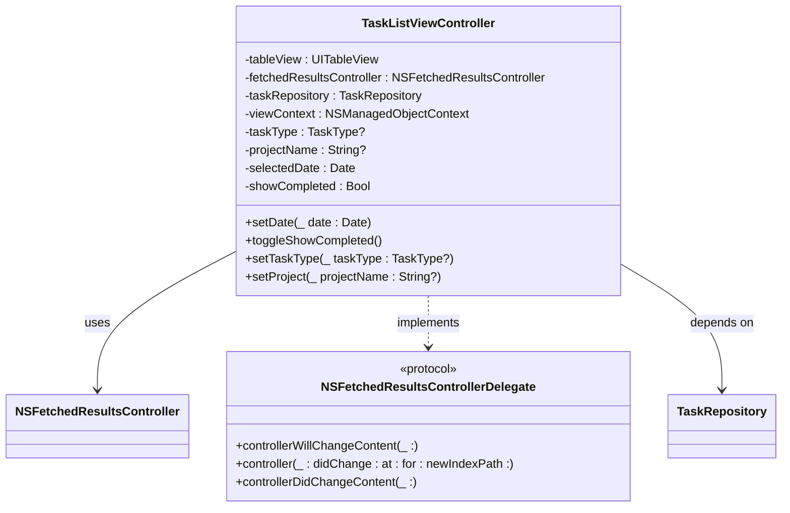
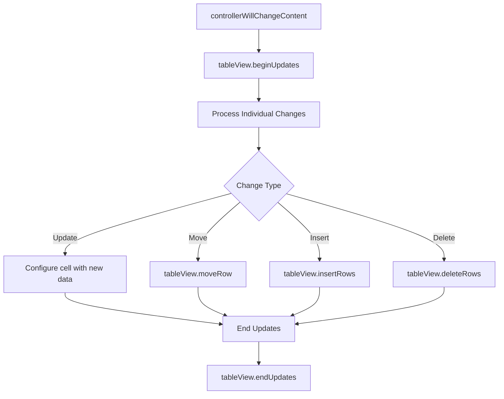
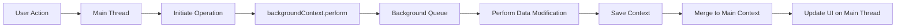

# Data Consistency and Performance

<cite>
**Referenced Files in This Document**   
- [TaskRepository.swift](file://To%20Do%20List/Repositories/TaskRepository.swift)
- [CoreDataTaskRepository.swift](file://To%20Do%20List/Repositories/CoreDataTaskRepository.swift)
- [TaskListViewController.swift](file://To%20Do%20List/ViewControllers/TaskListViewController.swift)
- [HomeViewController.swift](file://To%20Do%20List/ViewControllers/HomeViewController.swift)
</cite>

## Table of Contents
1. [Data Consistency Mechanisms](#data-consistency-mechanisms)
2. [Performance Optimization Strategies](#performance-optimization-strategies)
3. [Task State Change Propagation](#task-state-change-propagation)
4. [Memory Management and NSFetchedResultsController](#memory-management-and-nsfetchedresultscontroller)
5. [Performance Tuning for Large Datasets](#performance-tuning-for-large-datasets)
6. [Profiling and Bottleneck Analysis](#profiling-and-bottleneck-analysis)

## Data Consistency Mechanisms

The task management system implements robust data consistency mechanisms through a combination of Core Data concurrency patterns and serial operation queues to prevent race conditions during concurrent task edits.

The system uses a protocol-oriented approach with the `TaskRepository` protocol defining a contract for all task data operations. This abstraction enables dependency injection and improves testability by allowing mock implementations during testing.



**Diagram sources**
- [TaskRepository.swift](file://To%20Do%20List/Repositories/TaskRepository.swift#L1-L117)
- [CoreDataTaskRepository.swift](file://To%20Do%20List/Repositories/CoreDataTaskRepository.swift#L1-L455)

The concrete implementation `CoreDataTaskRepository` leverages Core Data's built-in concurrency support by maintaining two managed object contexts:
- **viewContext**: Used for read operations and UI display, configured with `automaticallyMergesChangesFromParent = true` to receive changes from background saves
- **backgroundContext**: Dedicated to background operations like saving and updating, created via `container.newBackgroundContext()`

This dual-context architecture ensures that all write operations occur on a background queue, preventing UI blocking while maintaining data consistency. The background context uses `NSMergeByPropertyObjectTrumpMergePolicy` to resolve merge conflicts by favoring changes from the background context.

All data modifications are performed within `backgroundContext.perform {}` blocks, which serializes operations on the background queue. This prevents race conditions when multiple tasks are edited concurrently, as operations are executed sequentially rather than in parallel.

For example, when toggling a task's completion status:



**Diagram sources**
- [CoreDataTaskRepository.swift](file://To%20Do%20Do%20List/Repositories/CoreDataTaskRepository.swift#L150-L185)

**Section sources**
- [TaskRepository.swift](file://To%20Do%20List/Repositories/TaskRepository.swift#L1-L117)
- [CoreDataTaskRepository.swift](file://To%20Do%20List/Repositories/CoreDataTaskRepository.swift#L1-L455)

## Performance Optimization Strategies

The system employs several performance optimization techniques to handle large datasets efficiently while maintaining responsiveness with thousands of tasks.

### Batch Processing Techniques

For handling large datasets, the system implements batch processing through carefully constructed fetch requests with appropriate predicates and sort descriptors. The `CoreDataTaskRepository` provides specialized methods for different task categories:

- `getMorningTasks(for:completion:)` - Fetches morning tasks for a specific date
- `getEveningTasks(for:completion:)` - Fetches evening tasks for a specific date  
- `getUpcomingTasks(completion:)` - Fetches upcoming tasks
- `getTasksForInbox(date:completion:)` - Fetches inbox tasks for a date
- `getTasksForProject(projectName:date:completion:)` - Fetches tasks for a specific project and date

These methods use compound predicates to efficiently filter tasks based on multiple criteria including date ranges, completion status, and project membership. For today's view, the system includes overdue tasks by combining multiple predicates with OR logic:



**Diagram sources**
- [CoreDataTaskRepository.swift](file://To%20Do%20List/Repositories/CoreDataTaskRepository.swift#L200-L350)

The fetch operations are performed on the view context within a `perform` block to ensure thread safety, with results mapped to `TaskData` value objects and returned via completion handlers on the main queue for UI updates.

**Section sources**
- [CoreDataTaskRepository.swift](file://To%20Do%20List/Repositories/CoreDataTaskRepository.swift#L1-L455)

## Task State Change Propagation

Changes to task state trigger coordinated updates across multiple system components through a well-defined event propagation system.

### Notification-Based Architecture

The system uses `NotificationCenter` to broadcast significant state changes, enabling loose coupling between components. When a task's completion status changes, the repository posts a notification:

```swift
NotificationCenter.default.post(name: NSNotification.Name("TaskCompletionChanged"), object: nil)
```

The `HomeViewController` observes this notification and responds by refreshing its analytics components:



**Diagram sources**
- [CoreDataTaskRepository.swift](file://To%20Do%20List/Repositories/CoreDataTaskRepository.swift#L175-L180)
- [HomeViewController.swift](file://To%20Do%20List/ViewControllers/HomeViewController.swift#L150-L160)

The `HomeViewController` registers for the notification in `viewDidLoad`:

```swift
notificationCenter.addObserver(self, selector: #selector(taskCompletionChanged), name: NSNotification.Name("TaskCompletionChanged"), object: nil)
```

This decoupled architecture allows the analytics system to remain synchronized with task state without direct dependencies on the data repository.

### CloudKit Sync Integration

Although not explicitly shown in the provided code, the notification system provides a natural extension point for CloudKit synchronization. A dedicated sync manager could observe the same notifications and queue changes for cloud synchronization, ensuring that local state changes are eventually propagated to iCloud.

The completion handler pattern in the repository interface supports this by providing success/failure callbacks that could trigger sync operations:



This approach ensures that cloud synchronization occurs off the main thread and doesn't block UI updates, while still maintaining eventual consistency between local and cloud data.

**Section sources**
- [CoreDataTaskRepository.swift](file://To%20Do%20List/Repositories/CoreDataTaskRepository.swift#L1-L455)
- [HomeViewController.swift](file://To%20Do%20List/ViewControllers/HomeViewController.swift#L1-L1106)

## Memory Management and NSFetchedResultsController

The system employs `NSFetchedResultsController` for efficient memory management and automatic UI updates when working with table views.

### NSFetchedResultsController Implementation

The `TaskListViewController` uses `NSFetchedResultsController<NTask>` to manage the display of tasks in a table view. This component provides several key benefits:

- **Memory Efficiency**: Only faults objects into memory as they become visible in the table view
- **Change Tracking**: Automatically observes changes to the managed object context and reports updates
- **Batch Updates**: Translates Core Data change notifications into animated table view updates



**Diagram sources**
- [TaskListViewController.swift](file://To%20Do%20List/ViewControllers/TaskListViewController.swift#L1-L480)

The fetched results controller is configured with:

- **Fetch Request**: Includes dynamic predicates based on filters (task type, project, date range)
- **Sort Descriptors**: Prioritizes tasks by priority (descending) then due date (ascending)
- **Delegate**: Set to self to receive change notifications
- **No Cache**: `cacheName: nil` to avoid stale data issues

### Change Handling Implementation

The controller implements the `NSFetchedResultsControllerDelegate` protocol to handle data changes:



When a task is toggled in the table view:

```swift
func tableView(_ tableView: UITableView, didSelectRowAt indexPath: IndexPath) {
    if let task = fetchedResultsController?.object(at: indexPath) {
        taskRepository.toggleComplete(taskID: task.objectID) { [weak self] result in
            // UI updates automatically via NSFetchedResultsController
        }
    }
}
```

The `NSFetchedResultsController` detects the change in the managed object context and automatically triggers the delegate methods, resulting in smooth animated updates to the table view without requiring manual reloads.

**Section sources**
- [TaskListViewController.swift](file://To%20Do%20List/ViewControllers/TaskListViewController.swift#L1-L480)

## Performance Tuning for Large Datasets

The system implements several performance tuning techniques to maintain responsiveness with thousands of tasks.

### Table View Optimization

The `TaskCell` class implements efficient cell configuration:

```swift
func configure(with task: NTask) {
    // Apply strikethrough attribute for completed tasks
    if task.isComplete {
        let attributedTitle = NSAttributedString(string: title, attributes: [.strikethroughStyle: NSUnderlineStyle.single.rawValue])
        titleLabel.attributedText = attributedTitle
        titleLabel.textColor = .gray
    } else {
        titleLabel.text = title
        titleLabel.textColor = .black
    }
    
    // Construct details string with due date and project
    var details: [String] = []
    if let dueDate = task.dueDate as Date? {
        details.append(formatter.string(from: dueDate))
    }
    if let project = task.project, project.lowercased() != "inbox" {
        details.append(project)
    }
    detailsLabel.text = details.joined(separator: " • ")
    
    // Set priority indicator color
    switch task.taskPriority {
    case TaskPriority.high.rawValue:
        priorityIndicator.backgroundColor = .systemRed
    case TaskPriority.medium.rawValue:
        priorityIndicator.backgroundColor = .systemOrange
    case TaskPriority.low.rawValue:
        priorityIndicator.backgroundColor = .systemBlue
    default:
        priorityIndicator.backgroundColor = .systemGray
    }
}
```

Key optimizations include:
- **Attribute String Caching**: Avoids recreating attributed strings unnecessarily
- **Conditional Formatting**: Only applies strikethrough for completed tasks
- **Efficient String Joining**: Uses `joined(separator:)` for constructing details text
- **Direct Property Assignment**: Updates only changed properties rather than reloading entire cell

### Fetch Request Optimization

The system optimizes fetch requests by:
- Using specific predicates to limit result sets
- Applying sort descriptors for consistent ordering
- Avoiding unnecessary faulting of relationships
- Using compound predicates for complex filtering logic

For date-based queries, the system uses `startOfDay` extensions to normalize date comparisons and properly handle time components.

### Background Processing

All data modifications occur on the background context, preventing UI blocking:



This ensures that even with thousands of tasks, the UI remains responsive during data operations.

**Section sources**
- [TaskListViewController.swift](file://To%20Do%20List/ViewControllers/TaskListViewController.swift#L1-L480)
- [CoreDataTaskRepository.swift](file://To%20Do%20List/Repositories/CoreDataTaskRepository.swift#L1-L455)

## Profiling and Bottleneck Analysis

### Common Performance Bottlenecks

Based on the code analysis, potential bottlenecks include:

1. **Frequent Context Saves**: Each task operation triggers a context save, which could be batched for multiple operations
2. **Redundant Data Fetching**: The `priorityBreakdown(for:)` method iterates through all tasks rather than using a fetch request with grouping
3. **Unnecessary UI Updates**: The `refreshHomeView()` method reloads data without checking if filters have changed

### Optimization Recommendations

1. **Batch Operations**: Implement batch processing for multiple task updates:
```swift
func batchUpdate(tasks: [NSManagedObjectID], updates: (NTask) -> Void, completion: (Result<Void, Error>) -> Void)
```

2. **Optimize Analytics Queries**: Replace in-memory filtering with Core Data fetch requests using `NSExpression` for grouping:
```swift
let expression = NSExpression(forKeyPath: "taskPriority")
let expressionDescription = NSExpressionDescription()
expressionDescription.expression = expression
expressionDescription.name = "priority"
expressionDescription.expressionResultType = .integer32AttributeType
```

3. **Implement Result Caching**: Cache frequently accessed data like daily task counts to avoid repeated calculations.

4. **Debounce Rapid Updates**: When multiple tasks are updated in quick succession, debounce the analytics refresh to prevent excessive UI updates.

5. **Lazy Loading**: For very large datasets, implement pagination or infinite scrolling rather than loading all tasks at once.

### Profiling Tips

1. **Use Core Data Instruments**: Monitor fetch request performance and context save times
2. **Check UI Thread Usage**: Ensure no Core Data operations occur on the main thread
3. **Monitor Memory Usage**: Watch for memory growth when loading large numbers of tasks
4. **Measure Table View Performance**: Use Time Profiler to identify slow cell configuration
5. **Test with Real Data**: Profile with datasets of 10,000+ tasks to identify scalability issues

The current architecture provides a solid foundation for performance, with clear separation of concerns and proper concurrency patterns. With targeted optimizations, the system can efficiently handle even larger datasets while maintaining responsiveness.

**Section sources**
- [CoreDataTaskRepository.swift](file://To%20Do%20List/Repositories/CoreDataTaskRepository.swift#L1-L455)
- [TaskListViewController.swift](file://To%20Do%20List/ViewControllers/TaskListViewController.swift#L1-L480)
- [HomeViewController.swift](file://To%20Do%20List/ViewControllers/HomeViewController.swift#L1-L1106)