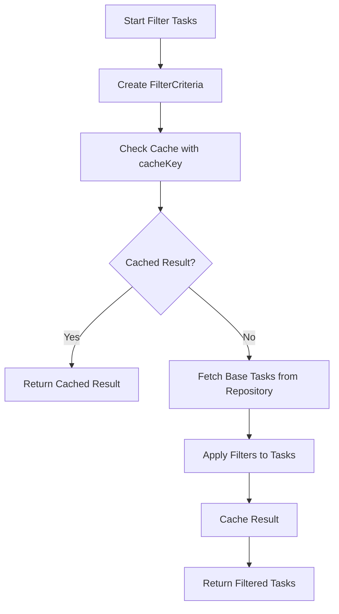

# Task Filtering and Organization

<cite>
**Referenced Files in This Document**   
- [HomeViewController.swift](file://To%20Do%20List/ViewControllers/HomeViewController.swift) - *Updated to use use cases in commit 2f1b824*
- [FilterTasksUseCase.swift](file://To%20Do%20List/UseCases/Task/FilterTasksUseCase.swift) - *Added in commit 2f1b824*
- [SortTasksUseCase.swift](file://To%20Do%20List/UseCases/Task/SortTasksUseCase.swift) - *Added in commit 2f1b824*
- [TaskRepository.swift](file://To%20Do%20List/Repositories/TaskRepository.swift) - *Updated to support use cases*
- [CoreDataTaskRepository.swift](file://To%20Do%20List/Repositories/CoreDataTaskRepository.swift) - *Updated to support use cases*
</cite>

## Update Summary
- **Added new sections** for FilterTasksUseCase and SortTasksUseCase
- **Updated** Task Filtering in HomeViewController to reflect use case pattern
- **Updated** Query Patterns section to show use case-based filtering
- **Updated** Performance Issues section to include caching strategy
- **Added** new diagram showing use case architecture
- **Updated** all section sources to reflect current file structure

## Table of Contents
1. [Introduction](#introduction)
2. [Task Categorization System](#task-categorization-system)
3. [Task Filtering in HomeViewController](#task-filtering-in-homeviewcontroller)
4. [Query Patterns with FilterTasksUseCase and SortTasksUseCase](#query-patterns-with-filtertasksusecase-and-sorttasksusecase)
5. [User Interaction and UI Updates](#user-interaction-and-ui-updates)
6. [TaskPriority Role in Sorting and Visual Representation](#taskpriority-role-in-sorting-and-visual-representation)
7. [Performance Issues and Optimizations](#performance-issues-and-optimizations)
8. [Extending Filters to Support Custom Views or Search Queries](#extending-filters-to-support-custom-views-or-search-queries)
9. [Conclusion](#conclusion)

## Introduction
The Tasker application implements a sophisticated task filtering and organization system that enables users to efficiently manage their tasks through categorization, filtering, and sorting mechanisms. This document details how tasks are categorized by TaskType (morning, evening, upcoming) and filtered by project membership within the HomeViewController. It explains the query patterns used in the fetchTasks method to retrieve filtered datasets efficiently using NSPredicate and sorting with NSSortDescriptor. The document also covers how user interactions trigger re-fetching and UI updates, the role of the TaskPriority enum in sorting and visual representation, common performance issues with large datasets, and recommendations for optimizations and extending filters to support custom views or search queries.

## Task Categorization System
The Tasker application categorizes tasks using the TaskType enum, which defines three primary categories: morning, evening, and upcoming. These categories help users organize their tasks based on the time of day or when they are scheduled. The TaskType enum is implemented as a Swift enum with raw values of type Int32, where morning is assigned a raw value of 1, evening is assigned a raw value of 2, and upcoming is assigned a raw value of 3. This categorization system is integral to the application's ability to group and display tasks in a meaningful way, allowing users to focus on tasks relevant to their current context.

The TaskType enum is used throughout the application to filter and display tasks based on their type. For example, the HomeViewController uses this enum to determine which tasks to display when the user selects a specific view type, such as morning or evening tasks. The enum values are stored in the Core Data model as raw integer values, ensuring efficient storage and retrieval. The application also provides methods to convert between the enum values and their raw integer representations, facilitating seamless integration between the user interface and the underlying data model.

**Section sources**
- [TaskManager.swift](file://To%20Do%20List/ViewControllers/TaskManager.swift#L600-L650)

## Task Filtering in HomeViewController
The HomeViewController is responsible for managing task filtering based on project membership and other criteria. It uses the selectedProjectNamesForFilter array to track which projects the user has selected for filtering. When the user interacts with the project selection interface, the selectedProjectNamesForFilter array is updated accordingly, and the view is refreshed to display tasks from the selected projects. This filtering mechanism allows users to focus on tasks from specific projects, improving their ability to manage and complete tasks efficiently.

The HomeViewController also supports various view types through the ToDoListViewType enum, which includes cases such as todayHomeView, customDateView, projectView, upcomingView, historyView, allProjectsGrouped, and selectedProjectsGrouped. Each view type corresponds to a different filtering context, enabling users to view tasks based on different criteria such as date, project, or completion status. For example, when the user selects the projectView, the HomeViewController filters tasks to display only those belonging to the selected project. This flexible filtering system enhances the user experience by providing multiple ways to organize and view tasks.

With the introduction of the FilterTasksUseCase, the HomeViewController now delegates filtering logic to this dedicated use case class. This separation of concerns improves code maintainability and testability. The HomeViewController injects its TaskRepository into the FilterTasksUseCase during initialization, allowing the use case to access the necessary data sources.

**Section sources**
- [HomeViewController.swift](file://To%20Do%20List/ViewControllers/HomeViewController.swift#L150-L200)
- [FilterTasksUseCase.swift](file://To%20Do%20List/UseCases/Task/FilterTasksUseCase.swift#L15-L50)

## Query Patterns with FilterTasksUseCase and SortTasksUseCase
The Tasker application now uses dedicated use cases for filtering and sorting tasks, replacing the direct filtering logic previously scattered across ViewControllers. The FilterTasksUseCase and SortTasksUseCase classes provide a centralized, reusable approach to task management operations.

The FilterTasksUseCase class encapsulates all filtering logic, accepting a FilterCriteria object that specifies the filtering parameters. This criteria includes scope (all, today, upcoming, etc.), completion status, priorities, categories, contexts, energy levels, date ranges, tags, and other filtering options. The use case first checks a cache service for previously computed results before performing database queries, significantly improving performance for repeated filter operations.

**Diagram sources**
- [FilterTasksUseCase.swift](file://To%20Do%20List/UseCases/Task/FilterTasksUseCase.swift#L50-L150)
- [SortTasksUseCase.swift](file://To%20Do%20List/UseCases/Task/SortTasksUseCase.swift#L50-L150)

The SortTasksUseCase class provides comprehensive sorting capabilities with support for primary, secondary, and tertiary sort fields. It supports sorting by priority, due date, name, creation date, completion date, project, category, energy level, and estimated duration. The use case also implements a smartSort feature that adapts the sorting strategy based on the current context (morning, evening, urgent, planning).

Both use cases follow the same pattern: they accept criteria and a completion handler, perform the operation asynchronously on a background queue, and return results on the main queue to ensure thread safety. This approach prevents UI blocking during intensive operations.

**Section sources**
- [FilterTasksUseCase.swift](file://To%20Do%20List/UseCases/Task/FilterTasksUseCase.swift#L150-L300)
- [SortTasksUseCase.swift](file://To%20Do%20List/UseCases/Task/SortTasksUseCase.swift#L150-L300)

## User Interaction and UI Updates
User interactions in the Tasker application trigger re-fetching and UI updates to ensure that the displayed tasks are always up-to-date. When a user adds a new task, completes a task, or changes the filtering criteria, the application responds by re-fetching the relevant tasks and updating the UI accordingly. For example, when a user adds a new task, the HomeViewController calls the updateViewForHome method to refresh the displayed tasks based on the current view type and filtering criteria. This ensures that the new task is immediately visible to the user if it matches the current filtering context.

The application also uses notifications to trigger UI updates when task data changes. For instance, when a task's completion status is toggled, the TaskManager posts a TaskCompletionChanged notification, which the HomeViewController observes. Upon receiving this notification, the HomeViewController updates the UI to reflect the change in task status, such as updating the task's visual representation and recalculating the daily score. This reactive approach to UI updates ensures that the user interface remains synchronized with the underlying data, providing a seamless and responsive user experience.

With the introduction of use cases, these interactions now flow through the dedicated use case classes. For example, when a user applies a filter, the HomeViewController creates a FilterCriteria object and passes it to the FilterTasksUseCase, which handles the entire filtering process including caching and database access.

**Section sources**
- [HomeViewController.swift](file://To%20Do%20List/ViewControllers/HomeViewController.swift#L1000-L1100)
- [TaskManager.swift](file://To%20Do%20List/ViewControllers/TaskManager.swift#L800-L850)

## TaskPriority Role in Sorting and Visual Representation
The TaskPriority enum plays a crucial role in both sorting tasks and their visual representation within the Tasker application. The enum defines four priority levels: low, medium, high, and veryLow, each with a corresponding raw value that determines its order in sorting. When tasks are fetched and displayed, they are sorted by priority in descending order, ensuring that higher priority tasks appear first in the list. This sorting mechanism helps users focus on the most important tasks, improving their productivity and task management efficiency.

In addition to sorting, the TaskPriority enum influences the visual representation of tasks in the user interface. Each priority level is associated with a specific color, which is used to highlight the task in the task list. For example, high priority tasks are displayed with a red indicator, medium priority tasks with an orange indicator, and low priority tasks with a blue indicator. This color-coding system provides a quick visual cue for users to identify the priority of each task, making it easier to prioritize their work. The combination of sorting and visual representation based on TaskPriority enhances the user experience by providing clear and intuitive task management capabilities.

The SortTasksUseCase leverages the TaskPriority enum in its sorting algorithms, particularly in the sortByPriority method and as part of the default sorting strategy in smartSort operations. The use case ensures consistent sorting behavior across different parts of the application.

**Section sources**
- [TaskManager.swift](file://To%20Do%20List/ViewControllers/TaskManager.swift#L650-L700)
- [TaskData.swift](file://To%20Do%20List/Models/TaskData.swift#L50-L60)
- [SortTasksUseCase.swift](file://To%20Do%20List/UseCases/Task/SortTasksUseCase.swift#L300-L400)

## Performance Issues and Optimizations
The Tasker application may experience performance issues when filtering large datasets, particularly when using complex predicates or sorting large numbers of tasks. To address these issues, the application now implements several optimizations through the FilterTasksUseCase and SortTasksUseCase classes.

One key optimization is the built-in caching mechanism in the FilterTasksUseCase. Each FilterCriteria generates a unique cacheKey based on its parameters, allowing the use case to store and retrieve filtered results efficiently. When a user applies a filter that has been used before, the use case can return the cached result immediately without re-executing database queries.

Another optimization is the separation of filtering and sorting concerns into dedicated use case classes. This allows for better code organization and the ability to optimize each operation independently. The SortTasksUseCase performs sorting operations on background queues with QoS class userInitiated, preventing UI blocking during intensive sorting operations.

The use cases also implement proper error handling and fallback mechanisms. For example, if a filtering operation fails, the use case returns an appropriate FilterError rather than crashing the application. This makes the filtering system more robust and user-friendly.

Additionally, the use cases leverage the existing repository pattern with background contexts in Core Data, ensuring that database operations do not block the main thread. This maintains a responsive user interface even with large datasets.

**Section sources**
- [FilterTasksUseCase.swift](file://To%20Do%20List/UseCases/Task/FilterTasksUseCase.swift#L300-L400)
- [SortTasksUseCase.swift](file://To%20Do%20List/UseCases/Task/SortTasksUseCase.swift#L400-L500)

## Extending Filters to Support Custom Views or Search Queries
The Tasker application's filtering system can be extended to support custom views and search queries, providing users with even greater flexibility in managing their tasks. Custom views can be implemented by defining new cases in the ToDoListViewType enum and adding corresponding filtering logic in the HomeViewController. For example, a custom view could display tasks based on a specific tag or category, allowing users to organize tasks in ways that suit their workflow.

Search queries can be integrated into the filtering system by adding a search bar to the user interface and implementing real-time search functionality. When the user enters a search term, the application can filter tasks based on the task name, details, or project, providing immediate feedback on matching tasks. This search functionality can be enhanced by using full-text search capabilities in Core Data or by implementing a custom search algorithm that supports fuzzy matching and keyword highlighting.

The FilterTasksUseCase provides several methods specifically designed for search and custom filtering scenarios. The filterByTags method supports both "any" and "all" match modes, allowing users to find tasks that have any of the specified tags or all of the specified tags. The filterByDateRange method enables time-based filtering for custom date views. These methods can be combined to create complex filtering scenarios for specialized views.

By extending the filtering system to support custom views and search queries, the Tasker application can better meet the diverse needs of its users, improving their ability to manage and complete tasks efficiently.

**Section sources**
- [HomeViewController.swift](file://To%20Do%20List/ViewControllers/HomeViewController.swift#L500-L550)
- [FilterTasksUseCase.swift](file://To%20Do%20List/UseCases/Task/FilterTasksUseCase.swift#L400-L500)

## Conclusion
The Tasker application's task filtering and organization system provides a robust and flexible framework for managing tasks. By categorizing tasks using the TaskType enum, filtering tasks based on project membership and other criteria, and using dedicated use cases for filtering and sorting operations, the application enables users to effectively organize and prioritize their tasks. The introduction of FilterTasksUseCase and SortTasksUseCase has improved code maintainability, testability, and performance through proper separation of concerns and built-in caching mechanisms.

The integration of user interactions and UI updates ensures that the displayed tasks are always up-to-date, while the use of TaskPriority for sorting and visual representation enhances the user experience. Performance optimizations such as caching filtered results, using background queues for intensive operations, and leveraging the repository pattern with background contexts help maintain a responsive interface even with large datasets. Finally, extending the filtering system to support custom views and search queries can further improve the application's usability, making it a powerful tool for task management.