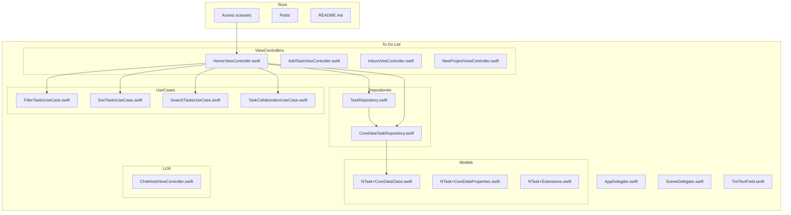
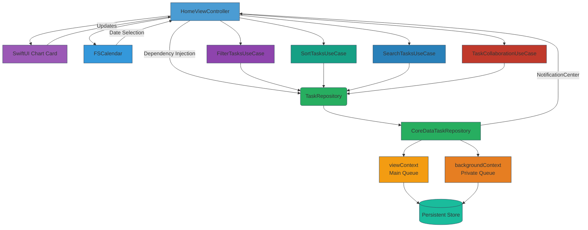
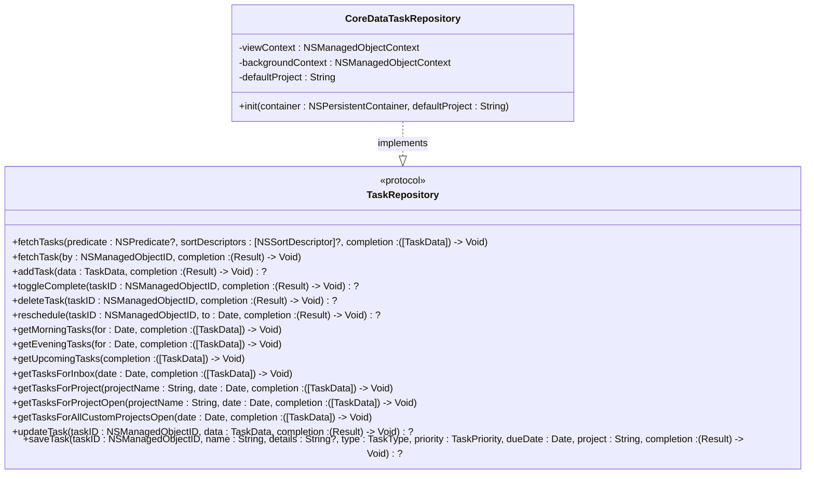
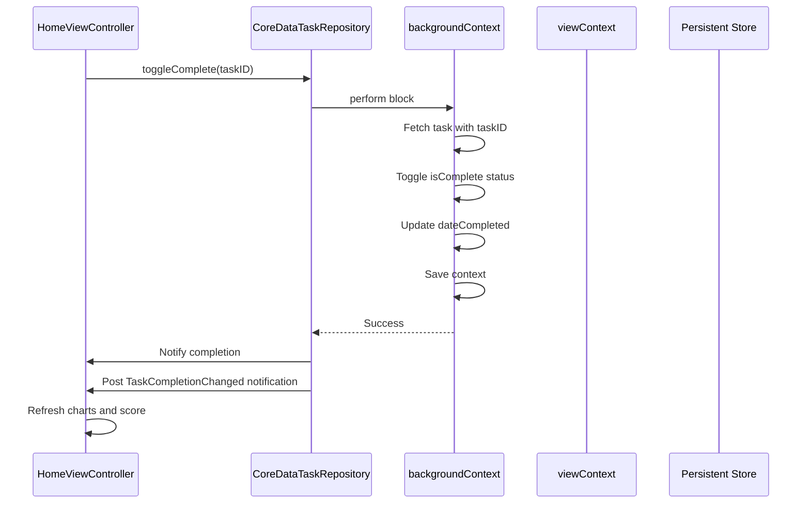
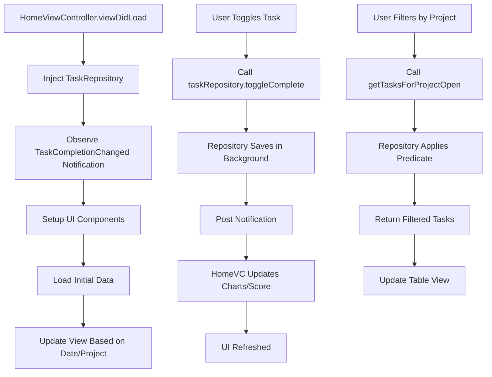
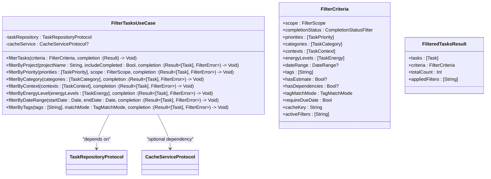

<docs>
# Task Management System

<cite>
**Referenced Files in This Document**   
- [TaskRepository.swift](file://To Do List/Repositories/TaskRepository.swift) - *Updated in recent commit*
- [CoreDataTaskRepository.swift](file://To Do List/Repositories/CoreDataTaskRepository.swift) - *Updated in recent commit*
- [HomeViewController.swift](file://To Do List/ViewControllers/HomeViewController.swift) - *Updated in recent commit*
- [FilterTasksUseCase.swift](file://To Do List/UseCases/Task/FilterTasksUseCase.swift) - *Added in recent commit*
- [SortTasksUseCase.swift](file://To Do List/UseCases/Task/SortTasksUseCase.swift) - *Added in recent commit*
- [SearchTasksUseCase.swift](file://To Do List/UseCases/Task/SearchTasksUseCase.swift) - *Added in recent commit*
- [TaskCollaborationUseCase.swift](file://To Do List/UseCases/Task/TaskCollaborationUseCase.swift) - *Added in recent commit*
- [NTask+CoreDataClass.swift](file://To Do List/NTask+CoreDataClass.swift)
- [NTask+CoreDataProperties.swift](file://To Do List/NTask+CoreDataProperties.swift)
- [NTask+Extensions.swift](file://To Do List/NTask+Extensions.swift)
</cite>

## Update Summary
- Added comprehensive documentation for new use case implementations: filtering, sorting, searching, and collaboration
- Updated architecture overview to reflect the use case layer integration
- Enhanced detailed component analysis with new use case interactions
- Added new sections for use case implementations and their integration with existing components
- Updated dependency analysis to include new use case dependencies
- Added performance considerations for new use case implementations

## Table of Contents
1. [Introduction](#introduction)
2. [Project Structure](#project-structure)
3. [Core Components](#core-components)
4. [Architecture Overview](#architecture-overview)
5. [Detailed Component Analysis](#detailed-component-analysis)
6. [Use Case Implementations](#use-case-implementations)
7. [Dependency Analysis](#dependency-analysis)
8. [Performance Considerations](#performance-considerations)
9. [Troubleshooting Guide](#troubleshooting-guide)
10. [Conclusion](#conclusion)

## Introduction
This document provides a comprehensive analysis of the task management system's Repository pattern implementation, now enhanced with new use case implementations. It focuses on the separation between the `TaskRepository` protocol and its concrete `CoreDataTaskRepository` implementation using Core Data. The system enables dependency injection, promotes testability, and ensures thread-safe data access across the application. Special attention is given to how tasks are queried by type (morning/evening), how completion updates trigger UI refreshes and score recalculations, and the mechanisms in place for maintaining data consistency across contexts. The document has been updated to include new use case implementations for filtering, sorting, searching, and collaboration.

## Project Structure



**Diagram sources**
- [TaskRepository.swift](file://To Do List/Repositories/TaskRepository.swift)
- [CoreDataTaskRepository.swift](file://To Do List/Repositories/CoreDataTaskRepository.swift)
- [HomeViewController.swift](file://To Do List/ViewControllers/HomeViewController.swift)
- [FilterTasksUseCase.swift](file://To Do List/UseCases/Task/FilterTasksUseCase.swift)
- [SortTasksUseCase.swift](file://To Do List/UseCases/Task/SortTasksUseCase.swift)
- [SearchTasksUseCase.swift](file://To Do List/UseCases/Task/SearchTasksUseCase.swift)
- [TaskCollaborationUseCase.swift](file://To Do List/UseCases/Task/TaskCollaborationUseCase.swift)

**Section sources**
- [TaskRepository.swift](file://To Do List/Repositories/TaskRepository.swift)
- [CoreDataTaskRepository.swift](file://To Do List/Repositories/CoreDataTaskRepository.swift)

## Core Components

The core components of the task management system revolve around the Repository pattern, which abstracts data access logic behind a protocol. The `TaskRepository` defines a comprehensive contract for all CRUD operations and specialized queries, enabling loose coupling between the UI layer and persistence mechanism. The `CoreDataTaskRepository` provides a concrete implementation using Core Data with proper context management for thread safety. The `HomeViewController` consumes this repository via dependency injection, allowing it to remain agnostic of the underlying data storage details while supporting rich querying capabilities including filtering by `TaskType`, project, and date ranges. The system has been enhanced with new use case implementations for filtering, sorting, searching, and collaboration, which provide advanced functionality while maintaining separation of concerns.

**Section sources**
- [TaskRepository.swift](file://To Do List/Repositories/TaskRepository.swift#L1-L117)
- [CoreDataTaskRepository.swift](file://To Do List/Repositories/CoreDataTaskRepository.swift#L1-L455)
- [HomeViewController.swift](file://To Do List/ViewControllers/HomeViewController.swift#L1-L1106)
- [FilterTasksUseCase.swift](file://To Do List/UseCases/Task/FilterTasksUseCase.swift#L1-L530)
- [SortTasksUseCase.swift](file://To Do List/UseCases/Task/SortTasksUseCase.swift#L1-L587)
- [SearchTasksUseCase.swift](file://To Do List/UseCases/Task/SearchTasksUseCase.swift#L1-L601)
- [TaskCollaborationUseCase.swift](file://To Do List/UseCases/Task/TaskCollaborationUseCase.swift#L1-L799)

## Architecture Overview



**Diagram sources**
- [TaskRepository.swift](file://To Do List/Repositories/TaskRepository.swift)
- [CoreDataTaskRepository.swift](file://To Do List/Repositories/CoreDataTaskRepository.swift)
- [HomeViewController.swift](file://To Do List/ViewControllers/HomeViewController.swift)
- [FilterTasksUseCase.swift](file://To Do List/UseCases/Task/FilterTasksUseCase.swift)
- [SortTasksUseCase.swift](file://To Do List/UseCases/Task/SortTasksUseCase.swift)
- [SearchTasksUseCase.swift](file://To Do List/UseCases/Task/SearchTasksUseCase.swift)
- [TaskCollaborationUseCase.swift](file://To Do List/UseCases/Task/TaskCollaborationUseCase.swift)

## Detailed Component Analysis

### TaskRepository Protocol Analysis

The `TaskRepository` protocol defines a comprehensive interface for task data operations, enabling dependency injection and testability. It abstracts all data access concerns from the view layer.



**Diagram sources**
- [TaskRepository.swift](file://To Do List/Repositories/TaskRepository.swift#L1-L117)
- [CoreDataTaskRepository.swift](file://To Do List/Repositories/CoreDataTaskRepository.swift#L1-L455)

### CoreDataTaskRepository Implementation Analysis

The `CoreDataTaskRepository` implements the `TaskRepository` protocol using Core Data with proper concurrency management. It utilizes two managed object contexts: a `viewContext` for UI-related fetches and a `backgroundContext` for all write operations.



**Diagram sources**
- [CoreDataTaskRepository.swift](file://To Do List/Repositories/CoreDataTaskRepository.swift#L1-L455)
- [HomeViewController.swift](file://To Do List/ViewControllers/HomeViewController.swift#L1-L1106)

### HomeViewController Integration Analysis

The `HomeViewController` integrates with the repository pattern through dependency injection, consuming the `TaskRepository` protocol rather than the concrete implementation.



**Diagram sources**
- [HomeViewController.swift](file://To Do List/ViewControllers/HomeViewController.swift#L1-L1106)
- [CoreDataTaskRepository.swift](file://To Do List/Repositories/CoreDataTaskRepository.swift#L1-L455)

**Section sources**
- [HomeViewController.swift](file://To Do List/ViewControllers/HomeViewController.swift#L1-L1106)
- [CoreDataTaskRepository.swift](file://To Do List/Repositories/CoreDataTaskRepository.swift#L1-L455)

## Use Case Implementations

### FilterTasksUseCase Implementation

The `FilterTasksUseCase` provides advanced filtering capabilities for tasks based on multiple criteria including completion status, priorities, categories, contexts, energy levels, date ranges, and tags. It implements a caching mechanism to improve performance for repeated filter operations.



**Diagram sources**
- [FilterTasksUseCase.swift](file://To Do List/UseCases/Task/FilterTasksUseCase.swift#L1-L530)

**Section sources**
- [FilterTasksUseCase.swift](file://To Do List/UseCases/Task/FilterTasksUseCase.swift#L1-L530)

### SortTasksUseCase Implementation

The `SortTasksUseCase` provides comprehensive sorting capabilities for tasks with multiple criteria and advanced options. It supports primary, secondary, and tertiary sorting fields with configurable sort order.

```mermaid
classDiagram
class