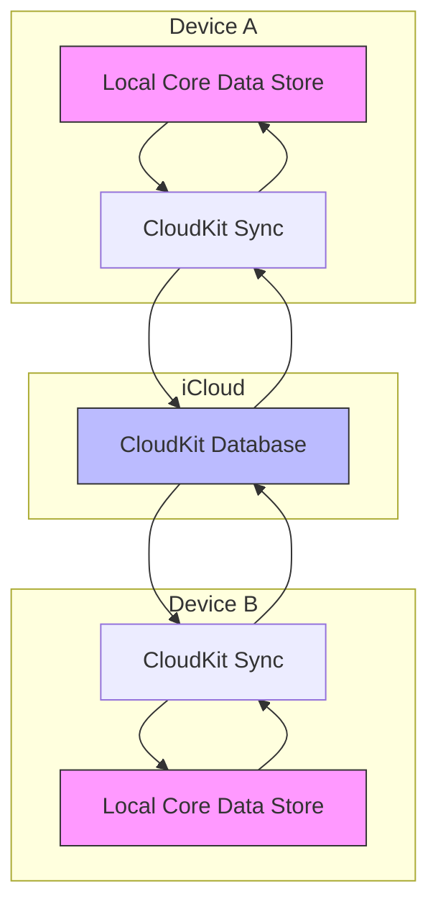
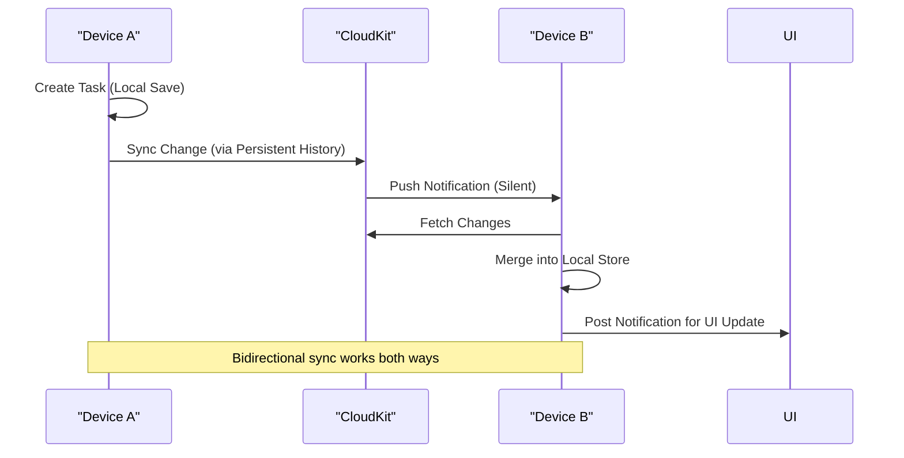

# Task Synchronization Mechanics

<cite>
**Referenced Files in This Document**   
- [AppDelegate.swift](file://To%20Do%20List/AppDelegate.swift)
- [CoreDataTaskRepository.swift](file://To%20Do%20List/Repositories/CoreDataTaskRepository.swift)
- [NTask+CoreDataProperties.swift](file://To%20Do%20List/NTask+CoreDataProperties.swift)
- [NTask+CoreDataClass.swift](file://To%20Do%20List/NTask+CoreDataClass.swift)
</cite>

## Table of Contents
1. [Introduction](#introduction)
2. [Core Data and CloudKit Integration Overview](#core-data-and-cloudkit-integration-overview)
3. [CloudKit Container Configuration](#cloudkit-container-configuration)
4. [Sync Mechanism and Change Propagation](#sync-mechanism-and-change-propagation)
5. [Conflict Resolution and Merge Policies](#conflict-resolution-and-merge-policies)
6. [Remote Change Handling and UI Updates](#remote-change-handling-and-ui-updates)
7. [Common Sync Issues and Troubleshooting](#common-sync-issues-and-troubleshooting)
8. [Developer Tools for Monitoring Sync](#developer-tools-for-monitoring-sync)
9. [Conclusion](#conclusion)

## Introduction
This document details the synchronization mechanics between the local Core Data store and CloudKit in the Tasker application. It explains how `NSPersistentCloudKitContainer` enables seamless, bidirectional syncing of task data across devices using iCloud. The system ensures data consistency, handles conflicts intelligently, and maintains offline functionality while automatically propagating changes when connectivity is restored. This documentation covers configuration, change tracking, conflict resolution, and developer tooling for monitoring and debugging sync behavior.

## Core Data and CloudKit Integration Overview

The Tasker app leverages Apple’s `NSPersistentCloudKitContainer` to synchronize task data across devices via iCloud. This integration enables automatic syncing of tasks created, updated, or deleted on one device to appear on all other devices signed into the same iCloud account. The architecture follows a local-first design, where all operations occur against the local Core Data store, and CloudKit acts as a background synchronization layer.

Key features of the integration include:
- **Automatic Record Zone Management**: `NSPersistentCloudKitContainer` automatically manages CloudKit record zones and handles schema synchronization.
- **Bidirectional Sync**: Changes made locally are pushed to CloudKit, and remote changes are pulled and merged into the local store.
- **Offline Support**: Users can create and modify tasks without internet connectivity; changes sync when reconnected.
- **Efficient Change Tracking**: Uses persistent history tracking to identify and propagate only changed records.



**Diagram sources**
- [AppDelegate.swift](file://To%20Do%20List/AppDelegate.swift#L100-L150)

**Section sources**
- [AppDelegate.swift](file://To%20Do%20List/AppDelegate.swift#L100-L150)

## CloudKit Container Configuration

The CloudKit container is configured during the initialization of the `NSPersistentCloudKitContainer` in `AppDelegate.swift`. The container is named `"TaskModel"` and is associated with a specific iCloud container identifier.

### Configuration Parameters
- **Container Name**: `"TaskModel"` – Defines the Core Data model used for persistence.
- **CloudKit Container Identifier**: `"iCloud.TaskerCloudKit"` – Links the app to a dedicated iCloud container.
- **History Tracking**: Enabled via `NSPersistentHistoryTrackingKey` to support robust change tracking.
- **Remote Change Notifications**: Enabled with `NSPersistentStoreRemoteChangeNotificationPostOptionKey` to receive silent push notifications for remote changes.

```swift
description.cloudKitContainerOptions = NSPersistentCloudKitContainerOptions(
    containerIdentifier: "iCloud.TaskerCloudKit"
)
description.setOption(true as NSNumber, forKey: NSPersistentHistoryTrackingKey)
description.setOption(true as NSNumber, forKey: NSPersistentStoreRemoteChangeNotificationPostOptionKey)
```

The app also registers for remote notifications to receive silent pushes from CloudKit when changes occur on other devices.

**Section sources**
- [AppDelegate.swift](file://To%20Do%20List/AppDelegate.swift#L107-L111)

## Sync Mechanism and Change Propagation

Task synchronization relies on Core Data’s persistent history tracking and CloudKit’s change token system. When a task is created, updated, or deleted, the change is recorded in the local persistent history. `NSPersistentCloudKitContainer` periodically uploads these changes to CloudKit using change tokens to track progress.

### Change Flow
1. **Local Change**: A task is modified in the local Core Data store.
2. **Save Context**: The context is saved, triggering persistent history tracking.
3. **CloudKit Upload**: `NSPersistentCloudKitContainer` detects the change and uploads it to CloudKit.
4. **Remote Notification**: Other devices receive a silent push notification via APNs.
5. **Download and Merge**: Devices fetch changes from CloudKit and merge them into the local store.

Background contexts are used for write operations in `CoreDataTaskRepository`, ensuring thread safety and performance.



**Diagram sources**
- [AppDelegate.swift](file://To%20Do%20List/AppDelegate.swift#L100-L150)
- [CoreDataTaskRepository.swift](file://To%20Do%20List/Repositories/CoreDataTaskRepository.swift#L20-L30)

**Section sources**
- [AppDelegate.swift](file://To%20Do%20List/AppDelegate.swift#L100-L150)
- [CoreDataTaskRepository.swift](file://To%20Do%20List/Repositories/CoreDataTaskRepository.swift#L20-L30)

## Conflict Resolution and Merge Policies

When concurrent edits occur across devices, the system employs a merge policy to resolve conflicts. The `NSMergeByPropertyStoreTrumpMergePolicy` is set on the main context, meaning that if a conflict arises, the values from the persistent store (i.e., the remote CloudKit version) take precedence over in-memory changes.

### Conflict Scenarios
- **Same Task Edited on Two Devices**: The last saved change wins per property.
- **Task Deleted Remotely, Edited Locally**: The deletion takes precedence after sync.
- **Property-Level Conflicts**: Individual properties are resolved based on the merge policy.

The use of `automaticallyMergesChangesFromParent = true` ensures that changes from background contexts and remote stores are automatically reflected in the view context without manual merging.

```swift
container.viewContext.automaticallyMergesChangesFromParent = true
container.viewContext.mergePolicy = NSMergeByPropertyStoreTrumpMergePolicy
```

This setup minimizes data loss and provides a predictable resolution strategy.

**Section sources**
- [AppDelegate.swift](file://To%20Do%20List/AppDelegate.swift#L133-L135)

## Remote Change Handling and UI Updates

When remote changes are detected, the app uses `NSPersistentStoreRemoteChange` notifications to merge updates into the main context. The `handlePersistentStoreRemoteChange(_:)` method in `AppDelegate` listens for these notifications and performs the merge on the context queue to ensure thread safety.

After merging, the app triggers data consolidation logic to fix any missing project or task defaults and posts a custom notification to inform the UI layer of changes.

```swift
@objc func handlePersistentStoreRemoteChange(_ notification: Notification) {
    context.perform {
        context.mergeChanges(fromContextDidSave: notification)
        ProjectManager.sharedInstance.fixMissingProjecsDataWithDefaults()
        TaskManager.sharedInstance.fixMissingTasksDataWithDefaults()
        NotificationCenter.default.post(name: Notification.Name("DataDidChangeFromCloudSync"), object: nil)
    }
}
```

UI components observe the `"DataDidChangeFromCloudSync"` notification to refresh task lists and charts accordingly.

**Section sources**
- [AppDelegate.swift](file://To%20Do%20List/AppDelegate.swift#L160-L180)

## Common Sync Issues and Troubleshooting

Despite robust sync mechanisms, users may encounter issues due to network conditions, iCloud availability, or quota limits.

### Common Issues
- **Sync Delays**: Caused by poor connectivity or iCloud throttling. Changes sync once connection is restored.
- **Partial Failures**: Some records may fail to sync due to validation errors or schema mismatches.
- **Quota Limits**: Exceeding iCloud storage limits halts syncing until resolved.
- **Missing Remote Changes**: Silent push notifications may be delayed or dropped.

### Troubleshooting Steps
1. **Check iCloud Status**: Ensure the user is signed in and iCloud Drive is enabled.
2. **Verify Container Access**: Confirm `"iCloud.TaskerCloudKit"` container is accessible.
3. **Force Sync**: Restart the app or manually trigger a context save.
4. **Review Console Logs**: Look for CloudKit event logs and error messages.
5. **Clear and Re-sync**: As a last resort, delete and re-download the store (with user consent).

Developers should guide users to check Settings > [Your Name] > iCloud > Show All > Tasker to verify app-specific iCloud permissions.

## Developer Tools for Monitoring Sync

The app includes built-in logging for CloudKit events to aid debugging. By observing `NSPersistentCloudKitContainer.eventChangedNotification`, developers can monitor sync operations in real time.

```swift
NotificationCenter.default.addObserver(
    forName: NSPersistentCloudKitContainer.eventChangedNotification,
    object: persistentContainer,
    queue: .main
) { note in
    guard let events = note.userInfo?[NSPersistentCloudKitContainer.eventNotificationUserInfoKey] as? [NSPersistentCloudKitContainer.Event] else { return }
    for event in events {
        print("📡 CloudKit event:", event.type)
        if let err = event.error { print("   ⛔️ error:", err) }
    }
}
```

This logs events such as:
- `.importCompleted`
- `.exportCompleted`
- `.errorEncountered`

These logs help identify sync status, detect errors, and validate that changes are being propagated correctly across devices.

**Section sources**
- [AppDelegate.swift](file://To%20Do%20List/AppDelegate.swift#L140-L160)

## Conclusion

The Tasker application implements a robust, automatic synchronization system between Core Data and CloudKit using `NSPersistentCloudKitContainer`. By enabling persistent history tracking, remote change notifications, and proper merge policies, the app ensures consistent, conflict-resilient data across devices. Developers can monitor sync behavior through event notifications, while users benefit from seamless, offline-capable task management. With proper troubleshooting and monitoring, sync reliability can be maximized across diverse network conditions and device states.