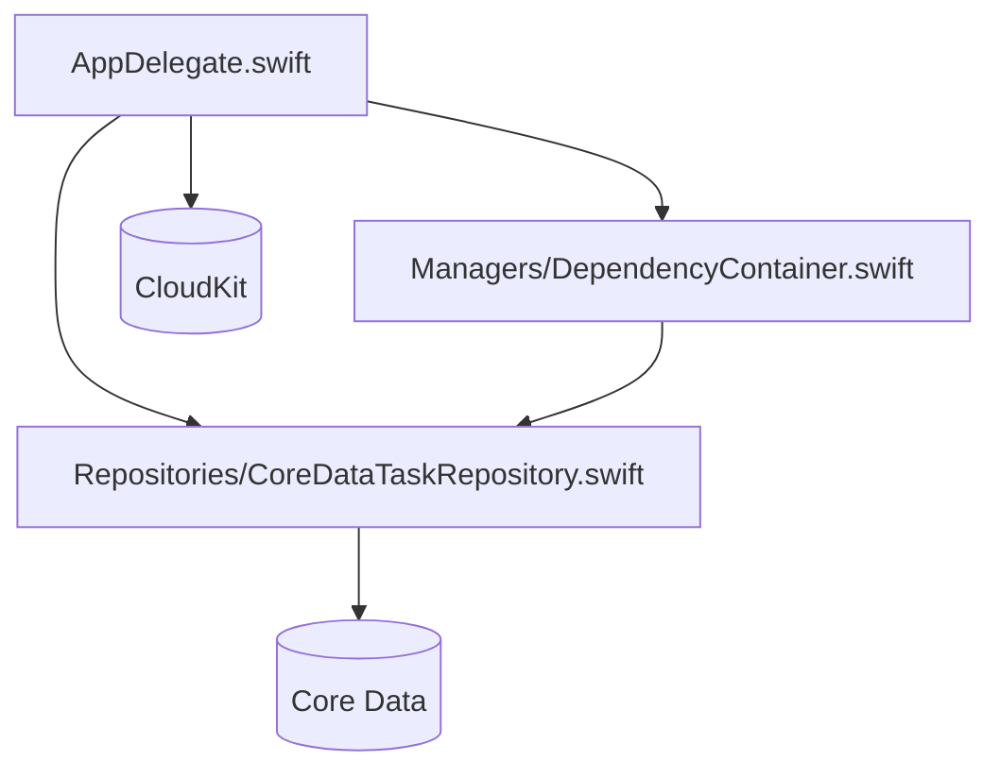
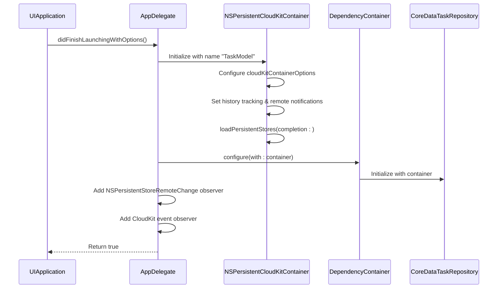
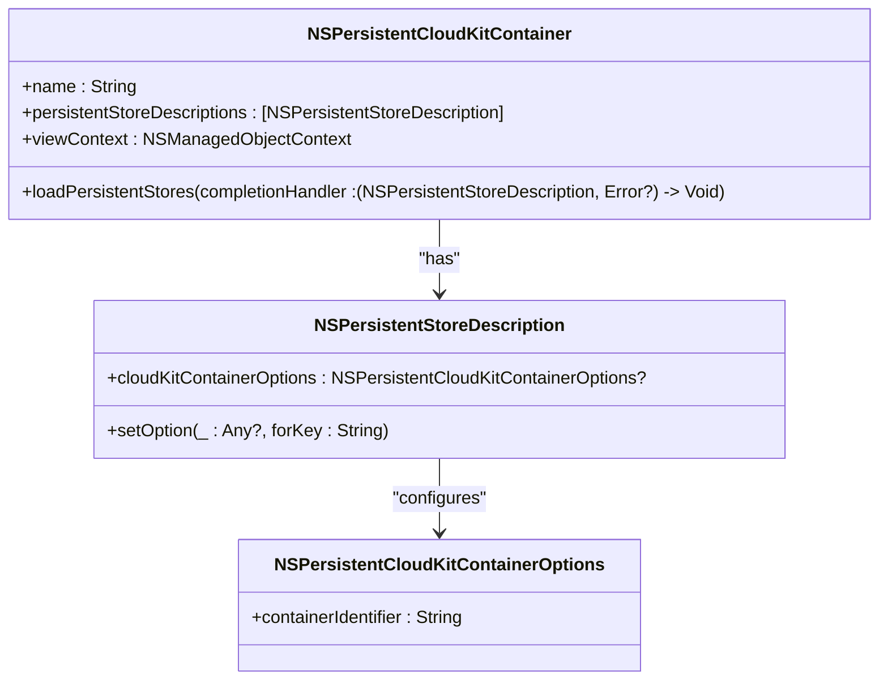
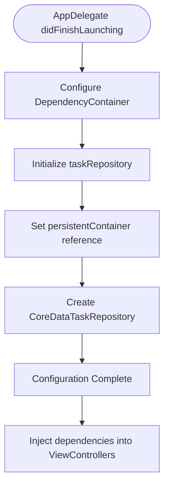
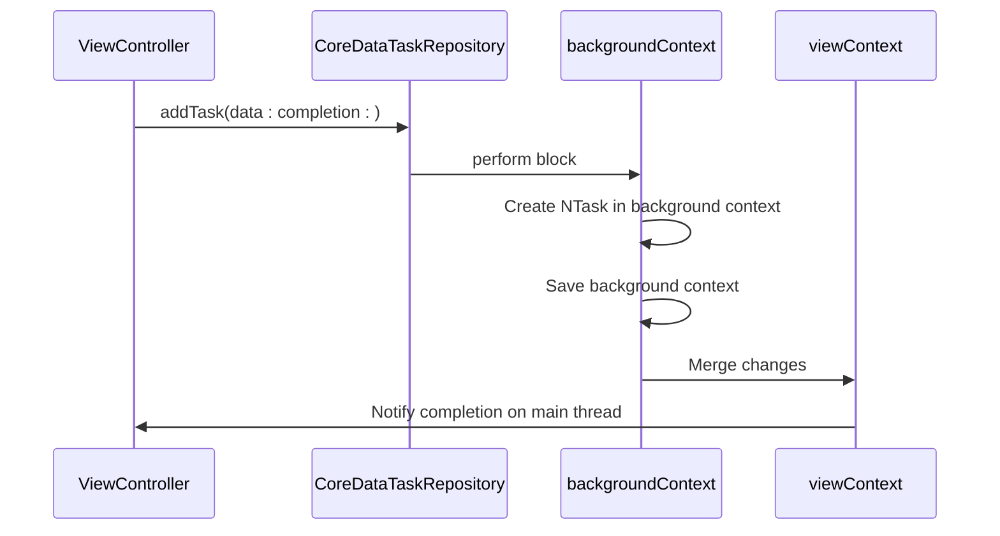
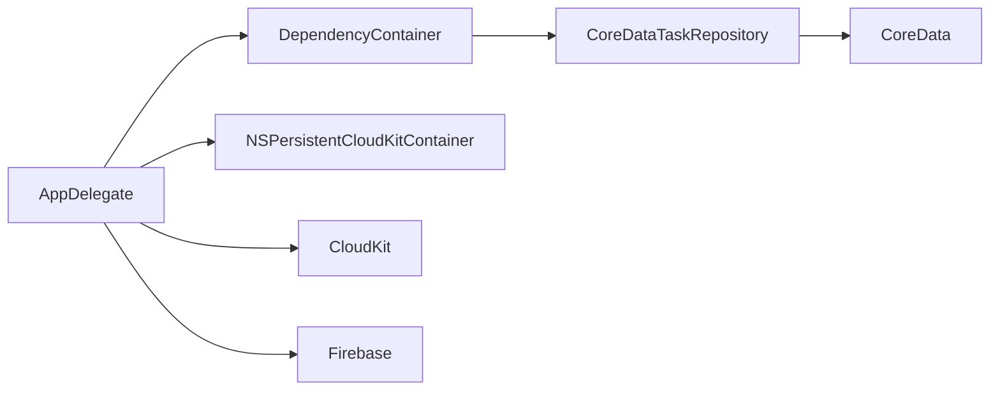

# AppDelegate Configuration

<cite>
**Referenced Files in This Document**   
- [AppDelegate.swift](file://To%20Do%20List/AppDelegate.swift)
- [DependencyContainer.swift](file://To%20Do%20List/Managers/DependencyContainer.swift)
- [CoreDataTaskRepository.swift](file://To%20Do%20List/Repositories/CoreDataTaskRepository.swift)
</cite>

## Table of Contents
1. [Introduction](#introduction)
2. [Project Structure](#project-structure)
3. [Core Components](#core-components)
4. [Architecture Overview](#architecture-overview)
5. [Detailed Component Analysis](#detailed-component-analysis)
6. [Dependency Analysis](#dependency-analysis)
7. [Performance Considerations](#performance-considerations)
8. [Troubleshooting Guide](#troubleshooting-guide)
9. [Conclusion](#conclusion)

## Introduction
The AppDelegate in the Tasker application serves as the central coordinator for application lifecycle events, Core Data stack initialization, and dependency injection setup. This document details how the AppDelegate configures the NSPersistentCloudKitContainer for seamless cloud synchronization, establishes the DependencyContainer for service management, and ensures thread-safe data operations through proper context handling. The analysis covers initialization logic, CloudKit integration, background context usage, and best practices for extending the AppDelegate while maintaining architectural integrity.

## Project Structure
The Tasker application follows a modular structure with clear separation between UI, data management, and business logic components. The AppDelegate resides in the root directory of the app module and coordinates with managers and repositories located in dedicated subdirectories.

**Diagram sources**
- [AppDelegate.swift](file://To%20Do%20List/AppDelegate.swift#L1-L192)
- [DependencyContainer.swift](file://To%20Do%20List/Managers/DependencyContainer.swift#L1-L80)
- [CoreDataTaskRepository.swift](file://To%20Do%20List/Repositories/CoreDataTaskRepository.swift#L1-L454)

**Section sources**
- [AppDelegate.swift](file://To%20Do%20List/AppDelegate.swift#L1-L192)

## Core Components
The core components involved in the AppDelegate's operation include the NSPersistentCloudKitContainer for data persistence and synchronization, the DependencyContainer for managing service dependencies, and the CoreDataTaskRepository implementing data access patterns. The AppDelegate initializes these components during application launch and configures their interactions for reliable data management across devices via CloudKit.

**Section sources**
- [AppDelegate.swift](file://To%20Do%20List/AppDelegate.swift#L50-L192)
- [DependencyContainer.swift](file://To%20Do%20List/Managers/DependencyContainer.swift#L10-L30)
- [CoreDataTaskRepository.swift](file://To%20Do%20List/Repositories/CoreDataTaskRepository.swift#L10-L50)

## Architecture Overview
The AppDelegate orchestrates the initialization of the Core Data stack with CloudKit integration, setting up the persistent container with appropriate options for cloud synchronization. It then configures the DependencyContainer to provide access to data services throughout the application. The architecture emphasizes separation of concerns by delegating data access to repositories while maintaining lifecycle control in the AppDelegate.

**Diagram sources**
- [AppDelegate.swift](file://To%20Do%20List/AppDelegate.swift#L25-L192)
- [DependencyContainer.swift](file://To%20Do%20List/Managers/DependencyContainer.swift#L40-L60)

## Detailed Component Analysis

### AppDelegate Lifecycle Management
The AppDelegate handles application launch by configuring Firebase, setting UI appearance properties, registering for remote notifications, and initializing the Core Data stack. It forces early loading of the persistent container to ensure CloudKit subscriptions are registered promptly during startup.

**Section sources**
- [AppDelegate.swift](file://To%20Do%20List/AppDelegate.swift#L25-L45)

### Core Data Stack Initialization
The persistentContainer lazy property creates an NSPersistentCloudKitContainer instance named "TaskModel" and configures its persistent store description with CloudKit synchronization enabled. The container identifier is set to "iCloud.TaskerCloudKit", enabling cross-device data sync through iCloud.

**Diagram sources**
- [AppDelegate.swift](file://To%20Do%20List/AppDelegate.swift#L100-L150)

### Dependency Injection Setup
The DependencyContainer is configured with the initialized persistent container, creating a CoreDataTaskRepository instance that provides type-safe access to task data operations. This pattern enables loose coupling between view controllers and data access logic.

**Diagram sources**
- [AppDelegate.swift](file://To%20Do%20List/AppDelegate.swift#L70-L75)
- [DependencyContainer.swift](file://To%20Do%20List/Managers/DependencyContainer.swift#L50-L65)

### CloudKit Integration and Monitoring
The AppDelegate registers for both APNs remote notifications and CloudKit container events to monitor synchronization status. It logs CloudKit events and errors for debugging purposes, providing visibility into the sync process.

**Section sources**
- [AppDelegate.swift](file://To%20Do%20List/AppDelegate.swift#L60-L70)

### Thread-Safe Data Operations
The CoreDataTaskRepository uses separate managed object contexts for main thread (viewContext) and background operations (backgroundContext). This ensures thread safety by performing all data modifications on a dedicated background context.

**Diagram sources**
- [CoreDataTaskRepository.swift](file://To%20Do%20List/Repositories/CoreDataTaskRepository.swift#L60-L90)

## Dependency Analysis
The AppDelegate has direct dependencies on Core Data, CloudKit, and Firebase frameworks. It creates a unidirectional dependency flow to the DependencyContainer, which in turn depends on the persistent container and CoreDataTaskRepository. The repository layer depends only on Core Data and the TaskRepository protocol, maintaining clean separation.

**Diagram sources**
- [AppDelegate.swift](file://To%20Do%20List/AppDelegate.swift#L1-L192)
- [DependencyContainer.swift](file://To%20Do%20List/Managers/DependencyContainer.swift#L1-L80)

**Section sources**
- [AppDelegate.swift](file://To%20Do%20List/AppDelegate.swift#L1-L192)
- [DependencyContainer.swift](file://To%20Do%20List/Managers/DependencyContainer.swift#L1-L80)

## Performance Considerations
The AppDelegate optimizes launch performance by using lazy initialization for the persistent container and performing potentially expensive operations (like store loading) asynchronously. The use of background contexts for data operations prevents UI blocking, while automatic merging of changes keeps the view context up-to-date without manual intervention.

**Section sources**
- [AppDelegate.swift](file://To%20Do%20List/AppDelegate.swift#L100-L150)
- [CoreDataTaskRepository.swift](file://To%20Do%20List/Repositories/CoreDataTaskRepository.swift#L30-L50)

## Troubleshooting Guide
Common issues include CloudKit zone errors due to incorrect container identifiers, permission issues from missing iCloud entitlements, and performance bottlenecks during launch from synchronous operations. Ensure the container identifier matches the provisioning profile, enable iCloud capabilities in the app configuration, and avoid blocking the main thread during data operations.

**Section sources**
- [AppDelegate.swift](file://To%20Do%20List/AppDelegate.swift#L130-L140)
- [AppDelegate.swift](file://To%20Do%20List/AppDelegate.swift#L170-L190)

## Conclusion
The AppDelegate in the Tasker application effectively manages application initialization, Core Data stack configuration with CloudKit integration, and dependency injection setup. By leveraging NSPersistentCloudKitContainer, it enables seamless cross-device synchronization while maintaining thread safety through proper context management. The architecture promotes separation of concerns and testability through dependency injection, providing a solid foundation for scalable application development.