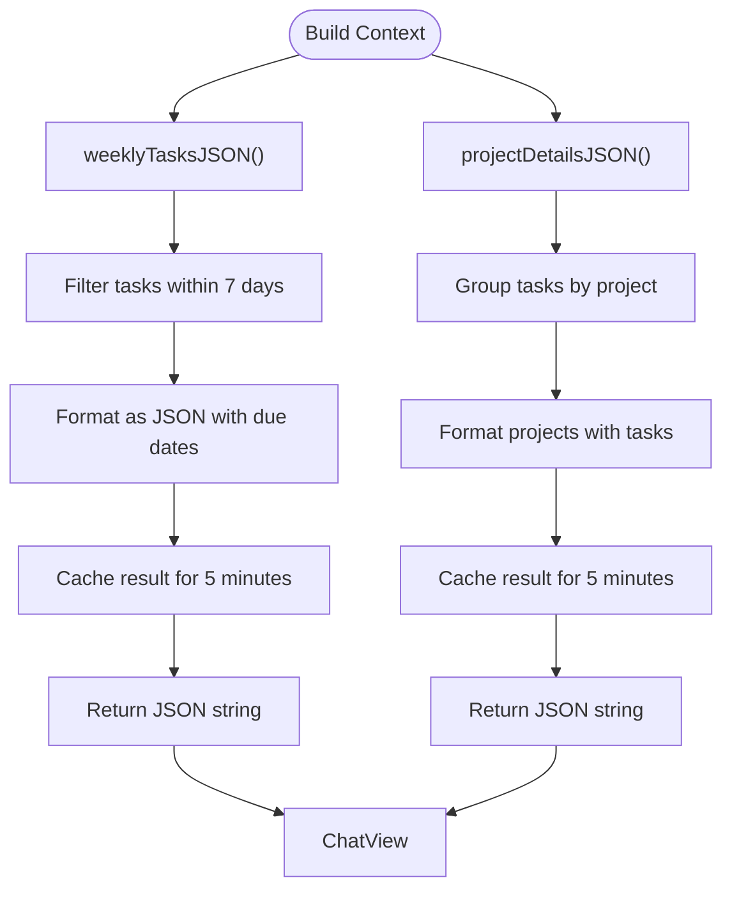

# AI Integration Architecture

<cite>
**Referenced Files in This Document**   
- [ChatHostViewController.swift](file://To%20Do%20List/LLM/ChatHostViewController.swift)
- [LLMDataController.swift](file://To%20Do%20List/LLM/Models/LLMDataController.swift)
- [LLMTaskContextBuilder.swift](file://To%20Do%20List/LLM/Models/LLMTaskContextBuilder.swift)
- [PromptMiddleware.swift](file://To%20Do%20List/LLM/Models/PromptMiddleware.swift)
- [ChatView.swift](file://To%20Do%20List/LLM/Views/Chat/ChatView.swift)
- [LLMEvaluator.swift](file://To%20Do%20List/LLM/Models/LLMEvaluator.swift)
- [RequestLLMIntent.swift](file://To%20Do%20List/LLM/Models/RequestLLMIntent.swift)
- [ConversationView.swift](file://To%20Do%20List/LLM/Views/Chat/ConversationView.swift)
- [privacy.html](file://privacy.html)
</cite>

## Table of Contents
1. [Introduction](#introduction)
2. [Project Structure](#project-structure)
3. [Core Components](#core-components)
4. [Architecture Overview](#architecture-overview)
5. [Detailed Component Analysis](#detailed-component-analysis)
6. [Security and Privacy Measures](#security-and-privacy-measures)
7. [Error Handling Strategies](#error-handling-strategies)
8. [Extensibility and Future Enhancements](#extensibility-and-future-enhancements)
9. [Conclusion](#conclusion)

## Introduction
The Tasker application integrates artificial intelligence through a local large language model (LLM) system to provide intelligent task management assistance. This document details the architectural design of the AI integration, focusing on how user interactions are processed, how context is built from task data, and how responses are generated and displayed. The system is designed with privacy in mind, processing all data locally on the user's device without transmitting personal information to external servers.

## Project Structure
The AI integration is organized within a dedicated LLM module inside the main To Do List application. This module contains all components related to the local LLM functionality, including view controllers, models, and UI components.


**Diagram sources**
- [ChatHostViewController.swift](file://To%20Do%20List/LLM/ChatHostViewController.swift)
- [ChatView.swift](file://To%20Do%20List/LLM/Views/Chat/ChatView.swift)
- [ConversationView.swift](file://To%20Do%20List/LLM/Views/Chat/ConversationView.swift)
- [LLMTaskContextBuilder.swift](file://To%20Do%20List/LLM/Models/LLMTaskContextBuilder.swift)
- [PromptMiddleware.swift](file://To%20Do%20List/LLM/Models/PromptMiddleware.swift)
- [LLMEvaluator.swift](file://To%20Do%20List/LLM/Models/LLMEvaluator.swift)
- [RequestLLMIntent.swift](file://To%20Do%20List/LLM/Models/RequestLLMIntent.swift)
- [LLMDataController.swift](file://To%20Do%20List/LLM/Models/LLMDataController.swift)

**Section sources**
- [ChatHostViewController.swift](file://To%20Do%20List/LLM/ChatHostViewController.swift)
- [ChatView.swift](file://To%20Do%20List/LLM/Views/Chat/ChatView.swift)

## Core Components
The AI integration in Tasker consists of several key components that work together to provide LLM-powered assistance. The architecture follows a clean separation of concerns, with distinct responsibilities for UI presentation, data management, and AI processing.

**Section sources**
- [ChatHostViewController.swift](file://To%20Do%20List/LLM/ChatHostViewController.swift)
- [LLMEvaluator.swift](file://To%20Do%20List/LLM/Models/LLMEvaluator.swift)
- [LLMDataController.swift](file://To%20Do%20List/LLM/Models/LLMDataController.swift)

## Architecture Overview
The AI integration architecture follows a layered approach with clear boundaries between presentation, business logic, and data layers. The system is designed to work entirely on-device, ensuring user privacy and data security.


**Diagram sources**
- [ChatHostViewController.swift](file://To%20Do%20List/LLM/ChatHostViewController.swift)
- [ChatView.swift](file://To%20Do%20List/LLM/Views/Chat/ChatView.swift)
- [LLMEvaluator.swift](file://To%20Do%20List/LLM/Models/LLMEvaluator.swift)
- [LLMTaskContextBuilder.swift](file://To%20Do%20List/LLM/Models/LLMTaskContextBuilder.swift)
- [PromptMiddleware.swift](file://To%20Do%20List/LLM/Models/PromptMiddleware.swift)

## Detailed Component Analysis

### ChatHostViewController Analysis
The ChatHostViewController serves as the UIKit wrapper that embeds the SwiftUI-based LLM interface. It acts as the entry point for the AI chat feature, managing the presentation of either the onboarding flow or the main chat interface based on whether a model is installed.


**Diagram sources**
- [ChatHostViewController.swift](file://To%20Do%20List/LLM/ChatHostViewController.swift#L0-L141)

**Section sources**
- [ChatHostViewController.swift](file://To%20Do%20List/LLM/ChatHostViewController.swift#L0-L141)

### LLMDataController Analysis
The LLMDataController is a singleton that provides a shared SwiftData container for the LLM module. It ensures that all views and components use the same persistent store for chat threads and messages, maintaining data consistency across the application.


**Diagram sources**
- [LLMDataController.swift](file://To%20Do%20List/LLM/Models/LLMDataController.swift#L0-L16)

**Section sources**
- [LLMDataController.swift](file://To%20Do%20List/LLM/Models/LLMDataController.swift#L0-L16)

### LLMTaskContextBuilder Analysis
The LLMTaskContextBuilder is responsible for creating contextual information from the user's task data and injecting it into the LLM prompts. It generates compact JSON representations of weekly tasks and project details that are used to personalize AI suggestions.



**Diagram sources**
- [LLMTaskContextBuilder.swift](file://To%20Do%20List/LLM/Models/LLMTaskContextBuilder.swift#L0-L281)

**Section sources**
- [LLMTaskContextBuilder.swift](file://To%20Do%20List/LLM/Models/LLMTaskContextBuilder.swift#L0-L281)

### PromptMiddleware Analysis
The PromptMiddleware handles prompt engineering by creating task summaries based on user requests. It processes slash commands and generates appropriate context for the LLM based on time ranges and project filters.


**Diagram sources**
- [PromptMiddleware.swift](file://To%20Do%20List/LLM/Models/PromptMiddleware.swift#L0-L56)
- [ChatView.swift](file://To%20Do%20List/LLM/Views/Chat/ChatView.swift#L0-L441)

**Section sources**
- [PromptMiddleware.swift](file://To%20Do%20List/LLM/Models/PromptMiddleware.swift#L0-L56)

### ChatView and ConversationView Analysis
The ChatView and ConversationView components handle the presentation of the chat interface and individual messages. They manage user input, display conversational responses, and handle UI state during response generation.


**Diagram sources**
- [ChatView.swift](file://To%20Do%20List/LLM/Views/Chat/ChatView.swift#L0-L441)
- [ConversationView.swift](file://To%20Do%20List/LLM/Views/Chat/ConversationView.swift#L0-L239)
- [LLMEvaluator.swift](file://To%20Do%20List/LLM/Models/LLMEvaluator.swift#L0-L166)

**Section sources**
- [ChatView.swift](file://To%20Do%20List/LLM/Views/Chat/ChatView.swift#L0-L441)
- [ConversationView.swift](file://To%20Do%20List/LLM/Views/Chat/ConversationView.swift#L0-L239)

### LLMEvaluator Analysis
The LLMEvaluator is the core component responsible for API communication with the local language model. It manages model loading, generation parameters, and streaming responses from the MLX framework.


**Diagram sources**
- [LLMEvaluator.swift](file://To%20Do%20List/LLM/Models/LLMEvaluator.swift#L0-L166)

**Section sources**
- [LLMEvaluator.swift](file://To%20Do%20List/LLM/Models/LLMEvaluator.swift#L0-L166)

### RequestLLMIntent Analysis
The RequestLLMIntent enables Siri shortcuts integration for the AI chat feature. It allows users to start new chats through voice commands or automation workflows.


**Diagram sources**
- [RequestLLMIntent.swift](file://To%20Do%20List/LLM/Models/RequestLLMIntent.swift#L0-L103)

**Section sources**
- [RequestLLMIntent.swift](file://To%20Do%20List/LLM/Models/RequestLLMIntent.swift#L0-L103)

## Security and Privacy Measures
The AI integration in Tasker prioritizes user privacy and data security through several key measures:

- **Local Processing**: All LLM operations occur on the user's device using Apple's MLX framework, ensuring that personal task data never leaves the device
- **On-Device Storage**: Chat history and message data are stored locally using SwiftData with no cloud synchronization for the LLM module
- **No Third-Party Access**: The privacy policy explicitly states that personal task data is never shared with third parties
- **Data Minimization**: Only necessary task context is extracted and formatted for LLM prompts, avoiding transmission of complete task databases
- **Secure Storage**: All data is encrypted and stored locally on the device according to Apple's security guidelines

The system leverages Apple's on-device machine learning frameworks (MLX and MLXLLM) which are designed with privacy as a core principle. This approach eliminates the need for network calls to external LLM APIs, completely removing the risk of data interception or unauthorized access during transmission.

**Section sources**
- [privacy.html](file://privacy.html#L0-L79)
- [LLMEvaluator.swift](file://To%20Do%20List/LLM/Models/LLMEvaluator.swift#L0-L166)

## Error Handling Strategies
The AI integration implements comprehensive error handling strategies to ensure reliability and provide meaningful feedback to users:

### Network and Model Loading Errors
The system handles model loading failures gracefully by catching exceptions and providing user-friendly error messages. The LLMEvaluator class includes specific error handling for model not found scenarios:

```swift
enum LLMEvaluatorError: Error {
    case modelNotFound(String)
}

func load(modelName: String) async throws -> ModelContainer {
    guard let model = ModelConfiguration.getModelByName(modelName) else {
        throw LLMEvaluatorError.modelNotFound(modelName)
    }
    // ... loading logic
}
```

### Generation and Processing Errors
During response generation, the system captures and displays errors while maintaining UI responsiveness:

```swift
func generate(modelName: String, thread: Thread, systemPrompt: String) async -> String {
    do {
        // ... generation logic
    } catch {
        output = "Failed: \(error)"
    }
    running = false
    return output
}
```

### Rate Limiting and Throttling
The system implements UI update throttling to maintain performance during streaming responses:

```swift
// Update display every 4 tokens for optimal performance
let displayEveryNTokens = 4

// Throttle UI updates in the generation loop
if tokens.count % self.displayEveryNTokens == 0 {
    let text = context.tokenizer.decode(tokens: tokens)
    _Concurrency.Task { @MainActor in
        self.output = text
    }
}
```

### Content Filtering
While the current implementation does not include explicit content filtering, the system could be extended to incorporate safety mechanisms by:
- Implementing prompt validation before submission
- Adding response filtering to detect and block inappropriate content
- Using Apple's built-in content moderation APIs
- Implementing custom rule-based filtering for sensitive topics

The architecture supports these enhancements through its modular design, allowing filtering components to be inserted at appropriate points in the processing pipeline.

**Section sources**
- [LLMEvaluator.swift](file://To%20Do%20List/LLM/Models/LLMEvaluator.swift#L0-L166)
- [ChatView.swift](file://To%20Do%20List/LLM/Views/Chat/ChatView.swift#L0-L441)

## Extensibility and Future Enhancements
The AI integration architecture is designed to be extensible, supporting future enhancements and integration of alternative LLM providers.

### Adding New Command Types
The slash command system in ChatView can be extended to support additional command types:

```swift
private func parseSlashCommand(_ text: String) -> SlashAction {
    guard text.hasPrefix("/") else { return .none }
    let components = text.split(separator: " ", maxSplits: 1, omittingEmptySubsequences: true)
    guard let command = components.first?.lowercased() else { return .none }

    switch command {
    // ... existing commands
    case "/analyze":
        return .summary(.week, nil)
    case "/prioritize":
        return .prioritizeTasks()
    case "/schedule":
        return .scheduleTasks()
    default:
        return .none
    }
}
```

### Integrating Alternative LLM Providers
The modular architecture allows for integration of alternative LLM providers by implementing adapter patterns:


This approach would allow the application to support both on-device models (via MLX) and cloud-based models (via API) while maintaining a consistent interface.

### Performance Optimization Opportunities
Several performance optimizations could be implemented:

- **Context Caching**: Implement more sophisticated caching strategies for task context to reduce computation
- **Model Quantization**: Use quantized model versions to improve inference speed on lower-end devices
- **Background Processing**: Offload context building to background queues to maintain UI responsiveness
- **Connection Pooling**: For cloud-based providers, implement connection pooling to reduce latency

**Section sources**
- [ChatView.swift](file://To%20Do%20List/LLM/Views/Chat/ChatView.swift#L0-L441)
- [LLMEvaluator.swift](file://To%20Do%20List/LLM/Models/LLMEvaluator.swift#L0-L166)

## Conclusion
The AI integration in Tasker demonstrates a well-architected approach to on-device LLM functionality, prioritizing user privacy and data security while providing intelligent task management assistance. The system's modular design separates concerns effectively, with clear boundaries between UI presentation, context building, and model interaction.

Key strengths of the architecture include:
- Complete on-device processing ensuring user privacy
- Clean separation of concerns between components
- Efficient context building with caching mechanisms
- Responsive UI with streaming response updates
- Extensible design supporting future enhancements

The implementation leverages Apple's MLX framework for local model inference, eliminating the need for network transmission of sensitive data. This approach aligns with modern privacy expectations while still delivering powerful AI capabilities. The architecture provides a solid foundation for future enhancements, including support for additional command types and potential integration with alternative LLM providers.