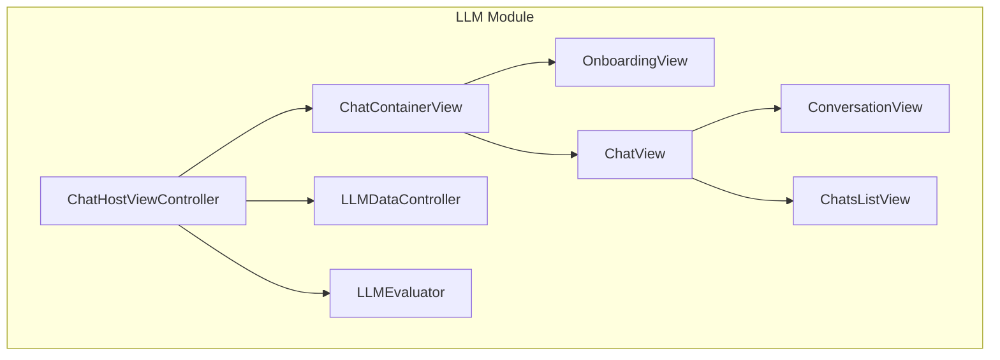
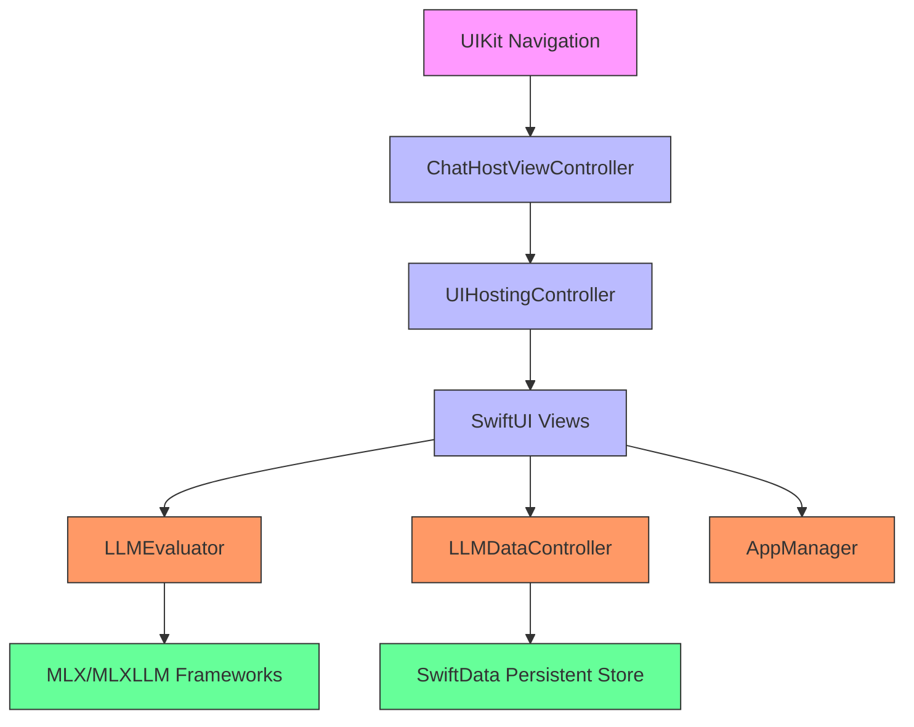
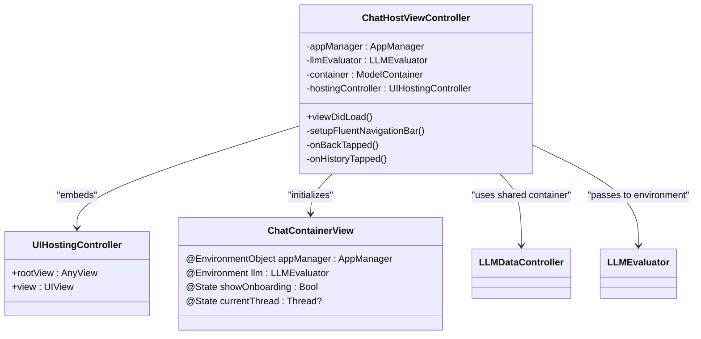
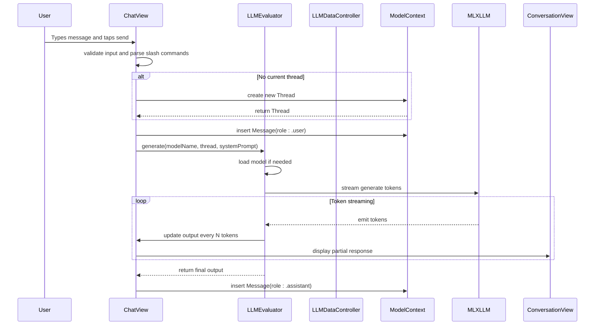
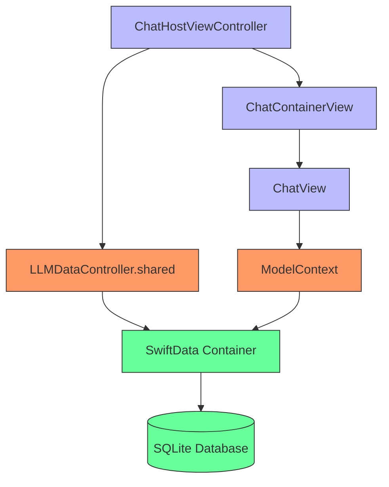
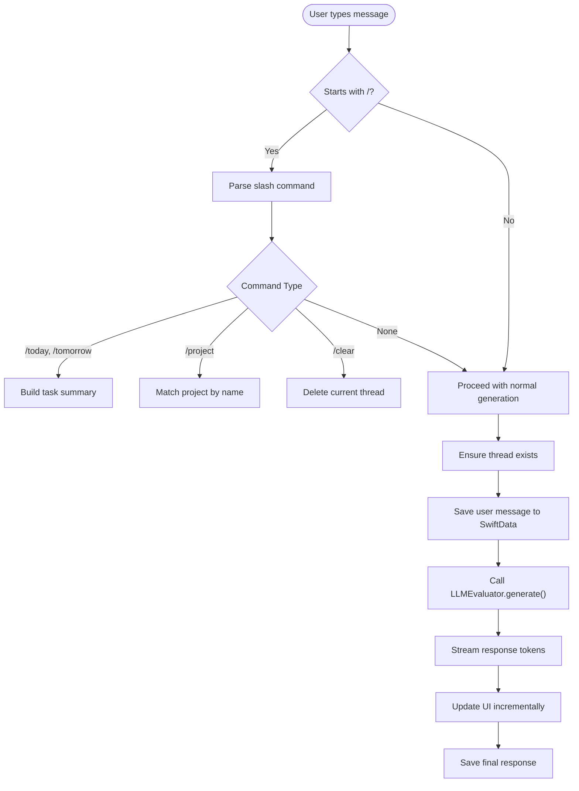
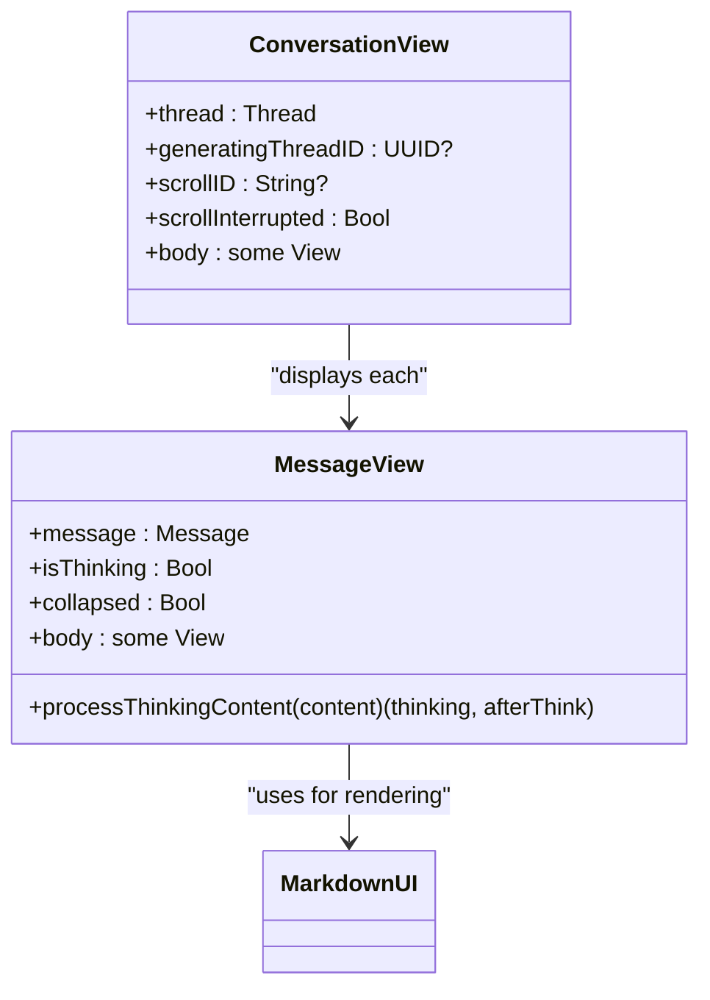

# ChatHostViewController

<cite>
**Referenced Files in This Document**   
- [ChatHostViewController.swift](file://To Do List/LLM/ChatHostViewController.swift)
- [LLMDataController.swift](file://To Do List/LLM/Models/LLMDataController.swift)
- [ChatView.swift](file://To Do List/LLM/Views/Chat/ChatView.swift)
- [ConversationView.swift](file://To Do List/LLM/Views/Chat/ConversationView.swift)
- [LLMEvaluator.swift](file://To Do List/LLM/Models/LLMEvaluator.swift)
</cite>

## Table of Contents
1. [Introduction](#introduction)
2. [Project Structure](#project-structure)
3. [Core Components](#core-components)
4. [Architecture Overview](#architecture-overview)
5. [Detailed Component Analysis](#detailed-component-analysis)
6. [UI State Management](#ui-state-management)
7. [Integration with LLMDataController](#integration-with-llmdatacontroller)
8. [User Interaction and Input Handling](#user-interaction-and-input-handling)
9. [Response Rendering and Message Display](#response-rendering-and-message-display)
10. [Error Handling and Edge Cases](#error-handling-and-edge-cases)
11. [Performance and Memory Considerations](#performance-and-memory-considerations)
12. [Customization Options](#customization-options)
13. [Troubleshooting Guide](#troubleshooting-guide)

## Introduction

The **ChatHostViewController** serves as the primary interface for AI-powered task assistance within the Tasker application. It functions as a UIKit view controller that hosts a SwiftUI-based chat interface, enabling users to interact with a local large language model (LLM) for task management support. This component orchestrates the presentation of either an onboarding flow (when no LLM model is installed) or the main chat UI, depending on the user's setup state.

The controller manages navigation, user input delegation, and lifecycle events while embedding SwiftUI views through a `UIHostingController`. It integrates tightly with the LLM module's data layer via SwiftData and coordinates with the `LLMEvaluator` for message processing and response generation. The design follows a hybrid UIKit-SwiftUI pattern, leveraging the strengths of both frameworks to deliver a responsive and feature-rich conversational experience.

**Section sources**
- [ChatHostViewController.swift](file://To Do List/LLM/ChatHostViewController.swift#L1-L141)

## Project Structure

The LLM module within Tasker is organized under the `To Do List/LLM/` directory, following a modular structure that separates concerns across different subdirectories:

- **Models**: Contains data models, state controllers, and business logic (e.g., `LLMDataController.swift`, `LLMEvaluator.swift`)
- **Views/Chat**: Houses SwiftUI views related to the chat interface (`ChatView.swift`, `ConversationView.swift`)
- **Views/Onboarding**: Manages model installation guidance and setup flows
- **Extensions**: Provides SwiftUI view modifiers and utility extensions

This separation enables maintainable code with clear responsibilities, where `ChatHostViewController` acts as the bridge between UIKit navigation and the SwiftUI-driven LLM interface.



**Diagram sources**
- [ChatHostViewController.swift](file://To Do List/LLM/ChatHostViewController.swift#L1-L141)
- [ChatView.swift](file://To Do List/LLM/Views/Chat/ChatView.swift#L1-L441)
- [LLMDataController.swift](file://To Do List/LLM/Models/LLMDataController.swift#L1-L16)

## Core Components

The core functionality of the chat system revolves around several key components:

- **ChatHostViewController**: The UIKit host controller that initializes and presents the SwiftUI chat interface.
- **ChatContainerView**: A SwiftUI container that decides whether to show onboarding or the main chat based on model installation status.
- **ChatView**: The primary chat interface responsible for input handling, message submission, and thread management.
- **ConversationView**: Renders individual messages in a thread using Markdown formatting.
- **LLMDataController**: Singleton providing shared SwiftData persistence for chat threads and messages.
- **LLMEvaluator**: Handles LLM model loading, prompt generation, and streaming response evaluation.

These components work together to create a seamless AI interaction experience within the Tasker app.

**Section sources**
- [ChatHostViewController.swift](file://To Do List/LLM/ChatHostViewController.swift#L1-L141)
- [ChatView.swift](file://To Do List/LLM/Views/Chat/ChatView.swift#L1-L441)
- [LLMDataController.swift](file://To Do List/LLM/Models/LLMDataController.swift#L1-L16)
- [LLMEvaluator.swift](file://To Do List/LLM/Models/LLMEvaluator.swift#L1-L166)

## Architecture Overview

The architecture follows a layered pattern with clear separation between presentation, state management, and data persistence:



**Diagram sources**
- [ChatHostViewController.swift](file://To Do List/LLM/ChatHostViewController.swift#L1-L141)
- [LLMEvaluator.swift](file://To Do List/LLM/Models/LLMEvaluator.swift#L1-L166)
- [LLMDataController.swift](file://To Do List/LLM/Models/LLMDataController.swift#L1-L16)

## Detailed Component Analysis

### ChatHostViewController Analysis

The `ChatHostViewController` is responsible for embedding the SwiftUI-based LLM interface within a UIKit navigation hierarchy. It sets up the hosting controller and configures the navigation bar using FluentUI.

#### Class Diagram



**Diagram sources**
- [ChatHostViewController.swift](file://To Do List/LLM/ChatHostViewController.swift#L1-L141)

**Section sources**
- [ChatHostViewController.swift](file://To Do List/LLM/ChatHostViewController.swift#L1-L141)

### ChatView Analysis

The `ChatView` struct manages the main chat interface, handling user input, message generation, and thread lifecycle.

#### Sequence Diagram



**Diagram sources**
- [ChatView.swift](file://To Do List/LLM/Views/Chat/ChatView.swift#L1-L441)
- [LLMEvaluator.swift](file://To Do List/LLM/Models/LLMEvaluator.swift#L1-L166)

**Section sources**
- [ChatView.swift](file://To Do List/LLM/Views/Chat/ChatView.swift#L1-L441)

## UI State Management

The chat interface maintains several UI states during LLM interactions:

- **Idle**: Ready for user input, generate button enabled when prompt is non-empty
- **Thinking**: LLM is generating response, stop button displayed, input disabled
- **Loading Model**: Progress indicator shown during model download
- **Onboarding**: Model installation guide displayed when no models are installed
- **Chat History Visible**: Sheet presenting list of saved threads (on iPhone)

State transitions are managed through bindings and environment objects:

- `@State private var isPromptFocused` controls keyboard visibility
- `@State private var showChats` controls chat history sheet presentation
- `@State private var showModelPicker` manages model selection UI
- `@Environment(LLMEvaluator.self) var llm` provides access to `running`, `cancelled`, and `output` states

The `ConversationView` also tracks scrolling behavior to prevent auto-scroll interruption when users manually scroll through long conversations.

**Section sources**
- [ChatView.swift](file://To Do List/LLM/Views/Chat/ChatView.swift#L1-L441)
- [ConversationView.swift](file://To Do List/LLM/Views/Chat/ConversationView.swift#L1-L239)

## Integration with LLMDataController

The `ChatHostViewController` integrates with `LLMDataController` to provide a shared persistent SwiftData container for all LLM-related data.

### Data Flow



The `LLMDataController` is implemented as a singleton enum that creates a `ModelContainer` configured with CloudKit disabled, ensuring local-only persistence:

```swift
@MainActor
enum LLMDataController {
    static let shared: ModelContainer = {
        let config = ModelConfiguration(cloudKitDatabase: .none)
        do {
            return try ModelContainer(for: Thread.self, Message.self, configurations: config)
        } catch {
            fatalError("Unable to create SwiftData container...")
        }
    }()
}
```

This container is passed to the SwiftUI view hierarchy via `.modelContainer(container)`.

**Diagram sources**
- [LLMDataController.swift](file://To Do List/LLM/Models/LLMDataController.swift#L1-L16)
- [ChatHostViewController.swift](file://To Do List/LLM/ChatHostViewController.swift#L1-L141)

**Section sources**
- [LLMDataController.swift](file://To Do List/LLM/Models/LLMDataController.swift#L1-L16)

## User Interaction and Input Handling

User interactions are handled through a combination of SwiftUI bindings and UIKit navigation controls.

### Input Processing Workflow



The `generate()` function in `ChatView` handles all input processing, including:
- Slash command parsing (`/today`, `/week`, `/project`, `/clear`)
- Dynamic system prompt construction with task context
- Thread creation and message persistence
- Haptic feedback on message send

**Section sources**
- [ChatView.swift](file://To Do List/LLM/Views/Chat/ChatView.swift#L1-L441)

## Response Rendering and Message Display

Responses are rendered using `ConversationView` and `MessageView`, which support Markdown formatting and thinking visualization.

### Message Rendering Logic



Key features:
- **Thinking visualization**: Content between `<think>` and `</think>` tags is displayed in a collapsible section
- **Streaming display**: Partial responses are shown as tokens arrive, updating every 4 tokens for performance
- **Markdown support**: Both user and assistant messages are rendered with `MarkdownUI`
- **Auto-scrolling**: ScrollView automatically scrolls to bottom unless user has manually scrolled away

The `MessageView` processes thinking content by splitting the message into pre-think, thinking, and post-think segments for appropriate rendering.

**Diagram sources**
- [ConversationView.swift](file://To Do List/LLM/Views/Chat/ConversationView.swift#L1-L239)

**Section sources**
- [ConversationView.swift](file://To Do List/LLM/Views/Chat/ConversationView.swift#L1-L239)

## Error Handling and Edge Cases

The system handles several error conditions and edge cases:

- **Model not found**: `LLMEvaluator` throws `modelNotFound` error, displayed in chat
- **Empty prompts**: Generate button is disabled when prompt is empty
- **Network failures**: Model download progress shows percentage; failures result in error message
- **Context injection**: Task/project context is added only once per thread to prevent prompt bloat
- **Thread management**: New threads are created automatically when sending first message
- **Cancellation**: Users can stop generation with the stop button

Error messages are displayed directly in the chat interface as assistant messages, maintaining context within the conversation flow.

**Section sources**
- [ChatView.swift](file://To Do List/LLM/Views/Chat/ChatView.swift#L1-L441)
- [LLMEvaluator.swift](file://To Do List/LLM/Models/LLMEvaluator.swift#L1-L166)

## Performance and Memory Considerations

The implementation includes several performance optimizations:

- **Throttled UI updates**: LLM output is updated every 4 tokens instead of every token (~15% performance improvement)
- **Shared SwiftData container**: Single persistent container reduces memory overhead
- **Lazy model loading**: Models are loaded only when needed and cached
- **Efficient scrolling**: `ScrollViewReader` with scroll interruption detection prevents unnecessary updates
- **Context deduplication**: Task context is injected only once per thread to keep prompts small

Memory management during prolonged conversations is handled by SwiftData's persistence, which stores messages to disk while keeping active threads in memory.

**Section sources**
- [LLMEvaluator.swift](file://To Do List/LLM/Models/LLMEvaluator.swift#L1-L166)
- [ChatView.swift](file://To Do List/LLM/Views/Chat/ChatView.swift#L1-L441)

## Customization Options

The chat interface can be customized through several mechanisms:

- **FluentUI navigation bar**: Customizable title style, color, and button placement
- **Platform-specific styling**: Different padding, corner radius, and layout for iOS, visionOS, and macOS
- **Haptic feedback**: Configurable through `AppManager.playHaptic()`
- **Model selection**: Users can switch between available models via the model picker
- **Theme adaptation**: Uses system colors and platform-specific background colors

Appearance customization can be achieved by modifying:
- `platformBackgroundColor` in `ChatView` and `MessageView`
- Navigation bar styling in `setupFluentNavigationBar()`
- Corner radii and padding values for input fields and message bubbles

**Section sources**
- [ChatHostViewController.swift](file://To Do List/LLM/ChatHostViewController.swift#L1-L141)
- [ChatView.swift](file://To Do List/LLM/Views/Chat/ChatView.swift#L1-L441)

## Troubleshooting Guide

Common issues and their solutions:

**Issue**: Chat interface shows onboarding screen unexpectedly  
**Solution**: Ensure at least one LLM model is installed via the settings menu

**Issue**: Messages not saving between app launches  
**Solution**: Verify `LLMDataController` is using persistent storage (should be automatic with current configuration)

**Issue**: Slow response times or token generation  
**Solution**: Check device performance; consider using smaller models for better speed

**Issue**: Thinking visualization not collapsing/expanding  
**Solution**: Verify `collapsed` state binding is properly connected in `MessageView`

**Issue**: Model download fails repeatedly  
**Solution**: Check network connection and available storage space

**Issue**: Chat history not appearing on iPhone  
**Solution**: Verify `showChats` binding is connected to the history button action

**Section sources**
- [ChatHostViewController.swift](file://To Do List/LLM/ChatHostViewController.swift#L1-L141)
- [ChatView.swift](file://To Do List/LLM/Views/Chat/ChatView.swift#L1-L441)
- [LLMEvaluator.swift](file://To Do List/LLM/Models/LLMEvaluator.swift#L1-L166)